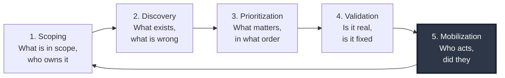
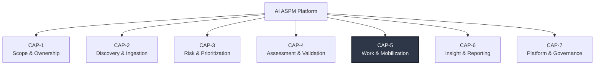

# 01 — Product Requirement

>**Document complete.** Authored in three parts per DOC-00 §19.3; all parts delivered. 424 requirements across five classes. No content was abbreviated to fit a delivery.

---

## Table of Contents

**Part 1 — delivered**
1. [Purpose and Scope](#1-purpose-and-scope)
2. [Prerequisites](#2-prerequisites)
3. [Local Conventions](#3-local-conventions)
4. [Problem Statement](#4-problem-statement)
5. [Product Vision and Positioning](#5-product-vision-and-positioning)
6. [Market and Deployment Context](#6-market-and-deployment-context)
7. [Personas and Role Archetypes](#7-personas-and-role-archetypes)
8. [Jobs To Be Done](#8-jobs-to-be-done)
9. [Capability Model, Product Principles, and Scope Boundaries](#9-capability-model-product-principles-and-scope-boundaries)

**Part 2**
10. [Functional Requirements](#10-functional-requirements)
    - [10.0 How to read this section](#100-how-to-read-this-section)
    - [10.1 `ORG` — Organization Hierarchy and Scope](#101-org--organization-hierarchy-and-scope)
    - [10.2 `AST` — Asset Inventory and Asset Graph](#102-ast--asset-inventory-and-asset-graph)
    - [10.3 `ASM` — Assessments](#103-asm--assessments)
    - [10.4 `PTR` — Penetration Test Requests and Engagements](#104-ptr--penetration-test-requests-and-engagements)
    - [10.5 `VUL` — Findings and Vulnerability Management](#105-vul--findings-and-vulnerability-management)
    - [10.6 `RSK` — Risk, Scoring, and Service Levels](#106-rsk--risk-scoring-and-service-levels)
    - [10.7 `EXC` — Risk Exceptions](#107-exc--risk-exceptions)
    - [10.8 `SBM` — SBOM Storage and Vulnerability Matching](#108-sbm--sbom-storage-and-vulnerability-matching)
    - [10.9 `ING` — Import and Export](#109-ing--import-and-export)
    - [10.10 `CON` — Connectors and External Integration](#1010-con--connectors-and-external-integration)
    - [10.11 `WRK` — Work Management and Collaboration](#1011-wrk--work-management-and-collaboration)
    - [10.12 `CAP` — Capacity and Workload](#1012-cap--capacity-and-workload)
    - [10.13 `DSH` — Dashboards and Reporting](#1013-dsh--dashboards-and-reporting)
    - [10.14 `AIC` — AI Capabilities](#1014-aic--ai-capabilities)
    - [10.15 `NTF` — Notification](#1015-ntf--notification)
    - [10.16 `AUD` — Audit Logging](#1016-aud--audit-logging)
    - [10.17 `IAM` — Identity, Authentication, and Session](#1017-iam--identity-authentication-and-session)
    - [10.18 `AUZ` — Authorization](#1018-auz--authorization)
    - [10.19 `TEN` — Tenancy and Isolation](#1019-ten--tenancy-and-isolation)
    - [10.20 `KBS` — Knowledge Base](#1020-kbs--knowledge-base)
    - [10.21 `API` — Programmatic Interface](#1021-api--programmatic-interface)

**Part 3**
11. [Configurability Requirements](#11-configurability-requirements)
12. [Non-Functional Requirements](#12-non-functional-requirements)
13. [Constraints](#13-constraints)
14. [Licensing and Entitlement](#14-licensing-and-entitlement)
15. [Requirements Summary](#15-requirements-summary)
16. [Extensibility Considerations](#16-extensibility-considerations)
17. [Closing Sections](#17-closing-sections)

---

## 1. Purpose and Scope

### 1.1 Purpose

This document defines **what** the AI ASPM platform does, **for whom**, and **why** — at a level of precision sufficient for the domain model (DOC-03), architecture (DOC-02), and test strategy (DOC-16) to be derived from it without interpretation.

It is the root of the traceability chain defined in DOC-00 §8. Every design element, schema object, API operation, and test case in the corpus traces backward to a requirement owned here or in a module document. An artifact that traces to nothing in this chain is either undocumented scope or a requirement nobody wrote down.

### 1.2 In scope

- The problem the product solves and the evidence that it is a real problem.
- Product vision, positioning, and competitive differentiation.
- Deployment and market context, including the multi-market implications of ADR-002 and ADR-027.
- Role archetypes and the jobs they need done. **Archetypes, not fixed roles** — see §7.1.
- The capability model: what the platform can do, organized so that scope decisions are traceable.
- Product principles that resolve ambiguity during implementation.
- Functional requirements across all domains *(Part 2)*.
- Configurability, non-functional requirements, and external constraints *(Part 3)*.
- Licensing and entitlement model *(Part 3)*.
- Explicit non-goals.

### 1.3 Out of scope

| Excluded here | Owned by |
|---|---|
| Domain semantics, aggregates, invariants | DOC-03 |
| Architecture, module topology, deployment units | DOC-02, DOC-15 |
| Authorization model and permission catalog | DOC-07 |
| Tenant isolation mechanics | DOC-24 |
| Security control specifications | DOC-06 |
| Risk formula, scoring weights, SLA engine internals | DOC-28 |
| State machines and transition tables | DOC-09 |
| Screen designs, component specifications | DOC-08 |
| API contracts | DOC-05 |
| Release sequencing and MVP cut lines | DOC-17 |

This document states **what must be true**. It does not state **how**. Where a requirement here appears to imply a mechanism, the mechanism is a downstream decision and is not binding unless recorded as an ADR.

### 1.4 Relationship to the requirements gathering that preceded it

The original requirement brief for this product listed 40 scope items, a linear business hierarchy, and a set of example personas. Requirements analysis (recorded in DOC-19, ADR-001 through ADR-029) found ten duplicated requirement groups, fifteen conflicts, and thirty gaps. This document reflects the **post-analysis** requirement set. Where it departs from the original brief, the departure is recorded as an ADR and the rationale is stated at the point of departure.

Two departures are load-bearing enough to state here:

1. **The linear hierarchy in the original brief is not implementable as written** (ADR-001). It asserted containment relationships that do not exist in reality — that a finding contains a repository, that a repository contains a service. This document works from two orthogonal structures: an organization tree for scope, and an asset graph for technical reality.
2. **The example personas in the original brief are not product entities** (ADR-027). Roles such as "DCEO" were illustrations of scope-based authorization drawn from one organization. This product is intended for any conglomerate. Roles are therefore tenant-configured data, and §7 describes archetypes rather than roles.

---

## 2. Prerequisites

| Document | Why required |
|---|---|
| DOC-00 | Requirement ID scheme, RFC 2119 usage, configurability tiers (§9), prohibited patterns (§19.2). This document is unreadable as a specification without the ID scheme. |
| DOC-18 (seeded) | Canonical definitions of *Asset*, *Finding*, *Assessment*, *WorkItem*, *OrgNode*, *Scope*, *Tenant*. Terms in Appendix D of DOC-00 carry exactly one meaning. |
| DOC-19 (seeded) | The 29 decisions this document assumes. Reading §4–§9 without ADR-001, ADR-027, and ADR-028 will produce incorrect conclusions about scope. |

---

## 3. Local Conventions

Extensions to DOC-00, applicable only within DOC-01:

**LC-01 — Persona references are archetypes.** Where this document names a role (e.g. *Security Program Owner*), it denotes a **role archetype**: a bundle of jobs and a scope pattern. It is not a product role, not a database enum value, and not a string that appears in code. Tenants create roles and name them; the archetype is an analytical device for requirements, and a default role template shipped as configuration.

**LC-02 — Illustrative examples are marked.** Organization-specific names appear only after *for example* or *such as*, per DOC-00 §9.5. Any unmarked organization-specific assumption in this document is a defect.

**LC-03 — Capability identifiers.** The capability model in §9 uses identifiers of the form `CAP-L1.L2` (e.g. `CAP-3.2`). These are structural labels for the capability map, **not** requirement IDs. They exist so that Part 2 requirements and DOC-17 roadmap items can reference a capability without restating it. They carry no normative weight.

**LC-04 — Working assumptions.** Three assumptions were ratified in lieu of answers to blocking open questions and are marked ⚠️ at each point of use, per DOC-00 §14.2:

| OQ | Working assumption | Impact if wrong |
|---|---|---|
| OQ-010 | v1 targets internal deployment first; commercial architecture is built from the start with no shortcuts that compromise tenancy | Low structural, moderate sequencing. Affects DOC-17 only |
| OQ-011 | Vietnam-first market; architecture ready for EU/US residency, not deployed there in v1 | Low. Residency pinning is designed; activation is configuration |
| OQ-012 | The platform replaces any incumbent executive security dashboard rather than feeding it | Moderate. If it must feed an incumbent, DOC-02 gains an external dependency and DOC-12 gains an export contract |

---

## 4. Problem Statement

### 4.1 The situation

Large enterprises — particularly conglomerates operating many semi-autonomous business units — have solved *detection* and failed at *management*.

A typical group of this shape has, today: several SAST tools (different ones per business unit, chosen independently), SCA in some pipelines, DAST somewhere, a penetration testing function, secret scanning enabled on some repositories, an infrastructure vulnerability scanner, and a compliance function asking for evidence. Each produces findings. None produces posture.

The result is a specific, recognizable failure pattern:

**Findings exist but do not resolve.** A scanner produces 4,000 findings. Nobody can act on 4,000. The list is exported to a spreadsheet, circulated, and ignored. Six months later the same scan produces 4,400, and the 4,000 are still open. There is no mechanism that distinguishes the twelve that matter.

**Ownership is unknown.** The single question that blocks every remediation conversation is *who owns this repository*. In a group with hundreds of applications and organizational change every quarter, the answer is not recorded anywhere authoritative. Findings are therefore assigned to whoever is easiest to reach, who is usually not the person who can fix them.

**The security team is the bottleneck and cannot scale linearly.** An application security function covering a large portfolio is structurally under-resourced. Each new project adds review demand; headcount does not grow proportionally, and should not — a model requiring one security engineer per five projects is not a model, it is an admission of failure. Yet the alternative that most organizations reach for — self-service scanning with no triage — produces the 4,000-finding spreadsheet.

**Work is tracked in systems that do not understand the domain.** Pentest requests arrive by email or chat. Engagements are tracked in a spreadsheet. Remediation is tracked in a generic issue tracker that has no concept of severity decay, SLA by exposure level, retest verification, or risk acceptance with expiry. Because three systems hold parts of the truth, none of them holds it, and reporting requires manual reconciliation every month.

**Executive reporting is manual and therefore infrequent and therefore stale.** Someone spends three days per month building a deck. The deck is accurate on the day it is presented and obsolete a week later. Decisions are made on data that is a month old, and the process consumes the time of the most senior person in the function.

**Nobody knows what is not covered.** This is the least visible and most consequential failure. When a scanner has been silently failing on forty projects for three months, the dashboard shows green — not because those projects are secure, but because there is no data. Coverage gaps are indistinguishable from clean results in every tool that does not explicitly model them.

### 4.2 Why existing tool categories do not solve it

| Category | What it does | Why it does not close this gap |
|---|---|---|
| **Individual scanners** (SAST, DAST, SCA, secret scanning) | Produce findings within one technique | No correlation across techniques, no ownership model, no prioritization against business context, no workflow. Each adds to the pile |
| **CNAPP / cloud security platforms** | Cloud infrastructure and workload posture | Application-layer findings, manual assessment, threat modeling, and penetration testing are outside their model. Strong where infrastructure is the risk; blind where application logic is |
| **Vulnerability risk aggregators** | Ingest findings from many sources, apply risk scoring | Stop at prioritization. Hand mobilization to an external tracker and lose the loop. No model of the security team's own work |
| **Open-source vulnerability managers** | Ingest, deduplicate, track findings | Correct scope, insufficient depth: no capacity management, no configurable workflow, no multi-tenancy suitable for a conglomerate, no assessment lifecycle, interface unusable by non-specialists |
| **Pentest reporting platforms** | Manage engagements and produce reports | Engagement-centric, not posture-centric. No continuous view between engagements, no scanner correlation |
| **Generic issue trackers** | Track work | No security domain model. Severity is a label. SLA is a custom field someone maintains. Retest is a ticket someone remembers to create. Findings, assets, and risk have no relationship |
| **GRC platforms** | Policy, control, and audit management | Operate at control-framework altitude. Cannot represent a specific vulnerability in a specific service on a specific commit |

### 4.3 The gap, stated precisely

There is no system that holds, simultaneously:

1. **The technical truth** — which applications exist, what they are built from, what is exposed, what is vulnerable.
2. **The organizational truth** — who owns each of those things, in an organizational structure that changes.
3. **The risk truth** — which findings matter, computed deterministically from business context, reproducible and defensible under challenge.
4. **The work truth** — who is doing what about it, how long it is taking, what is blocked and by whom.
5. **The honesty layer** — what the system does *not* know, made as visible as what it does.

Holding one, two, or three of these produces a tool. Holding all five produces a posture management system. **The absence of (4) is why most ASPM deployments stall; the absence of (5) is why the ones that do not stall produce confident, wrong reports.**

### 4.4 Evidence that this is the real problem

The problem statement above is not derived from market research; it is derived from the operational reality of the organizations this product is built for. Specific observable symptoms, each of which the platform must measurably improve:

- Monthly executive security reporting consumes multiple days of senior engineering time and is produced by hand from exported spreadsheets.
- Vulnerability data lives in per-export files, requiring ad-hoc scripting to consolidate for analysis.
- Penetration test intake arrives through unstructured channels, so engagements begin with a discovery phase to establish what is actually being tested and whether the environment works.
- Test environment readiness is the most common cause of engagement delay, and the delay is attributed to the security team.
- Risk registers are maintained in spreadsheets with manually recalculated priority.
- The same checklist, template, and governance artifacts are rebuilt per engagement rather than instantiated from a system.

Each of these is a symptom of the same root cause: **the absence of a system of record for application security.**

---

## 5. Product Vision and Positioning

### 5.1 Vision

> **A single system of record for application security posture and the work that changes it — one that knows what exists, who owns it, what matters, who is acting on it, and what it does not know.**

Three clauses in that sentence carry weight.

*"System of record"* — not a dashboard over other systems. Where the platform is authoritative, it is the only authority. Duplicated authority is the failure mode the product exists to remove; introducing it internally would be self-defeating (ADR-028).

*"And the work that changes it"* — posture without mobilization is observation. The platform owns the security team's work, not only the security findings.

*"And what it does not know"* — coverage gaps, stale data, and low-confidence inputs are first-class, surfaced, and reported. A posture system that cannot distinguish *clean* from *unmeasured* is worse than no posture system, because it produces false assurance at executive altitude.

### 5.2 Positioning statement

**For** application security functions in large, multi-business-unit enterprises
**who** must manage security posture across a portfolio far larger than their headcount can linearly serve,
**the AI ASPM platform is** a system of record that unifies application inventory, security assessment, vulnerability management, and the security team's own workflow,
**that** computes deterministic, defensible risk from business context and closes the loop from detection to verified remediation,
**unlike** aggregators that stop at prioritization or generic trackers that have no security domain model,
**because** it owns the complete cycle — scope, discover, prioritize, validate, mobilize — inside one authorization model, one asset graph, and one audit trail.

### 5.3 Strategic frame: CTEM

The platform is organized around **Continuous Threat Exposure Management (CTEM)** — the five-stage cycle of Scoping, Discovery, Prioritization, Validation, and Mobilization.

CTEM is adopted as the organizing frame for three reasons. It is analyst-recognized, which matters for enterprise procurement where a defensible category narrative shortens sales cycles. It is a *cycle* rather than a pipeline, which correctly represents that posture management never completes. And most usefully, it exposes precisely where the competitive gap is.

*Figure 5.1 — The CTEM cycle. Stage 5, Mobilization, is emphasized: it is the stage the incumbent tool categories externalize, and the stage this platform owns.*

| CTEM stage | Platform capability | Competitive assessment |
|---|---|---|
| **1. Scoping** | Organization tree, asset graph, ownership resolution, business criticality classification | Contested. Most tools have inventory; few have *ownership* that survives organizational change |
| **2. Discovery** | Scanner result ingestion, SBOM matching, manual assessment, threat modeling, penetration testing | Commoditized. Everyone ingests findings |
| **3. Prioritization** | Deterministic risk scoring with business context, exploit intelligence, SLA policy | Contested. Many tools score; few produce a score that is reproducible, versioned, and defensible under executive challenge |
| **4. Validation** | Penetration testing, retest workflow, exploitability assessment, exception verification | Weakly served. Automated tools cannot validate; pentest platforms cannot correlate |
| **5. Mobilization** | Work management, assignment, capacity, SLA tracking, remediation verification, collaboration | **Largely unserved.** This is the differentiator |

**The strategic argument.** Stages 2 and 3 are where the incumbent tools compete and where differentiation is expensive. Stage 5 is where deployments actually fail, and it is structurally unserved because the incumbents made an architectural decision — hand mobilization to an external tracker — that cannot be reversed without rebuilding their product. A platform that owns Stage 5 natively closes a loop nobody else closes, and it does so with a defensible moat: the integration cost of retrofitting work management into an aggregator is higher than building it in from the start.

**The strategic risk, stated honestly.** Owning Stage 5 means competing, in a narrow domain, with mature general-purpose work management products. The platform will be compared to them on collaboration quality. If it loses that comparison badly, users will maintain a parallel tracker and the single-source-of-truth property collapses — the exact outcome ADR-028 exists to prevent. This is why the collaboration primitives in Part 2 (`WRK` domain) are `MUST_HAVE` rather than `SHOULD_HAVE`, and why they are specified in detail rather than gestured at. Under-building them is the most likely way this product fails.

### 5.4 The AI-native claim

The product is named AI-native. That claim requires discipline, because it is the most-abused adjective in the current security market and buyers have learned to discount it.

**What "AI-native" means here:**

| Property | Meaning |
|---|---|
| **AI is designed in, not attached** | AI capabilities operate over a domain model built to support them: a normalized finding schema, a deterministic risk score with explicit factors, an ownership graph, and a work history. AI grounded in structured data produces different output quality than AI prompted with unstructured text |
| **AI is advisory, always** | AI writes to a suggestion ledger, never to the system of record. Every promotion is a human action, audited with the model identity, prompt hash, and acting user (ADR-005) |
| **AI explains, does not compute** | The risk score is deterministic, versioned, and reproducible. AI narrates *why* the score is what it is. It never produces the number. A score whose value depends on a model invocation cannot be defended in an audit, reproduced six months later, or trusted when it changes |
| **AI is provider-neutral** | Model access is abstracted. Hosted providers, self-hosted, and OpenAI-compatible endpoints are all supported, because data governance requirements differ per tenant and per market and some tenants cannot send finding data to a third party at all |
| **AI failure degrades gracefully** | Every AI capability has a defined non-AI fallback. The platform remains fully functional with AI disabled. A tenant that turns AI off loses convenience, not capability |

**What it does not mean:** the platform does not use AI to determine severity, compute risk, decide assignment, close findings, or take any action with authority. Those paths are deterministic by design (ADR-005). The reason is not caution for its own sake — it is that a security posture system's output is used to make resource decisions and to satisfy auditors, and both use cases require reproducibility that a probabilistic system cannot provide.

### 5.5 Differentiation summary

| Dimension | AI ASPM | Aggregators | CNAPP | OSS vuln managers | Pentest platforms | Generic trackers |
|---|---|---|---|---|---|---|
| Application-layer focus | ● Primary | ◐ Mixed | ○ Secondary | ● Primary | ● Primary | ○ None |
| Asset graph with ownership | ● | ◐ | ● Cloud only | ○ | ○ | ○ |
| Deterministic, versioned risk score | ● | ◐ | ◐ | ○ | ○ | ○ |
| Manual assessment lifecycle | ● | ○ | ○ | ◐ | ● | ◐ |
| **Security team work management** | ● | ○ | ○ | ○ | ◐ | ● Generic |
| **Capacity and workload management** | ● | ○ | ○ | ○ | ○ | ◐ |
| Coverage-gap visibility | ● | ◐ | ◐ | ○ | ○ | ○ |
| Configurable for any org structure | ● | ◐ | ◐ | ○ | ◐ | ● |
| Executive reporting, automated | ● | ● | ● | ○ | ◐ | ○ |
| AI grounded in domain model | ● | ◐ | ◐ | ○ | ○ | ◐ |

● full · ◐ partial · ○ absent

The two emphasized rows are the differentiation. Everything else is table stakes that must be met to be credible, but will not win a deal on its own.

---

## 6. Market and Deployment Context

### 6.1 Target buyer and user profile

| Attribute | Profile |
|---|---|
| **Organization shape** | Multi-business-unit enterprise or conglomerate; semi-autonomous units with independent technology choices |
| **Portfolio size** | Tens to hundreds of applications; hundreds to thousands of repositories and services ⚠️ *(OQ-015 — precise sizing pending; NFR targets in Part 3 are bound to stated data volumes and will be revised, not the architecture)* |
| **Security function size** | Small relative to portfolio. Structurally unable to scale headcount with project count |
| **Economic buyer** | Group CISO, Head of Cyber Security, or equivalent |
| **Primary user** | Application security engineers and their program owner |
| **Secondary users** | Engineering leads and developers (as requesters and remediators), business unit leadership (as accountable owners), executives (as reporting consumers), auditors and compliance |
| **Incumbent state** | Multiple scanners, spreadsheets, a generic issue tracker, and manual reporting |

### 6.2 Deployment models

Three models MUST be supported. Requirements are specified in Part 3 (`DEP`, `TEN`, `NFR`); the strategic rationale is stated here because it constrains architecture.

| Model | Description | Why required |
|---|---|---|
| **SaaS multi-tenant** | Platform-operated; tenants logically isolated with per-tenant keys (ADR-002) | Commercial scalability. Lowest operating cost per tenant |
| **Single-tenant hosted** | Dedicated instance, platform-operated | Enterprises whose procurement or regulatory posture prohibits shared infrastructure |
| **On-premises / air-gapped** | Customer-operated, no outbound internet | Government, defence, critical infrastructure, and regulated sectors. Also the internal deployment path ⚠️ *(OQ-010)* |

**Architectural consequence.** Supporting air-gapped deployment is not a deployment detail; it constrains the product globally. Every capability that depends on an external service — vulnerability intelligence feeds, exploit prediction data, hosted AI models, notification delivery — MUST have an offline path or degrade explicitly and visibly. This is stated in §5.1 as *"knows what it does not know"*: an air-gapped instance with a 60-day-old vulnerability database MUST display that fact rather than silently reporting stale results as current. Designing this in costs modest effort; adding it later requires revisiting every data-dependent capability.

### 6.3 Market and regulatory context

⚠️ **Working assumption (OQ-011): Vietnam-first, with architecture prepared for EU/US.**

| Market | Primary regulatory considerations |
|---|---|
| Vietnam (v1 primary) | Personal data protection framework (Decree 13/2023 and successors); cybersecurity and data legislation including the 2025 framework; data localization expectations for certain data categories |
| Southeast Asia (v1 adjacent) | Per-jurisdiction personal data regimes; varying localization requirements |
| EU (architected, not activated) | GDPR — lawful basis, data subject rights including erasure, cross-border transfer, processor obligations |
| US (architected, not activated) | State privacy legislation; sector-specific requirements where applicable |

**Requirement consequence.** The regulatory matrix is not a compliance appendix. It generates hard product requirements: per-tenant data residency pinning; data subject erasure that reconciles with audit immutability; configurable retention; explicit control over whether tenant data may reach a third-party AI provider; and evidence export suitable for audit. These are specified in Part 2 (`DAT`, `AUD`, `AIC`) and Part 3 (`CON` constraints).

**The erasure-versus-immutability conflict is real and must be designed, not discovered.** Findings contain evidence; evidence contains personal data; audit trails must be immutable; data subjects have erasure rights. A design that ignores this conflict fails its first EU audit. The resolution — separating immutable audit *events* from erasable audit *payloads*, with cryptographic proof of non-tampering that survives payload removal — is specified in DOC-14 and referenced by requirement in Part 2.

### 6.4 The universality requirement (ADR-027)

The platform MUST be deployable by any conglomerate without code modification. This is the single most architecturally consequential requirement in this document, and it is easy to state and easy to violate.

**What it prohibits.** No role name, organizational level name, workflow state, severity taxonomy, business criticality tier, SLA policy, or vocabulary term specific to any one organization may appear in code, in a database enumeration, or in a fixed configuration. The illustrative personas from the original requirements brief — including role names drawn from a specific corporate structure — are examples of *scope-based authorization patterns*, nothing more.

**What it requires.** A configurability model with three tiers (DOC-00 §9), a permission catalog that is product-fixed with roles composed from it by tenants, an organization hierarchy of configurable depth and node naming, workflows expressed as data, tenant-defined custom fields, and vocabulary override.

**Why it must be v1 and not v2.** Hardcoding is always locally faster. Each shortcut is invisible in isolation; collectively they make the product unsellable to the second customer, and unwinding them touches the schema, the authorization layer, every dashboard, and every workflow. The cost differential between designing for configurability and retrofitting it is roughly an order of magnitude, and the retrofit lands at exactly the moment the company is trying to close its second deal.

**What it does not require.** It does not require the product to be unopinionated. A platform where everything is configurable has no invariants, and a domain model without invariants is a data dump with a UI. DOC-00 §9.4 enumerates what is deliberately fixed: the permission catalog, security control floors, audit schema and immutability, finding identity, tenant isolation, core domain invariants, and the structural form of the risk model. Configurable structure with opinionated defaults is the target; either extreme fails.

---

## 7. Personas and Role Archetypes

### 7.1 Archetypes, not roles

Per LC-01 and ADR-027, this section describes **role archetypes**. Each archetype is:

- a set of jobs to be done,
- a characteristic **scope pattern** (what breadth of the organization tree the holder can see),
- a characteristic **permission profile**,
- and a **default role template** shipped as tenant configuration, which tenants rename, modify, split, merge, or delete.

Archetypes are an analytical device for writing requirements and a starting configuration for onboarding. **They are not enumerated in code.** Where a tenant's structure does not match an archetype, the tenant composes roles from the permission catalog directly.

**Scope pattern vocabulary:**

| Pattern | Meaning |
|---|---|
| `GLOBAL` | All tenants (platform operation only) |
| `TENANT` | Entire organization tree of one tenant |
| `SUBTREE` | One or more assigned nodes and everything beneath them, at any depth |
| `LEAF_SET` | Explicitly assigned individual nodes, no inheritance |
| `OBJECT_SET` | Explicitly granted individual objects (e.g. specific engagements) |
| `SELF` | Only objects the holder created or is assigned |

### 7.2 Archetype catalog

#### A1 — Platform Operator

| | |
|---|---|
| **Scope** | `GLOBAL` |
| **Typical names** | Platform SRE, Service Operations |
| **Exists in** | SaaS and single-tenant hosted deployments only |
| **Primary jobs** | Operate the service; manage tenant lifecycle; respond to incidents; apply upgrades |
| **Critical constraint** | MUST NOT have standing access to tenant business data. Access to tenant data requires a **break-glass** procedure: time-boxed, justified, tenant-notified, and audited (DOC-24, DOC-26) |

**Rationale for the constraint.** Standing operator access to tenant data is the most common finding in SaaS security assessments and a frequent procurement blocker. In a platform whose contents are a prioritized attack map of the customer's entire enterprise, it is disqualifying. Break-glass with notification is more expensive to build and is the only defensible design.

#### A2 — Tenant Administrator

| | |
|---|---|
| **Scope** | `TENANT` |
| **Typical names** | Security Platform Administrator, Tool Owner |
| **Primary jobs** | Configure the organization tree; define roles and assign them; configure workflows, custom fields, SLA policies, severity taxonomy, and vocabulary; manage integrations and API clients; configure AI providers and data governance |
| **Notable** | This archetype is the primary consumer of every T3 configurability surface. Its capability set is the practical test of ADR-027: if a tenant administrator cannot achieve a structural change without engineering involvement, the requirement is unmet |

#### A3 — Security Program Owner

| | |
|---|---|
| **Scope** | `TENANT` or broad `SUBTREE` |
| **Typical names** | Head of Application Security, AppSec Manager, Security Program Manager |
| **Primary jobs** | Allocate finite team capacity across demand exceeding it; triage and assign incoming work; monitor SLA exposure and escalate; report posture to executive leadership; identify systemic problems across business units; justify resourcing with evidence |
| **Distinguishing need** | The only archetype that needs the **capacity and workload view**. Its central question is not *what is broken* but *can my team absorb what is arriving, and if not, what should I refuse or escalate* |
| **Data sensitivity** | The only archetype with access to per-person workload data, classified `RESTRICTED` (DOC-00 §15.3, ADR-022) |

**Why this archetype is called out separately from A4.** The original requirements brief treated application security as a single undifferentiated team role. Program ownership and practice are different jobs with different data needs and different authorization requirements. Conflating them means either denying practitioners the tools they need or exposing personnel data to everyone in the function.

#### A4 — Security Practitioner

| | |
|---|---|
| **Scope** | `TENANT` or `SUBTREE`, typically broad read |
| **Typical names** | Application Security Engineer, Penetration Tester, Security Architect, Security Champion (with a narrower variant) |
| **Primary jobs** | Conduct assessments — architecture review, threat modeling, penetration testing; triage findings; verify remediation; advise engineering teams; maintain checklists, templates, and knowledge base content |
| **Distinguishing need** | A prioritized personal work queue and deep working context for one engagement at a time: the target, its history, its owners, prior findings, applicable checklists, credentials, and environment details in one place |
| **Sub-variant** | *Security Champion* — an engineering-embedded practitioner with practitioner-like permissions restricted to their own `SUBTREE` |

#### A5 — Engineering Owner

| | |
|---|---|
| **Scope** | `SUBTREE` or `LEAF_SET` |
| **Typical names** | Engineering Manager, Tech Lead, Development Manager, Product Engineering Owner |
| **Primary jobs** | Understand what is assigned to their teams and by when; prioritize remediation against feature work; request assessments; dispute or seek exception for findings they assess as inapplicable; demonstrate their portfolio's posture upward |
| **Distinguishing need** | A view scoped tightly to their own responsibility, expressed in terms they can action. **A list of 400 findings across the group is noise to this archetype; twelve findings on their services with deadlines is actionable** |
| **Adoption criticality** | This archetype's cooperation determines whether findings are fixed. A platform this archetype finds hostile is a platform whose findings do not get fixed, regardless of how good its detection is |

#### A6 — Requester

| | |
|---|---|
| **Scope** | `LEAF_SET` (assigned nodes) + `SELF` |
| **Typical names** | Developer, QA Engineer, Project Manager, Release Manager |
| **Primary jobs** | Submit a penetration test or assessment request; supply the information needed for it to proceed; track its status without asking; respond to information requests; know what is expected of them and when |
| **Population** | **By far the largest user population** — potentially thousands, versus tens of practitioners |
| **Commercial consequence** | Drives the seat model. A per-seat licence applied uniformly makes the product unaffordable at this population. Requester access is a distinct entitlement tier (Part 3, `LIC`) |
| **Design consequence** | This archetype uses the platform occasionally, under time pressure, without training. The intake experience must be self-explanatory. A confusing intake form produces incomplete requests, which produce engagement delays, which are attributed to the security team |

#### A7 — Business Owner

| | |
|---|---|
| **Scope** | `SUBTREE` (assigned business units) |
| **Typical names** | Business unit leadership, division management, general management — *for example* a deputy chief executive with assigned units, a division president, or a P&L owner |
| **Primary jobs** | Understand the security posture of the units they are accountable for, relative to peers; know what is deteriorating and why; know what decisions require them — exception approvals, resourcing, go-live risk; demonstrate their units' posture upward |
| **Distinguishing need** | Aggregate posture with **comparative context**. An absolute number is uninterpretable to this archetype; a trend and a peer comparison are actionable |
| **Critical exclusion** | MUST NOT see per-person workload or productivity data for security personnel. That data is `RESTRICTED` and outside this archetype's legitimate need. Exposing it creates distorted incentives and, in several jurisdictions, a personal data compliance problem (ADR-022) |

> **On the illustrative role in the original brief.** The role name "DCEO" appeared in the original requirements as an example of a business owner scoped to assigned business units. It is exactly that — an example. This archetype covers it, along with any equivalently scoped role under any name, in any organization. No product artifact contains that name.

#### A8 — Executive

| | |
|---|---|
| **Scope** | `TENANT` |
| **Typical names** | Group CISO, Chief Risk Officer, Chief Executive, Board Risk Committee |
| **Primary jobs** | Understand enterprise-wide exposure and its direction; identify which parts of the organization require intervention; satisfy governance and board obligations; make investment decisions |
| **Distinguishing need** | Extreme concision with drill-down available but not required. **Narrative over dashboard**: this archetype consumes a written assessment more readily than a chart grid |
| **Design consequence** | This is the primary consumer of AI-generated executive narrative (`AIC` requirements, Part 2) — and the archetype for whom AI output accuracy matters most, because it is least able to detect an error. Grounding, citation to underlying data, and explicit uncertainty are `MUST_HAVE`, not refinements |

#### A9 — External Assessor

| | |
|---|---|
| **Scope** | `OBJECT_SET` — only explicitly granted engagements |
| **Typical names** | External Penetration Tester, Third-Party Auditor, Consultant |
| **Primary jobs** | Understand engagement scope and rules; access target information and credentials; record findings with evidence; deliver a report |
| **Critical constraints** | Time-boxed access, automatically revoked at engagement close; no visibility of any other engagement, business unit, or finding; agreement acceptance gate before access; upload-oriented evidence handling; all access audited at elevated granularity |
| **Rationale** | This archetype is the highest-risk access class: an external party inside a system containing the enterprise's complete attack surface. Its permissions must be constructed by explicit grant, never by scope inheritance. Automatic revocation is required because manual revocation does not happen reliably |

#### A10 — Compliance and Audit

| | |
|---|---|
| **Scope** | `TENANT`, read-only, plus audit trail access |
| **Typical names** | Internal Audit, Compliance Officer, Risk Management, External Auditor |
| **Primary jobs** | Verify that stated process was followed; obtain evidence for audit; confirm exceptions were properly approved and have not silently expired; confirm retention and access controls operate |
| **Distinguishing need** | Read access breadth combined with **zero mutation capability**, and access to the audit trail itself. A role that can both act and alter the record of action is a separation-of-duties failure |

#### A11 — Automation Principal

| | |
|---|---|
| **Scope** | `LEAF_SET` or narrow, per-credential |
| **Typical names** | CI/CD pipeline, scanner integration, SBOM publisher, external system |
| **Primary jobs** | Submit SBOMs and scan results; query posture programmatically; create or update work items from external triggers |
| **Critical constraints** | Sender-constrained credentials (ADR-004); scope pinned to the credential, not inherited from a human; independent server-side re-validation of every resource identifier submitted; distinct rate limit class; every action attributed to the principal in the audit trail |
| **Rationale** | Non-human principals are the credential class most likely to be over-scoped for convenience and least likely to be reviewed. Narrow, pinned scope is the only durable control |

### 7.3 Archetype scope and sensitivity summary

| Archetype | Scope | Sees `RESTRICTED` personnel data | Sees findings | Can mutate | Population |
|---|---|---|---|---|---|
| A1 Platform Operator | `GLOBAL` | No | Break-glass only | Config only | 1s |
| A2 Tenant Administrator | `TENANT` | No | Configurable | Config | 1s |
| A3 Security Program Owner | `TENANT` / `SUBTREE` | **Yes** | Yes | Yes | 1s |
| A4 Security Practitioner | `TENANT` / `SUBTREE` | Own only | Yes | Yes | 10s |
| A5 Engineering Owner | `SUBTREE` / `LEAF_SET` | No | Own scope | Own scope | 100s |
| A6 Requester | `LEAF_SET` + `SELF` | No | Own scope | Own requests | 1,000s |
| A7 Business Owner | `SUBTREE` | **No** | Own scope, aggregate | Approvals only | 10s |
| A8 Executive | `TENANT` | No | Aggregate | Approvals only | 1s–10s |
| A9 External Assessor | `OBJECT_SET` | No | Granted only | Granted only | 10s |
| A10 Compliance / Audit | `TENANT` read | No | Yes | **None** | 1s–10s |
| A11 Automation Principal | Pinned | No | Per grant | Per grant | 10s–100s |

**Two observations that drive requirements.** First, the population column inverts the permission column: the largest user group has the narrowest access, which means the intake and self-service surfaces carry the highest authorization risk by volume and are where object-level authorization defects will be exploited. Second, only one archetype sees personnel data, which means that data must be gated by explicit permission rather than by role seniority — a program owner in one tenant may be a different role name than in another (ADR-027), so the gate must be a permission, not a role check.

---

## 8. Jobs To Be Done

Job statements are written in the form *When [situation], I want to [motivation], so I can [expected outcome]*. Each job is mapped to the archetypes that hold it and the capability that serves it. Part 2 requirements reference these job identifiers.

### 8.1 Scoping and ownership

| ID | Job | Archetypes | Capability |
|---|---|---|---|
| JTBD-01 | When a finding arrives on an asset I do not recognize, I want to determine who owns it, so I can route remediation to someone who can act rather than someone who is easy to reach | A3, A4 | `CAP-1.3` |
| JTBD-02 | When our organizational structure changes, I want the platform's hierarchy and ownership to be updatable by me without engineering work, so posture data stays attributable | A2, A3 | `CAP-1.1` |
| JTBD-03 | When I need to know what we actually have, I want an inventory built from evidence rather than from a spreadsheet someone maintained, so scope decisions rest on reality | A3, A4 | `CAP-1.2` |
| JTBD-04 | When an asset appears with no owner, I want it queued for claim and escalated, so unowned assets do not accumulate invisibly | A3 | `CAP-1.3` |

### 8.2 Discovery

| ID | Job | Archetypes | Capability |
|---|---|---|---|
| JTBD-05 | When my scanners produce results in six formats, I want them normalized into one finding model with stable identity, so the same issue is one record across rescans | A3, A4, A11 | `CAP-2.1` |
| JTBD-06 | When a new critical vulnerability is disclosed, I want to know within minutes which of our applications contain the affected component, so exposure assessment is not a multi-day exercise | A3, A4 | `CAP-2.3` |
| JTBD-07 | When I run an assessment, I want a structured process with the applicable checklist selected for me, so quality does not depend on which engineer performed it | A4 | `CAP-2.4` |
| JTBD-08 | When a scanner has been failing silently, I want that surfaced as a coverage gap, so I do not mistake missing data for a clean result | A3, A4 | `CAP-2.5` |
| JTBD-09 | When a project has never submitted an SBOM, I want it visible as unmeasured rather than absent from the report, so my posture reporting is honest | A3, A8 | `CAP-2.5` |

### 8.3 Prioritization

| ID | Job | Archetypes | Capability |
|---|---|---|---|
| JTBD-10 | When I have four thousand open findings, I want the twelve that matter identified by business context and exploit likelihood, so my team works on consequence rather than count | A3, A4 | `CAP-3.1` |
| JTBD-11 | When an executive challenges a risk score, I want to show exactly how it was computed and reproduce it, so the number survives scrutiny | A3, A8 | `CAP-3.2` |
| JTBD-12 | When a score changes, I want to know which input changed it, so score movement is explainable rather than mysterious | A3, A5 | `CAP-3.2` |
| JTBD-13 | When a finding is assigned a deadline, I want that deadline derived from policy rather than negotiated per case, so remediation expectations are consistent and defensible | A3, A5 | `CAP-3.3` |

### 8.4 Validation

| ID | Job | Archetypes | Capability |
|---|---|---|---|
| JTBD-14 | When I need a penetration test, I want to submit one request containing everything the tester needs, so the engagement starts on schedule instead of beginning with a discovery phase | A6, A5 | `CAP-4.1` |
| JTBD-15 | When I receive a request, I want to know immediately whether it can proceed and what is missing, so I am not discovering a broken environment on day one | A3, A4 | `CAP-4.1` |
| JTBD-16 | When a team says a finding is fixed, I want structured verification before it closes, so closure means fixed rather than claimed | A4, A3 | `CAP-4.3` |
| JTBD-17 | When a finding cannot be fixed now, I want a time-bound exception with recorded compensating controls that automatically reopens, so accepted risk does not become forgotten risk | A5, A3, A7 | `CAP-4.4` |
| JTBD-18 | When an external assessor needs access, I want to grant exactly the engagement and nothing else, with automatic expiry, so third-party access does not accumulate | A3, A2 | `CAP-4.2` |

### 8.5 Mobilization — the differentiating cluster

| ID | Job | Archetypes | Capability |
|---|---|---|---|
| JTBD-19 | When work arrives faster than my team can absorb it, I want to see that plainly with evidence, so I can escalate or refuse with data rather than assertion | A3 | `CAP-5.4` |
| JTBD-20 | When I plan the coming month, I want to know my team's real capacity net of leave and non-project work, so commitments are achievable | A3 | `CAP-5.4` |
| JTBD-21 | When a request is late, I want to know *why* — our capacity, an unready environment, a scope change, or an external dependency — so accountability is accurate | A3, A7 | `CAP-5.5` |
| JTBD-22 | When I start my day, I want a prioritized view of my own work, so I do not spend the first hour deciding what to do | A4, A5 | `CAP-5.2` |
| JTBD-23 | When I need to discuss a finding, I want that discussion attached to the finding, so context is not distributed across chat and email | A4, A5, A6 | `CAP-5.3` |
| JTBD-24 | When I ask a requester for information, I want them notified, tracked, and escalated if unanswered, with the clock stopped in the meantime, so waiting is visible and not charged to my team | A3, A4 | `CAP-5.5` |
| JTBD-25 | When our process differs from the default, I want to change the workflow myself, so we adapt the tool rather than our process | A2, A3 | `CAP-5.1` |
| JTBD-26 | When we track something the product did not anticipate, I want to add a field, so we do not maintain a parallel spreadsheet | A2, A3 | `CAP-5.1` |
| JTBD-27 | When we retire our existing tracker, I want our history imported, so adopting this platform does not mean losing institutional memory | A2, A3 | `CAP-5.6` |
| JTBD-28 | When something needs my attention, I want to be told once, usefully, in a channel I read, so I do not disable notifications entirely | All | `CAP-5.7` |

**Note on JTBD-28.** It appears minor and is not. Notification quality determines whether the platform is used. A system that over-notifies gets muted, and a muted system is a system whose SLA escalations do not arrive. This is why notification is specified as a first-class capability with digest, deduplication, and per-user preference rather than as an event-to-email mapping.

### 8.6 Reporting and governance

| ID | Job | Archetypes | Capability |
|---|---|---|---|
| JTBD-29 | When monthly reporting is due, I want it generated from live data, so I spend my time on judgement rather than assembly | A3, A8 | `CAP-6.1` |
| JTBD-30 | When I report to leadership, I want a narrative that states what matters and what is uncertain, so the audience acts on the right thing | A3, A8 | `CAP-6.2` |
| JTBD-31 | When I compare business units, I want normalized comparison accounting for portfolio size and criticality, so the comparison is fair and survives challenge | A7, A8 | `CAP-6.1` |
| JTBD-32 | When an auditor asks whether process was followed, I want to produce evidence directly, so audit preparation is not a project | A10 | `CAP-6.3` |
| JTBD-33 | When I need to know if we are improving, I want trend over time with the confidence of the underlying data stated, so I distinguish real improvement from changed measurement | A3, A8 | `CAP-6.1` |

**Note on JTBD-33.** Improvement metrics are the most commonly misread data in security programs. A finding count that drops because a scanner stopped running looks identical to one that drops because vulnerabilities were fixed. Coverage-adjusted trend is a requirement, not a refinement.

### 8.7 Platform administration

| ID | Job | Archetypes | Capability |
|---|---|---|---|
| JTBD-34 | When I onboard the platform, I want to configure our structure, roles, and vocabulary without engineering involvement, so deployment does not require the vendor | A2 | `CAP-7.1` |
| JTBD-35 | When I connect a scanner or pipeline, I want credentials managed, rotated, and health-monitored, so integrations fail loudly rather than silently | A2 | `CAP-7.2` |
| JTBD-36 | When I evaluate AI features, I want explicit control over what data leaves our boundary and to which provider, so I can satisfy our data governance obligations | A2, A10 | `CAP-7.3` |
| JTBD-37 | When someone changes a configuration that affects risk or access, I want it audited, so configuration drift is attributable | A10, A2 | `CAP-7.4` |

---

## 9. Capability Model, Product Principles, and Scope Boundaries

### 9.1 Capability map

Seven top-level capability groups, aligned to the CTEM cycle plus platform administration. Identifiers are structural labels (LC-03), not requirements.

*Figure 9.1 — Capability groups. `CAP-5` is emphasized as the differentiating group per §5.3.*

| ID | Capability | CTEM stage | Owning documents |
|---|---|---|---|
| **CAP-1** | **Scope and Ownership** | 1 | DOC-03, DOC-07 |
| CAP-1.1 | Organization hierarchy — configurable depth, node types, vocabulary | 1 | DOC-03 |
| CAP-1.2 | Asset inventory and asset graph — repositories, services, APIs, domains, artifacts, components | 1 | DOC-03 |
| CAP-1.3 | Ownership resolution, claim workflow, unowned-asset queue | 1 | DOC-03, DOC-09 |
| CAP-1.4 | Business criticality and exposure classification | 1 | DOC-03, DOC-28 |
| CAP-1.5 | Asset lifecycle — discovery, active, deprecated, retired | 1 | DOC-09 |
| **CAP-2** | **Discovery and Ingestion** | 2 | DOC-11, DOC-21, DOC-22 |
| CAP-2.1 | Scanner result ingestion, normalization, deduplication, stable finding identity | 2 | DOC-11 |
| CAP-2.2 | Connector framework — credentials, health, rotation, bidirectional sync | 2 | DOC-21 |
| CAP-2.3 | SBOM storage and vulnerability matching; re-evaluation on intelligence update | 2 | DOC-22 |
| CAP-2.4 | Manual assessment execution — architecture review, threat modeling, checklist-driven testing | 2, 4 | DOC-09 |
| CAP-2.5 | **Coverage and freshness governance** — gaps, staleness, confidence labelling | 2 | DOC-22, DOC-12 |
| CAP-2.6 | Vulnerability intelligence enrichment — CVE, CWE, CVSS, exploit prediction, known-exploited status, VEX | 2, 3 | DOC-03, DOC-21 |
| **CAP-3** | **Risk and Prioritization** | 3 | DOC-28 |
| CAP-3.1 | Deterministic risk scoring with business context | 3 | DOC-28 |
| CAP-3.2 | Score versioning, reproducibility, change explanation, anti-gaming | 3 | DOC-28 |
| CAP-3.3 | SLA policy engine — severity mapping, business calendars, escalation | 3 | DOC-28, DOC-09 |
| CAP-3.4 | Posture scoring at organization-node level, comparative and normalized | 3 | DOC-28, DOC-12 |
| **CAP-4** | **Assessment and Validation** | 4 | DOC-09 |
| CAP-4.1 | Assessment and penetration test request intake | 4 | DOC-09 |
| CAP-4.2 | Engagement lifecycle, including constrained external-party access | 4 | DOC-09, DOC-07 |
| CAP-4.3 | Retest and remediation verification | 4 | DOC-09 |
| CAP-4.4 | Risk exception lifecycle — approval, compensating controls, expiry, auto-reopen | 4 | DOC-09 |
| CAP-4.5 | Evidence management — hostile content handling, chain of custody | 4 | DOC-06 |
| **CAP-5** | **Work and Mobilization** | 5 | DOC-09, DOC-12 |
| CAP-5.1 | Configurable work item types, workflows-as-data, custom fields, templates | 5 | DOC-09 |
| CAP-5.2 | Assignment, personal work queues, prioritized views, board views | 5 | DOC-08, DOC-09 |
| CAP-5.3 | Collaboration — comments, mentions, watchers, activity timeline, attachments, linking, search | 5 | DOC-09, DOC-08 |
| CAP-5.4 | Capacity and workload management — team capacity, allocation, utilization, skills | 5 | DOC-12 |
| CAP-5.5 | SLA tracking with pause and attribution; escalation | 5 | DOC-09, DOC-28 |
| CAP-5.6 | Migration import from incumbent trackers | 5 | DOC-11 |
| CAP-5.7 | Notification — channels, digests, deduplication, preferences, escalation | 5 | DOC-13 |
| CAP-5.8 | Automation rules — condition-action, deterministic | 5 | DOC-09 |
| **CAP-6** | **Insight and Reporting** | all | DOC-12, DOC-10 |
| CAP-6.1 | Dashboards — executive, operational, engineering, workload; scope-rooted drill-down | all | DOC-12 |
| CAP-6.2 | AI-assisted analysis, narrative generation, and explanation | all | DOC-10 |
| CAP-6.3 | Report generation, scheduling, and audit evidence export | all | DOC-12, DOC-14 |
| CAP-6.4 | Knowledge base — remediation guidance, standards, internal playbooks | all | DOC-01 Part 2 |
| **CAP-7** | **Platform and Governance** | — | DOC-07, DOC-14, DOC-24 |
| CAP-7.1 | Tenant configuration — roles, hierarchy, workflows, taxonomies, vocabulary | — | DOC-07, DOC-09 |
| CAP-7.2 | Identity, authentication, session, and API principal management | — | DOC-06 |
| CAP-7.3 | AI provider configuration and data governance controls | — | DOC-10 |
| CAP-7.4 | Audit logging, integrity, retention, legal hold, and erasure reconciliation | — | DOC-14 |
| CAP-7.5 | Tenant isolation, residency, and lifecycle | — | DOC-24 |
| CAP-7.6 | Licensing, entitlement, and usage metering | — | DOC-01 Part 3 |

### 9.2 Product principles

These principles resolve ambiguity when a requirement does not cover a case. They are binding on design decisions and are cited by ADRs. Where two principles conflict, the earlier prevails.

---

**PP-1 — Absence of evidence is not evidence of absence.**

The platform MUST distinguish *measured and clean* from *not measured*. Every metric, dashboard, and report MUST carry the coverage and freshness of its underlying data. A failed scan MUST NOT close findings. A project with no data MUST appear as unmeasured, never as zero.

*Why first.* Every other property of the product is downstream of trustworthy data. A posture system that reports confidently on data it does not have will be believed, will inform resource decisions, and will be wrong at the moment of consequence. This principle is also what makes the product defensible: any competitor can show a number, and few can show what the number does not include.

---

**PP-2 — Determinism where it matters; assistance elsewhere.**

Risk scores, SLA deadlines, deduplication, authorization decisions, and state transitions MUST be deterministic, versioned, and reproducible. AI assists with interpretation, narrative, clustering suggestions, and drafting. AI MUST NOT be in the path of any decision the platform is accountable for (ADR-005).

*Why.* Reproducibility is the difference between a finding that survives an audit and one that does not. A score that cannot be recomputed identically six months later cannot support a decision that must be justified.

---

**PP-3 — Configurable structure, opinionated defaults.**

Organizational structure, vocabulary, roles, workflows, and taxonomies are tenant-configured (ADR-027). Security control floors, audit immutability, domain invariants, and the permission catalog are not. Every configurable surface ships a working default.

*Why.* A product that requires forty decisions before first use does not survive onboarding. A product with no invariants is a database with a user interface. Both extremes fail; the target is a platform usable on day one and adaptable in month six.

---

**PP-4 — Scope is derived, never asserted by the client.**

Every read and write MUST resolve the caller's authorized scope server-side and validate the requested object against it independently of any client-supplied identifier. A filtered picker is a usability feature and is never an authorization control.

*Why.* Broken object-level authorization is this platform's highest-likelihood serious vulnerability, and it is the defect class the product exists to find in customers' applications. Shipping it would be indefensible and is the first thing a prospective customer's security team will test.

---

**PP-5 — The record of what happened is inviolable.**

Every state change, access to restricted data, and configuration change affecting risk or access MUST be recorded in an append-only, tamper-evident audit trail. Data subject erasure obligations MUST be satisfied without compromising the integrity of the event record.

*Why.* The audit trail is the product's evidence of its own correctness and the customer's evidence to their auditors. Both uses fail if the record can be silently altered.

---

**PP-6 — Waiting is visible and attributed.**

When work cannot proceed, the platform MUST record that it is waiting, on whom, and for how long, and MUST pause any commitment clock. Delay MUST be attributable to its actual cause.

*Why.* Unattributed delay defaults to blaming the security team, which is usually wrong and always corrosive. Accurate attribution converts an interpersonal dispute into a process problem with data — and generates the evidence that justifies fixing the actual cause.

---

**PP-7 — The largest user population has the narrowest permissions and the least training.**

Requesters and engineering owners outnumber security practitioners by orders of magnitude, use the platform infrequently, and receive no training. Surfaces they touch MUST be self-explanatory, and MUST be treated as the highest-volume authorization risk.

*Why.* Adoption and security both fail at the same surface. A confusing intake form produces incomplete requests and engagement delay; a permissive one produces cross-business-unit data exposure.

---

**PP-8 — Scale without proportional headcount.**

Where a capability can be met by automation, templates, policy, or self-service without loss of rigour, it MUST be. Any design requiring security-team effort proportional to portfolio size MUST be identified and justified explicitly.

*Why.* This is the economic premise of the product. A platform that improves visibility while leaving effort linear in project count has not solved the problem its buyer has.

---

**PP-9 — Fail loudly, degrade explicitly.**

Integration failures, stale intelligence, unavailable AI providers, and partial ingestion MUST surface as visible degraded states with the consequence stated. Silent failure is prohibited.

*Why.* A corollary of PP-1 applied to operations. Silent integration failure is how coverage gaps form, and coverage gaps are how false assurance forms.

---

**PP-10 — One name, one meaning, one place.**

A concept has one name across domain model, schema, API, and interface (DOC-00 §10). Data has one authoritative home. Duplicated authority is prohibited.

*Why.* Divergence between duplicated authorities is undetectable and permanent. This principle is the reason ADR-028 requires the platform to *replace* rather than *supplement* an incumbent tracker: two systems of record for the same work means neither is one.

---

### 9.3 Scope boundaries — explicit non-goals

The following are **out of scope**. Each is stated with its rationale, because an unexplained non-goal gets revisited every quarter, and because several of these will be requested by prospective customers who need a clear answer.

| # | Non-goal | Rationale |
|---|---|---|
| NG-01 | **Not a scanner.** The platform does not execute static analysis, dynamic analysis, or secret scanning over source code, and does not fetch or store source code | ADR-024. Executing analysis over untrusted source requires build execution to be accurate, which is arbitrary code execution on unreviewed code — an unacceptable risk profile for a platform holding the enterprise's attack surface. Scanning belongs in the customer's pipeline; the platform consumes results. The one exception is SBOM-to-vulnerability matching, which requires no code and no build (ADR-013) |
| NG-02 | **Not a CNAPP.** Cloud configuration posture, workload runtime protection, and cloud entitlement analysis are out of scope | Different domain, different data model, mature incumbents. The platform ingests infrastructure findings for context and classifies them separately so they do not distort application posture, but does not attempt cloud security management |
| NG-03 | **Not a SIEM or detection platform.** No log aggregation, no threat detection, no incident response case management | Detection operates on events at a volume and latency profile that is architecturally incompatible with posture management. The platform supports security operations as a consumer of posture data, not as a detection system |
| NG-04 | **Not a runtime protection control.** No WAF, RASP, or blocking capability | The platform manages posture; it does not sit in the request path. Any product in the request path has an availability profile the platform is not designed for |
| NG-05 | **Not a GRC platform.** No policy lifecycle management, control framework attestation, or enterprise risk register beyond application security | Adjacent and frequently requested. The platform produces evidence that GRC platforms consume, and exposes it by API. Expanding into control framework management would dilute the domain model that makes application security posture work |
| NG-06 | **Not a general-purpose work tracker.** Work management is bounded to application security work and its remediation | ADR-028 requires replacing the incumbent tracker *for AppSec work*, not for engineering work generally. This boundary must hold: a platform that becomes the enterprise's issue tracker acquires requirements that destroy its security domain model. Remediation items are tracked because they are security work; feature development is not |
| NG-07 | **No automated remediation.** The platform does not modify customer code, configuration, or infrastructure | Write access to customer systems changes the risk profile categorically, and a platform holding an enterprise's attack surface must not also hold the ability to change it. Remediation guidance is produced; execution belongs to engineering teams |
| NG-08 | **No AI action authority.** AI does not close findings, assign work, set severity, approve exceptions, or make any change of record | ADR-005, PP-2 |
| NG-09 | **Not an IDE or pipeline gate in v1.** No editor plugin; pipeline gating is advisory via API rather than a blocking build step | Deferred, not rejected. Pipeline gating requires latency and availability guarantees appropriate to a build-blocking service, which is a distinct engineering commitment. The API supports customer-built gates |
| NG-10 | **Not a bug bounty or vulnerability disclosure platform.** No researcher management, no reward handling | Adjacent domain with distinct workflow and commercial mechanics. Findings from such programs are ingestible as an input |
| NG-11 | **No threat intelligence production.** The platform consumes vulnerability and exploit intelligence; it does not generate it | Intelligence production is a different business with different economics |
| NG-12 | **No penetration testing services.** The platform manages engagements; it does not perform them | Software product, not a services business. Conflating the two makes the product unsellable to competing service providers, who are a channel |

### 9.4 Deferred capabilities

Distinct from non-goals: these are in the product's intended direction, deliberately excluded from v1, with extension points reserved so that adding them is additive rather than structural (DOC-00 §12.2).

| # | Deferred capability | Reserved extension point | Trigger to reconsider |
|---|---|---|---|
| DF-01 | Container image scanning as a native capability | `ScanTarget.target_type` reserves `CONTAINER_IMAGE`; rejected at application layer in v1 (ADR-026) | Registry access approved and container deployment is the dominant delivery model |
| DF-02 | Platform-generated SBOM from source | `SbomSnapshot.source` reserves `PLATFORM_GENERATED`; `ScanTarget.target_type` reserves `GIT_REPO` | Source access policy permits ephemeral, non-persisted fetch |
| DF-03 | SCA reachability and exploitability analysis | Finding model reserves reachability attributes; scoring model reserves the factor with weight zero | Component-level call graph data becomes available from pipeline integrations |
| DF-04 | Blocking pipeline gate | Advisory API present in v1 | Latency and availability commitments can be met |
| DF-05 | Additional locales beyond the source and first target | i18n architecture present from v1 (`INT` requirements) | Market entry |
| DF-06 | Mobile-native application | Responsive web in v1 | Field usage patterns justify it |
| DF-07 | Cross-tenant benchmarking | Data model supports aggregation; disabled by default; opt-in required | Sufficient tenant base and explicit consent framework |

---

## 10. Functional Requirements

### 10.0 How to read this section

**LC-05 — Domain-level extensibility.** DOC-00 §7.1 requires an extensibility attribute on every requirement, while the compact requirement form in DOC-00 §7.3 provides five columns and omits it. This is an inconsistency in DOC-00 and is recorded for correction in version 1.0.1. Pending that correction, this document applies the following convention, which is a genuine improvement rather than a workaround: **extensibility is stated once per domain** in a `Domain Extensibility` subsection, because extensibility concerns are almost always properties of a domain's model rather than of an individual requirement. Where a *specific* requirement has extensibility implications that differ from its domain, it is written in expanded form with its own extensibility attribute.

**Requirement form.** Compact table form is used by default. Expanded form (DOC-00 §7.3) is used where a requirement has security implications, tenant-configurability, or non-obvious edge cases. Every requirement in compact form carries: ID, statement, rationale, priority, verification method, and the capability and job it serves.

**Column abbreviations.** `Pri` = priority (`M` = MUST_HAVE, `S` = SHOULD_HAVE, `C` = COULD_HAVE). `V` = verification (`AT` = automated test, `MT` = manual test, `CR` = code review, `AR` = architecture review, `PT` = penetration test, `DM` = demonstration, `DI` = document inspection).

**Domain order** follows the registry in DOC-00 Appendix A.

**Carried-forward identifiers.** Requirements issued during requirements analysis under provisional domain codes are carried forward at their original sequence numbers per DOC-00 Appendix C. Where ADR-013, ADR-023, ADR-024, or ADR-026 materially changed a requirement's substance, the original is marked `Superseded` and a new sequence number is issued, per DOC-00 §6.3. Supersessions are listed at §10.8.6.

---

### 10.1 `ORG` — Organization Hierarchy and Scope

#### 10.1.1 Purpose

The organization tree is the platform's **scope and permission substrate**. It answers *who is accountable for this* and *what may this user see*. It is deliberately separate from the asset graph (ADR-001): the organization tree models human accountability, which is hierarchical and changes by reorganization; the asset graph models technical reality, which is a graph and changes by deployment.

Per ADR-027, the tree's **depth, node type names, and vocabulary are tenant-configured**. The platform ships a default configuration; it does not impose one.

#### 10.1.2 Requirements

| ID | Statement | Rationale | Pri | V | Serves |
|---|---|---|---|---|---|
| `PRD-ORG-001` | The platform MUST represent organizational structure as a single hierarchy of `OrgNode` records of arbitrary depth, with node types defined per tenant. | Conglomerate structures differ irreducibly: Group→Division→BU→Sub-BU→Product→Project in one, Holding→Company→Department→System in another. A fixed-level model fits neither, and a model with three hardcoded tables cannot accept a new level without schema migration and changes to every foreign key, dashboard, and permission check. | M | AT | `CAP-1.1`, JTBD-02 |
| `PRD-ORG-002` | Hierarchy traversal MUST be supported by a closure table or equivalent structure permitting ancestor and descendant resolution in a single query at any depth. | Every authorization decision and every dashboard aggregation requires subtree resolution. Recursive traversal per request makes the two highest-frequency operations in the platform scale with tree depth. | M | AT | `CAP-1.1` |
| `PRD-ORG-003` | Each `OrgNode` MUST have exactly one parent, except tenant-root nodes which have none. Cycles MUST be rejected at write time. | A node with two parents makes accountability and scope inheritance ambiguous, and makes aggregate metrics double-count. Cycle rejection must be at write time because a cycle introduced into a closure table corrupts every subsequent traversal. | M | AT | `CAP-1.1` |
| `PRD-ORG-004` | Node types MUST be tenant-defined, each declaring its permitted parent types, whether it may own assets, and whether it may be a work item scope. | Structural validity is tenant-specific: one tenant permits a project directly under a business unit, another requires an intervening product. Without declared parent constraints the tree accepts structurally meaningless configurations that later break reporting. | M | AT | `CAP-1.1`, JTBD-34 |
| `PRD-ORG-005` | The platform MUST support tenant vocabulary override for node type labels and for platform-wide terms in the user interface, notifications, and reports. | A tenant that calls business units "P&Ls" must be able to say so without engineering involvement. Vocabulary mismatch is a persistent low-grade adoption cost: users translate mentally on every screen. | S | DM | `CAP-1.1`, JTBD-34 |
| `PRD-ORG-006` | Each `OrgNode` MUST carry a business criticality classification, either assigned directly or inherited from its nearest ancestor with an assignment. | Criticality is the primary business-context input to risk scoring. Requiring assignment at every node makes onboarding impractical; inheritance with override makes it tractable. | M | AT | `CAP-1.4`, `CAP-3.1` |
| `PRD-ORG-007` | Criticality inheritance MUST be overridable at any node, with the override recorded together with a justification and the acting user. | A low-criticality business unit may contain one mission-critical system. Silent override produces a score nobody can explain; recorded override with justification survives audit. | M | AT | `CAP-1.4` |
| `PRD-ORG-008` | Each `OrgNode` MUST support one or more accountable owners, distinguishing business accountability from technical accountability. | These are different people with different jobs. Routing a remediation deadline to a business owner and a posture report to a technical lead are both errors, and both are the default outcome of a single owner field. | M | AT | `CAP-1.3`, JTBD-01 |
| `PRD-ORG-009` | The platform MUST support node lifecycle states of at least `ACTIVE`, `DEPRECATED`, and `ARCHIVED`, and MUST NOT permit hard deletion of a node that has ever had findings, assets, or work items associated with it. | Deleting a node destroys the attributability of historical findings and audit records. Archival preserves history while removing the node from operational views and new assignment. | M | AT | `CAP-1.5` |
| `PRD-ORG-010` | The platform MUST support reorganization operations — moving a node with its subtree, merging two nodes, and splitting a node — as first-class, audited operations. | Reorganization occurs continuously in large groups. If it requires manual re-parenting of every descendant, it will be done incorrectly or not at all, and ownership data decays until it is worthless. | M | AT | `CAP-1.1`, JTBD-02 |

##### `PRD-ORG-011` — Historical scope preservation across reorganization

**Statement.** When an `OrgNode` is moved, merged, or split, the platform MUST preserve the scope context in effect at the time of each historical event, such that authorization decisions and aggregate reporting for past periods remain correct and reproducible.

**Rationale.** This is the single hardest requirement in the domain and the one most commonly omitted. Consider a project that moves from business unit A to business unit B. Three questions arise immediately, and a naive implementation answers all three wrongly. *Can the former business unit's manager still see the findings that occurred under their accountability?* — they must, for audit, but must not see new ones. *Does last quarter's posture report for business unit A change retroactively?* — it must not, or every historical report becomes unreproducible and executive trend data becomes fiction. *Which SLA policy applies to a finding opened before the move?* — the one in effect when it opened, or remediation deadlines shift arbitrarily under reorganization. A model that stores only current parentage cannot answer any of these. The resolution is to record a scope snapshot on every scope-bearing event and to resolve historical authorization against the snapshot rather than the live tree.

**Priority.** MUST_HAVE
**Verification.** AT — the test suite MUST include a reorganization scenario with assertions on historical report reproducibility and on both directions of historical access.
**Security considerations.** Historical access grants MUST be read-only and MUST NOT extend to objects created after the move. The snapshot is an authorization input and is therefore integrity-sensitive: it MUST be immutable once written.
**Configurability.** T1. The retention of historical access is a product invariant, not a tenant choice, because it is an audit property.
**Depends on.** `PRD-AUD-004` (event scope recording)
**Extensibility.** The snapshot is a generic scope descriptor, not a node identifier list, so introducing a new node type or an additional scope dimension (for example geography) extends the descriptor without invalidating existing snapshots.

| ID | Statement | Rationale | Pri | V | Serves |
|---|---|---|---|---|---|
| `PRD-ORG-012` | The platform MUST support bulk import and ongoing synchronization of the organization hierarchy from an external authoritative source, with conflict reporting. | Maintaining the tree by hand in a group with hundreds of nodes guarantees drift from the organization's real structure. Where an authoritative HR or configuration management source exists, it should be the source. | S | AT | `CAP-1.1`, JTBD-34 |
| `PRD-ORG-013` | The platform MUST expose, for any user, the complete resolved set of nodes within their authorized scope, and MUST make that resolution available for inspection by administrators. | "Why can this person see this?" must be answerable. An authorization model whose effective grants cannot be inspected cannot be audited or debugged, and access review becomes guesswork. | M | AT | `CAP-7.1`, JTBD-37 |
| `PRD-ORG-014` | Changes to hierarchy structure, node criticality, ownership, and vocabulary MUST be audit-logged with actor, before value, after value, and timestamp. | Hierarchy is authorization-relevant configuration. A change to it silently changes who can see what, which is a security event. | M | AT | `CAP-7.4`, JTBD-37 |

#### 10.1.3 Domain extensibility

The `OrgNode` model is a typed tree with the type registry as the extension mechanism. Adding an organizational level, renaming a level, or introducing a parallel classification is a configuration change with no schema impact. Reserved for future use without model change: additional scope dimensions orthogonal to the tree (geography, legal entity, regulatory regime), implemented as tags participating in scope predicates rather than as additional tree levels — because a second tree would reintroduce the multiple-parent ambiguity `PRD-ORG-003` exists to prevent.

**Deliberate rigidity.** Single parentage (`PRD-ORG-003`) is fixed. Requests for matrix organizational structures will arrive; the answer is orthogonal scope tags, not a second parent, because accountability that is shared is accountability that is absent.

#### 10.1.4 Domain security considerations

The hierarchy is the authorization substrate; a defect here is an authorization defect everywhere. Specifically: node creation must be constrained to the creator's scope, or a user can create a sibling node and escalate laterally; reorganization operations must require elevated permission distinct from node editing, because moving a node changes who can see its contents; and scope resolution must be server-side and cached with explicit invalidation on hierarchy change, since a stale scope cache is a live authorization bypass. Detail in DOC-07; threat analysis in DOC-26.

---

### 10.2 `AST` — Asset Inventory and Asset Graph

#### 10.2.1 Purpose

The asset graph models **technical reality**: what exists, what it is built from, what it exposes, and how the parts relate. Per ADR-009 it is one `Asset` aggregate with a type registry, not five parallel inventories, and per ADR-001 it is a graph, not a hierarchy.

The distinction from `ORG` is worth restating because conflating them is the original requirement brief's central error: an organization node is a unit of *accountability*; an asset is a unit of *technical existence*. One repository may serve three products owned by two business units. Modelling that as containment is impossible; modelling it as an ownership edge plus a graph is straightforward.

#### 10.2.2 Requirements

| ID | Statement | Rationale | Pri | V | Serves |
|---|---|---|---|---|---|
| `PRD-AST-001` | The platform MUST represent all technical inventory as a single `Asset` aggregate distinguished by `asset_type`, with types defined in a registry declaring each type's attribute schema. | The original brief listed five inventories — application, repository, service, API, domain. Implementing five tables produces five sets of ownership logic, five permission paths, five deduplication implementations, and five dashboards, all of which must then be kept consistent. A registry means adding an asset type in future is a registration, not a migration. | M | AT | `CAP-1.2`, JTBD-03 |
| `PRD-AST-002` | The platform MUST support at minimum the asset types: application, repository, service, API, domain, build artifact, and software component. | These are the entity classes required to answer the two questions the platform exists to answer: *what is exposed* and *what is a given finding actually in*. | M | AT | `CAP-1.2` |
| `PRD-AST-003` | Each `Asset` MUST be owned by exactly one `OrgNode`. | Shared ownership means no ownership; it is the mechanism by which findings become nobody's responsibility. Where genuine shared responsibility exists, it is expressed as a single accountable owner plus additional stakeholders — a deliberate asymmetry, because accountability does not divide. | M | AT | `CAP-1.3`, JTBD-01 |
| `PRD-AST-004` | The platform MUST represent typed relationships between assets, at minimum: repository *builds* artifact; artifact *deploys as* service; service *exposes* API; API *published on* domain; artifact *described by* SBOM; SBOM *contains* component. | These relationships are what make the platform more than a list. Without the artifact→service→API→domain chain, the question *which internet-facing systems contain this vulnerable component* is unanswerable, and that question is the reason the product exists. | M | AT | `CAP-1.2`, JTBD-06 |
| `PRD-AST-005` | Asset relationships MUST support many-to-many cardinality in both directions. | One repository builds many artifacts; one API is published on many domains; one component appears in many artifacts. Any constraint to one-to-many here makes the graph unable to represent normal deployment topologies. | M | AT | `CAP-1.2` |
| `PRD-AST-006` | Each `Asset` MUST have a stable identity independent of its display name, and the platform MUST define per-type identity resolution rules for matching assets reported by different sources. | The same repository is reported by a scanner as a clone URL, by a pipeline as a project path, and by a human as a name. Without identity resolution the inventory accumulates duplicates, and duplicated assets fragment finding history — which destroys trend data irreversibly. | M | AT | `CAP-1.2` |
| `PRD-AST-007` | The platform MUST record the discovery source and discovery timestamp for every asset and for every asset relationship. | Provenance determines trust. An asset asserted by a pipeline integration is stronger evidence than one typed by a person eighteen months ago, and coverage reporting requires knowing which is which. | M | AT | `CAP-2.5` |
| `PRD-AST-008` | The platform MUST support asset lifecycle states of at least `DISCOVERED`, `ACTIVE`, `DEPRECATED`, and `RETIRED`, and MUST exclude retired assets from posture metrics while retaining their history. | A decommissioned application's open findings inflate posture metrics indefinitely and are the most common source of disputed reporting. Deleting them destroys audit history. Lifecycle state resolves both. | M | AT | `CAP-1.5` |
| `PRD-AST-009` | Each `Asset` MUST carry an exposure classification, and for network-reachable types the classification MUST be verifiable against observed evidence where available. | Exposure is the second-largest risk factor after criticality. Self-declared exposure is systematically wrong in the unsafe direction: systems believed internal are frequently reachable. Where evidence contradicts declaration, the contradiction must surface. | M | AT | `CAP-1.4`, `CAP-3.1` |
| `PRD-AST-010` | Assets MUST inherit business criticality from their owning `OrgNode`, overridable per asset with recorded justification. | Same reasoning as `PRD-ORG-007`, applied one level down. Onboarding hundreds of assets with mandatory per-asset criticality does not happen; inheritance makes the default correct and the exception explicit. | M | AT | `CAP-1.4` |

##### `PRD-AST-011` — Ownership resolution and unowned asset queue

**Statement.** The platform MUST maintain a queue of assets with no resolved owner, MUST support a claim workflow by which an `OrgNode` owner accepts ownership, and MUST escalate unclaimed assets according to a configurable policy.

**Rationale.** *Who owns this repository* is the question that blocks every application security programme, and it is not answered by any authoritative system in most enterprises. Assets arrive from scanner integrations and SBOM submissions faster than anyone assigns them, and an unowned asset is worse than an unknown one: it generates findings that are routed nowhere, which trains everyone to ignore finding notifications. Making unowned assets a visible, escalating queue converts a silent decay into a tractable operational task with a named owner. Without this requirement the asset graph degrades into an inventory of things nobody is responsible for, which is the state the platform was purchased to escape.

**Priority.** MUST_HAVE
**Verification.** AT for the queue and claim transitions; DM for the escalation policy.
**Security considerations.** Claiming an asset grants visibility of its findings, so a claim MUST be an authorized action verified against the claimant's scope, and MUST NOT be self-service across scope boundaries. An unauthorized claim is a data-exfiltration path: claim a competitor business unit's repository, receive its findings.
**Configurability.** T3 — escalation timing, escalation target, and whether claims require approval are tenant-configured. Default: escalate to the nearest ancestor node owner after fourteen days.
**Depends on.** `PRD-ORG-008`, `PRD-NTF-006`
**Extensibility.** Ownership resolution is a rule pipeline: explicit assignment, then inference from configured signals (repository path patterns, pipeline metadata, prior findings), then unowned. Additional inference signals extend the pipeline without model change.

| ID | Statement | Rationale | Pri | V | Serves |
|---|---|---|---|---|---|
| `PRD-AST-012` | The platform MUST support asset merge, moving all findings, relationships, and history to the surviving asset, as an audited and reversible operation. | Duplicate assets are inevitable regardless of identity resolution quality. Without merge, the only remedies are deletion — which destroys history — or tolerating a permanently split view of one system. | M | AT | `CAP-1.2` |
| `PRD-AST-013` | The platform MUST record external identifiers for assets from integrated systems, permitting multiple identifiers per asset. | Correlation across scanners, pipelines, and trackers requires holding each system's identifier. A single external-ID field forces one integration to win and the rest to re-resolve on every ingestion. | M | AT | `CAP-2.2` |
| `PRD-AST-014` | The platform MUST support tenant-defined custom attributes per asset type, with typed values, validation, and searchability. | No product anticipates every attribute an enterprise tracks. Absence of custom attributes is a primary cause of parallel spreadsheets, which defeats the single-source-of-truth premise. | M | AT | `CAP-5.1`, JTBD-26 |
| `PRD-AST-015` | The platform MUST support tenant-defined tags on assets, participating in filtering, scope predicates, and reporting. | Tags carry the classifications that are orthogonal to the hierarchy — regulatory scope, technology stack, deployment region — without adding tree levels. | M | AT | `CAP-1.2` |
| `PRD-AST-016` | Assets MUST support attachment of a technical contact distinct from the `OrgNode` owner. | The accountable owner is frequently a manager; the person who can answer a question about a service is frequently not. Routing technical queries to the accountable owner introduces a hop and a delay on every interaction. | S | AT | `CAP-1.3` |
| `PRD-AST-017` | The platform MUST surface assets whose declared exposure conflicts with observed evidence as a distinct exception queue. | An asset declared internal but observed on a public domain is a high-value finding in itself, and it silently corrupts every risk score computed from the declaration. | S | AT | `CAP-2.5`, `CAP-3.1` |
| `PRD-AST-018` | Asset and relationship changes MUST be audit-logged, and the platform MUST retain a queryable history of criticality, exposure, and ownership over time. | Risk scores are computed from these attributes. Reproducing a historical score — required by `PRD-RSK-006` — is impossible without knowing the attribute values in effect at the time. | M | AT | `CAP-7.4`, `CAP-3.2` |

#### 10.2.3 Domain extensibility

The type registry is the primary extension point: an asset type declares its attribute schema, identity resolution rule, permitted relationships, and applicable assessment checklists. Anticipated additions — container image, mobile application, machine learning model, operational technology device, data store, third-party SaaS dependency — are registrations. The relationship model is likewise a typed edge registry rather than a fixed set of join tables.

**Deliberate rigidity.** Exactly one owning `OrgNode` per asset (`PRD-AST-003`) is fixed and will be challenged. The answer is stakeholders, not co-owners.

**Known extension cost.** Introducing an asset type whose identity cannot be resolved by an attribute comparison — one requiring content-based or probabilistic matching — will require extending the identity framework beyond rule evaluation. This is anticipated for machine learning models and data stores and is not solved in v1.

#### 10.2.4 Domain security considerations

The asset graph is an enumeration of the enterprise's attack surface and is among the platform's most sensitive datasets, independent of the findings attached to it. Read access MUST be scope-constrained; graph traversal MUST NOT be a scope escape (a user authorized for one node must not reach an out-of-scope asset by following a relationship edge — traversal results are filtered per-node, not per-query); and bulk export MUST be permission-gated and audited separately from single-asset read, because the aggregate is more sensitive than the parts.

---

### 10.3 `ASM` — Assessments

#### 10.3.1 Purpose

An `Assessment` is a **structured, scoped, evidence-producing security evaluation**. Per ADR-004 of the original analysis (recorded as duplication group D-04), architecture review, threat modeling, penetration testing, vendor security assessment, and generic application security assessment are one aggregate with a type registry — not five modules. They share scope, evidence, findings, workflow shape, and reporting; they differ in payload schema, checklist, and workflow variant.

Penetration test **requests and engagements** have their own domain (`PTR`) because their intake, external-party access, and environment requirements are substantially larger than the shared assessment model.

#### 10.3.2 Requirements

| ID | Statement | Rationale | Pri | V | Serves |
|---|---|---|---|---|---|
| `PRD-ASM-001` | The platform MUST represent all structured security evaluations as a single `Assessment` aggregate distinguished by `assessment_type`, with types defined in a registry declaring payload schema, workflow, and applicable checklists. | Five separate modules means five workflows, five permission models, and five reporting paths for activities that differ only in content. It also means a tenant cannot introduce their own evaluation type, which ADR-027 requires. | M | AT | `CAP-2.4`, JTBD-07 |
| `PRD-ASM-002` | The platform MUST support at minimum the assessment types: architecture review, threat model, penetration test, vendor security assessment, and generic security assessment. | These cover the evaluation activities of an application security function. Vendor assessment is included because it shares the model completely and is otherwise tracked in a spreadsheet. | M | AT | `CAP-2.4` |
| `PRD-ASM-003` | Each `Assessment` MUST be scoped to one or more assets, and its findings MUST inherit organizational scope from the affected asset's owner rather than from the assessment's creator. | Scope must follow the thing assessed, not the person assessing. Deriving finding scope from the assessor means a central security team's findings are scoped to the security team, and the accountable business unit cannot see them. | M | AT | `CAP-1.3`, `CAP-2.4` |
| `PRD-ASM-004` | The platform MUST support checklist definitions, versioned, with items grouped by domain, and MUST record per-item outcome and evidence during an assessment. | Assessment quality without a checklist depends on which engineer performed it. Versioning is required because a finding's meaning depends on the checklist version that produced it, and because changing a live checklist would silently alter historical coverage claims. | M | AT | `CAP-2.4`, JTBD-07 |
| `PRD-ASM-005` | The platform MUST automatically select applicable checklists from the assessment type and the target asset's characteristics, permitting manual adjustment with a recorded reason. | Selecting from a large checklist library by hand is skipped under time pressure, and the wrong checklist produces an assessment that looks complete and is not. Automatic selection from platform type, exposure, and technology makes the correct default free. | M | AT | `CAP-2.4`, JTBD-07 |
| `PRD-ASM-006` | The platform MUST record assessment coverage — items assessed, not applicable with reason, and not assessed — and MUST expose incomplete coverage on the assessment record and in reporting. | An assessment reporting no findings is meaningless without knowing what was examined. Undifferentiated "no findings" is the single most misleading output a security function produces, and it is indistinguishable from "we did not look". This is PP-1 applied to manual work. | M | AT | `CAP-2.5`, PP-1 |
| `PRD-ASM-007` | Assessments MUST support structured evidence attachment per finding and per checklist item, with the evidence handling controls of `PRD-ASM-012`. | Evidence is what makes a finding actionable and what makes it defensible when disputed. Unstructured evidence in a report document cannot be linked to the finding it supports or retrieved during retest. | M | AT | `CAP-4.5` |
| `PRD-ASM-008` | Threat model assessments MUST support recording of assets, trust boundaries, data flows, identified threats, and mitigations, with threats linkable to findings and to accepted risks. | A threat model whose output is a diagram in a document is not actionable and is never revisited. Structured threats can be tracked, mitigated, accepted with expiry, and re-examined when the system changes. | S | AT | `CAP-2.4` |
| `PRD-ASM-009` | Architecture review assessments MUST support a decision outcome with conditions, where conditions are tracked to closure independently of the review's completion. | The characteristic failure of architecture review is conditional approval whose conditions are never verified. Tracking conditions as first-class items with owners and deadlines is the only mechanism that closes them. | M | AT | `CAP-2.4` |
| `PRD-ASM-010` | The platform MUST support configurable assessment gates that require a specified assessment outcome before a milestone may be recorded as passed. | Gating is how assessment becomes non-optional. Making gates configurable rather than fixed is required by ADR-027: gate structure, trigger conditions, and enforcement strength differ per organization. | S | AT | `CAP-2.4` |
| `PRD-ASM-011` | The platform MUST support intake classification that determines, from declared system characteristics, which specialist review tracks are required for an assessment. | Whether a system needs data protection review, AI-specific review, or infrastructure review is determinable from its characteristics. Leaving that determination to whoever receives the request produces inconsistent activation and missed reviews. | S | AT | `CAP-4.1` |

##### `PRD-ASM-012` — Evidence handling as potentially hostile content

**Statement.** Assessment evidence MUST be treated as potentially malicious content. The platform MUST validate declared type against content signature, scan for malware before the artifact becomes retrievable, store evidence in an isolated location distinct from application-served content, serve it only via short-lived signed references with non-inline disposition and content-type enforcement, regenerate filenames server-side, and encrypt evidence at rest with per-tenant keys.

**Rationale.** Penetration test evidence routinely contains working exploit payloads, web shells uploaded to demonstrate an unrestricted upload vulnerability, malware samples, and captured credentials. It is, by construction, a repository of functional attack tooling. The generic secure-upload controls that suffice for a profile picture are inadequate here in three specific ways: the content is *expected* to be malicious so a malware verdict cannot simply reject it, it must remain retrievable by authorized users so it cannot be quarantined permanently, and it is stored alongside the identity of the system it exploits so a compromise of evidence storage yields both the vulnerability and its proof of exploitability. An organization whose evidence store is breached has handed an attacker a validated, prioritized attack plan.

**Priority.** MUST_HAVE
**Verification.** PT — evidence handling MUST be explicitly in scope for the platform's own penetration testing, per DOC-16. AT for validation, signature checking, and access control paths.
**Security considerations.** Evidence is classified `RESTRICTED` (DOC-00 §15.3). Malware detection MUST flag rather than delete, because the sample is the evidence; flagged artifacts MUST carry a visible warning and MUST require explicit acknowledgement before retrieval. Evidence MUST NOT be served from an origin that hosts application content, MUST NOT be rendered inline under any circumstances, and MUST be excluded from AI prompt context without exception (`PRD-AIC-009`). Retention MUST be bounded and configurable, because indefinite retention of exploit tooling is an accumulating liability rather than a conservative default.
**Configurability.** T2 for storage location, malware scanning integration, and signed-reference lifetime. T3 for retention period within a product-defined maximum.
**Depends on.** `PRD-AST-018`, `PRD-AUD-002`
**Extensibility.** Evidence handling is a pipeline of validators and processors, so adding sandboxed detonation, content redaction, or format-specific inspection extends the pipeline rather than altering the storage model.

| ID | Statement | Rationale | Pri | V | Serves |
|---|---|---|---|---|---|
| `PRD-ASM-013` | The platform MUST support assessment templates that pre-populate scope, checklist selection, and payload structure. | Recurring assessment types are re-specified from scratch each time without templates, which is both wasted effort and a source of inconsistency between engagements. | S | DM | `CAP-2.4`, PP-8 |
| `PRD-ASM-014` | Assessments MUST record actual effort derived from state duration, without requiring manual time entry. | Capacity planning requires effort data (`PRD-CAP-004`). Mandatory timesheets produce data of poor quality because they are completed retrospectively and resented (ADR-021). State duration is captured anyway and is more accurate. | M | AT | `CAP-5.4`, JTBD-20 |
| `PRD-ASM-015` | The platform MUST allow a periodic assessment to be planned as a dated window against an application or a project, without requiring the information an assessment request requires. | A plan for a year is made before the information a request needs exists: the scope, the payload and the assessment type are not knowable in October for work happening the following September. Requiring them makes the periodic obligation unplannable, which defeats `PRD-ASM-003`; the obligation is then tracked in a spreadsheet, where coverage stops being answerable. A window carries only what is known at planning time. | M | AT | `CAP-2.4`, PP-1 |
| `PRD-ASM-016` | A planned window MUST be distinguishable from an assessment request at every point it is displayed or counted, and MUST NOT contribute to any figure describing work in progress. | The plan and the record of work must be able to disagree: “we planned four reviews and completed two” is the finding a planning cycle exists to produce, and it cannot be produced if a plan becomes whatever happened. Counting windows as requests also inflates every in-flight figure by the size of the plan, which makes the assessor queue unusable as a queue. | M | AT | `CAP-5.4`, PP-1 |
| `PRD-ASM-017` | The platform MUST support more than one planned window per target per year, and MUST retain a cancelled window rather than deleting it. | An application above a criticality threshold is reviewed several times a year, so a single next-due date cannot express its plan. Cancellation is retained because a plan that was dropped and a plan that never existed are different findings, and only the first one indicates a capacity problem. | M | AT | `CAP-2.4`, PP-5 |
| `PRD-ASM-018` | Converting a planned window into an assessment request MUST be an explicit human action, and the resulting request MUST remain joined to the window it discharged. | A request needs a scope descriptor, and product principle 4 forbids the platform asserting one on the user's behalf — so the conversion cannot be automatic without the platform choosing a scope nobody reviewed. The join is required because planned-versus-actual is otherwise a manual reconciliation between two lists. | M | AT | `CAP-2.4`, PP-4 |
| `PRD-ASM-019` | The platform MUST allow a whole-application review carried out outside the platform to be recorded against a past period, and MUST count it towards the periodic obligation. | On first load, every application assessed before the platform existed reads as never reviewed and a large share read as overdue. A coverage figure the estate's own security team knows to be wrong is not read at all, so the obligation the platform exists to track becomes untracked. There is nothing to relabel in this case: no request exists to carry a trigger. | M | AT | `CAP-2.4`, PP-1 |
| `PRD-ASM-020` | A recorded review MUST state whether the platform observed it or a person asserted it, wherever a review date, count, or coverage figure derived from it is displayed or exported. | Product principle 1 distinguishes measured from not-measured; asserted is a third state and carries a different weight of claim. A coverage figure that mixes evidence the platform holds with one person's recollection, without saying which is which, cannot be audited and cannot be defended to a regulator. The observed count MUST keep its existing meaning and MUST NOT absorb asserted reviews. | M | AT | `CAP-2.4`, PP-1 |
| `PRD-ASM-021` | An asserted review MUST carry the identity of the person who asserted it, and withdrawing an assertion MUST retain the record together with a stated reason. | An assertion about coverage with nobody's name on it cannot be questioned, because there is nobody to ask when it proves wrong. Retention on withdrawal is required because a claim that was made and retracted is a different finding from a claim never made — the first indicates a control that was believed to exist, which is what a post-incident review looks for. | M | AT | `CAP-2.4`, PP-5 |
| `PRD-ASM-022` | The platform MUST NOT record an asserted review as having finished in the future. | The record exists to carry history. A future-dated assertion would discharge an obligation that has not yet come due, silently moving an application out of the population that is owed work — the one failure mode this capability could introduce into the figures it was added to correct. Future work is expressed as a planned window (`PRD-ASM-015`). | M | AT | `CAP-2.4`, PP-1 |
| `PRD-ASM-023` | A rate, percentage, or proportion MUST be reported as absent where its denominator is zero, and MUST NOT be reported as zero. | Zero and undefined are different findings and the difference decides where attention goes. An organization with nothing planned reported as “0% complete” reads as one that planned work and delivered none of it — a failure of execution — when the actual finding is that no plan exists, which is a failure of planning and is fixed by someone else. This is product principle 1 applied to a division. | M | AT | `CAP-2.4`, PP-1 |
| `PRD-ASM-024` | Where an aggregate figure is displayed alongside the groups it aggregates, the aggregate MUST equal the sum of the displayed groups. | A reader checks a total by adding the column, and a total that fails that check destroys confidence in every other figure on the screen — including the correct ones. The common cause is computing the aggregate with a second query whose filters drift from the first; the requirement therefore constrains the outcome rather than the method, because any method that produces a consistent total is acceptable. | M | AT | `CAP-5.4`, PP-10 |
| `PRD-ASM-025` | Coverage figures grouped by criticality MUST use the tenant's configured tiers, in the tenant's configured order, and MUST report applications carrying no tier as a distinct group. | Tier names and their number are tenant configuration (ADR-027), so the platform cannot name or merge them. Unclassified applications are separated because an application nobody classified is not a low-criticality one: no review interval can reach it, so it is owed nothing and appears compliant — the gap that most needs surfacing is the one that looks like an empty cell. A configured tier holding no applications MUST still be reported, so that “nothing is in this tier” is distinguishable from “this tier does not exist”. | M | AT | `CAP-2.4`, PP-1 |

#### 10.3.3 Domain extensibility

The type registry carries payload schema, workflow reference, checklist mapping, and required reviewer competencies. A tenant-defined assessment type is a configuration action. Anticipated additions: red team exercise, secure code review, cloud configuration review, model security review, supply chain assessment.

**Deliberate rigidity.** Every assessment produces findings through the same `Finding` model and the same deduplication pipeline (ADR-011). Assessment types do not get private finding representations; if they did, cross-source correlation — the platform's central value — would be impossible.

#### 10.3.4 Domain security considerations

Assessments concentrate the platform's most sensitive content: unremediated vulnerabilities with proof of exploitability. Access MUST be scope-constrained with object-level checks on every read. Draft assessments require particular care: an in-progress assessment contains unremediated findings not yet communicated to the owning team, and premature disclosure is both a security and an organizational problem. External assessor access is constrained per `PRD-PTR-019`.

---

### 10.4 `PTR` — Penetration Test Requests and Engagements

#### 10.4.1 Purpose

This domain covers the **intake and lifecycle of requested security testing**, including the intake surface used by the largest user population (archetype A6) and the constrained access model for external assessors (A9).

It is separated from `ASM` for three reasons. Its intake surface is substantially larger than any other assessment type — the information required for a penetration test to start productively is extensive and is the difference between an engagement that begins on schedule and one that begins with three days of discovery. It is the platform's primary write surface for users outside the security function, which makes it the highest-volume object-level authorization risk (PP-7). And it involves external parties with time-boxed access, which requires an authorization model distinct from scope inheritance.

The design premise of this domain: **the most common cause of engagement delay is incomplete intake and unready environments, and the delay is attributed to the security team.** Requirements below move that cost to the point where it can be prevented, and make attribution accurate when it cannot.

#### 10.4.2 Intake requirements

Carried forward from requirements analysis at original sequence numbers per DOC-00 Appendix C.

| ID | Statement | Rationale | Pri | V | Serves |
|---|---|---|---|---|---|
| `PRD-PTR-001` | Any authenticated user MUST be able to create a test request scoped to the organization nodes they are assigned. | Intake must be self-service to be timely. Routing requests through the security team for creation makes the security team a data-entry bottleneck before any testing begins. | M | AT | `CAP-4.1`, JTBD-14 |
| `PRD-PTR-002` | Project selection MUST be filtered server-side to the caller's authorized scope, **and** the selected scope MUST be re-validated server-side on write, independently of the client-supplied identifier. | This is the platform's canonical broken-object-level-authorization risk. A filtered picker is a usability feature; it is not an authorization control, and treating it as one permits a user to submit a request against another business unit's project by altering one identifier — obtaining, by return, that project's asset and finding context. It is the defect class this product exists to detect in customers' software (PP-4). | M | AT, PT | `CAP-4.1`, PP-4 |
| `PRD-PTR-003` | The platform MUST require at least two test accounts for each declared role before a request may be accepted. | Two accounts of the same role are the *only* way to test horizontal privilege escalation and object-level authorization: demonstrating that user A can read user B's data requires both A and B. Since broken object-level authorization is consistently the highest-impact application vulnerability class, a request lacking this cannot produce a meaningful authorization assessment — the engagement will be conducted, the report will say authorization was tested, and it will not have been. | M | AT | `CAP-4.1`, JTBD-15 |
| `PRD-PTR-004` | Test account credentials MUST be stored in a secrets vault referenced by the request, MUST be masked by default in all interfaces, MUST require an explicit audited action to reveal, and MUST be excluded from every export format without exception. | These are live credentials to systems in pre-production environments that frequently share data or trust relationships with production. Storing them as request fields places working credentials in every export, every backup, every log line that dumps a record, and every AI prompt. The exclusion from exports admits no exception, because an export is the one artifact whose subsequent distribution the platform cannot control. | M | AT, CR | `CAP-4.1`, ADR-019 |
| `PRD-PTR-005` | Request attachments MUST be validated by content signature against declared type, malware-scanned before becoming retrievable, stored on an isolated origin, and served non-inline. | Same threat as `PRD-ASM-012`, arriving through a surface exposed to the platform's largest and least-trained user population. | M | AT | `CAP-4.1` |
| `PRD-PTR-006` | API collection and specification files MUST be parsed in a hardened parser with external reference resolution disabled, document depth and size limits, and safe deserialization. | An uploaded API specification is untrusted structured data. With external reference resolution enabled, it is a server-side request forgery and local file disclosure primitive — the parser will fetch whatever the document points at, from inside the platform's network. Depth limits prevent parser resource exhaustion. | M | AT | `CAP-4.1` |
| `PRD-PTR-007` | The platform MUST derive an endpoint inventory from uploaded API collections, validate it against the declared endpoint count, and surface material discrepancies to the requester at submission time. | Declared endpoint counts are systematically understated, and effort estimation depends on them. Discovering at engagement start that the scope is four times the declared size produces either an overrun attributed to the security team or a partial test presented as complete. Validating at intake moves the conversation before commitment. | M | AT | `CAP-4.1`, JTBD-15 |
| `PRD-PTR-008` | Requests MUST capture a required completion date and, where applicable, a go-live date. | Without a required date there is no capacity planning, no SLA, and no basis for the workload management capability. This is the field on which `CAP-5.4` entirely depends. | M | AT | `CAP-5.4`, JTBD-20 |
| `PRD-PTR-009` | The platform MUST require completion of an environment readiness attestation before a request may be accepted. | Environment unreadiness is the most common cause of engagement delay. An attestation moves verification to the party who can actually verify it, at a moment when correcting it is cheap, and it produces the attribution data that makes `PRD-PTR-016` meaningful. It does not prevent unready environments; it makes the cost visible to the party who caused it. | M | DM | `CAP-4.1`, PP-6 |
| `PRD-PTR-010` | Any SLA clock MUST pause while a request is in a state awaiting action from the requester or a third party, with the pause reason recorded. | Charging waiting time to the security team's SLA is both inaccurate and corrosive: it makes the metric useless for management and converts a process problem into a blame problem (PP-6). | M | AT | `CAP-5.5`, JTBD-21 |
| `PRD-PTR-011` | The platform MUST determine applicable checklist profiles and required specialist review tracks from intake classification. | Consistency, and removal of a manual step performed under time pressure. See `PRD-ASM-005` and `PRD-ASM-011`. | M | AT | `CAP-4.1` |
| `PRD-PTR-012` | The platform MUST flag test accounts for rotation or disablement at engagement closure and MUST require attestation of completion. | A test account that outlives its engagement is an unmanaged credential with known-weak controls, frequently with elevated privileges, in an environment connected to real data. These accumulate silently and are a recurring finding in the platform's own future assessments. | M | AT | `CAP-4.2` |

#### 10.4.3 Scope, classification, and technical profile

| ID | Statement | Rationale | Pri | V | Serves |
|---|---|---|---|---|---|
| `PRD-PTR-013` | Requests MUST capture explicit in-scope and out-of-scope items and prohibited actions. | Explicit out-of-scope declaration is protective for both parties, and its absence is the direct cause of the classic incident in which testing affects a system nobody intended to include. Prohibited actions must be recorded because they are the tester's authorization boundary. | M | AT | `CAP-4.1` |
| `PRD-PTR-014` | Requests MUST capture the specific code revision or release identifier to be tested. | A finding that cannot be traced to a revision cannot be retested meaningfully: the team fixes it on a later revision, and there is no basis to determine whether the fix addresses what was found. Retest without a revision anchor is verification of something other than what was reported. | M | AT | `CAP-4.3` |
| `PRD-PTR-015` | Requests MUST capture exposure level, business criticality, personal data handling with volume indication, payment data handling, presence of AI or machine learning components, whether authentication or authorization logic changed, and third-party integration involvement. | These are the inputs to priority computation, specialist track activation, and effort estimation. The authorization-change indicator deserves particular note: it is the highest-value single signal for effort allocation, because authorization changes are where the most severe findings originate, and a request declaring one warrants a senior reviewer and additional time. | M | AT | `CAP-3.1`, `CAP-4.1` |
| `PRD-PTR-016` | Requests MUST capture test environment details including protective-control presence, and where a protective control is present the request MUST record an approved bypass or allowlist arrangement. | A web application firewall between the tester and the target produces a test of the firewall. Discovering this on day one costs the engagement two days for an allowlist request; capturing it at intake costs a checkbox. This is among the highest-return-per-field requirements in the domain. | M | AT | `CAP-4.1`, JTBD-15 |
| `PRD-PTR-017` | The platform MUST estimate effort from the request's technical profile using a deterministic, versioned model, and MUST record actual effort for subsequent calibration. | Capacity planning requires estimates; trustworthy estimates require calibration against outcomes. A deterministic model is required so that estimate changes are explainable, and versioned so that historical estimates remain interpretable. AI MUST NOT produce the estimate (PP-2). | S | AT | `CAP-5.4`, JTBD-20 |
| `PRD-PTR-018` | The platform MUST compute and display an earliest feasible start date from current backlog and capacity at submission time, and MUST warn where it is incompatible with the requester's required date. | This converts the recurring dispute — a request submitted days before a go-live with an impossible timeline — from a post-hoc argument about blame into a pre-commitment conversation about scope. It is the single most effective mechanism available for managing demand that exceeds capacity, because it manages expectation at the moment of asking. | S | AT | `CAP-5.4`, JTBD-19 |

#### 10.4.4 Engagement and external party access

##### `PRD-PTR-019` — Constrained external assessor access

**Statement.** External assessor access MUST be granted per engagement by explicit object grant, MUST NOT be derived from organizational scope inheritance, MUST be time-boxed with automatic revocation at engagement closure or grant expiry, MUST require acceptance of applicable agreements before first access, and MUST be audited at elevated granularity.

**Rationale.** An external assessor is an untrusted party inside a system that contains the enterprise's complete, prioritized, evidence-bearing attack surface. Granting them access through the normal scope mechanism is the failure mode to avoid: scope inheritance is designed to *broaden* with organizational position, and any subsequent change to the organization tree, role definition, or node assignment can silently widen an external party's visibility. Explicit object grant cannot widen implicitly. Automatic revocation is required because manual revocation reliably does not occur — access reviews find dormant external accounts as a matter of routine, and each is a standing compromise of the customer's entire security posture data. Elevated audit granularity is required because this is the access class where after-the-fact reconstruction is most likely to be needed.

**Priority.** MUST_HAVE
**Verification.** AT for grant, expiry, and revocation semantics; PT for isolation from non-granted objects.
**Security considerations.** An external assessor MUST NOT be able to enumerate organization nodes, assets, findings, or users outside the granted engagement — including through relationship traversal, search, notification content, export, or error messages that differentiate between "not found" and "not authorized". Evidence upload is permitted; broad read is not. Credential reveal for test accounts within the engagement is permitted and audited. Session controls MUST be stricter than for internal users.
**Configurability.** T3 for grant duration limits, required agreements, and whether external access is permitted at all. Some tenants prohibit it entirely, and that must be enforceable.
**Depends on.** `PRD-AUZ-008`, `PRD-AUD-003`
**Extensibility.** The grant model is a general time-boxed object-scoped grant, applicable to any future constrained-access scenario — auditors, regulators, acquisition due diligence — without a new mechanism.

| ID | Statement | Rationale | Pri | V | Serves |
|---|---|---|---|---|---|
| `PRD-PTR-020` | The platform MUST detect probable duplicate requests at submission and offer linking or merging. | Duplicate requests consume triage capacity and fragment the record of what was tested. Detection at submission is cheap; detection after two engagements are underway is not. | S | AT | `CAP-4.1` |
| `PRD-PTR-021` | Where testing spans multiple projects, the platform MUST model this as a request group containing one request per project rather than one request with multiple project scopes. | A single request spanning projects has ambiguous scope, ambiguous ownership, and ambiguous effort attribution, and it breaks per-node reporting. A group preserves clean per-project scope while retaining the coordinating view. | M | AT | `CAP-4.1` |
| `PRD-PTR-022` | The platform MUST verify test account validity before engagement start and MUST transition the request to a blocked state with a paused clock where accounts are unusable. | Test accounts expire or lock between submission and engagement start with high frequency. Discovering this on day one costs a day; verifying it a day before costs a scheduled job. | S | AT | `CAP-4.1`, PP-6 |
| `PRD-PTR-023` | Requests MUST record a technical contact, a business contact, and an escalation contact reachable during the test window. | When testing produces unexpected system behaviour, the response window is minutes. A request without a reachable contact converts a recoverable situation into an incident. | M | AT | `CAP-4.1` |
| `PRD-PTR-024` | The platform MUST support configurable approval gates before a request enters the security team's backlog. | Where demand exceeds capacity, an approval gate places prioritization with the business rather than making the security team the party that refuses. Configurable and default-disabled because it is unnecessary at low volume and essential at high volume (ADR-029). | S | DM | `CAP-4.1`, JTBD-19 |
| `PRD-PTR-025` | The platform MUST surface, at intake, existing unresolved findings of significant severity on the target's assets. | Conducting a penetration test on a target with forty unremediated critical dependency vulnerabilities is a poor use of scarce manual capacity. The information should inform the decision without blocking it — the requester may have valid reasons to proceed. | S | AT | `CAP-4.1`, PP-8 |

#### 10.4.5 Domain extensibility

Intake is a typed form driven by the assessment type registry, with field groups declared per type and conditional visibility driven by classification answers. A new request type — for example a red team exercise with different scope and rules-of-engagement fields — is a type registration with its own field group set. Tenant custom fields (`PRD-WRK-*`) apply to requests as to any work item.

**Known extension cost.** The effort estimation model (`PRD-PTR-017`) requires calibration data before it produces useful output. Until roughly fifty completed engagements exist, estimates will be poor. This is inherent, not a defect, and it must be communicated in the interface rather than presented as authoritative — displaying a confidence indicator on estimates derived from insufficient data.

#### 10.4.6 Domain security considerations

This domain is the platform's highest-risk surface by exposure volume. The concentration of risk is specific: the largest user population, the weakest training, the widest write access relative to read scope, file upload, untrusted document parsing, and live credential storage in one workflow.

Priority controls: object-level authorization re-validated on every write (`PRD-PTR-002`); credential storage in a vault with export exclusion (`PRD-PTR-004`); parser hardening (`PRD-PTR-006`); attachment isolation (`PRD-PTR-005`); external grant isolation (`PRD-PTR-019`); rate limiting to prevent intake flooding; and secret detection on uploaded API collections, which routinely contain production tokens in environment variables that the submitter did not consider credentials.

---

### 10.5 `VUL` — Findings and Vulnerability Management

#### 10.5.1 Purpose

The `Finding` is the platform's highest-volume aggregate and its most consequential modelling decision. Everything else — risk, SLA, work, reporting, trend — is computed from findings. Two properties dominate the domain's design: **identity** (whether the same issue reported twice is one record) and **honesty** (whether a closed finding is actually fixed).

#### 10.5.2 Finding identity

##### `PRD-VUL-001` — Stable finding identity across rescans and source changes

**Statement.** The platform MUST compute a deterministic fingerprint for every finding from attributes that are stable across rescans, and MUST use it to resolve whether an incoming finding is new or an existing record. The fingerprint algorithm MUST be versioned, and the platform MUST support re-fingerprinting with preservation of triage state and history.

**Rationale.** This is the hardest problem in the domain and the most common cause of abandoned deployments. A fingerprint that is too specific — including line numbers, scan timestamps, or full file paths — produces a new record on every rescan, so triage state is lost, the same issue is triaged repeatedly, finding counts inflate without cause, and trend data becomes noise. A fingerprint that is too loose collapses distinct issues into one record, so fixing one appears to fix all and closure is wrong. Either failure destroys trust in the data within weeks, and once a team stops believing the finding count, no amount of subsequent correctness recovers the deployment.

Versioning is required because the algorithm will need improvement, and improvement changes identity. Without a re-fingerprinting path that preserves state, an algorithm improvement discards the entire triage history of the platform — which means the improvement is never made, and the platform is permanently stuck with its first attempt.

**Priority.** MUST_HAVE
**Verification.** AT — the test suite MUST include a rescan corpus asserting identity stability across scanner version changes, file movement, code reformatting, and branch differences; and MUST assert that distinct issues remain distinct.
**Security considerations.** The fingerprint MUST be scoped within a tenant. A globally scoped fingerprint would permit cross-tenant inference: submitting a finding and observing whether it is treated as new reveals whether another tenant has the same vulnerability. This is a genuine cross-tenant information leak through a mechanism that looks purely technical.
**Configurability.** T1. Identity must be globally consistent within the product; a tenant-tunable identity algorithm makes cross-tenant benchmarking, support, and defect diagnosis impossible.
**Extensibility.** Fingerprint inputs are declared per finding class — code-level, dependency-level, infrastructure-level, manual — so a new class supplies its own inputs. For dependency findings the inputs exclude file location entirely, because the identity of a vulnerable component does not depend on where its manifest sits.

| ID | Statement | Rationale | Pri | V | Serves |
|---|---|---|---|---|---|
| `PRD-VUL-002` | Findings from every source — automated ingestion, native matching, manual assessment — MUST pass through one normalization and deduplication pipeline. | Two ingestion paths mean two identity implementations, which diverge, and the divergence produces duplicate findings that cannot be reconciled after the fact. ADR-011. | M | AT | `CAP-2.1`, JTBD-05 |
| `PRD-VUL-003` | A finding MUST be able to affect multiple assets, and the platform MUST report per-asset remediation status independently of the finding's aggregate status. | A vulnerable component appears in many services. Modelling this as many findings fragments triage; modelling it as one finding with one status makes it impossible to see that six of eight services are fixed. Both failures are common and both are avoided by per-asset status. | M | AT | `CAP-2.1` |
| `PRD-VUL-004` | The platform MUST record the source, tool, tool version, and rule identifier for every finding. | Required for false-positive attribution, tool evaluation, and reproducibility. Without tool version, a finding that disappears after a tool upgrade is indistinguishable from one that was fixed. | M | AT | `CAP-2.1` |
| `PRD-VUL-005` | The platform MUST support a tenant-configurable severity taxonomy, with a product-fixed internal ordinal for comparison and normalization across sources. | Tenants use four, five, or organization-specific severity scales, and scanners report in their own. Configurable presentation over a fixed internal ordinal permits both tenant fidelity and cross-source comparison; a fixed presentation taxonomy would force every tenant to translate, and a fully configurable internal scale would make comparison impossible. | M | AT | `CAP-3.1` |
| `PRD-VUL-006` | Severity assigned by a source MUST be retained unmodified, separately from any platform-adjusted or tenant-overridden severity, with adjustments recorded with actor and reason. | Overwriting reported severity destroys the ability to audit adjustment and to detect systematic downgrading. Retaining both makes severity adjustment a visible, reviewable act rather than an invisible one. | M | AT | `CAP-3.2` |
| `PRD-VUL-007` | The platform MUST enrich findings with available vulnerability intelligence, at minimum: vulnerability identifier, weakness classification, severity scoring, exploit prediction, and known-exploited status. | Without exploit intelligence, prioritization rests on severity alone, which is why organizations have four thousand highs. Known-exploited status and exploit prediction are what reduce four thousand to twelve, and that reduction is the platform's central prioritization claim. | M | AT | `CAP-2.6`, JTBD-10 |
| `PRD-VUL-008` | Enrichment data MUST carry its retrieval timestamp and source version, and stale enrichment MUST be visibly indicated. | Exploit prediction and known-exploited status change over time; a finding enriched six months ago may now be actively exploited. Presenting stale enrichment as current is the PP-1 failure applied to intelligence, and in an air-gapped deployment it is the normal condition rather than an edge case. | M | AT | `CAP-2.5`, PP-1 |
| `PRD-VUL-009` | The platform MUST support ingestion and application of exploitability statements that assert a known vulnerability is not exploitable in a specific product context. | Dependency scanning produces large volumes of findings for components that are present but unreachable. Without a mechanism to record and apply supplier or internal exploitability assertions, the only options are to triage each manually — which does not scale — or to ignore the category, which loses the real findings among them. | S | AT | `CAP-2.6` |

#### 10.5.3 Lifecycle and triage

| ID | Statement | Rationale | Pri | V | Serves |
|---|---|---|---|---|---|
| `PRD-VUL-010` | Finding state transitions MUST follow a defined state machine with recorded actor, timestamp, and reason for every transition. | Findings are the basis of remediation obligations and audit evidence. An undefined lifecycle produces inconsistent closure semantics, and closure without recorded reason cannot be audited. | M | AT | `CAP-5.1` |
| `PRD-VUL-011` | The platform MUST distinguish closure reasons, at minimum: fixed and verified, fixed and unverified, not applicable, false positive, duplicate, risk accepted, and asset retired. | Undifferentiated closure makes the closure rate meaningless — it is the metric most likely to be optimized by closing findings rather than fixing them. Distinguishing reasons makes that visible. | M | AT | `CAP-3.2` |
| `PRD-VUL-012` | A finding closed as fixed MUST record the verification method and, where verification occurred, the verifying actor and evidence. | Unverified closure is a claim, not a fact. Recording the distinction permits reporting on verified versus claimed remediation, which is a meaningful quality metric and frequently a surprising one. | M | AT | `CAP-4.3`, JTBD-16 |
| `PRD-VUL-013` | A finding that reappears after closure MUST be reopened as the same record with an incremented recurrence count, not created as a new finding. | Reopening as a new record loses the history that reveals recurring regression, and it makes remediation appear more effective than it is by resetting the age clock. Recurrence count is a quality signal about the fix, not the finding. | M | AT | `CAP-4.3` |
| `PRD-VUL-014` | The platform MUST support dispute of a finding by the accountable party, with the dispute recorded, routed for adjudication, and the finding's clock behaviour defined during dispute. | Findings are sometimes wrong, and a system with no dispute path produces either silent non-remediation or informal side-channel resolution that leaves no record. An explicit path preserves the record and produces false-positive data for tool evaluation. | M | AT | `CAP-5.3` |
| `PRD-VUL-015` | False positive determinations MUST be recorded with reason and MUST be usable to suppress recurrence of the same determination on subsequent scans. | Re-triaging the same false positive after every scan is the most reliable way to exhaust a security team's willingness to triage at all. Suppression MUST be fingerprint-scoped and MUST expire or require periodic revalidation, because a suppression that is correct today may be wrong after the code changes. | M | AT | `CAP-2.1`, PP-8 |
| `PRD-VUL-016` | The platform MUST support bulk triage operations over filtered finding sets, with per-finding audit records and a defined partial-failure outcome. | Triaging thousands of findings individually is not feasible, and its absence forces the export-to-spreadsheet workflow the platform exists to eliminate. Per-finding audit is required because a bulk action is many decisions, each of which may later need justification. | M | AT | `CAP-5.2`, PP-8 |
| `PRD-VUL-017` | The platform MUST support finding-level assignment to an accountable individual, distinct from the asset's owner. | Remediation is performed by a person. Assignment to a team or an owning node means assignment to nobody, which is the state in which findings age indefinitely. | M | AT | `CAP-5.2` |
| `PRD-VUL-018` | The platform MUST support suggested grouping of related findings for efficient triage, with grouping being advisory and never altering individual finding identity or state. | One dependency upgrade may resolve forty findings; treating them as forty independent triage decisions wastes capacity. Grouping MUST NOT collapse identity, because the findings remain individually trackable obligations and some may be individually excepted (PP-2). | S | AT | `CAP-5.2`, JTBD-10 |

##### `PRD-VUL-019` — Secret findings require a distinct lifecycle

**Statement.** Findings representing exposed credentials MUST follow a lifecycle in which risk acceptance is unavailable, remediation requires recorded rotation or revocation, the secret value is stored encrypted and displayed only partially masked, and validity checking against the issuing system is supported where feasible.

**Rationale.** An exposed credential is categorically different from other findings and modelling it identically produces two specific failures. First, it cannot be risk-accepted: a leaked credential is not a risk to be weighed, it is an active exposure whose only remediation is rotation, and offering an acceptance path guarantees that acceptance is chosen under deadline pressure. Second, remediating the code — removing the secret from the repository — does not remediate the exposure, because the secret remains valid and remains in version control history. A lifecycle whose closure condition is a code change will systematically close findings whose credentials are still live and still exposed. Validity checking matters because it distinguishes the expired test credential from the live production key, and that distinction is the difference between a routine finding and an incident.

**Priority.** MUST_HAVE
**Verification.** AT for lifecycle constraints and storage controls; MT for validity checking integrations.
**Security considerations.** The secret value is classified `RESTRICTED`. It MUST be encrypted at rest with per-tenant keys, MUST be displayed only in partial-mask form, MUST never appear in exports, notifications, logs, or AI prompt context, and reveal MUST require explicit audited action. This creates the platform's most acute concentration of risk: a database of the enterprise's leaked live credentials. Validity checking MUST be rate-limited and audited, since it is itself an authentication attempt against a third-party system and could constitute unauthorized access if misdirected.
**Configurability.** T3 for validity checking enablement per credential type — some organizations prohibit it — and for rotation attestation requirements. The prohibition on risk acceptance is T1.
**Depends on.** `PRD-VUL-011`, `PRD-EXC-002`
**Extensibility.** Credential types are a registry declaring detection pattern, validity check method, rotation guidance, and masking rule.

| ID | Statement | Rationale | Pri | V | Serves |
|---|---|---|---|---|---|
| `PRD-VUL-020` | The platform MUST retain a queryable history of every finding's state, severity, assignment, and score over time. | Trend reporting, SLA compliance evidence, score reproducibility (`PRD-RSK-006`), and audit all require historical state. It cannot be reconstructed from current state, and the opportunity to capture it exists only at the moment of change. | M | AT | `CAP-6.1`, `CAP-3.2` |

#### 10.5.4 Domain extensibility

Finding classes are a registry declaring fingerprint inputs, severity mapping, enrichment sources, lifecycle variant, and required evidence. Anticipated additions: infrastructure misconfiguration, cloud posture, licence compliance, model security, operational technology.

**Deliberate rigidity.** One deduplication pipeline (`PRD-VUL-002`) and one identity mechanism (`PRD-VUL-001`) are fixed. Requests for a source-specific bypass will arrive when an integration is difficult; granting one reintroduces the duplicate-finding failure permanently and undetectably.

**Known extension cost.** Reachability-aware dependency findings (DF-03) require call graph data the platform does not receive under ADR-024. The finding model reserves reachability attributes and the scoring model reserves a zero-weighted factor, so the extension is additive — but it depends on pipeline integrations that do not exist in v1.

#### 10.5.5 Domain security considerations

The finding store is the platform's crown jewel: a prioritized, evidence-bearing inventory of exploitable weaknesses across the enterprise, with the secret-finding subset containing live credentials. Access MUST be object-level scoped on every read including search, aggregate, and export. Aggregate and export operations MUST be separately permissioned and audited, because the collection is materially more sensitive than any element. Error responses MUST NOT differentiate non-existence from non-authorization, since that differentiation permits enumeration of another business unit's findings by identifier probing. Full threat analysis in DOC-26.

---

### 10.6 `RSK` — Risk, Scoring, and Service Levels

#### 10.6.1 Purpose

This domain produces **the number that drives attention**. Its requirements are dominated by one property: the score must survive challenge. A score that cannot be explained, reproduced, or defended will be disbelieved by the first executive who dislikes its implication, and once disbelieved it is inert. Detailed methodology is in DOC-28; this section states what must be true of it.

#### 10.6.2 Requirements

| ID | Statement | Rationale | Pri | V | Serves |
|---|---|---|---|---|---|
| `PRD-RSK-001` | Risk scores MUST be computed deterministically from recorded inputs. AI MUST NOT participate in score computation. | A score is used to allocate resources and to satisfy auditors. Both uses require that the same inputs always produce the same output and that the computation can be shown. A probabilistic contributor makes the score irreproducible and therefore indefensible (PP-2, ADR-005). | M | AT | `CAP-3.1`, JTBD-11 |
| `PRD-RSK-002` | The scoring model MUST be versioned, and every computed score MUST record the model version, the input values, and the computation timestamp. | Without recorded inputs and version, a historical score cannot be reproduced, which means historical reporting cannot be defended and score movement cannot be distinguished from model change. | M | AT | `CAP-3.2`, JTBD-11 |
| `PRD-RSK-003` | Risk scores MUST incorporate, at minimum: finding severity, exploit likelihood, known-exploited status, asset exposure, asset business criticality, and data sensitivity. | Severity alone does not prioritize: a critical finding on a retired internal tool ranks below a medium finding on an internet-facing payment service. Business context is the entire mechanism by which four thousand findings become an actionable list. | M | AT | `CAP-3.1`, JTBD-10 |
| `PRD-RSK-004` | Factor weights MUST be tenant-configurable within validated bounds; the model's factor set and structural form MUST be product-fixed. | Organizations weight exposure and data sensitivity differently, legitimately. But a tenant-defined formula shape makes the score incomparable across tenants, unsupportable, and impossible to reason about in defect diagnosis. Weights configurable, structure fixed. | M | AT | `CAP-3.1` |
| `PRD-RSK-005` | The platform MUST provide a factor-level explanation of any score, showing each factor's input value and contribution. | This is what makes the score defensible under challenge, and it is also the grounding data for AI narrative explanation. AI explains the factor breakdown; it does not invent an explanation (`PRD-AIC-004`). | M | AT | `CAP-3.2`, JTBD-11 |
| `PRD-RSK-006` | The platform MUST reproduce any historical score from its recorded inputs and model version. | Reproducibility is the property that distinguishes a risk score from an opinion. It is required for audit, for dispute resolution, and for any trend claim. | M | AT | `CAP-3.2` |
| `PRD-RSK-007` | When a score changes, the platform MUST identify which input changed and the resulting delta. | "Why did our score drop?" is asked constantly and, without attribution, answered by speculation. Attribution also detects the case where a score improved because coverage was lost rather than because risk fell — a PP-1 failure with executive consequences. | M | AT | `CAP-3.2`, JTBD-12 |
| `PRD-RSK-008` | The platform MUST compute aggregate posture scores at any organization node, normalized for portfolio size and criticality composition to support comparison. | Un-normalized comparison punishes large business units for being large and is dismissed as unfair on first presentation — correctly. Normalization is what makes comparative reporting survive its own audience. | M | AT | `CAP-3.4`, JTBD-31 |
| `PRD-RSK-009` | Aggregate scores MUST incorporate and display the coverage and freshness of their underlying data. | A node with no data must not score well. This is PP-1 at the reporting layer, and it is the requirement that prevents the platform from producing confident, wrong executive reports. | M | AT | `CAP-2.5`, PP-1 |
| `PRD-RSK-010` | The platform MUST implement controls against score manipulation, at minimum: audited severity override, distinguished closure reasons, exception visibility in scored posture, and detection of anomalous bulk state changes. | Once a score drives executive attention it will be optimized, and optimizing the score is easier than reducing risk. Mass-closing findings as not-applicable, bulk-downgrading severity, and excepting rather than fixing are the available paths; each must be visible. Anti-gaming is not cynicism, it is a predictable consequence of measurement. | M | AT | `CAP-3.2` |

#### 10.6.3 Service level requirements

| ID | Statement | Rationale | Pri | V | Serves |
|---|---|---|---|---|---|
| `PRD-RSK-011` | The platform MUST support tenant-configurable service level policies mapping finding characteristics to remediation deadlines. | Remediation deadlines derived from policy are consistent and defensible; deadlines negotiated per finding are neither, and they consume the security team's time in negotiation rather than in security work. | M | AT | `CAP-3.3`, JTBD-13 |
| `PRD-RSK-012` | Service level computation MUST be business-calendar aware, supporting per-tenant working days, holidays, and time zones. | A three-day deadline spanning a public holiday is not three working days. Calendar-naive deadlines produce systematic false breaches, which train users to ignore breach notifications. | M | AT | `CAP-3.3` |
| `PRD-RSK-013` | Service level clocks MUST support pause with recorded attribution, and elapsed paused time MUST be reportable separately. | Waiting on a third party is not the accountable team's delay (PP-6). Separate reporting of paused time is what converts the recurring dispute about lateness into a data question. | M | AT | `CAP-5.5`, JTBD-21 |
| `PRD-RSK-014` | The platform MUST detect approaching and breached service levels and MUST trigger configurable escalation. | A deadline with no consequence is a suggestion. Escalation must be configurable because escalation paths are organizational, and a fixed path fits no organization (ADR-027). | M | AT | `CAP-5.5` |
| `PRD-RSK-015` | The platform MUST support recorded, approved extension of a service level deadline, distinct from breach. | Legitimate extensions occur. Without an explicit path they are recorded as breaches, which corrupts breach data, or handled informally, which leaves no record. Distinguishing them preserves the meaning of both. | S | AT | `CAP-5.5` |

#### 10.6.4 Domain extensibility

The scoring model is a versioned, declarative factor set. Adding a factor is a new model version with the factor initially zero-weighted, so existing scores are unaffected and adoption is a deliberate tenant action. Reachability (DF-03) and asset interconnection-based blast radius are anticipated as future factors and are reserved in this form.

**Deliberate rigidity.** Determinism (`PRD-RSK-001`) and structural fixity (`PRD-RSK-004`) are not negotiable. There will be pressure to let AI adjust scores because it appears more sophisticated; accepting it forfeits the reproducibility on which every other use of the score depends.

#### 10.6.5 Domain security considerations

Scores and service level policies are integrity-sensitive: altering a weight silently changes enterprise-wide prioritization, and altering a policy silently changes every deadline. Both MUST be permission-gated separately from operational finding work, MUST be audit-logged with before and after values, and SHOULD support approval workflow for changes. Score explanation MUST NOT disclose input values from outside the caller's authorized scope — an aggregate score is a permitted disclosure, but its factor breakdown can leak the existence and severity of out-of-scope findings.

---

### 10.7 `EXC` — Risk Exceptions

#### 10.7.1 Purpose

An exception is a **time-bound, approved, compensated decision not to remediate now**. The domain exists because the alternative — informal non-remediation — is what actually happens without it, and it leaves no record, no expiry, and no accountability.

The domain's design premise is a single observation: **a risk register whose entries do not expire becomes fiction.** Every requirement below follows from it.

#### 10.7.2 Requirements

| ID | Statement | Rationale | Pri | V | Serves |
|---|---|---|---|---|---|
| `PRD-EXC-001` | Risk exceptions MUST be modelled as a distinct aggregate with their own approval, expiry, and review lifecycle, not as a finding state. | An exception has an approver, an expiry, compensating controls, a justification, and a review cadence — none of which belong on a finding. Modelling it as a state means those attributes are absent, which means the exception is a label rather than a decision. | M | AT | `CAP-4.4`, JTBD-17 |
| `PRD-EXC-002` | Every exception MUST have a mandatory expiry date, bounded by a configurable maximum. Indefinite exceptions MUST NOT be creatable. | This is the domain's central requirement. A non-expiring exception is a permanent unremediated vulnerability with an approval attached, and organizations accumulate them until the register describes a security posture that no longer exists. A maximum bound is required because otherwise expiry is set to twenty years and the requirement is satisfied in form only. | M | AT | `CAP-4.4`, JTBD-17 |
| `PRD-EXC-003` | On expiry, the platform MUST automatically return the underlying finding to an active state and MUST notify the accountable owner and approver. | Expiry without automatic reopen is a calendar entry nobody reads. Automatic reopen is what makes the expiry date meaningful, and notifying the original approver is what makes renewal a decision rather than a default. | M | AT | `CAP-4.4` |
| `PRD-EXC-004` | Exceptions MUST require recorded compensating controls or an explicit, separately approved statement that none exist. | An exception without compensating controls is an acceptance of undiminished risk, which is sometimes legitimate and should always be conspicuous. Requiring the explicit statement makes it conspicuous rather than merely unstated. | M | AT | `CAP-4.4` |
| `PRD-EXC-005` | Approval requirements MUST be tenant-configurable, supporting authority thresholds by risk level, and the platform MUST enforce that the approver is distinct from the requester. | Approval authority is organizational (ADR-027). Requester-approver separation is a fundamental control: self-approval makes the exception process a formality, and it is the first thing an auditor tests. | M | AT | `CAP-4.4` |
| `PRD-EXC-006` | Exceptions MUST support periodic review before expiry, with review outcome recorded. | A twelve-month exception granted on assumptions that changed in month two should be revisited in month two. Review cadence catches this; expiry alone does not. | S | AT | `CAP-4.4` |
| `PRD-EXC-007` | Excepted findings MUST remain visible in posture reporting, identified as excepted, and MUST NOT be removed from aggregate risk. | Exception is not remediation. If excepting a finding improves the posture score, exception becomes the cheapest way to improve the score, and it will be used that way (`PRD-RSK-010`). Visibility is what preserves the score's meaning. | M | AT | `CAP-3.2`, PP-1 |
| `PRD-EXC-008` | The platform MUST support exceptions scoped to a single finding, to a finding class within a scope, and to an asset, with distinct approval requirements per scope breadth. | Per-finding exceptions do not scale for large dependency finding sets. Broader scopes are necessary and are correspondingly more dangerous, so they require higher approval authority and tighter expiry. | S | AT | `CAP-4.4` |
| `PRD-EXC-009` | Exceptions MUST NOT be available for exposed credential findings. | A leaked credential is not a risk to weigh; it is an active exposure whose only remediation is rotation. Offering acceptance guarantees it is chosen under deadline pressure, leaving a live credential exposed with an approval attached (`PRD-VUL-019`). | M | AT | `CAP-4.4` |
| `PRD-EXC-010` | All exception lifecycle events MUST be audit-logged, and the platform MUST provide an exception register queryable by scope, approver, expiry, and status. | The exception register is among the most frequently requested audit artifacts, and producing it manually is a recurring cost. It is also the artifact that reveals whether the exception process is functioning or is a rubber stamp. | M | AT | `CAP-6.3`, JTBD-32 |

#### 10.7.3 Domain extensibility

The exception model is generic over the object being excepted, so extending it to accept a policy deviation, a control gap, or an architecture review condition requires no new aggregate. Approval chains are configuration, permitting arbitrary authority structures without code change.

**Deliberate rigidity.** Mandatory bounded expiry (`PRD-EXC-002`) and requester-approver separation (`PRD-EXC-005`) are fixed. Both will be challenged as friction. Both are the entire point.

#### 10.7.4 Domain security considerations

The exception mechanism is the platform's most attractive target for insider misuse: it converts an obligation into a non-obligation with a signature. Approval MUST be strongly authenticated, and elevated-authority approvals SHOULD require re-authentication. Approval delegation MUST be explicit, bounded, and audited. Retroactive exception creation — dating an exception to before a breach occurred — MUST be prevented or, where a legitimate backdating need exists, separately permissioned and conspicuously flagged.

---

### 10.8 `SBM` — SBOM Storage and Vulnerability Matching

#### 10.8.1 Purpose and scope boundary

This domain stores software bills of materials and matches their contents against vulnerability intelligence. Per ADR-013, ADR-023, and ADR-024 its boundary is deliberately narrow:

**In scope.** SBOM ingestion via API and manual upload; quality validation; immutable snapshot storage; matching stored SBOMs against vulnerability intelligence; re-matching on intelligence update; component change detection between snapshots; coverage and freshness governance.

**Out of scope.** Source code fetch, clone, or storage (ADR-024). Scanner execution over source. SBOM generation by the platform. Build or dependency resolution execution (ADR-017). Container registry access (deferred, DF-01).

**The consequence of this boundary, stated plainly.** The platform is blind between SBOM submissions. If a project last submitted three months ago, the platform's view of its dependencies is three months old, and its dashboard will show a favourable result **because data is missing, not because the project is secure.** This is the most dangerous failure mode in the domain, it is a direct consequence of a deliberate architectural choice, and §10.8.4 exists entirely to make it visible rather than to pretend it away.

#### 10.8.2 Ingestion requirements

##### `PRD-SBM-014` — SBOM submission API as sole automated ingestion path

**Statement.** The platform MUST expose an authenticated API accepting SBOM submissions, associating each with an organization scope and a build artifact identity. Manual upload MUST be available as a fallback. The platform MUST NOT acquire SBOMs by any other automated means in this release.

**Rationale.** Since this is the only automated path by which dependency data enters the platform (ADR-023), its reliability determines whether the domain functions at all. A submission endpoint that is difficult to integrate, unclear about failure, or silent about rejection will be integrated once, fail quietly, and leave the platform with stale data that it reports as current. The requirement is therefore not merely "provide an endpoint" but "provide the only endpoint, and treat it as a single point of failure."

**Priority.** MUST_HAVE
**Verification.** AT for the contract, idempotency, and rejection paths; DM for integration ergonomics against a representative pipeline.
**Security considerations.** Credentials MUST be sender-constrained and scope-pinned (ADR-004, `PRD-AUZ-011`). The submitted organization scope MUST be re-validated server-side against the credential's pinned scope and MUST NOT be trusted from the payload — a submission accepting a client-asserted project identifier permits cross-scope data injection, which both corrupts another business unit's posture data and reveals whether a given project exists. Submission MUST be rate-limited per credential. Parser hardening per `SEC-SBM-004`.
**Configurability.** T3 for whether manual upload is permitted, and for submission credential issuance policy.
**Supersedes.** `PRD-SBM-001` (which specified native scanner execution via a pluggable engine, a capability removed by ADR-024).
**Extensibility.** The submission model records a source attribute reserving `PLATFORM_GENERATED` and `REGISTRY_DERIVED` (DF-01, DF-02), rejected at the application layer in this release, so enabling either later is additive.

| ID | Statement | Rationale | Pri | V | Serves |
|---|---|---|---|---|---|
| `PRD-SBM-002` | Matching MUST execute asynchronously as a background operation. No synchronous matching endpoint SHALL be exposed. | Matching duration varies with SBOM size and cannot be bounded within a request timeout. A synchronous endpoint fails unpredictably, and it fails most often on the largest applications, which are the ones that matter most. | M | AT | `CAP-2.3` |
| `PRD-SBM-003` | The platform MUST support batch matching over a scope-based selection with configurable concurrency, defaulting to one concurrent operation. | Portfolio-wide re-evaluation on intelligence update is the domain's primary operating mode. Sequential default protects shared infrastructure; configurability permits scaling where infrastructure allows. | M | AT | `CAP-2.3`, JTBD-06 |
| `PRD-SBM-004` | Interactive and batch matching MUST use isolated queue classes such that interactive operations are never blocked behind a batch. | A user-initiated re-evaluation queued behind a portfolio sweep is a feature nobody uses. Queue isolation is what keeps the on-demand path usable, and its absence is the most common operational failure in self-built scan orchestration. | M | AT | `CAP-2.3` |
| `PRD-SBM-005` | Batch ordering MUST be weighted by asset business criticality and by time since last successful match, not first-in-first-out. | A batch interrupted by deployment, incident, or maintenance window must have completed the important portion. Alphabetical or arrival order guarantees the opposite, and time-since-last-match is required to prevent permanent starvation of low-criticality assets. | M | AT | `CAP-2.3` |
| `PRD-SBM-007` | SBOM snapshots MUST be immutable, content-hash identified, and associated with an artifact identity and where available a revision identifier. | Immutability is the foundation of the entire domain: re-matching a stored snapshot against new intelligence requires that the snapshot has not changed, or results are not attributable. It is also the prerequisite for exploitability statements, change detection, and any future attestation capability. | M | AT | `CAP-2.3` |
| `PRD-SBM-009` | The platform MUST NOT execute project build tooling or dependency resolution. | Executing a build over unreviewed project content is arbitrary code execution inside the platform, which holds the enterprise's attack surface data. Retained as an explicit prohibition even though ADR-024 makes it currently unreachable, because it is the requirement most likely to be violated later in pursuit of better dependency resolution accuracy. | M | CR | ADR-017 |
| `PRD-SBM-011` | Match results MUST flow through the same normalization and deduplication pipeline as ingested scanner results. | Two paths to finding creation means two identity implementations, which diverge undetectably (`PRD-VUL-002`, ADR-011). | M | AT | `CAP-2.1` |
| `PRD-SBM-012` | Match operations MUST use lease-based work claiming with automatic reclamation of expired leases and bounded retry with backoff. | A worker terminated mid-operation must not leave work permanently claimed. Lease expiry reclaims it; heartbeat-only designs do not survive abrupt termination, which is the normal failure mode in a container environment. | M | AT | `CAP-2.3` |
| `PRD-SBM-013` | Every match operation MUST record the vulnerability intelligence version used, and the platform MUST support offline intelligence provisioning for air-gapped deployment. | Recorded version is required for reproducibility and for staleness detection. Offline provisioning is required because air-gapped deployment is a supported model (§6.2), and an air-gapped instance silently matching against six-month-old intelligence is the PP-1 failure in its most consequential form. | M | AT | `CAP-2.3`, PP-9 |

#### 10.8.3 Matching and quality

##### `PRD-SBM-015` — SBOM quality validation and scoring

**Statement.** The platform MUST validate submitted SBOMs against format conformance and completeness criteria, MUST compute and expose a quality score, MUST reject submissions below a configurable rejection threshold, and MUST warn on submissions below an acceptance threshold. A submission containing zero components MUST be rejected.

**Rationale.** Vulnerability matching operates on package identifiers. An SBOM whose components lack valid identifiers, lack concrete versions, or use malformed identifier syntax produces **zero matches and no error** — the matcher finds nothing because there is nothing it can match, and the result is indistinguishable from a clean application. This is a false negative that presents as good news, which makes it more dangerous than any false positive the domain can produce.

Zero-component rejection deserves separate statement because a zero-component SBOM is the most likely output of a misconfigured pipeline, and accepting it records "this application has no dependencies" — which will be reported as a perfect result.

**Priority.** MUST_HAVE
**Verification.** AT — the test corpus MUST include SBOMs with absent identifiers, malformed identifiers, version ranges, zero components, and ecosystem mismatch against the declared technology stack.
**Security considerations.** Validation operates on untrusted input and MUST be subject to the parser limits of `SEC-SBM-004`. Validation failures MUST NOT echo document content into logs or error responses, because SBOM documents occasionally contain embedded credentials in repository URLs. Quality score MUST NOT be self-asserted by the submitter.
**Configurability.** T3 for thresholds within product-defined bounds; T1 for the criteria set and zero-component rejection.
**Depends on.** `PRD-SBM-014`
**Extensibility.** Criteria are declared per SBOM format, so adding a format supplies its own criteria and its own limits without altering the shared validation path.

| ID | Statement | Rationale | Pri | V | Serves |
|---|---|---|---|---|---|
| `PRD-SBM-016` | The platform MUST re-match stored snapshots against updated vulnerability intelligence without requiring resubmission, and MUST do so automatically on intelligence update. | This is the domain's core mechanism. When a critical vulnerability is disclosed, the component inventory is already stored; determining exposure is a matching operation over existing data, achievable in seconds across the portfolio. Requiring resubmission would make disclosure response depend on the cooperation of every engineering team, which converts a seconds-long query into a multi-week campaign — exactly the failure JTBD-06 exists to eliminate. | M | AT | `CAP-2.3`, JTBD-06 |
| `PRD-SBM-017` | The platform MUST support on-demand re-matching for a selected scope, initiated by an authorized user. | Analysts need to re-evaluate immediately after configuring an exploitability statement, correcting asset criticality, or investigating a specific disclosure, without waiting for a scheduled sweep. | M | AT | `CAP-2.3` |
| `PRD-SBM-018` | The platform MUST compute a component change set between consecutive snapshots of the same artifact, identifying added, removed, and version-changed components. | Change detection is what makes dependency posture actionable rather than static: a newly introduced vulnerable component is a different event from one that has been present for a year, and reviewing only changes is what makes continuous review feasible. | S | AT | `CAP-2.3`, PP-8 |
| `PRD-SBM-010` | The platform MUST NOT close findings on the basis of a match operation that did not complete successfully with confirmed coverage, and MUST NOT close findings where intelligence data was stale. | A failed match returns no components. Under naive logic — component absent from results therefore remediated — a single failure auto-closes every dependency finding for that project. This has occurred in production deployments of comparable tooling and it destroys data trust irrecoverably, because the team learns that closure is meaningless. Absence of evidence is not evidence of remediation (PP-1). | M | AT | `CAP-4.3`, PP-1 |
| `PRD-SBM-019` | Findings closed by automatic match-based resolution MUST record the resolving snapshot, the previous and current component versions, and the intelligence version, and MUST be distinguishable from human-verified closure. | Automatic closure is a legitimate efficiency and a weaker claim than verified remediation. Recording the distinction permits reporting on verified versus inferred remediation and provides the evidence trail when an auto-closure is later disputed. | M | AT | `CAP-4.3` |

#### 10.8.4 Coverage and freshness governance

This subsection exists because of the boundary in §10.8.1. Without it, the domain produces confident reporting over unknown coverage.

| ID | Statement | Rationale | Pri | V | Serves |
|---|---|---|---|---|---|
| `PRD-SBM-020` | The platform MUST expose SBOM coverage as a first-class metric: assets and organization nodes with no SBOM ever submitted, distinguished from those with current data. | A project that has never submitted is not a low-risk project; it is an unmeasured one. Without an explicit coverage metric it is absent from dependency reporting entirely, and absence reads as absence of problems. This is the single most important requirement in the domain (PP-1). | M | AT | `CAP-2.5`, JTBD-09 |
| `PRD-SBM-021` | The platform MUST compute SBOM age per asset and MUST support tenant-configurable freshness service levels by business criticality, with breach surfaced as a coverage gap. | Staleness is invisible without an explicit age metric and a threshold. Criticality-differentiated thresholds are required because a thirty-day-old SBOM is acceptable for a low-criticality internal tool and unacceptable for an internet-facing payment service. | M | AT | `CAP-2.5`, JTBD-08 |
| `PRD-SBM-022` | Every metric, dashboard element, and report section derived from SBOM data MUST display the coverage and freshness of the data supporting it. | A dependency risk figure without coverage context is misleading in the favourable direction, and it will be presented to executives. Displaying "twelve critical findings, from data current as of three days ago, covering seventy percent of the portfolio" is a materially different statement from "twelve critical findings" — and only the first is honest. | M | AT, DI | `CAP-2.5`, `CAP-6.1`, PP-1 |
| `PRD-SBM-023` | The platform MUST maintain queues of assets with no SBOM and assets with stale SBOMs, with configurable escalation to accountable owners. | Coverage gaps close only when someone is accountable for closing them. A visible, escalating queue converts a silent deficiency into an assigned task. | M | AT | `CAP-2.5`, JTBD-08 |
| `PRD-SBM-024` | The platform MUST expose submission health per integration credential, including last successful submission, failure count, and last failure reason. | An integration that has been failing for weeks is the mechanism by which coverage gaps form. It must fail loudly (PP-9), and the failure must be visible to the party who can fix it rather than only in a server log. | M | AT | `CAP-2.5`, JTBD-35 |

#### 10.8.5 Domain extensibility

The matcher is abstracted behind a match-engine interface declaring supported ecosystems, identifier schemes, and intelligence sources; the reference implementation for this release is a single external matcher invoked as an isolated worker process (ADR-016). Alternative or additional matchers are registrations. Snapshot source and scan target attributes reserve the values required for DF-01 and DF-02, rejected at the application layer so that enabling them is additive.

**Deliberate rigidity.** The prohibition on source code acquisition (ADR-024) and on build execution (`PRD-SBM-009`) are fixed for this release. Both will be revisited when the trigger conditions in DF-01 and DF-02 are met, and revisiting them is a documented ADR decision rather than an implementation choice.

**Known extension cost.** Reachability analysis (DF-03) cannot be delivered from SBOM data alone; it requires call graph information the platform does not receive. The finding model and scoring model reserve the necessary attributes, but the capability depends on pipeline integration work outside this domain.

#### 10.8.6 Supersession record

Per DOC-00 §6.3, requirements whose substance changed materially under ADR-013, ADR-023, ADR-024, and ADR-026:

| Original | Original substance | Status | Successor |
|---|---|---|---|
| `PRD-SBM-001` | Native SCA/SBOM scan execution via pluggable scan engine | Superseded | `PRD-SBM-014` |
| `PRD-SBM-006` | Distinct re-evaluation mode alongside a scanning mode | Superseded — re-matching is now the only mode | `PRD-SBM-016` |
| `PRD-SBM-008` | Isolated ephemeral sandbox with deny-by-default egress for scanner execution over untrusted source | Withdrawn — no untrusted source code is processed (ADR-024). Residual process isolation and parser controls are carried by `SEC-SBM-003` and `SEC-SBM-004` in DOC-06 | — |

`PRD-SBM-002`, `-003`, `-004`, `-005`, `-007`, `-009`, `-010`, `-011`, `-012`, and `-013` are carried forward unchanged in substance, with wording adjusted to reflect matching rather than scanning terminology. This adjustment is a clarification, not a change of intent, and is permitted under DOC-00 §6.3.

#### 10.8.7 Domain security considerations

The residual attack surface after ADR-024 is narrow but real, and it concentrates at one point: the submission endpoint is the sole automated ingestion path and processes untrusted structured documents. Priority controls: parser execution in a worker process isolated from the API process, because intelligence databases are large and matching is memory-intensive, so an out-of-memory condition in matching must not affect API availability; parser hardening against depth, size, component count, and external reference resolution; subprocess invocation by argument array without shell interpretation, with server-generated file paths, since argument injection through a submitter-influenced filename is the remaining code execution vector; intelligence database integrity verification before use; and output sanitization, because component names and identifiers originate in submitted documents and reach the user interface. Detail in DOC-06; threat analysis in DOC-26.

---

### 10.9 `ING` — Import and Export

#### 10.9.1 Purpose

This domain covers **file-based data movement**: parsing scanner output files into the canonical finding model, and exporting platform data for external use. It is distinct from `CON`, which covers live system integration — a distinction worth stating because conflating them is common and produces a design in which a parser failure and a network failure are handled by the same code path despite having nothing in common.

Import is the platform's highest-volume untrusted-input surface. Every file arriving here was produced by a tool the platform does not control, describing systems it has not inspected, submitted by a user whose competence it cannot assume.

#### 10.9.2 Ingestion requirements

| ID | Statement | Rationale | Pri | V | Serves |
|---|---|---|---|---|---|
| `PRD-ING-001` | The platform MUST implement import as a registry of format parsers behind a common contract, each declaring supported versions, field mapping, and validation rules. | Hardcoding parsers into an import service means every new format touches shared code and risks regressing existing formats. A registry makes format support additive and independently testable, which matters because scanner output formats change without notice and a parser regression silently corrupts ingested data. | M | AT | `CAP-2.1`, JTBD-05 |
| `PRD-ING-002` | The platform MUST support import of, at minimum: web application proxy findings, dynamic scanner output, infrastructure scanner output, dependency scanner output, container scanner output, SBOM documents in CycloneDX and SPDX, prior vulnerability-manager exports, and generic tabular and structured formats. | These are the formats present in the target environment. Generic tabular and structured import is required because no format list is complete, and the alternative is that unsupported data stays in a spreadsheet outside the platform. | M | AT | `CAP-2.1` |
| `PRD-ING-003` | All imported findings MUST be normalized to the canonical finding model and MUST pass through the shared deduplication pipeline. | ADR-011. A format-specific finding representation makes cross-source correlation impossible, which is the platform's primary value over a folder of scan reports. | M | AT | `CAP-2.1` |
| `PRD-ING-004` | Import MUST classify each finding by asset class, and infrastructure-class findings MUST NOT contribute to application security posture scores. | Infrastructure scanner output is voluminous and legitimate to ingest for context, but permitting it into the application posture score destroys the score's meaning: an application posture figure dominated by operating system patch findings tells an application team nothing they can act on. Separation preserves both signals. | M | AT | `CAP-3.1` |
| `PRD-ING-005` | Import MUST be idempotent on a submission identity derived from content and target, such that resubmitting the same file does not duplicate findings or create a second import record. | Retries occur — pipelines retry on timeout, users double-click. Without idempotency the platform's finding count is a function of network reliability. | M | AT | `CAP-2.1` |
| `PRD-ING-006` | Import MUST execute asynchronously with observable progress, and MUST accept files up to a configured size limit with rejection above it. | A large scanner export cannot be parsed within a request timeout. Silent truncation or timeout failure on large files means the largest applications — the ones that matter most — are the ones whose data is missing. | M | AT | `CAP-2.1` |
| `PRD-ING-007` | Import MUST define and implement partial-failure semantics: valid records MUST be ingested, invalid records MUST be quarantined with a per-record reason, and the import MUST report a per-record outcome summary. | A single malformed record in a forty-thousand-record file must not discard the file, and must not be silently skipped either. All-or-nothing import fails on real data; skip-and-continue without reporting loses data invisibly. | M | AT | `CAP-2.1` |
| `PRD-ING-008` | Quarantined records MUST be retrievable, correctable, and re-submittable without re-importing the whole file. | Quarantine that cannot be resolved is deletion with extra steps. | S | AT | `CAP-2.1` |
| `PRD-ING-009` | Import MUST resolve each finding to an asset anchor, and MUST create assets in an unclaimed state rather than discarding findings whose asset cannot be resolved. | Discarding unresolvable findings is silent data loss at the point where it is least detectable. Creating an unclaimed asset routes the problem into the ownership queue (`PRD-AST-011`) where it is visible and assigned. | M | AT | `CAP-1.3` |
| `PRD-ING-010` | The platform MUST record import provenance for every finding: source file identity, importing principal, parser and parser version, and import timestamp. | Required for reproducibility, for attributing a bad import, and for bulk reversal. Without parser version, a systematic mapping error introduced by a parser change cannot be scoped. | M | AT | `CAP-2.1` |
| `PRD-ING-011` | The platform MUST support reversal of an import, returning affected findings to their prior state where they were modified by that import and removing those it created. | Bad imports happen: wrong project selected, wrong file, misconfigured parser. Without reversal, the remedy is manual correction of thousands of records, which is not performed, so the corrupted data persists. | S | AT | `CAP-2.1` |
| `PRD-ING-012` | Generic tabular and structured import MUST support tenant-defined, reusable field mapping templates with a preview step before commitment. | Custom mappings are re-derived on every import without templates, which is both wasted effort and a source of inconsistent mapping between imports of the same source. Preview prevents committing a mapping error to thousands of records. | M | AT | `CAP-2.1`, PP-8 |

##### `PRD-ING-013` — Migration import from an incumbent work tracker

**Statement.** The platform MUST support migration import of work item history from an incumbent tracker, preserving item identity, state history, comments with original authorship and timestamps, attachments, and links, and MUST record every migrated record as migrated with its original external identifier.

**Rationale.** ADR-028 requires the platform to replace the incumbent tracker rather than supplement it. That replacement fails at a specific, predictable point: the team is asked to abandon years of institutional memory. Historical decisions, the reasoning behind a prior exception, who agreed to what and when — this is the material that makes an organization's process work, and no team will accept a tool that discards it. In practice they do not accept it: they keep the old tracker in read-only mode "temporarily", and the temporary state becomes permanent, and the platform is not the single source of truth it was adopted to be.

Preserving original authorship and timestamps rather than attributing everything to the migration principal is essential and frequently omitted. A comment thread in which every entry is attributed to "migration" on the migration date is unusable as history — the information that makes it valuable is precisely who said what, when.

**Priority.** MUST_HAVE
**Verification.** AT for fidelity assertions on identity, authorship, and chronology; DM against a representative export from the incumbent tracker.
**Security considerations.** Migrated content is untrusted input at scale: comment bodies may contain markup, embedded scripts, or credentials pasted by users who assumed a private context. All migrated content MUST pass the same sanitization as native input. Attachments MUST pass the evidence controls of `PRD-ASM-012`. Migrated authorship MUST map to platform identities where resolvable and to a clearly marked unresolved-identity placeholder otherwise — it MUST NOT be attributable to an arbitrary existing user, since that falsifies the record. Migration MUST NOT bypass scope validation: a migrated item lands in a scope the migrating principal is authorized for.
**Configurability.** T2 for the migration tooling and source adapters; T3 for field mapping.
**Depends on.** `PRD-WRK-001`, `PRD-WRK-019`, `PRD-ING-012`
**Extensibility.** Migration is a source adapter over the generic import pipeline, so supporting an additional incumbent tracker is an adapter, not a new mechanism.

#### 10.9.3 Export requirements

| ID | Statement | Rationale | Pri | V | Serves |
|---|---|---|---|---|---|
| `PRD-ING-014` | Every export MUST enforce the requesting principal's authorized scope at generation time, and MUST NOT include any record outside it. | Export is the most likely path for scope violation to become permanent, because the resulting file leaves the platform's control entirely and no subsequent authorization change can recall it. Scope must be applied at generation, not by filtering a broader result. | M | AT, PT | PP-4 |
| `PRD-ING-015` | Exports MUST exclude credentials, secret values, and raw evidence content without exception, regardless of the requesting principal's permissions. | An export is an uncontrolled artifact. There is no permission level at which writing live credentials into a spreadsheet that will be emailed is acceptable, and offering the capability guarantees it will be used under time pressure. This is an absolute rule rather than a permission check because permission checks are relaxed and absolutes are not (`PRD-PTR-004`, `PRD-VUL-019`). | M | AT, CR | `CAP-4.1` |
| `PRD-ING-016` | Exports exceeding a configured record threshold MUST execute asynchronously with delivery via an authenticated, expiring reference. | Large synchronous exports fail on timeout and consume request-handling capacity. Expiring references are required because a permanent link to an export containing the enterprise's findings is a standing exposure. | M | AT | `CAP-6.3` |
| `PRD-ING-017` | Export operations MUST be audit-logged with the requesting principal, applied scope, record count, format, and generation timestamp. | Bulk extraction of the platform's contents is the highest-value insider action available, and it looks identical to legitimate reporting. Only the audit record distinguishes them, and only if it captures the scope and volume. | M | AT | `CAP-7.4` |
| `PRD-ING-018` | The platform MUST support export in tabular, structured, and document formats, and MUST support export of a saved query's result set. | Downstream use varies: analysis needs tabular, integration needs structured, distribution needs document. Exporting a saved query rather than a fixed report is what removes the recurring "can you send me a list of…" request from the security team's workload (PP-8). | M | AT | `CAP-6.3` |

#### 10.9.4 Domain extensibility

The parser registry is the extension point, with each parser declaring its formats, versions, field mapping, validation rules, and asset anchor resolution strategy. Adding a format is a parser registration with its own fixture corpus in DOC-16. Export formats are likewise a registry of serializers over a common scope-enforced record stream, so the scope enforcement cannot be bypassed by adding a format.

**Known extension cost.** Parsers for formats without a stable published schema require maintenance whenever the producing tool changes its output, and the failure mode is silent field mis-mapping rather than a parse error. Each such parser needs a fixture corpus regenerated against tool versions, which is ongoing cost rather than one-time work. This is a real operating burden and is stated so it is planned rather than discovered.

#### 10.9.5 Domain security considerations

Import processes untrusted structured documents at volume, and export moves the platform's most sensitive data across its boundary. Import controls: parser hardening against depth, size, entity expansion, external reference resolution, and archive expansion; parsing in an isolated worker process; strict output sanitization, since scanner output contains attacker-controlled strings — a payload captured in a proxy finding is by definition hostile content that will be rendered in the interface; and rejection of embedded references to local resources. Export controls: scope enforcement at generation, absolute credential exclusion, separate permission from single-record read, volume audit, and rate limiting to impede bulk extraction. Detail in DOC-06.

---

### 10.10 `CON` — Connectors and External Integration

#### 10.10.1 Purpose

This domain covers **live integration with external systems**: pulling data on a schedule, pushing data outward, and holding the credentials that make either possible. Its dominant concern is not the integration logic, which is straightforward, but the failure behaviour — because an integration that fails silently is the mechanism by which coverage gaps form (`PRD-SBM-024`, PP-9).

**Boundary note on work tracker integration.** ADR-028 establishes the platform as the system of record for application security work, and NG-06 bounds that to security work rather than engineering work generally. These two facts together define the correct integration posture: the platform does not synchronize its own work items bidirectionally with an external tracker, because two systems of record for the same item means neither is one (PP-10). It does support **outbound propagation** of remediation obligations into an engineering team's own tracker, where that team's development work legitimately lives elsewhere. The distinction is that the security obligation remains authoritative here; the propagated item is a reference, and its state does not overwrite the platform's.

#### 10.10.2 Requirements

| ID | Statement | Rationale | Pri | V | Serves |
|---|---|---|---|---|---|
| `PRD-CON-001` | The platform MUST implement integrations as connectors conforming to a declared contract, each specifying its capabilities, required credentials, configuration schema, and health semantics. | Ad-hoc integrations accumulate as unrelated code with inconsistent failure handling, no common health view, and no consistent credential treatment. A contract makes health monitoring, credential rotation, and failure reporting uniform across every integration rather than per-integration afterthoughts. | M | AT | `CAP-2.2`, JTBD-35 |
| `PRD-CON-002` | Connector credentials MUST be stored in a secrets vault, MUST never be retrievable in plaintext through the interface or API after entry, and MUST support rotation without connector reconfiguration. | Credentials entered once and never rotatable become permanent, and permanent credentials to a customer's source control and scanner infrastructure are exactly what an attacker targeting this platform is after. Non-retrievability after entry is required because an administrator who can read a stored credential can exfiltrate access to every integrated system. | M | AT, CR | `CAP-7.2` |
| `PRD-CON-003` | Connectors MUST expose health state including last successful operation, consecutive failure count, last failure classification, and current backoff state. | An integration that has been failing for three weeks is the single most common cause of stale posture data, and it produces no user-visible symptom other than data that stops changing — which looks like stability. Health state is what makes it visible (PP-9). | M | AT | `CAP-2.5`, JTBD-35 |
| `PRD-CON-004` | Connector failures MUST be classified at minimum as authentication, authorization, rate limit, transient, configuration, or data error, and retry behaviour MUST differ by class. | Blind retry on an authentication failure locks the account, which converts a configuration problem into an outage affecting the integrated system. Blind non-retry on a transient failure discards recoverable work. Classification is what makes retry safe. | M | AT | `CAP-2.2` |
| `PRD-CON-005` | Connectors MUST implement exponential backoff with jitter and a circuit breaker that suspends operation after sustained failure, and MUST notify the responsible party on suspension. | Without a breaker, a failing integration retries indefinitely, consuming platform capacity and potentially triggering defensive blocking by the target system. Notification on suspension is required because a suspended integration that nobody is told about is a permanent coverage gap. | M | AT | `CAP-2.2`, PP-9 |
| `PRD-CON-006` | Connectors MUST respect the target system's rate limits and MUST support configured request budgets per connector instance. | An integration that exhausts a customer's API quota affects their other systems, which converts a security tool into an operational incident and ends the deployment. | M | AT | `CAP-2.2` |
| `PRD-CON-007` | Connector network egress MUST be constrained to explicitly configured destinations. | A connector accepting an arbitrary target address is a server-side request forgery primitive positioned inside the platform's network, operating with the platform's credentials. The destination is configuration, and configuration is validated; it must not be inferred from data. | M | AT, PT | `CAP-2.2` |
| `PRD-CON-008` | Connectors MUST transmit only the minimum data necessary for their function, and outbound data content MUST be documented per connector. | Data leaving the platform is data leaving the tenant's control. A connector whose outbound payload is undocumented cannot be assessed by the tenant's data governance function, which makes it unapprovable in regulated environments and therefore unusable. | M | DI | `CAP-7.3`, JTBD-36 |
| `PRD-CON-009` | The platform MUST support vulnerability intelligence connectors with recorded data version, and MUST support offline provisioning of intelligence for deployments without egress. | Intelligence freshness determines prioritization accuracy. Recorded version enables staleness detection (`PRD-VUL-008`); offline provisioning is required for air-gapped deployment (§6.2). | M | AT | `CAP-2.6` |
| `PRD-CON-010` | The platform MUST support identity provider integration for authentication and for automated user lifecycle provisioning and deprovisioning. | Manual user management in an enterprise with thousands of requesters does not stay accurate, and the inaccuracy is in the unsafe direction: departed users retain access. Automated deprovisioning is the only control that reliably closes accounts. | M | AT | `CAP-7.2` |
| `PRD-CON-011` | The platform MUST support outbound propagation of remediation obligations to an external work tracker, where the platform record remains authoritative and the external item is a reference. | Some engineering teams legitimately keep their development work in their own tracker, and requiring them to work in two places produces non-adoption. Outbound propagation meets them where they work without surrendering authority over the security obligation — which bidirectional state synchronization would do (PP-10, NG-06). | S | AT | `CAP-5.7` |
| `PRD-CON-012` | Where an external reference exists, the platform MUST detect and surface divergence between its own record and the external item rather than silently reconciling it. | Automatic reconciliation between two systems requires deciding which wins, and any answer is wrong in some case — a finding closed externally but not verified here must not close here. Surfacing divergence puts the decision with a human, which is correct because the decision is a judgement about remediation, not a data merge. | S | AT | `CAP-5.7` |
| `PRD-CON-013` | The platform MUST support outbound webhooks with signed payloads, delivery retry, and delivery status visibility. | Webhooks are how tenants build integrations the platform does not provide, and they are the primary extension mechanism available to a customer without vendor involvement. Signing is required because an unsigned webhook is an unauthenticated instruction to the receiving system. | S | AT | `CAP-2.2` |
| `PRD-CON-014` | Every connector MUST be individually disableable, and the platform MUST remain fully functional with all connectors disabled, degrading explicitly. | Required for air-gapped deployment and for tenants whose governance prohibits specific integrations. A platform with a mandatory external dependency cannot be deployed in the environments that most need it (PP-9). | M | AT | `CAP-2.2` |

#### 10.10.3 Domain extensibility

The connector contract is the extension point. A connector declares capability, credential requirements, configuration schema, health semantics, and outbound data content. Anticipated additions: container registry (DF-01), cloud provider inventory, source control platform inventory, chat platforms, service management systems, secret validity verification services.

**Deliberate rigidity.** Egress destination as configuration rather than data (`PRD-CON-007`) is fixed, and it will be requested as a flexibility feature. Granting it converts every connector into a server-side request forgery primitive.

#### 10.10.4 Domain security considerations

Connectors are the platform's outbound trust boundary and its largest credential concentration: collectively, the connector credential store holds access to a tenant's source control, scanners, trackers, and identity provider. A compromise of that store is a compromise of the tenant's engineering estate, independently of anything stored in the platform itself.

Priority controls: vault storage with per-tenant encryption and non-retrievability; least-privilege credential scoping with documented minimum required permissions per connector, so a tenant is not encouraged to supply an administrative token for convenience; egress allowlisting; credential redaction in all logs, errors, and traces; separate elevated permission for connector configuration, since configuring a connector is equivalent to granting the platform access to another system; and audit of every configuration change with before and after values excluding secret material.

---

### 10.11 `WRK` — Work Management and Collaboration

#### 10.11.1 Purpose and strategic weight

This domain is the product's differentiator (§5.3) and its largest adoption risk.

Per ADR-028 the platform replaces the incumbent issue tracker for application security work. That decision creates an obligation the rest of the corpus depends on: **if the collaboration experience is materially worse than what teams left behind, they will not leave it behind.** They will record states here and hold conversations elsewhere — in chat, in email, in a side spreadsheet — and the platform will hold a hollow record of a process that actually happens somewhere else. Every reporting, capacity, and posture capability in this corpus assumes the work record is complete. If this domain under-delivers, those capabilities produce confident output over incomplete data, which is the PP-1 failure at the level of the entire product.

This is why the requirements below include primitives that appear peripheral to security — mentions, reactions, unread state, keyboard navigation. They are not peripheral. They are the difference between a system people work in and a system people report to.

The domain also carries a second obligation from ADR-027: because the platform must serve any conglomerate, **work item types, their workflows, and their fields are data rather than code.**

#### 10.11.2 Work item model

##### `PRD-WRK-001` — WorkItem as the unified abstraction

**Statement.** The platform MUST represent all trackable application security work as a `WorkItem` aggregate distinguished by type, covering at minimum: assessment and test requests, remediation obligations, exception requests, asset ownership claims, platform engineering tasks, governance and reporting tasks, enablement activities, incident support, and generic tasks.

**Rationale.** Two distinct failures follow from modelling only findings and test requests.

The first is a capacity measurement failure with organizational consequences. An application security team's effort does not go primarily into penetration tests. It goes into architecture reviews, threat models, vendor assessments, building checklists and tooling, governance, executive reporting, champion enablement, incident support, hiring, and training. A capacity model that counts only test requests will report a team at low utilization while that team is materially over capacity — and that number will be used to deny resourcing. **A measurement system that produces evidence against its own users is worse than no measurement system**, and it is the predictable outcome of a partial work model.

The second is a fragmentation failure. Work that has no home in the platform acquires a home elsewhere, and once a parallel tracker exists for one work category it accumulates others.

**Priority.** MUST_HAVE
**Verification.** AT for the type registry and shared behaviour; DM for capacity reporting completeness across work categories.
**Security considerations.** Work item types carry different sensitivity: a remediation obligation is visible to the engineering owner, while an unremediated assessment finding may not yet be. Type-level and field-level permissions are therefore required (`PRD-WRK-024`), and type must not be assumed to imply uniform visibility.
**Configurability.** T3 for type definition, naming, and vocabulary. T1 for the requirement that all types share identity, audit, state history, and permission mechanisms.
**Relocates.** `PRD-RES-002` from requirements analysis, per the reconciliation table at §10.12.5.
**Extensibility.** The type registry declares schema, workflow, permissions, and default views. A tenant-defined type is configuration. Anticipated additions: policy exception, control gap, security debt item, third-party review.

| ID | Statement | Rationale | Pri | V | Serves |
|---|---|---|---|---|---|
| `PRD-WRK-002` | Work item types MUST be tenant-definable, declaring their field schema, workflow, permission requirements, and default views. | ADR-027. An organization tracking a work category the product did not anticipate must be able to model it, or it will be tracked outside the platform. | M | AT | `CAP-5.1`, JTBD-25 |
| `PRD-WRK-003` | The platform MUST support tenant-defined custom fields per work item type, with typed values, validation, conditional visibility, default values, and inclusion in filtering, search, and export. | Custom fields are the most-cited reason teams maintain a parallel spreadsheet alongside a tracker. A field that cannot be filtered or exported is not a usable field, so the supporting capabilities are part of the requirement rather than refinements of it. | M | AT | `CAP-5.1`, JTBD-26 |
| `PRD-WRK-004` | The platform MUST support work item templates that pre-populate fields, checklists, and sub-items. | Recurring work re-specified from scratch is both wasted effort and a source of inconsistency. Templates are the lowest-cost mechanism available for scaling process without headcount (PP-8). | S | DM | `CAP-5.1`, PP-8 |
| `PRD-WRK-005` | Work items MUST support sub-items and checklists, where sub-item completion is visible on the parent without sub-items being independently scheduled work. | Not all decomposition is a work item. A checklist of remediation steps needs visible progress; making each step a scheduled item with an assignee and SLA produces administrative overhead that causes the decomposition to be abandoned. | S | AT | `CAP-5.1` |
| `PRD-WRK-006` | Work items MUST support typed relationships including at minimum blocks, is blocked by, relates to, duplicates, and caused by, with inverse relationships maintained automatically. | Dependency between items is why work stalls, and an unrecorded blocking relationship is invisible in every queue and every capacity projection. Automatic inverse maintenance is required because manually maintained inverses diverge. | M | AT | `CAP-5.1` |
| `PRD-WRK-007` | Work items MUST support tenant-defined labels, participating in filtering, saved queries, and automation conditions. | Labels carry ad-hoc classification that does not warrant a field and does not fit the hierarchy. Their absence produces classification encoded in title text, which is unqueryable. | M | AT | `CAP-5.1` |

#### 10.11.3 Workflow as data

##### `PRD-WRK-008` — Tenant-configurable workflows

**Statement.** Work item workflows MUST be defined as data: states, permitted transitions, transition guards, required fields per state, permission requirements per transition, and side effects. Tenants MUST be able to define and modify workflows per work item type without code change. The platform MUST ship default workflows and MUST validate a workflow for reachability and terminal-state presence before activation.

**Rationale.** ADR-027 requires the platform to serve any conglomerate, and process is the dimension on which organizations differ most. One tenant's assessment workflow includes an independent report quality review stage; another's does not. One requires business approval before work enters the backlog; another treats that as unnecessary friction (ADR-029). Neither is wrong, and a fixed workflow forces one of them to work against their own process — which in practice means they stop recording state accurately, because the states available do not describe what is happening.

Validation before activation is a specific and necessary requirement. A workflow with an unreachable state, or with no terminal state, is silently broken: items enter it and cannot leave, and the defect surfaces days later as work that appears stalled for no visible reason. Validating reachability at configuration time is cheap; diagnosing it in production data is not.

**Priority.** MUST_HAVE
**Verification.** AT for definition, validation, and enforcement; AT for the rejection of invalid workflows; MT for the configuration experience.
**Security considerations.** Transition permission requirements are authorization configuration. Modifying a workflow can remove an approval gate, which is a privilege escalation achieved through configuration rather than through the authorization system — and it will not be detected by an access review that examines roles. Workflow modification MUST therefore require elevated permission distinct from work item management, MUST be audit-logged with before and after definitions, and SHOULD support approval. Workflows MUST NOT be able to grant a permission the acting user does not hold.
**Configurability.** T3 for workflow definition. T1 for the validation rules and for the requirement that every transition is audited.
**Depends on.** `PRD-WRK-001`, `PRD-AUZ-005`
**Extensibility.** Workflow definitions are versioned. In-flight items retain the version under which they were created, so a workflow change does not strand existing work — which is the failure that makes teams refuse to ever change a workflow once it has data in it.

| ID | Statement | Rationale | Pri | V | Serves |
|---|---|---|---|---|---|
| `PRD-WRK-009` | Workflow definitions MUST be versioned, and in-flight work items MUST continue under the version in effect at their creation unless explicitly migrated. | Changing a workflow beneath items already in it produces items in states that no longer exist. Version pinning makes workflow evolution safe, which is what makes it actually happen rather than being avoided indefinitely. | M | AT | `CAP-5.1` |
| `PRD-WRK-010` | Every state transition MUST record actor, timestamp, source state, target state, and where required a reason. | Transitions are the basis of SLA measurement, cycle time, capacity data, and audit. A transition without a recorded actor cannot be attributed. | M | AT | `CAP-7.4` |

##### `PRD-WRK-011` — Append-only state transition history

**Statement.** The platform MUST maintain an append-only record of every work item state transition, including duration in the prior state and whether any service level clock was running, retained for the life of the work item.

**Rationale.** This requirement must be satisfied from the first release because the data it captures **cannot be reconstructed later**. The question *how many items were in remediation at the end of last quarter* is answerable only from a record of transitions; it is not derivable from current state, and it is not derivable from a state field with a last-modified timestamp. A platform that omits this in v1 and adds workload analytics in v2 will find that its historical charts begin on the day the log was introduced, and that the preceding period is permanently unavailable.

The consequences are concrete. Cumulative flow analysis — which distinguishes a bottleneck in the security team from a bottleneck in engineering remediation, and which is the single most diagnostic view available to a program owner — requires state occupancy over time. Cycle time by stage requires duration in each state. Service level attribution requires knowing which intervals were clock-running. None of these is available retroactively.

**Priority.** MUST_HAVE
**Verification.** AT for completeness of the log against a scripted transition sequence; AT for rollup correctness against the raw log.
**Security considerations.** The transition log reveals working patterns of individuals and is an input to per-person workload data, which is classified `RESTRICTED` (ADR-022). Aggregate access and per-person access MUST be separately permissioned. The log is append-only and MUST NOT be modifiable, since it is audit-grade evidence for service level compliance.
**Configurability.** T1. Retention of the log is a product invariant; the derived rollup granularity is T2.
**Relocates.** Part of `PRD-RES-001` from requirements analysis; the daily rollup component is carried by `PRD-CAP-001`. See §10.12.5.
**Extensibility.** The log is generic over work item type, so new types are covered without change. Additional derived aggregates read the same log rather than requiring new capture.

#### 10.11.4 Assignment, queues, and views

| ID | Statement | Rationale | Pri | V | Serves |
|---|---|---|---|---|---|
| `PRD-WRK-012` | Work items MUST support assignment to a single accountable individual, with additional participants in declared supporting roles. | Assignment to a team or a group is assignment to nobody, which is the state in which items age. A single accountable assignee with named supporters preserves both accountability and the reality that work is often collaborative. | M | AT | `CAP-5.2` |
| `PRD-WRK-013` | The platform MUST provide each user a personal work view, prioritized, showing items assigned to them, items awaiting their action, and items they are watching. | This is the view a practitioner opens first every day. Its absence means each person constructs their own priority order from a filtered list every morning, which is both wasted time and a source of the wrong thing being worked on. | M | DM | `CAP-5.2`, JTBD-22 |
| `PRD-WRK-014` | The platform MUST provide board views grouped by workflow state, supporting inline transition, with configurable columns and swimlanes. | A team coordinating daily needs a spatial view of work in progress. A table does not serve this, and its absence is a common reason teams maintain a physical or external board alongside the tracker. | M | DM | `CAP-5.2` |
| `PRD-WRK-015` | The platform MUST support saved queries with sharing, and shared queries MUST evaluate against the viewing user's authorized scope rather than the author's. | Saved queries replace the query language of the incumbent tracker; without them, every recurring question is re-specified. Evaluating against the viewer's scope is a security requirement disguised as a usability one: a shared query that returned the author's scope would be a scope escalation available to anyone with a link. | M | AT | `CAP-5.2`, PP-4 |
| `PRD-WRK-016` | The platform MUST support bulk operations over filtered work item sets, with per-item audit records, per-item permission evaluation, and a defined partial-failure outcome. | Bulk operations are how large sets are managed at all; their absence forces export-and-spreadsheet. Per-item permission evaluation is essential — a bulk operation must not become a mechanism for acting on items the user could not act on individually. | M | AT | `CAP-5.2`, PP-8 |
| `PRD-WRK-017` | The platform MUST provide keyboard-driven navigation and a command interface for primary actions. | Practitioners work in this interface for hours daily. Keyboard-first interaction is the difference between a tool that feels fast and one that feels like an obligation, and per ADR-006 it is the platform's chosen interaction model rather than an accessibility afterthought — though it serves that purpose too. | S | DM | `CAP-5.2` |
| `PRD-WRK-018` | The platform MUST provide full-text search across work items, comments, and custom field values, scope-filtered, with result ranking and filtering. | Search across discussion history is a primary reason teams value an incumbent tracker: the answer to "did we decide something about this before" lives in comments, not fields. Search that omits comments omits the institutional memory that `PRD-ING-013` exists to preserve. | M | AT | `CAP-5.3` |

#### 10.11.5 Collaboration

##### `PRD-WRK-019` — Collaboration primitives

**Statement.** Work items MUST support: threaded comments with constrained rich text including code formatting; mentions of users and groups that generate notification; watchers with explicit subscribe and unsubscribe; a unified activity timeline interleaving state changes, field changes, comments, attachments, and automated actions in chronological order; attachments on comments; and per-user unread state.

**Rationale.** This requirement is where ADR-028 is either honoured or abandoned. A tracker's value to its users is not its state machine — it is that the conversation about the work is attached to the work. Remove that and the conversation moves to chat, where it is unsearchable, unattributable, and invisible to anyone who joins later. The platform then holds states without reasons, which makes it useless as institutional memory and useless as audit evidence, because *why* a decision was made is not recorded anywhere the platform can see.

Individual elements matter for specific reasons. **Mentions** are the mechanism by which a person is drawn into a discussion they are not watching, and their absence means the way to involve someone is to message them elsewhere — which relocates the conversation. **The unified timeline** is what makes an item comprehensible to someone arriving three months later: a state history and a comment thread as separate views cannot answer what happened, in what order, and why. **Unread state** is what makes returning to the platform efficient rather than requiring a re-read of everything.

**Priority.** MUST_HAVE
**Verification.** MT and DM for the collaboration experience against representative multi-party scenarios; AT for notification generation, permission enforcement, and immutability behaviour.
**Security considerations.** Comment content is user input rendered to other users and is a stored cross-site scripting vector; rich text MUST be a constrained allowlist rather than sanitized arbitrary markup. Mentions MUST NOT disclose the existence of users outside the mentioning user's authorized scope, and mention autocomplete is a user enumeration surface requiring scope filtering. Comments MUST be editable with retained edit history and MUST NOT be hard-deletable, because a comment thread on a security finding is audit evidence and selective deletion would permit reconstruction of a different history — a removal capability MUST be limited to redaction that leaves a visible record. Comment content MUST be excluded from AI prompt context unless the tenant has explicitly permitted it (`PRD-AIC-008`), since comments routinely contain material users did not consider sensitive.
**Configurability.** T3 for whether external assessors may comment, for mention notification defaults, and for redaction authority.
**Depends on.** `PRD-NTF-002`, `PRD-AUD-002`
**Extensibility.** The activity timeline is a projection over the domain event stream, so a new event type appears in the timeline without timeline changes.

| ID | Statement | Rationale | Pri | V | Serves |
|---|---|---|---|---|---|
| `PRD-WRK-020` | The platform MUST support inbound email association, whereby a reply to a notification is recorded as a comment on the originating work item. | The population this matters for is archetype A6 and A5 — occasional users who receive a notification and reply to it by reflex. Without inbound association that reply is lost and the requester believes they responded. This is a frequent and invisible failure. | S | AT | `CAP-5.3`, JTBD-24 |
| `PRD-WRK-021` | Concurrent edits to the same work item MUST be detected and MUST NOT silently discard either party's change. | Silent last-write-wins loses work and, worse, loses it invisibly — the person whose change vanished believes it was saved. Detection with explicit resolution is required; optimistic concurrency with a conflict prompt is sufficient. | M | AT | `CAP-5.1` |
| `PRD-WRK-022` | The platform MUST autosave in-progress composition of comments and long-form fields. | Losing a substantial written analysis to a navigation or session event is a memorable negative experience that reduces willingness to write substantial analysis in the platform at all. | S | DM | `CAP-5.3` |
| `PRD-WRK-023` | The platform MUST support lightweight acknowledgement of comments. | This appears trivial and serves a real function: it permits "seen and agreed" without a comment that generates notification for everyone watching. Its absence produces either notification noise or unacknowledged messages, both of which erode the thread's usefulness. | C | DM | `CAP-5.3` |

#### 10.11.6 Permissions and automation

| ID | Statement | Rationale | Pri | V | Serves |
|---|---|---|---|---|---|
| `PRD-WRK-024` | The platform MUST support permission configuration at work item type level and at field level within a type. | Work item types differ in sensitivity, and fields within a type differ more: an engineering owner should see a remediation obligation while not seeing the exploit evidence, and should not see the credential reference on a test request. Type-level permission alone forces the choice between over-disclosure and withholding the item entirely. | M | AT | `CAP-7.1`, PP-4 |
| `PRD-WRK-025` | The platform MUST support deterministic automation rules of condition-action form, evaluated on defined triggers, with every automated action attributed to the rule and recorded in audit. | Automation replaces the recurring manual actions that consume a program owner's day — routing by classification, escalation on age, labelling by attribute. It MUST be deterministic and rule-based rather than model-driven (PP-2), because an automation whose behaviour cannot be predicted from its definition cannot be trusted with state changes. | M | AT | `CAP-5.8`, PP-8 |
| `PRD-WRK-026` | Automation rules MUST NOT perform an action the rule's owning principal is not authorized to perform, MUST have loop detection, and MUST have a bounded execution budget per trigger. | An automation rule is code executing with authority, and it is authored through configuration by someone who is not thinking about authorization. Without an authority ceiling it is a privilege escalation mechanism; without loop detection, two rules triggering each other produce unbounded execution. | M | AT | PP-4 |
| `PRD-WRK-027` | The platform MUST record effort per work item derived from state duration, and MUST permit optional manual effort adjustment without requiring routine time entry. | Capacity planning needs effort data (`PRD-CAP-004`). Mandatory time entry produces poor data because it is completed retrospectively from memory, and it is resented in a way that reduces overall platform adoption (ADR-021). Derived duration is captured regardless and is more accurate; manual adjustment covers the cases derivation cannot see. | M | AT | `CAP-5.4`, JTBD-20 |
| `PRD-WRK-028` | Work items MUST support service level policy application with clock pause and recorded blocking attribution. | The mechanism specified in `PRD-RSK-011` through `PRD-RSK-015` applies to all work items, not only to findings. Attribution is what makes lateness a process question rather than a blame question (PP-6). | M | AT | `CAP-5.5`, JTBD-21 |
| `PRD-WRK-029` | The platform MUST support lightweight time-boxed planning periods for the security team, with items assigned to a period and completion visible against it. | A program owner planning a month needs a container for commitment. This is deliberately minimal — the platform is not a general agile planning tool (NG-06) — but its complete absence means planning happens in a spreadsheet, and the spreadsheet then becomes the real plan. | C | DM | `CAP-5.4` |
| `PRD-WRK-030` | Work items MUST link to the domain objects they concern — findings, assets, assessments, exceptions — and those objects MUST show their associated work. | The link between a security object and the work on it is the platform's structural advantage over a generic tracker. Without bidirectional visibility the two halves are separate systems that happen to share a database. | M | AT | `CAP-5.1` |

#### 10.11.7 Domain extensibility

The type registry carries schema, workflow reference, permission requirements, default views, and available automation triggers. A tenant-defined type is configuration. The activity timeline and search index are projections over the domain event stream, so new item types and new event types are covered without modification.

**Deliberate rigidity.** Three constraints are fixed. Work management is bounded to application security work (NG-06) — a general engineering tracker acquires requirements that would destroy the security domain model, and this boundary will be pushed. Comments are not hard-deletable (`PRD-WRK-019`) because the thread is audit evidence. Automation is deterministic (`PRD-WRK-025`) because state changes require predictability.

**Known extension cost.** Full-text search over comments and custom fields at scale, with scope filtering applied correctly, is a non-trivial engineering commitment — a naive implementation either filters after retrieval, which leaks result counts across scope boundaries, or filters before ranking, which produces poor relevance. This is called out because it is routinely underestimated and because the wrong approach is a scope-disclosure defect rather than merely a performance problem.

#### 10.11.8 Domain security considerations

This domain has the platform's broadest user population and its most varied content sensitivity. Priority controls: object-level authorization on every read and write including search, bulk, and export paths; field-level permission enforcement, since a single item legitimately contains content for different audiences; constrained rich text on an allowlist basis; mention autocomplete scope filtering to prevent user enumeration; comment immutability with redaction rather than deletion; automation authority ceilings; and separate elevated permission for workflow and automation configuration, both of which can alter authorization outcomes without appearing in an access review.

---

### 10.12 `CAP` — Capacity and Workload

#### 10.12.1 Purpose and boundary

This domain models **the security team's finite capacity and how it is consumed**. It exists because the platform's economic premise (PP-8) is that a security function can serve a portfolio disproportionate to its headcount — and that claim cannot be managed, defended, or falsified without measurement.

**Boundary with `DSH`.** This domain owns the capacity model, the derived measures, and their access constraints. The dashboards, charts, and tables that present them are owned by `DSH` (§10.13) and specified in DOC-12. The separation exists so that a measure is defined once and presented in several places without duplication (DOC-00 §6.4).

**A caution that shapes every requirement here.** This is the only domain in the corpus whose subject is people rather than systems. Measures about individuals behave differently from measures about software: they change behaviour when observed, they are personal data in most jurisdictions, and they are used in decisions about employment. A capacity model built without that in mind produces a surveillance tool that its users will correctly resist, and resistance takes the form of gaming the inputs — which destroys the data the domain exists to produce.

#### 10.12.2 Requirements

| ID | Statement | Rationale | Pri | V | Serves |
|---|---|---|---|---|---|
| `PRD-CAP-001` | The platform MUST produce daily workload snapshots by rollup from the state transition history, and the rollup MUST be idempotent and re-runnable over historical periods. | Trend and flow analysis over months of transition data is too expensive to compute per request. Idempotent, backfillable rollup is required so that a rollup defect can be corrected retroactively without data loss — a non-backfillable rollup makes any bug in it permanent. | M | AT | `CAP-5.4` |
| `PRD-CAP-002` | The platform MUST model team members with a capacity ratio, and MUST compute available capacity net of non-working days, leave, and a configured non-project overhead allowance. | Gross headcount overstates capacity by a wide margin. A plan built on it fails, and the failure is attributed to execution rather than to the plan. The overhead allowance is required because meetings, interrupts, and administration are real and are not optional. | M | AT | `CAP-5.4`, JTBD-20 |
| `PRD-CAP-003` | The platform MUST support recording of member availability including leave, with optional import from an external source. | Capacity computed without leave is wrong at exactly the moments it matters — holiday periods and absences are when commitments are missed. Manual entry is acceptable; unavailability of the data is not. | M | AT | `CAP-5.4` |
| `PRD-CAP-004` | The platform MUST compute allocated effort per member from work item assignment and estimated effort, and MUST surface allocation exceeding available capacity. | Over-allocation is the proximate cause of missed commitments and is normally discovered after the fact. Surfacing it at allocation time is the entire point of the model. | M | AT | `CAP-5.4`, JTBD-20 |
| `PRD-CAP-005` | The platform MUST compute utilization as allocated effort over available capacity, and MUST present it against a configurable target band rather than against a maximum. | Presenting utilization against one hundred percent invites the conclusion that a team at seventy percent is idle. Queueing behaviour makes this badly wrong: as utilization approaches saturation, waiting time grows non-linearly, so a team sustained near full allocation has materially worse delivery times and no capacity to absorb urgent work. The target band encodes this so that the interface does not mislead the reader into optimizing toward a state that degrades throughput. | M | AT, DI | `CAP-5.4`, JTBD-19 |
| `PRD-CAP-006` | The platform MUST compute effort distribution across work categories over time. | This answers a question no other measure answers: what proportion of the team's time actually goes to each activity. Capacity plans are routinely built on an assumption about this figure that is wrong by a factor of two, and the plan fails for reasons nobody can locate (`PRD-WRK-001`). | M | AT | `CAP-5.4`, JTBD-20 |
| `PRD-CAP-007` | The platform MUST compute intake and completion rates per period and the resulting backlog trend. | This is the evidence base for the resourcing conversation. Where intake exceeds completion across consecutive periods, backlog grows without bound and no improvement in execution speed can close it — that is an arithmetic conclusion rather than an argument, and it is the strongest instrument a program owner has (JTBD-19). | M | AT | `CAP-5.4`, JTBD-19 |
| `PRD-CAP-008` | The platform MUST compute cycle time decomposed by workflow stage, including time in states awaiting external parties. | Aggregate cycle time identifies that work is slow; stage decomposition identifies where. The result is frequently counter-intuitive — the longest stage is often remediation by engineering rather than any stage owned by the security team — and that finding changes where improvement effort is directed. | M | AT | `CAP-5.5` |
| `PRD-CAP-009` | The platform MUST attribute service level breaches to a cause classification, and MUST report breach counts by attribution. | Unattributed lateness is attributed to the security team by default, which is usually wrong and always corrosive (PP-6). Attributed lateness converts the recurring dispute into a data question with an addressable answer — and where the dominant cause is requester readiness, it is the evidence that justifies the intake requirements in §10.4. | M | AT | `CAP-5.5`, JTBD-21 |
| `PRD-CAP-010` | The platform MUST compute an earliest feasible start date from current backlog, capacity, and prioritization, exposed at intake. | Consumed by `PRD-PTR-018`. Managing expectation at the moment of asking is more effective than explaining a missed date afterwards, and it is the only mechanism available for demand management that does not require the security team to refuse work. | S | AT | `CAP-5.4`, JTBD-19 |
| `PRD-CAP-011` | The platform MUST record estimated against actual effort and MUST expose estimation bias by work type. | Estimates are useless without calibration and worse than useless if their inaccuracy is unknown. Bias by type is actionable in a way that aggregate error is not. | S | AT | `CAP-5.4` |
| `PRD-CAP-012` | The platform MUST support recording member competencies by domain and proficiency, and MUST expose single-person coverage in any domain. | Two purposes. Assignment can consider competence rather than only availability, which matters because a specialist assessment given to a generalist produces a report that looks complete and is not. And single-person coverage in a domain is a quantified continuity risk — it identifies where the loss of one person removes a capability, which is both a training priority and a resourcing argument. | S | AT | `CAP-5.4` |

##### `PRD-CAP-013` — Personal workload data access restriction

**Statement.** Per-person workload, utilization, allocation, and effort data MUST be classified `RESTRICTED`, MUST be accessible only through explicit permission rather than by role seniority or organizational position, MUST be excluded from business owner and executive views, MUST be visible to each individual for their own data, and every access MUST be audit-logged.

**Rationale.** This data is personal data concerning employment in the jurisdictions the platform operates in, and its exposure creates three distinct problems.

It creates a compliance exposure: processing employee productivity data requires a lawful basis and purpose limitation, and making it broadly visible on a dashboard is not consistent with either.

It creates a distorted incentive. A business owner who can see which security engineer is least allocated will direct requests accordingly, bypassing the prioritization the platform exists to enforce. A business owner who can compare engineers will form judgements about people whose work they are not positioned to assess.

And it creates a data quality collapse. If individuals believe these measures are used to evaluate them, they will manage the inputs — selecting easier work, inflating estimates, avoiding items likely to stall. The measures then describe the gaming rather than the work, and the domain produces nothing of value. **The restriction is not primarily an ethical accommodation; it is the condition under which the data remains true.**

Permission-based rather than role-based access is required because role names are tenant-defined (ADR-027): there is no role the platform can check for, so the gate must be a permission that a tenant grants deliberately.

**Priority.** MUST_HAVE
**Verification.** AT for access enforcement across every surface including export, search, API, and notification content; PT for indirect disclosure through aggregates.
**Security considerations.** Aggregate team-level measures MUST NOT be constructible into per-person values — a team of three where two members' data is visible discloses the third. Aggregates MUST therefore enforce a minimum group size or suppress accordingly. Export of personal workload data MUST require separate permission and MUST be individually audited.
**Configurability.** T3 for which roles hold the permission, within the T1 constraint that it cannot be granted to external parties and cannot be enabled by default.
**Depends on.** `PRD-AUZ-004`, `PRD-AUD-003`
**Relocates.** `PRD-RES-006` from requirements analysis.
**Extensibility.** The classification and gate apply to any future person-level measure without revisiting the model.

| ID | Statement | Rationale | Pri | V | Serves |
|---|---|---|---|---|---|
| `PRD-CAP-014` | The platform MUST document, in the interface where individual measures are presented, that they are intended for capacity planning and not for performance evaluation or ranking. | Measurement changes behaviour, and the behaviour it produces depends on what people believe the measurement is for. Stating the purpose where the data appears is the cheapest available control against the gaming described in `PRD-CAP-013`, and it also protects the platform from being cited as the source of a personnel decision it was not designed to support. | M | DI | `CAP-5.4` |
| `PRD-CAP-015` | The platform MUST expose blocked work with the blocking party, duration, and last escalation, as an actionable queue. | Blocked work is invisible in allocation views — it consumes no capacity while consuming calendar time, so a team can be fully blocked and appear underutilized. An explicit queue is what converts blockage from a background condition into an assigned task (PP-6). | M | AT | `CAP-5.5`, JTBD-24 |

#### 10.12.3 Domain extensibility

Measures are declarative computations over the transition log and the capacity model, so additional measures are definitions rather than new capture. The rollup is idempotent and backfillable, so a new measure can be computed over historical data provided its inputs were captured — which is the reason `PRD-WRK-011` and `PRD-CAP-001` are `MUST_HAVE` in v1 despite the analytics they support being of secondary priority.

**Deliberate rigidity.** The personal data restriction (`PRD-CAP-013`) is fixed. It will be challenged by a customer who wants productivity comparison across their security team. The answer is that the platform does not provide it, and the rationale above is the answer.

**Known extension cost.** Estimation accuracy (`PRD-CAP-011`) and the feasible start date (`PRD-CAP-010`) require accumulated history before they are useful — roughly fifty completed items of a given type. Until then they must be presented with a low-confidence indication rather than as authoritative, because an early estimate presented confidently and then missed damages trust in the whole domain.

#### 10.12.4 Domain security considerations

The domain's sensitivity is unusual in the corpus: its risk is not attacker access but internal misuse. Priority controls: permission-gated per-person data with audit; minimum group size on aggregates to prevent reconstruction; separate export permission; exclusion from AI prompt context; and exclusion from notification content, since a notification is a distribution channel with no scope enforcement at the point of receipt.

#### 10.12.5 Reconciliation of provisional identifiers

Requirements issued during analysis under the provisional `RES` domain code are reconciled here, per DOC-00 Appendix C. Three were relocated to the domain that properly owns them, and two were found to duplicate requirements owned elsewhere and are resolved by reference rather than restated (DOC-00 §6.4).

| Provisional | Substance | Resolution |
|---|---|---|
| `PRD-RES-001` | Append-only transition log with daily rollup | **Split.** Log → `PRD-WRK-011`; rollup → `PRD-CAP-001` |
| `PRD-RES-002` | `WorkItem` abstraction over all work types | **Relocated** → `PRD-WRK-001` |
| `PRD-RES-003` | SLA clock pause with attribution | **Duplicate.** Owned by `PRD-RSK-013`; applied to work items by `PRD-WRK-028` |
| `PRD-RES-004` | Capacity model with FTE, leave, holidays, overhead | Carried → `PRD-CAP-002` |
| `PRD-RES-005` | Intake-versus-throughput and cumulative flow visualizations | **Split.** Measure → `PRD-CAP-007`; presentation → `DSH` domain, §10.13 |
| `PRD-RES-006` | Per-person utilization restricted and audited | Carried → `PRD-CAP-013` |
| `PRD-RES-007` | Individual metrics not used for ranking | Carried → `PRD-CAP-014` |
| `PRD-RES-008` | Charts drill through to filtered queues | **Relocated** → `DSH` domain, §10.13 |
| `PRD-RES-009` | Scan coverage gaps exposed | **Duplicate.** Owned by `PRD-SBM-020` through `PRD-SBM-024` |
| `PRD-RES-010` | Earliest available start date | Carried → `PRD-CAP-010` |

---

### 10.13 `DSH` — Dashboards and Reporting

#### 10.13.1 Purpose and boundary

This domain owns **presentation of measures**: dashboards, charts, tables, reports, and their scheduled delivery. It does not own the measures themselves — those belong to the domains that compute them (`RSK`, `CAP`, `SBM`, `VUL`). The separation exists so that a measure has one definition and several presentations (DOC-00 §6.4); without it, a figure appearing on three dashboards acquires three definitions and eventually three values.

Per ADR-012 the platform provides a small number of **compositions** over one metrics read model rather than a dashboard per role. The original requirement brief listed five dashboards; four of them differed only in the breadth of organization they displayed, which is a scope parameter rather than a distinct artifact.

#### 10.13.2 Requirements

##### `PRD-DSH-001` — Scope root and relative drill-down

**Statement.** Every dashboard MUST begin at the highest organization node within the viewing principal's authorized scope and MUST support drill-down relative to that root. Dashboards MUST NOT assume an enterprise-level starting point, and MUST NOT disclose the existence of nodes outside the principal's scope through navigation, aggregate figures, comparison sets, or breadcrumbs.

**Rationale.** The original brief specified drill-down from enterprise to business unit to product to project, universally. That path is unavailable to most of the platform's users: a business unit owner has no enterprise tier to descend from, and an engineering owner has no business unit tier. A dashboard built on an absolute path either fails for them or, worse, renders an enterprise view with out-of-scope data suppressed — which discloses the shape of the organization above them and the count of peers beside them.

Relative drill-down from a computed scope root makes one composition correct for every principal, which is what makes ADR-012's consolidation possible at all. It also removes an entire class of authorization defect: there is no navigation path to construct because the root is derived rather than requested.

**Priority.** MUST_HAVE
**Verification.** AT for root computation across archetype scope patterns; PT for disclosure through comparison sets and aggregate arithmetic.
**Security considerations.** Comparative figures are the disclosure risk. A business unit owner shown their unit against a peer average can derive information about peers, and where the peer set is small the derivation is precise. Comparison sets MUST enforce a minimum group size or suppress. Node counts, percentile positions, and rank indicators are all disclosure surfaces and MUST be evaluated as such rather than treated as harmless aggregates.
**Configurability.** T3 for which compositions a role may access; T1 for the scope root mechanism.
**Depends on.** `PRD-AUZ-002`, `PRD-ORG-013`
**Extensibility.** Scope root is computed from the authorization context, so adding an orthogonal scope dimension (§10.1.3) extends the root computation without changing any dashboard.

| ID | Statement | Rationale | Pri | V | Serves |
|---|---|---|---|---|---|
| `PRD-DSH-002` | The platform MUST provide dashboard compositions for at minimum: executive posture, security operations, engineering ownership, and security team workload. | Four audiences with genuinely different questions. Executive asks *where is exposure concentrated*; operations asks *what needs action now*; engineering asks *what is mine and when is it due*; the program owner asks *can my team absorb the demand*. These are not scope variants of one another, unlike the five dashboards of the original brief. | M | DM | `CAP-6.1` |
| `PRD-DSH-003` | Every dashboard MUST specify and implement its key measures, available filters, drill-down behaviour, required permissions, and export capability. | Mandated by DOC-00 §18.2. A dashboard without defined filters becomes a fixed report; without defined permissions it becomes a disclosure path; without export it generates a manual data request to the security team for every question it does not answer. | M | DI | `CAP-6.1` |
| `PRD-DSH-004` | Filter state MUST be encodable in a shareable reference that re-evaluates against the recipient's authorized scope. | Sharing a view is how colleagues coordinate. Re-evaluation against the recipient's scope rather than the author's is a security requirement in usability clothing — the alternative is a link that grants the author's visibility to anyone who receives it (`PRD-WRK-015`, PP-4). | M | AT | `CAP-6.1`, PP-4 |
| `PRD-DSH-005` | Chart elements MUST support drill-through that applies the element's slice as a filter to the corresponding work or finding queue. | A chart that cannot be acted upon is a poster. Drill-through is what converts an observation into a work list, and its absence is why teams export dashboard data into spreadsheets to act on it. | M | AT | `CAP-6.1` |
| `PRD-DSH-006` | The platform MUST present intake against completion with resulting backlog trend, and state occupancy over time, on the workload composition. | These are the two views that diagnose where a delivery problem actually is: intake versus completion establishes whether the problem is arithmetic rather than behavioural, and state occupancy distinguishes a security team bottleneck from an engineering remediation bottleneck. Measures owned by `PRD-CAP-007` and `PRD-CAP-001`. | M | DM | `CAP-5.4`, JTBD-19 |
| `PRD-DSH-007` | The platform MUST present service level exposure including approaching deadlines against available capacity over a forward window. | Forward visibility is what permits renegotiation before a date is missed rather than explanation afterwards. A view showing only current breaches reports history. | M | DM | `CAP-5.5`, JTBD-19 |
| `PRD-DSH-008` | The platform MUST present service level breaches decomposed by attribution cause. | Measure owned by `PRD-CAP-009`. Presented because unattributed lateness defaults to the security team, and the decomposition is frequently the most consequential single view for the program owner's standing in the organization (PP-6). | M | DM | `CAP-5.5`, JTBD-21 |
| `PRD-DSH-009` | Every measure derived from data with variable coverage MUST display its coverage and freshness alongside the value. | PP-1 at the presentation layer. This is the requirement that prevents the platform from producing a confident, wrong executive report, and it is the one most likely to be dropped as visual clutter during interface design. It is not clutter; it is the difference between a figure and a claim (`PRD-SBM-022`). | M | AT, DI | `CAP-2.5`, PP-1 |
| `PRD-DSH-010` | Dashboards MUST provide actionable queues, at minimum: unassigned work, work awaiting external parties, work in progress with service level status, work awaiting remediation, work awaiting verification, breached and at-risk work, and coverage gaps. | A dashboard of charts without queues requires the viewer to construct the work list themselves. The queues are the operational surface; the charts explain them. | M | DM | `CAP-6.1`, JTBD-22 |
| `PRD-DSH-011` | The platform MUST support scheduled generation and delivery of reports to defined recipients, with scope evaluated against each recipient's authorization at generation time. | Scheduled delivery is what removes the recurring manual reporting cycle (JTBD-29). Per-recipient scope evaluation is required because a single generated artifact sent to multiple recipients is a disclosure to the least-authorized among them. | M | AT | `CAP-6.3`, JTBD-29 |
| `PRD-DSH-012` | Report templates MUST be tenant-configurable in structure, section selection, and branding. | Executive reporting formats are organizational conventions. A fixed format is either rewritten by hand every cycle — reintroducing the manual work the capability exists to remove — or not used. | S | DM | `CAP-6.3` |
| `PRD-DSH-013` | The platform MUST produce audit evidence exports demonstrating process adherence for a defined scope and period. | Audit preparation is a recurring multi-day cost that consumes senior time. The evidence exists in the platform; the requirement is to assemble it on request rather than by hand (JTBD-32). | S | AT | `CAP-6.3`, JTBD-32 |
| `PRD-DSH-014` | Dashboard queries MUST execute against a purpose-built read model rather than against operational tables directly. | Dashboard aggregation over transactional tables at portfolio scale degrades both the dashboard and the operational workload it competes with. This is stated as a requirement rather than left to architecture because the failure appears only at scale, by which point the query patterns are embedded throughout. | M | AR | `NFR-DSH-*` |
| `PRD-DSH-015` | Comparative presentations MUST normalize for portfolio size and criticality composition, and MUST state the normalization applied. | Un-normalized comparison penalizes large business units for being large and is dismissed on first presentation, correctly. Stating the normalization is what makes the comparison defensible rather than merely defensible-looking (`PRD-RSK-008`). | M | AT | `CAP-3.4`, JTBD-31 |
| `PRD-DSH-016` | Dashboard and report access MUST be permission-gated per composition, and compositions containing personal workload data MUST enforce `PRD-CAP-013`. | Composition access is the practical enforcement point for the personal data restriction: a business owner denied the workload composition cannot reach the data through it regardless of what the underlying measures permit. | M | AT | `CAP-7.1` |

#### 10.13.3 Domain extensibility

Compositions are declarative arrangements of measure and queue components over the read model. A new composition is configuration; a new measure is a definition in its owning domain that becomes available to every composition. Tenant-authored compositions are anticipated and reserved but not delivered in this release, because tenant-authored queries against the read model require a query-safety layer that is a distinct engineering commitment.

**Known extension cost.** The read model must be extended whenever a new measure requires a dimension it does not carry, and read model schema change requires backfill. Measures should therefore be specified against existing dimensions where possible, and the dimension set should be established deliberately in DOC-04 rather than accreted.

#### 10.13.4 Domain security considerations

Dashboards are aggregation surfaces, and aggregation is a disclosure mechanism that authorization checks on individual records do not catch. The specific risks: comparative figures permitting inference about out-of-scope peers; counts and percentages revealing the existence and volume of out-of-scope objects; drill-through paths reaching records the composition did not display; shared filter references carrying the author's scope; scheduled reports delivering a single artifact to recipients with differing authorization; and export as a bulk extraction path (`PRD-ING-014`). Every one of these is an authorization defect that a per-record permission check passes cleanly.

---

### 10.14 `AIC` — AI Capabilities

#### 10.14.1 Purpose

This domain delivers the product's AI capabilities under the constraints of ADR-005 and PP-2: **AI assists interpretation; it does not hold authority.** Requirements here are unusually concerned with what AI must not do, because the failure modes are asymmetric — a helpful summary that is wrong is more damaging than no summary, since it is consumed by the audience least equipped to detect the error (archetype A8).

#### 10.14.2 Provider abstraction and governance

| ID | Statement | Rationale | Pri | V | Serves |
|---|---|---|---|---|---|
| `PRD-AIC-001` | The platform MUST access language models through a provider abstraction supporting hosted providers, self-hosted deployments, and endpoints implementing a compatible interface. | Data governance requirements differ per tenant and per market, and a material proportion of target customers cannot transmit finding data to a third party under any commercial terms. A platform bound to one provider is unsellable to them, and self-hosted capability is the only answer that satisfies them. | M | AT | `CAP-7.3`, JTBD-36 |
| `PRD-AIC-002` | Model selection MUST be configurable per capability, with a defined fallback and explicit degradation when no provider is available. | Capabilities differ in their requirements: narrative generation and clustering suggestion do not need the same model. Explicit degradation is required because a silently unavailable AI capability produces an empty section in an executive report that the reader interprets as "nothing to report" (PP-9). | M | AT | `CAP-7.3` |
| `PRD-AIC-003` | The platform MUST remain fully functional with all AI capabilities disabled, and every AI capability MUST have a defined non-AI equivalent or explicit absence. | A tenant disabling AI must lose convenience, not capability. This also protects the product commercially: an AI-dependent platform cannot be sold into environments that prohibit model use, which includes several of the most security-conscious buyers. | M | AT | `CAP-7.3` |

##### `PRD-AIC-004` — Grounding, citation, and the prohibition on computed values

**Statement.** Every AI output presented as factual MUST be grounded in retrieved platform data, MUST cite the specific records supporting each claim, and MUST NOT introduce numeric values that the platform has not computed. Where an AI capability explains a computed value such as a risk score, it MUST explain the recorded factor breakdown and MUST NOT restate or recalculate the value.

**Rationale.** The audience for AI narrative is the archetype least able to detect an error and most likely to act on it. An executive summary stating that critical findings fell by thirty percent, where the underlying figure is different, is worse than no summary: it is a confident falsehood entering a decision process, and its subsequent correction damages trust in every figure the platform produces.

The prohibition on introducing numeric values is the specific control. Language models generate plausible numbers, and a plausible number in a security report is indistinguishable from a correct one to its reader. Requiring that every figure originate in a platform computation and every claim cite its source makes the failure mode detectable: an unsourced claim is visibly unsourced. This also makes score explanation safe, because the explanation is a rendering of a recorded factor breakdown (`PRD-RSK-005`) rather than an independent analysis that might reach a different conclusion than the score it purports to explain.

**Priority.** MUST_HAVE
**Verification.** AT for citation presence and for rejection of unsourced numeric output; MT for narrative accuracy against fixture datasets; the evaluation harness of `PRD-AIC-013` MUST gate release.
**Security considerations.** Grounding retrieval MUST enforce the requesting principal's scope. An AI capability that retrieves broadly and summarizes narrowly is a scope bypass with a natural language interface, and it is a particularly difficult one to detect because the disclosure is paraphrased rather than quoted.
**Configurability.** T3 for capability enablement; T1 for the grounding and citation requirements.
**Depends on.** `PRD-RSK-005`, `PRD-AUZ-002`
**Extensibility.** Grounding is a retrieval contract per capability, declaring permitted sources and required citation granularity, so a new capability declares its own contract rather than inheriting an unconstrained one.

##### `PRD-AIC-005` — Suggestion ledger and human promotion

**Statement.** AI output MUST be written only to a suggestion store that is not the system of record. Promotion of any suggestion into the system of record MUST be an explicit human action, recorded with the suggestion identity, model identity and version, prompt identity or hash, retrieved context identity, acting principal, and timestamp. AI MUST NOT create, modify, or transition any domain object directly.

**Rationale.** ADR-005. The requirement resolves what would otherwise be a direct contradiction in the original brief, which stated that AI must never modify data automatically while also requiring AI to cluster findings and recommend priorities — both of which are writes if implemented naively.

The recorded provenance is what makes the arrangement auditable rather than merely stated. Six months after a finding was reclassified on an AI suggestion, the questions are which model produced it, on what context, and who accepted it. Without the ledger those questions have no answers, and the platform cannot demonstrate that its records reflect human decisions.

**Priority.** MUST_HAVE
**Verification.** AT — architectural test asserting that no AI code path holds write access to domain aggregates; AT for promotion audit completeness.
**Security considerations.** The suggestion store is a write surface influenced by untrusted input (`PRD-AIC-006`) and MUST be treated as such: suggestions are data to be reviewed, never instructions to be executed. Promotion MUST re-validate the acting principal's authorization for the resulting change — accepting a suggestion must not accomplish what the principal could not do directly.
**Configurability.** T3 for which capabilities may produce suggestions; T1 for the ledger and promotion mechanism.
**Depends on.** `PRD-AUD-002`
**Extensibility.** The ledger is generic over suggestion type, so new capabilities require no new mechanism.

##### `PRD-AIC-006` — Indirect prompt injection through ingested data

**Statement.** Content originating outside the platform — finding descriptions, captured payloads, request and response fragments, component metadata, submitted documents, and migrated content — MUST be treated as untrusted data when incorporated into model context. It MUST be structurally segregated from instructions, MUST NOT be able to alter capability behaviour, and model output MUST be validated against an expected structure before use. No AI output MUST reach a privileged action path.

**Rationale.** This is the domain's most under-appreciated risk and it is specific to this product. A security finding legitimately contains attacker-authored text: a payload captured by a proxy, a header value from a hostile request, a crafted parameter recorded as evidence. That content is then, by design, fed to a model that produces summaries and suggestions for a security team. An attacker who can get text into a scanned application can get text into the platform's model context — and unlike a conventional prompt injection, they never need access to the platform at all.

The consequences available to such an attacker are meaningful: suppressing a finding from an executive summary, misdirecting remediation priority, or inducing output that misleads the team about the nature of a vulnerability. The platform is a security tool, so degrading its judgement has direct value to someone attacking the systems it protects.

Structural segregation, output structure validation, and the absence of any privileged path from model output are the controls. They are not complete — indirect injection is not a solved problem — which is why the suggestion ledger (`PRD-AIC-005`) is the load-bearing control and injection resistance is defence in depth behind it.

**Priority.** MUST_HAVE
**Verification.** AT — the test corpus MUST include findings containing injection attempts in every field that reaches model context; PT for the surface as a whole.
**Security considerations.** Output validation MUST reject rather than sanitize where structure is violated, because sanitizing model output is an attempt to repair content of unknown intent. Capabilities operating over multiple tenants' data in one context are prohibited by `PRD-TEN-005`, which also bounds the blast radius of a successful injection to one tenant.
**Configurability.** T1.
**Depends on.** `PRD-AIC-005`
**Extensibility.** Segregation and validation are properties of the capability contract, so new capabilities inherit them by construction rather than by discipline.

| ID | Statement | Rationale | Pri | V | Serves |
|---|---|---|---|---|---|
| `PRD-AIC-007` | The platform MUST redact credentials, secret values, and detected personal data from model context before transmission, and MUST log that redaction occurred. | Model context assembled from findings will otherwise include secret values (`PRD-VUL-019`) and personal data present in evidence. Transmitting either to an external provider is a disclosure the tenant did not authorize and, for personal data, may be an unlawful transfer. | M | AT | `CAP-7.3`, JTBD-36 |
| `PRD-AIC-008` | The platform MUST permit tenants to declare, per data category, whether it may be included in model context, and MUST enforce the declaration. Comment content and evidence MUST be excluded by default. | Data governance approval requires knowing what leaves the boundary, per category, with enforcement rather than assurance. Comments and evidence default to excluded because users write in them assuming a bounded audience, and that assumption is reasonable. | M | AT | `CAP-7.3`, JTBD-36 |
| `PRD-AIC-009` | Evidence content MUST NOT be included in model context under any configuration. | Evidence contains working exploit material (`PRD-ASM-012`). Transmitting it to a third-party model provider is an unbounded disclosure of both the vulnerability and its exploitation method, and there is no capability whose value justifies it. | M | AT, CR | `CAP-4.5` |
| `PRD-AIC-010` | The platform MUST record model provider, model identity, and model version for every AI operation, and MUST support version pinning per capability. | Model behaviour changes between versions, so output quality changes without any change in the platform. Pinning makes behaviour reproducible; recording makes a quality regression attributable rather than mysterious. | M | AT | `CAP-7.3` |
| `PRD-AIC-011` | The platform MUST enforce configurable consumption budgets per tenant and per capability, with defined behaviour on exhaustion. | AI consumption is a variable cost that scales with usage rather than with seats, and an unbounded capability invoked from a dashboard refresh can produce a commercially significant bill from ordinary use. Defined exhaustion behaviour is required so the outcome is a disabled capability rather than a failed page. | M | AT | `CAP-7.3`, `LIC` |
| `PRD-AIC-012` | Every AI invocation MUST be audit-logged with capability, principal, model identity, context scope, and outcome. Prompt and output retention MUST be configurable. | Required to answer what the platform sent to a provider and on whose behalf — a question tenants ask during procurement and auditors ask afterwards. Retention is configurable because prompts contain tenant data and indefinite retention is a liability. | M | AT | `CAP-7.4` |
| `PRD-AIC-013` | The platform MUST maintain an evaluation harness with fixture datasets and quality thresholds, and AI capability changes MUST NOT ship without passing it. | AI output quality is not verifiable by inspection and regresses silently on model change, prompt change, or context change. Without a gating harness, quality is discovered by users, in production, in an executive report. | M | AT | `CAP-6.2` |

#### 10.14.3 Capability requirements

| ID | Statement | Rationale | Pri | V | Serves |
|---|---|---|---|---|---|
| `PRD-AIC-014` | The platform MUST generate executive narrative summarizing posture, material changes, and their drivers for a given scope and period, with explicit statement of data coverage and uncertainty. | The highest-value capability: it addresses the multi-day manual reporting cycle directly (JTBD-29, JTBD-30). Explicit uncertainty is mandatory because a narrative reads as more authoritative than the table it derives from, and the reader cannot see what the data did not cover (PP-1). | M | MT | `CAP-6.2`, JTBD-30 |
| `PRD-AIC-015` | The platform MUST generate factor-level explanation of risk scores and of score changes, from the recorded breakdown. | Makes the score defensible to a non-specialist audience without weakening its determinism. This is the clearest illustration of the domain's division of labour: the platform computes, the model explains (PP-2). | M | MT | `CAP-3.2`, JTBD-11 |
| `PRD-AIC-016` | The platform MUST suggest groupings of related findings, as advisory suggestions that do not alter finding identity or state. | Grouping is a genuine efficiency for large finding sets and a task models perform well. It MUST remain advisory because deterministic deduplication is the system of record (`PRD-VUL-001`) and a probabilistic grouping that altered identity would corrupt it irreversibly. | S | MT | `CAP-5.2`, JTBD-10 |
| `PRD-AIC-017` | The platform MUST suggest remediation guidance for findings, grounded in knowledge base content and finding context, with sources cited. | Remediation guidance is where a security team's advisory capacity is most obviously non-scalable (PP-8). Grounding in curated content rather than model recall is what makes the guidance specific to the tenant's stack and standards rather than generically plausible. | S | MT | `CAP-6.4` |
| `PRD-AIC-018` | The platform MUST suggest prioritization within a scope, as advisory ordering with stated reasoning, and MUST NOT alter recorded risk scores or service levels. | Prioritization requires judgement across factors the score does not encode — an upcoming release, a known operational constraint. Advisory suggestion is the appropriate form; altering the score would forfeit reproducibility (PP-2). | S | MT | `CAP-3.1`, JTBD-10 |
| `PRD-AIC-019` | The platform MUST support AI-assisted drafting of report sections and work item content, presented as an editable draft attributed as AI-generated until a human accepts it. | Drafting is a low-risk, high-value application because the human reviews before commitment by construction. Attribution until acceptance is required so that unreviewed generated text is never mistaken for authored content. | S | DM | `CAP-6.2` |
| `PRD-AIC-020` | AI-generated content MUST be visually and structurally identified as such wherever presented, including in exported reports. | A reader's evaluation of a statement depends on knowing its provenance. Unlabelled generated text in an exported report is presented to its audience as the security function's considered assessment, which it is not. | M | DI | `CAP-6.2` |

#### 10.14.4 Domain extensibility

Capabilities are declarative: each declares its grounding contract, permitted data categories, output structure, model requirements, evaluation fixtures, and non-AI fallback. A new capability is a declaration plus a prompt and its fixtures. The provider abstraction accommodates new providers without capability changes.

**Deliberate rigidity.** Three constraints are fixed and will be pressured. AI holds no write authority (`PRD-AIC-005`) — the request will be framed as automation efficiency. AI does not compute values (`PRD-AIC-004`) — the request will be framed as sophistication. Evidence never enters model context (`PRD-AIC-009`) — the request will be framed as improving analysis quality. Each concession would be individually defensible and collectively fatal to the product's defensibility.

#### 10.14.5 Domain security considerations

The domain's distinctive risk is indirect prompt injection through ingested findings (`PRD-AIC-006`), which is reachable by an attacker with no platform access. Secondary risks: scope bypass through broad grounding retrieval; data egress to third-party providers; secret and personal data leakage into context; and cost exhaustion as a denial-of-service vector. Full analysis in DOC-26; capability specifications in DOC-10.

---

### 10.15 `NTF` — Notification

#### 10.15.1 Purpose

Notification determines whether the platform is used. This is not an overstatement of a minor capability: a system that notifies excessively is muted, and a muted system is one whose service level escalations do not arrive, whose information requests go unanswered, and whose findings age unnoticed. Every capability in this corpus that depends on someone being told something depends on this domain being restrained enough to remain trusted.

#### 10.15.2 Requirements

| ID | Statement | Rationale | Pri | V | Serves |
|---|---|---|---|---|---|
| `PRD-NTF-001` | The platform MUST maintain a catalogue of notifiable events, each declaring its default audience, default channels, and whether it is digestible or immediate. | Without a catalogue, notifications accrete per feature with inconsistent defaults, and the aggregate volume is nobody's responsibility. The digestible-versus-immediate distinction is the primary volume control. | M | DI | `CAP-5.7` |
| `PRD-NTF-002` | The platform MUST generate notifications from domain events, including assignment, mention, state change on watched items, comment on watched items, approaching and breached service levels, information requests, and integration failures. | These are the events whose non-delivery causes a process to stall silently. Mention and information request in particular: an unanswered information request is the most common cause of a stalled engagement, and the requester frequently believes they were never asked. | M | AT | `CAP-5.7`, JTBD-24 |
| `PRD-NTF-003` | The platform MUST support delivery through in-product, email, and outbound integration channels, with channel selection per event category per user. | Different events warrant different urgency, and users differ in which channel they actually read. Forcing one channel for all events guarantees either noise in the attended channel or important events in an unattended one. | M | AT | `CAP-5.7` |
| `PRD-NTF-004` | The platform MUST support digest delivery aggregating multiple events into a single scheduled notification, configurable per user. | Digest is the mechanism that makes high event volume tolerable. Its absence is the single most common cause of notification muting, and muting is unrecoverable — a user who has muted does not un-mute when the volume improves. | M | AT | `CAP-5.7`, JTBD-28 |
| `PRD-NTF-005` | The platform MUST deduplicate and coalesce notifications such that a burst of related events produces one notification rather than one per event. | Bulk operations, batch imports, and automation rules produce event bursts. Uncoalesced delivery sends hundreds of messages from one action, which trains the recipient to filter the sender permanently. | M | AT | `CAP-5.7` |
| `PRD-NTF-006` | The platform MUST support configurable escalation chains triggered by elapsed time without required action. | An unanswered notification with no escalation is a process that has stopped with nobody aware. Escalation is what makes the first notification consequential. Chains are configurable because escalation paths are organizational (ADR-027). | M | AT | `CAP-5.7`, JTBD-24 |
| `PRD-NTF-007` | Notification content MUST be evaluated against the recipient's authorized scope at delivery time, and MUST NOT include data the recipient is not authorized to see. | A notification is a delivery to an unauthenticated destination with no scope enforcement at the point of receipt. Including a finding summary in an email to a recipient who has since lost access to that finding is a disclosure that no subsequent authorization change can retract (PP-4). | M | AT, PT | PP-4 |
| `PRD-NTF-008` | Notifications MUST NOT include credentials, secret values, evidence content, or personal workload data. | Same reasoning as `PRD-ING-015`, applied to a channel that leaves the platform by design and is frequently forwarded. | M | AT, CR | `CAP-4.1` |
| `PRD-NTF-009` | Notification templates MUST be tenant-configurable and MUST support localization. | Templates carry organizational tone and terminology, and the recipient population includes users whose working language differs from the platform's source locale. An untranslated notification to a large occasional-user population is a barrier to the response the notification exists to produce. | S | AT | `CAP-5.7`, `INT` |
| `PRD-NTF-010` | The platform MUST provide an in-product notification centre with read state and the ability to act directly from a notification. | The in-product channel is the one the platform controls, and read state is what makes returning to it efficient. Acting from the notification removes a navigation step from the most frequent interaction in the platform. | M | DM | `CAP-5.7`, JTBD-22 |
| `PRD-NTF-011` | The platform MUST record delivery outcome per notification and MUST surface persistent delivery failure to an administrator. | Silent delivery failure means escalations do not arrive and nobody knows. A bounced address for a key approver is an invisible process failure until a deadline is missed (PP-9). | M | AT | `CAP-5.7`, PP-9 |
| `PRD-NTF-012` | Users MUST be able to unsubscribe from any non-mandatory notification category, and the platform MUST define which categories are mandatory. | Unsubscribe capability is what prevents wholesale muting. Defining mandatory categories is what prevents unsubscribing from the notifications that carry obligations — a user may not opt out of being told their work has breached its service level. | M | AT | `CAP-5.7` |

#### 10.15.3 Domain extensibility

The event catalogue and channel registry are the extension points. A new notifiable event is a catalogue entry with default audience and digestibility; a new channel is a registry entry implementing the delivery contract. Template localization uses the platform's internationalization architecture (`INT` requirements) rather than a notification-specific mechanism.

**Deliberate rigidity.** Scope evaluation at delivery time (`PRD-NTF-007`) is fixed and imposes a cost — notifications cannot be pre-rendered once for a group. The alternative is disclosure to the least-authorized recipient of every group notification.

#### 10.15.4 Domain security considerations

Notification is an unauthenticated egress channel and must be treated as one. Content scope evaluation at delivery; absolute exclusion of credentials, evidence, and personal workload data; verification of address ownership before delivery to a new address, since notification content is a disclosure to whoever controls the address; and rate limiting per recipient to prevent the notification system becoming an abuse vector against a third party.

---

### 10.16 `AUD` — Audit Logging

#### 10.16.1 Purpose

The audit trail is the platform's evidence of its own correctness and the tenant's evidence to their auditors. Both uses fail identically if the record can be altered, and the second fails if the record cannot be produced on demand.

#### 10.16.2 Requirements

| ID | Statement | Rationale | Pri | V | Serves |
|---|---|---|---|---|---|
| `PRD-AUD-001` | The platform MUST maintain a catalogue of auditable actions covering at minimum: authentication, authorization decisions that deny, all domain object state changes, access to restricted data, configuration changes, export operations, AI invocations, and administrative operations. | An audit trail whose coverage is undefined cannot be assessed for sufficiency, and gaps are discovered during an audit rather than before one. | M | DI | `CAP-7.4` |

##### `PRD-AUD-002` — Append-only, tamper-evident record

**Statement.** Audit events MUST be append-only. The platform MUST NOT expose any mechanism to modify or delete an audit event through the application, the API, or administrative tooling. Integrity MUST be cryptographically verifiable such that removal or alteration of any event is detectable, and the platform MUST support integrity verification on demand.

**Rationale.** The audit trail's entire value is that it is not editable by the parties it records. An audit facility with an administrative delete is not an audit facility; it is a log, and its evidential weight in a dispute or an investigation is correspondingly limited. Cryptographic verifiability rather than access control alone is required because the threat includes a privileged insider and a compromise of the platform itself — both of which defeat access control by definition.

On-demand verification matters because integrity that cannot be demonstrated is indistinguishable from integrity that does not exist. An auditor asking whether the trail has been altered needs an answer that does not rest on the platform operator's assurance.

**Priority.** MUST_HAVE
**Verification.** AT for absence of mutation paths, including administrative; AT for detection of injected, removed, and reordered events; PT for the surface.
**Security considerations.** Verification material MUST be protected against the same adversary as the events, which requires that it be independently anchored rather than stored alongside. Audit write failure MUST NOT silently discard events; the platform MUST either block the audited operation or record the failure durably, and the choice MUST be explicit per operation class rather than incidental.
**Configurability.** T1. Immutability is not a tenant option.
**Depends on.** `PRD-TEN-002`
**Extensibility.** The integrity mechanism is independent of event schema, so new event types and new fields are covered without revisiting it.

##### `PRD-AUD-003` — Restricted data access recording

**Statement.** Every access to `RESTRICTED` data MUST be individually recorded with the accessing principal, the specific object, the stated purpose where the interface requires one, and the timestamp. This applies at minimum to credential reveal, secret value reveal, evidence retrieval, personal workload data access, and any operation performed under a break-glass grant.

**Rationale.** For most data, recording the mutation is sufficient. For restricted data, the *read* is the sensitive event: nothing changes when someone reveals a test account credential or retrieves exploit evidence, and yet that read is the action a subsequent investigation needs to reconstruct. Access recording is also the only control that operates against an authorized insider, who by definition passes every authorization check.

Recording at object granularity rather than operation granularity matters. "User viewed findings" is not usable in an investigation; "user revealed the credential on request PT-0142 at 03:12" is.

**Priority.** MUST_HAVE
**Verification.** AT for coverage of every restricted-data path including export, API, and search.
**Security considerations.** Access records themselves reveal what exists and who is interested in it, so the audit trail is sensitive and its access is itself auditable (`PRD-AUD-007`). Records MUST NOT contain the restricted value — an audit entry recording a revealed credential must record that it was revealed, not what it was.
**Configurability.** T3 for whether a purpose statement is required at reveal; T1 for the recording itself.
**Depends on.** `PRD-AUD-002`
**Extensibility.** Applies to any future data classified `RESTRICTED` without amendment.

| ID | Statement | Rationale | Pri | V | Serves |
|---|---|---|---|---|---|
| `PRD-AUD-004` | Every audit event MUST record the organizational scope in effect at the time of the event, independently of the current hierarchy. | Required by `PRD-ORG-011`. Without recorded scope, a reorganization retroactively changes who appears to have been authorized for a past action, which makes the trail unusable as evidence about the period before the change. | M | AT | `CAP-7.4` |
| `PRD-AUD-005` | Audit events MUST distinguish actor type between human principal, service principal, automation rule, and platform process, and MUST record the initiating principal where an action was performed on behalf of another. | An action attributed to "system" is unattributable. Where automation acts, the rule and its owning principal must both be recoverable, or an automated privilege escalation has no traceable origin. | M | AT | `CAP-7.4` |
| `PRD-AUD-006` | The platform MUST support audit search and export by principal, object, scope, action type, and time range, with performance suitable for interactive investigation. | An audit trail that cannot be queried within an investigation's time constraints is an archive. Both routine access review and incident investigation require interactive query, not a batch extract. | M | AT | `CAP-6.3`, JTBD-32 |
| `PRD-AUD-007` | Access to the audit trail MUST be separately permissioned, MUST NOT be implied by administrative permission, and MUST itself be audited. | A principal who can both act and read the record of action is positioned to verify that their action was recorded — and a principal who can also alter configuration affecting audit is a separation-of-duties failure. Administrative capability and audit visibility are distinct concerns. | M | AT | `CAP-7.4` |
| `PRD-AUD-008` | The platform MUST support export of audit events to an external system in a documented format, with delivery reliability appropriate to evidential use. | Tenants retain audit data beyond the platform's retention and correlate it with other sources. External retention is also the tenant's control against platform compromise, which is a legitimate concern for a platform holding this data. | S | AT | `CAP-7.4` |

##### `PRD-AUD-009` — Reconciling erasure obligations with audit immutability

**Statement.** The platform MUST satisfy data subject erasure obligations without compromising audit integrity. Audit events MUST separate immutable event metadata from erasable payload content, such that payload removal is possible while integrity verification over the event sequence remains valid and the fact of erasure is itself recorded.

**Rationale.** This is a genuine conflict between two hard requirements, and a design that does not address it explicitly will fail an audit in one direction or the other. Audit events must be immutable (`PRD-AUD-002`). Personal data must be erasable on a valid request in the jurisdictions the platform operates in (§6.3). Evidence and comments contain personal data, and audit events reference and sometimes contain it.

The two failure modes are equally bad. Refusing erasure to preserve immutability is a compliance breach in the EU and increasingly elsewhere. Deleting audit events to satisfy erasure destroys the integrity chain, which invalidates the trail as evidence for every other purpose and cannot be repaired.

Separating immutable metadata from erasable payload resolves it: the fact that an event occurred, when, by whom, and against what object remains permanently verifiable, while the content that constituted personal data can be removed. Recording the erasure preserves the trail's completeness as a record of what happened, including the removal.

**Priority.** MUST_HAVE
**Verification.** AT — integrity verification MUST pass after payload erasure; AT for erasure completeness across audit, findings, evidence, and comments; DI for the legal basis documentation.
**Security considerations.** Erasure is a destructive privileged operation and an attractive means of covering an insider's activity. It MUST require elevated permission distinct from administration, MUST be recorded with the requesting basis, and SHOULD require dual control. Erasure MUST NOT be available for data under legal hold, and hold status MUST be enforced rather than advisory.
**Configurability.** T3 for retention periods within regulatory bounds and for legal hold designation; T1 for the separation mechanism.
**Depends on.** `PRD-AUD-002`, `PRD-TEN-008`
**Extensibility.** The metadata-payload separation applies uniformly, so a new event type carrying personal data is covered without redesign.

| ID | Statement | Rationale | Pri | V | Serves |
|---|---|---|---|---|---|
| `PRD-AUD-010` | The platform MUST support configurable audit retention with a product-defined minimum, and MUST support legal hold that suspends retention expiry for a defined scope. | Retention requirements vary by jurisdiction and sector; a fixed period satisfies neither the tenant with longer obligations nor the one with data minimisation obligations. A minimum exists because a tenant configuring thirty days has no audit capability. | M | AT | `CAP-7.4` |

#### 10.16.3 Domain extensibility

The event schema is extensible through typed payloads over a fixed envelope, so the integrity mechanism, scope recording, actor attribution, and erasure separation apply to new event types automatically. This is why the envelope is specified before the event catalogue rather than derived from it.

**Known extension cost.** Audit volume grows with usage and is the platform's largest data set at scale. Partitioning and archival strategy must be established in DOC-04 rather than added later, because repartitioning a table with an integrity chain over it is materially harder than partitioning it correctly at the outset.

#### 10.16.4 Domain security considerations

The trail is both a security control and a sensitive asset: it records who examined which vulnerability, which reveals investigative and operational patterns. Controls: separate permission for read (`PRD-AUD-007`); no mutation path at any privilege level; independently anchored integrity material; exclusion of restricted values from event content; and treatment of audit search as a disclosure surface subject to scope enforcement, since an unrestricted audit query would return events concerning objects the querying principal cannot otherwise see.

---

### 10.17 `IAM` — Identity, Authentication, and Session

#### 10.17.1 Purpose

This domain establishes **who is acting**. Control specifications are owned by DOC-06; requirements here state what the product must provide. Its scope includes non-human principals, which are the more common source of credential compromise and the less commonly reviewed.

#### 10.17.2 Requirements

| ID | Statement | Rationale | Pri | V | Serves |
|---|---|---|---|---|---|
| `PRD-IAM-001` | The platform MUST support federated authentication through standards-based enterprise identity providers as the primary authentication method. | The target buyer operates a central identity provider and will not accept a separate credential store for a platform of this sensitivity. Federation also means the tenant's existing authentication strength, conditional access, and deprovisioning apply without duplication. | M | AT | `CAP-7.2` |
| `PRD-IAM-002` | The platform MUST support multi-factor authentication, and MUST support a tenant policy requiring it for all principals or for principals holding specified permissions. | The platform contains the tenant's complete exploitable attack surface. Single-factor access to it is disproportionate to the asset value, and credential stuffing against a target of this value is a plausible rather than theoretical attack. | M | AT | `CAP-7.2` |
| `PRD-IAM-003` | The platform MUST support step-up authentication for defined sensitive operations, at minimum: restricted data reveal, exception approval at elevated authority, workflow and authorization configuration change, erasure, and break-glass invocation. | A session established hours earlier is weak evidence that the person currently acting is the authenticated principal. Step-up binds the highest-consequence actions to a fresh authentication, which is the control against an unattended session and against session theft. | M | AT | `CAP-7.2` |
| `PRD-IAM-004` | The platform MUST support automated provisioning and deprovisioning from the tenant's identity source. | Manual user lifecycle in an organization with thousands of occasional users does not remain accurate, and the inaccuracy is in the unsafe direction. Automated deprovisioning is the only control that reliably closes departed users' access. | M | AT | `CAP-7.2` |
| `PRD-IAM-005` | The platform MUST support immediate session revocation for a principal, and revocation MUST take effect for tokens already issued. | Revocation that waits for token expiry is not revocation. This requirement constrains the token design — long-lived stateless tokens without a revocation check cannot satisfy it — and stating it here prevents the architecture from foreclosing it. | M | AT | `CAP-7.2` |
| `PRD-IAM-006` | Sessions MUST have absolute and idle lifetime limits, configurable per tenant within product bounds, and users MUST be able to view and terminate their own active sessions. | Indefinite sessions accumulate on shared and personal devices. Self-service session visibility is also a user's only means of detecting that their account is in use elsewhere. | M | AT | `CAP-7.2` |
| `PRD-IAM-007` | Where local authentication is supported, the platform MUST enforce a configurable credential policy including compromised-credential checking, and MUST NOT enforce mandatory periodic rotation as a default. | Local authentication exists for deployments without a federated provider and for break-glass. Compromised-credential checking is materially more effective than composition rules; mandatory rotation is not recommended by current guidance because it produces predictable derivations and is stated here to prevent it being added as an assumed good practice. | M | AT | `CAP-7.2` |
| `PRD-IAM-008` | The platform MUST support service principals for non-human access, with credentials that are individually revocable, scope-pinned, and expiring by default. | Non-human credentials are the most likely to be over-scoped and the least likely to be reviewed. Default expiry forces periodic reconsideration, which is the only mechanism that removes credentials nobody remembers issuing. | M | AT | `CAP-7.2` |
| `PRD-IAM-009` | The platform MUST NOT support bearer credentials without sender constraint for service access. Where a legacy integration cannot support sender-constrained credentials, the platform MUST require request signing with replay protection and MUST record the exception with a deprecation path. | ADR-004. A bearer credential is replayable by anyone who observes it, and observation is common — build logs, error reports, proxy captures. Four parallel authentication mechanisms guarantee the weakest becomes the breach path, so the weak option is not offered as a peer. | M | AT, PT | ADR-004 |
| `PRD-IAM-010` | The platform MUST implement authentication throttling and account protection that does not permit an attacker to lock out a legitimate principal at will. | Naive lockout converts a credential-guessing attempt into a denial of service against a named user, which is a more reliable attack than the one it prevents. The control must degrade the attacker without disabling the user. | M | AT | `CAP-7.2` |
| `PRD-IAM-011` | The platform MUST support a break-glass access path for platform operators that is time-boxed, individually justified, tenant-notified, and audited at elevated granularity. | Operators require occasional access to tenant data for support and incident response, and standing access is disqualifying for a platform of this sensitivity (§7.2 A1). Tenant notification is the control that makes the access accountable rather than merely logged, and it is a frequent procurement requirement. | M | AT | `CAP-7.5` |
| `PRD-IAM-012` | Every authentication event, including failures, and every session lifecycle event MUST be audit-logged with source context. | Authentication events are the primary signal of credential attack and the starting point of most investigations. Failures matter more than successes for detection. | M | AT | `CAP-7.4` |

#### 10.17.3 Domain extensibility

Authentication methods are pluggable behind a common principal resolution contract, so additional federation protocols or credential types extend the set without altering authorization, session, or audit behaviour. Step-up operation designations are configuration, so a future sensitive operation is added by declaration.

**Deliberate rigidity.** The prohibition on unconstrained bearer credentials (`PRD-IAM-009`) is fixed and will be challenged on integration convenience grounds, since a static token is the easiest thing for a pipeline author to use. The signed-request path exists precisely so the answer is not "no".

#### 10.17.4 Domain security considerations

Identity is the outermost boundary and its compromise renders every downstream control inoperative. Priority controls per DOC-06 with ASVS Level 3 uplift (ADR-007): federation with enforced multi-factor; sender-constrained service credentials; revocable sessions; step-up on sensitive operations; break-glass with notification; and comprehensive authentication event logging. The break-glass path warrants specific note as a deliberately introduced privileged path whose controls are the only thing distinguishing it from a backdoor.

---

### 10.18 `AUZ` — Authorization

#### 10.18.1 Purpose

This domain establishes **what a principal may do**. It is the domain where ADR-027 is either enforced or defeated, because the tempting shortcut — checking a role name — is both faster to write and fatal to the universality requirement.

#### 10.18.2 Requirements

##### `PRD-AUZ-001` — Product-fixed permission catalogue, tenant-composed roles

**Statement.** The platform MUST define a product-fixed catalogue enumerating every distinct permitted action. Roles MUST be composed from the catalogue by tenants, with tenant-defined names and membership. Application code MUST evaluate permissions and MUST NOT branch on role names, role counts, or organizational position.

**Rationale.** ADR-027 requires the platform to serve any conglomerate. Role taxonomies are the dimension on which organizations differ most and the one the original requirement brief exemplified with names drawn from a single company. A product containing a role enumeration fits the organization it was written for and no other.

The prohibition on role-name branching is the operative half and needs stating separately, because permission-based authorization can be designed correctly and then bypassed in practice. `if (role === 'BU_MANAGER')` is faster to write than resolving a permission, passes review when the reviewer is focused on the feature, and is invisible until a customer creates a role structure the check does not anticipate. At that point the defect is distributed across the codebase in the places most convenient to write it, which are the places most likely to concern authorization.

Fixing the catalogue while freeing role composition is the correct division: the set of things one can do is a product concern, since each action requires an enforcement point; the grouping of those actions into roles is an organizational concern.

**Priority.** MUST_HAVE
**Verification.** AT for catalogue completeness against enforcement points; CR and static analysis for absence of role-name branching, enforced in continuous integration rather than by review discipline alone.
**Security considerations.** The catalogue is the authorization surface's definition. A permission that gates multiple unrelated actions is a latent privilege escalation, because granting it for one purpose grants the others. Permissions MUST be granular enough that no grant conveys unintended capability.
**Configurability.** T3 for roles; T1 for the catalogue.
**Depends on.** `PRD-ORG-001`
**Extensibility.** New capability adds catalogue entries. Existing roles do not silently acquire new permissions, which means a new feature is unavailable until deliberately granted — the correct default, and one that must be stated because the convenient default is the opposite.

| ID | Statement | Rationale | Pri | V | Serves |
|---|---|---|---|---|---|
| `PRD-AUZ-002` | Authorization MUST combine permission with a scope predicate, and every access MUST be evaluated against both. | A permission without scope is enterprise-wide. The platform's entire access model is a permission qualified by a portion of the organization tree, so evaluating one without the other is not a partial check but a wrong one. | M | AT | `CAP-7.1` |
| `PRD-AUZ-003` | The platform MUST support the scope patterns of §7.1, including subtree inheritance, explicit node sets, explicit object grants, and self-scope. | These patterns cover the archetypes. Subtree inheritance is what makes assignment maintainable; explicit object grant is what makes external access safe (`PRD-AUZ-008`); the two must coexist because neither serves both cases. | M | AT | `CAP-7.1` |
| `PRD-AUZ-004` | Sensitive data categories MUST be gated by specific permissions rather than inferred from role seniority, organizational position, or administrative capability. | Required by `PRD-CAP-013`. There is no role the platform can check for, because role names are tenant-defined. Inferring access from seniority also produces the wrong outcome — a senior business owner has no legitimate need for security personnel workload data. | M | AT | `CAP-7.1` |
| `PRD-AUZ-005` | Workflow transitions, automation rules, and approval actions MUST be permission-gated, and MUST NOT be able to effect a change the acting principal could not perform directly. | Configuration surfaces are privilege escalation paths that access reviews do not examine. A workflow transition or automation rule authored by one principal and triggered by another must not exceed the authority of whoever it acts as (`PRD-WRK-026`). | M | AT | `CAP-7.1`, PP-4 |
| `PRD-AUZ-006` | Authorization MUST be deny-by-default at every enforcement point. | An enforcement point that permits when no rule matches fails open, and failing open in this platform discloses the enterprise's vulnerability data. Deny-by-default converts a missing rule into a visible malfunction rather than a silent exposure. | M | AT, CR | PP-4 |
| `PRD-AUZ-007` | Object-level authorization MUST be enforced on every read and write, independently of any client-supplied identifier, and MUST NOT rely on identifier unpredictability or on server-side filtering of selection interfaces. | The platform's highest-likelihood serious vulnerability, and the defect class the product exists to find in customers' software. Unpredictable identifiers are a mitigation, never a control; a filtered picker is a usability feature (PP-4, `PRD-PTR-002`). | M | AT, PT | PP-4 |
| `PRD-AUZ-008` | The platform MUST support explicit, time-boxed grants of individual objects to a principal, independent of scope inheritance, with automatic expiry. | Required by `PRD-PTR-019`. Scope inheritance broadens with organizational change; an explicit object grant cannot widen implicitly, which is the property external party access requires. | M | AT | `CAP-4.2` |
| `PRD-AUZ-009` | The platform MUST support separation-of-duties constraints preventing the same principal from holding conflicting permission combinations, at minimum: requesting and approving an exception, acting and reading the audit record of action, and configuring authorization while holding operational permissions. | Self-approval makes an approval process a formality, and it is the first control an auditor tests. Constraints must be enforced rather than advised, because an advisory constraint is satisfied by the grant that violates it. | M | AT | `CAP-7.1` |
| `PRD-AUZ-010` | The platform MUST support explicit, time-boxed, audited delegation of permissions, and MUST NOT permit delegation to exceed the delegator's own authority. | Absence, leave, and coverage require delegation. Its absence produces credential sharing, which is worse in every respect. The authority ceiling prevents delegation becoming an escalation mechanism. | S | AT | `CAP-7.1` |
| `PRD-AUZ-011` | Service principal scope MUST be pinned to the credential and MUST NOT be derived from a human principal's scope or asserted in a request payload. | Required by `PRD-SBM-014`. A service credential accepting a payload-asserted scope permits cross-scope data injection and existence disclosure, and it is a common design because it appears to make integration flexible. | M | AT, PT | `CAP-7.2`, PP-4 |
| `PRD-AUZ-012` | The platform MUST provide effective-permission inspection for any principal, showing the resolved permission set, scope, and the grants producing them. | "Why can this person see this?" and "who can see this?" must both be answerable. An authorization model whose effective state cannot be inspected cannot be access-reviewed, cannot be debugged, and cannot be evidenced to an auditor. | M | AT | `CAP-7.1`, JTBD-37 |
| `PRD-AUZ-013` | All authorization configuration changes MUST be audit-logged with before and after state, and MUST be subject to elevated permission distinct from operational permissions. | Authorization configuration change is a security event. The distinct permission is required because an operational administrator who can also grant permissions can grant themselves anything, which makes every other constraint advisory. | M | AT | `CAP-7.4` |
| `PRD-AUZ-014` | Authorization denials MUST NOT disclose the existence of the object denied, and error responses MUST NOT differentiate non-existence from non-authorization. | Differentiated responses permit enumeration of another business unit's findings, assets, and users by identifier probing, using only responses the platform considers denials. | M | AT, PT | PP-4 |

#### 10.18.3 Domain extensibility

The catalogue grows with capability; scope predicates are composable, so an orthogonal scope dimension (§10.1.3) extends the predicate grammar without altering existing grants. Separation-of-duties constraints are declarative and extensible.

**Deliberate rigidity.** The catalogue is product-fixed. Tenants will request custom permissions; the answer is that a permission requires an enforcement point in code, so a custom permission is a product change by definition, and pretending otherwise produces permissions that gate nothing.

#### 10.18.4 Domain security considerations

This domain is the platform's primary control and the one whose failure is most consequential. Enforcement must be structural rather than depending on each call site being written correctly — a single-enforcement-point architecture with mandatory scope resolution, rather than distributed checks that can be omitted. The static analysis requirement in `PRD-AUZ-001` exists because the alternative is trusting that no engineer takes the faster path under deadline. Detail in DOC-07; threat analysis in DOC-26.

---

### 10.19 `TEN` — Tenancy and Isolation

#### 10.19.1 Purpose

Per ADR-002 the tenant is a **hard isolation boundary from the first release**. Requirements here are summary; the isolation model is specified in DOC-24.

The rationale for hardness at v1 rather than logical separation with later hardening is economic and one-directional. Retrofitting tenant isolation is among the most expensive refactors in enterprise software because it touches every query, every cache key, every background job, and every encryption decision. The cost at v1 is a small proportion of effort; the cost at v3 is a rewrite, and it arrives precisely when the company is trying to close its second and third deals.

#### 10.19.2 Requirements

| ID | Statement | Rationale | Pri | V | Serves |
|---|---|---|---|---|---|
| `PRD-TEN-001` | Every tenant-scoped record MUST carry a tenant identifier, and isolation MUST be enforced at the persistence layer such that omitting a tenant predicate in application code cannot return cross-tenant data. | Application-layer isolation depends on every query being written correctly, and one omission is a cross-tenant breach — the most severe failure available to a multi-tenant platform and the one that ends the company. Persistence-layer enforcement makes the correct behaviour the default rather than the discipline. | M | AT, PT | `CAP-7.5` |
| `PRD-TEN-002` | Tenant data MUST be encrypted at rest with per-tenant key material, and key access MUST be scoped to the tenant. | Per-tenant keys bound the impact of storage-layer compromise to a single tenant and are a routine procurement requirement. They also make cryptographic erasure a viable tenant offboarding mechanism (`PRD-TEN-008`). | M | AT | `CAP-7.5` |
| `PRD-TEN-003` | The platform MUST support tenant-level data residency pinning, and MUST enforce that pinned data does not leave its designated region including through backup, logging, telemetry, notification, and AI provider paths. | Residency requirements are absolute where they apply. The enumerated secondary paths matter because they are where residency is actually breached — the primary data store is designed for residency and the telemetry pipeline is not. | M | AT | `CAP-7.5`, §6.3 |
| `PRD-TEN-004` | Tenant configuration, including roles, workflows, custom fields, taxonomies, scoring weights, and vocabulary, MUST be isolated per tenant with no shared mutable state. | Shared configuration state means one tenant's change affects another, which is a correctness failure and, where the configuration is authorization-relevant, a security failure. | M | AT | `CAP-7.1` |
| `PRD-TEN-005` | No operation MUST span tenants, including background jobs, search, aggregation, AI context assembly, and export. Cross-tenant aggregation MUST require explicit tenant opt-in and MUST be irreversibly anonymised. | Background jobs and search indices are where cross-tenant leakage occurs in practice, because they are written by engineers holding a mental model of the whole system rather than of one tenant. Cross-tenant benchmarking (DF-07) is commercially attractive and MUST NOT be available without consent. | M | AT, PT | `CAP-7.5` |
| `PRD-TEN-006` | The platform MUST enforce per-tenant resource controls preventing one tenant's usage from degrading another's service. | Without controls, a tenant importing a large scan file or triggering a portfolio-wide operation degrades every other tenant, which is a service failure attributable to the platform rather than to the tenant who caused it. | M | AT | `NFR-PLT-*` |
| `PRD-TEN-007` | Tenant lifecycle operations — provisioning, suspension, reactivation, and offboarding — MUST be supported as audited operations with defined data treatment at each stage. | Offboarding without a defined path leaves customer data in the platform indefinitely after the relationship ends, which is both a liability and a contractual breach in most enterprise agreements. Suspension must be distinct from offboarding because a payment dispute is not a termination. | M | AT | `CAP-7.5` |
| `PRD-TEN-008` | On offboarding the platform MUST provide complete tenant data export in documented formats, followed on request by verifiable deletion. | Export is a contractual requirement and a condition of purchase for buyers evaluating exit cost. Verifiable deletion is a compliance requirement, and per-tenant key destruction (`PRD-TEN-002`) makes it demonstrable rather than merely asserted. | M | AT | `CAP-7.5` |
| `PRD-TEN-009` | Platform operators MUST NOT have standing access to tenant business data; access MUST require break-glass per `PRD-IAM-011`. | The most common finding in software-as-a-service security assessment and a frequent procurement blocker. In a platform holding the tenant's complete attack surface, standing operator access is disqualifying (§7.2 A1). | M | AT | `CAP-7.5` |
| `PRD-TEN-010` | Single-tenant and air-gapped deployments MUST use the same tenancy model as multi-tenant, with a single tenant rather than a distinct code path. | Divergent code paths per deployment model produce defects that appear in one model only and are found by the customer. A single model tested once is both cheaper and more reliable. | M | AR | §6.2 |

#### 10.19.3 Domain extensibility

The tenant boundary accommodates additional isolation dimensions — region, legal entity, environment — as extensions of the boundary descriptor rather than as new mechanisms. Residency is a tenant attribute, so adding a region is deployment configuration.

**Deliberate rigidity.** No cross-tenant operations (`PRD-TEN-005`). This will be pressured by benchmarking, shared threat intelligence, and support convenience. Each would be individually valuable and each erodes the boundary that makes the platform sellable.

#### 10.19.4 Domain security considerations

Cross-tenant leakage is the platform's most severe possible failure: it discloses one customer's complete vulnerability inventory to another. Isolation must be enforced structurally at the persistence layer rather than by query discipline, and the test suite must include adversarial cross-tenant attempts across every access path — API, search, aggregation, export, background jobs, AI context, notification, and caching. Cache key construction deserves specific attention as a recurring source of cross-tenant disclosure in otherwise correctly isolated systems. Full model in DOC-24.

---

### 10.20 `KBS` — Knowledge Base

#### 10.20.1 Purpose

The knowledge base is the mechanism by which a security team's advisory capacity stops being linear in the number of people asking. It is the most direct expression of PP-8 in the product.

#### 10.20.2 Requirements

| ID | Statement | Rationale | Pri | V | Serves |
|---|---|---|---|---|---|
| `PRD-KBS-001` | The platform MUST support tenant-authored knowledge articles with versioning, review dates, and ownership. | Guidance without an owner and a review date becomes wrong and remains published, which is worse than absent guidance because it is followed. Versioning is required because a finding remediated under one version of guidance was assessed against that version. | M | AT | `CAP-6.4` |
| `PRD-KBS-002` | Knowledge articles MUST be linkable to finding classes, weakness classifications, asset types, and checklist items, and the linked guidance MUST surface in context. | Guidance that must be searched for is not used at the moment of need. Surfacing it on the finding is what converts a library into a capability, and it is the difference between the knowledge base being maintained and being abandoned. | M | AT | `CAP-6.4`, JTBD-22 |
| `PRD-KBS-003` | The platform MUST support internal standards, secure development guidance, and control requirement content, mapped to the assessment checklists that verify them. | The link between a requirement and its verification is what makes a standard enforceable rather than aspirational, and it is what permits an auditor to trace a stated control to evidence of its assessment. | S | AT | `CAP-6.4` |
| `PRD-KBS-004` | Knowledge content MUST be searchable alongside work items and findings, scope-filtered where content is scoped. | A separate search surface is a search surface that is not used. Most knowledge content is tenant-wide, but content scoped to a business unit must respect that scope. | M | AT | `CAP-5.3` |
| `PRD-KBS-005` | The platform MUST record which knowledge content was referenced in remediation and assessment activity. | Usage data identifies which guidance is load-bearing and therefore worth maintaining, and which is unused and can be retired. Without it, maintenance effort is distributed by guesswork across content whose value is unknown. | C | AT | `CAP-6.4` |
| `PRD-KBS-006` | Knowledge content MUST be usable as grounding for AI remediation guidance, with citation to the source article. | Grounding in curated tenant content is what makes AI guidance specific to the tenant's stack, standards, and prior decisions rather than generically plausible (`PRD-AIC-017`). Citation lets the reader verify and lets the author see their content being used. | S | AT | `CAP-6.4` |
| `PRD-KBS-007` | Knowledge content MUST support internationalization of both platform-supplied and tenant-authored articles. | Remediation guidance is read by the engineering population, which is the largest and most linguistically varied audience in the platform. Guidance in a language the reader does not work in is not guidance. | S | AT | `INT` |

#### 10.20.3 Domain extensibility

Content types are a registry declaring schema, linkage targets, and review policy. Anticipated additions: architecture pattern, approved component register, threat library entry, playbook.

#### 10.20.4 Domain security considerations

Content is tenant-authored input rendered to other users and is a stored cross-site scripting vector; the same constrained rich text allowlist as `PRD-WRK-019` applies. Content may embed internal architectural detail and is therefore tenant-scoped and not shared across tenants. Authoring MUST be permission-gated, since published guidance carries organizational authority and a malicious or careless article could direct engineers toward an insecure pattern at scale.

---

### 10.21 `API` — Programmatic Interface

#### 10.21.1 Purpose

The API is a first-class product surface, not an adjunct. It is how SBOMs arrive (`PRD-SBM-014`), how tenants build integrations the platform does not provide, and how customers avoid vendor lock-in — which is a purchase condition for buyers of this size. Contract detail is owned by DOC-05.

#### 10.21.2 Requirements

| ID | Statement | Rationale | Pri | V | Serves |
|---|---|---|---|---|---|
| `PRD-API-001` | The platform MUST publish a machine-readable specification covering every operation, generated from or verified against the implementation. | A hand-maintained specification diverges from the implementation, and consumers discover the divergence at runtime. Generation or verification is what makes the specification trustworthy enough to build against. | M | AT | `CAP-7.2` |
| `PRD-API-002` | The API MUST be versioned with a documented deprecation policy including a minimum support window after deprecation notice. | Consumers include pipelines that nobody will proactively update. A breaking change without a support window breaks customer builds, which is the most damaging class of vendor-inflicted incident. | M | DI | `CAP-7.2` |
| `PRD-API-003` | Collection operations MUST support consistent pagination, filtering, and sorting, and pagination MUST be stable under concurrent modification. | Offset pagination over a mutating collection silently skips and duplicates records, which corrupts any consumer performing a full extract — and full extract is the most common API use. Stability is a correctness requirement, not an optimization. | M | AT | `CAP-7.2` |
| `PRD-API-004` | Errors MUST follow a consistent structured format with stable machine-readable codes, and MUST NOT disclose internal implementation detail. | Consumers branch on error semantics; unstable or unstructured errors force string matching that breaks on any message change. Suppressing internal detail prevents error responses becoming an information disclosure surface. | M | AT | `CAP-7.2` |
| `PRD-API-005` | State-changing operations MUST support idempotency keys, and a repeated key MUST return the original outcome rather than repeating the effect. | Clients retry on timeout and cannot distinguish a lost request from a lost response. Without idempotency, retry duplicates work items, findings, and imports, and the duplication is attributed to the platform. | M | AT | `CAP-7.2` |
| `PRD-API-006` | Long-running operations MUST follow an asynchronous pattern returning a job reference with observable status, and MUST NOT hold a request open. | Import, export, matching, and reporting exceed request timeouts at real scale. A synchronous design fails on the largest data sets, which are the ones that matter. | M | AT | `CAP-7.2` |
| `PRD-API-007` | The API MUST support bulk operations with per-item outcome reporting, per-item permission evaluation, and defined partial-failure semantics. | Bulk is required for the volumes involved. Per-item permission evaluation is essential: a bulk operation must not become a mechanism for acting on items the caller could not act on individually (`PRD-WRK-016`). | M | AT | `CAP-7.2` |
| `PRD-API-008` | Every operation MUST enforce authorization per `PRD-AUZ-007`, re-validating every supplied identifier against the caller's authorized scope, independently of any prior response that surfaced it. | An identifier appearing in a previous response does not authorize a later operation against it, and scope may have changed between the two. This is the mechanism by which server-side filtering is mistaken for authorization at the API layer (PP-4). | M | AT, PT | PP-4 |
| `PRD-API-009` | The API MUST implement rate limiting by named class per principal, with limits communicated in responses. | Rate limiting protects availability and impedes enumeration and bulk extraction. Communicating limits is what allows a well-behaved client to comply rather than discovering limits through failure. | M | AT | `CAP-7.2` |
| `PRD-API-010` | Signed-request authentication MUST include replay protection through nonce and timestamp validation with a bounded acceptance window. | A signed request without replay protection is a reusable credential for anyone who observes it, which defeats the purpose of signing (`PRD-IAM-009`). | M | AT, PT | ADR-004 |
| `PRD-API-011` | Every operation MUST emit its designated audit event, and audit emission MUST NOT be omitted on the read path for restricted data. | Read operations are frequently exempted from audit for volume reasons, which is precisely wrong for restricted data where the read is the sensitive event (`PRD-AUD-003`). | M | AT | `CAP-7.4` |
| `PRD-API-012` | Request bodies MUST be validated against a declared schema with size, depth, and element count limits, rejecting unknown fields rather than ignoring them. | Silently ignoring unknown fields means a client typo produces a silent no-op — the client believes it set a value that was discarded. Depth and size limits prevent parser resource exhaustion. | M | AT | `CAP-7.2` |
| `PRD-API-013` | The API MUST expose the platform's principal read capabilities, including findings, assets, posture measures, and work items, sufficient for a tenant to build reporting the platform does not provide. | Read parity is what prevents every unanticipated question becoming a request to the security team (PP-8), and it is what makes the platform's data the tenant's rather than the vendor's — a material consideration in enterprise procurement. | M | AT | `CAP-7.2` |
| `PRD-API-014` | The platform MUST document, per operation, its authorization requirement, rate limit class, audit event, and data classification. | Mandated by DOC-00 §15.1. Undocumented security characteristics cannot be assessed by a tenant's security review, which is a step every enterprise buyer of this product will perform. | M | DI | DOC-00 §15.1 |

#### 10.21.3 Domain extensibility

Operations are added additively within a version. The specification is generated, so it cannot drift. Common concerns — pagination, filtering, errors, idempotency, rate limiting, audit emission, authorization — are framework properties rather than per-operation implementations, so a new operation inherits them and cannot accidentally omit one.

**Known extension cost.** Stable pagination over filtered, sorted, permission-evaluated collections is more difficult than it appears, and the naive approach fails only at scale and under concurrency — conditions absent from most test suites. This is called out because the failure corrupts consumer data silently rather than producing an error.

#### 10.21.4 Domain security considerations

The API is the platform's largest programmatic surface and its principal automation entry point. Priority controls: identifier re-validation on every operation (`PRD-API-008`); sender-constrained credentials with replay protection; rate limiting as an anti-enumeration control; uniform error responses that do not differentiate non-existence from non-authorization (`PRD-AUZ-014`); schema validation with limits; per-operation audit including restricted reads; and separate permission for bulk and export operations, whose aggregate sensitivity exceeds that of the records they return. Full specification in DOC-05.

---

## Section 10 — Complete

§10 is complete across all twenty-one requirement domains. **Three hundred and thirty-two functional requirements** are issued.

| Domain | Count | | Domain | Count |
|---|---|---|---|---|
| `ORG` | 14 | | `WRK` | 30 |
| `AST` | 18 | | `CAP` | 15 |
| `ASM` | 14 | | `DSH` | 16 |
| `PTR` | 25 | | `AIC` | 20 |
| `VUL` | 20 | | `NTF` | 12 |
| `RSK` | 15 | | `AUD` | 10 |
| `EXC` | 10 | | `IAM` | 12 |
| `SBM` | 24 | | `AUZ` | 14 |
| `ING` | 18 | | `TEN` | 10 |
| `CON` | 14 | | `KBS` | 7 |
| | | | `API` | 14 |

---

## 11. Configurability Requirements

### 11.1 Purpose and the reason this section is separate

This section states **what must not be fixed in code**. It exists as a distinct requirement class (`CFG`) because of ADR-027, and the separation has a specific verification purpose: it makes the set of must-be-configurable surfaces queryable, so that compliance can be checked systematically rather than discovered when a second customer cannot be onboarded.

The failure this section prevents is not dramatic. It is a series of individually reasonable decisions. An engineer implementing a dashboard finds a role check faster than a permission resolution. An engineer implementing severity display finds a fixed five-value enumeration faster than a taxonomy lookup. Each shortcut is invisible in review and defensible in isolation. Collectively they produce a product that fits one organization, and unwinding them touches the schema, the authorization layer, every dashboard, and every workflow — at precisely the moment the company is trying to close its second deal.

Tiers are defined in DOC-00 §9.2: **T1** product-fixed, **T2** operator-configurable per deployment, **T3** tenant-configurable self-service.

### 11.2 Mandatory tenant-configurable surfaces

| ID | Statement | Tier | Rationale | Pri | V |
|---|---|---|---|---|---|
| `CFG-ORG-001` | Organization hierarchy depth, node type names, permitted parent relationships, and displayed vocabulary MUST be tenant-configurable. | T3 | Conglomerate structures are irreducibly different (`PRD-ORG-001`). A product with four fixed levels fits organizations that happen to have four levels and misrepresents every other. | M | AT |
| `CFG-AUZ-001` | Roles, their names, and their permission composition MUST be tenant-configurable from the product-fixed permission catalogue. | T3 | No two enterprises share a role taxonomy. The example roles in the original requirements brief were drawn from one organization and are not product entities (`PRD-AUZ-001`). | M | AT |
| `CFG-AUZ-002` | Scope assignment — which principals hold which roles over which nodes — MUST be tenant-managed without vendor involvement. | T3 | Access administration is continuous. A product requiring vendor action for a role assignment is unoperable at enterprise scale. | M | AT |
| `CFG-WRK-001` | Work item types, their field schemas, and their default views MUST be tenant-configurable. | T3 | Organizations track work categories the product did not anticipate. Absence of this produces a parallel spreadsheet, which defeats the single-source-of-truth premise (`PRD-WRK-002`). | M | AT |
| `CFG-WRK-002` | Workflows — states, transitions, guards, required fields, and transition permissions — MUST be tenant-configurable as data, per work item type, and MUST be validated before activation. | T3 | Process is the dimension on which organizations differ most. A fixed workflow forces a tenant to record states that do not describe what is happening, and they then stop recording accurately (`PRD-WRK-008`). | M | AT |
| `CFG-WRK-003` | Custom fields with typed values, validation, conditional visibility, and participation in filtering, search, and export MUST be tenant-configurable per work item type and per asset type. | T3 | A field that cannot be filtered or exported is not a usable field, so the supporting capabilities are part of the requirement (`PRD-WRK-003`, `PRD-AST-014`). | M | AT |
| `CFG-WRK-004` | Work item templates and automation rules MUST be tenant-authorable. | T3 | These are the mechanisms by which a tenant scales its own process without headcount (PP-8). Vendor-authored automation cannot anticipate tenant process. | M | AT |
| `CFG-VUL-001` | The severity taxonomy — value count, names, and ordering — MUST be tenant-configurable over a product-fixed internal ordinal. | T3 | Tenants use four, five, or organization-specific scales. Configurable presentation over a fixed internal ordinal permits tenant fidelity and cross-source comparison simultaneously (`PRD-VUL-005`). | M | AT |
| `CFG-AST-001` | Business criticality tier names and count, exposure classification values, and asset tag vocabularies MUST be tenant-configurable. | T3 | These are the business-context inputs to risk scoring, and their vocabulary is organizational. | M | AT |
| `CFG-AST-002` | The set of environments an asset endpoint may be published in MUST be tenant-configurable, and the platform MUST offer an endpoint column and an endpoint filter for every configured environment irrespective of whether any endpoint is currently recorded in it. | T3 | Environment naming differs between deployments — pre-production, UAT, SIT, staging — so a fixed set makes a naming difference a code change. The second clause is the load-bearing half: an environment with no configured presence acquires no endpoint, so a column derived only from recorded endpoints never appears, and an estate that holds production data behind weaker controls stays absent from the inventory that exists to enumerate exposure (PP-1, `PRD-AST-004`). | M | AT |
| `CFG-RSK-001` | Risk model factor weights MUST be tenant-configurable within product-defined validated bounds. The factor set and the model's structural form MUST NOT be tenant-configurable. | T3 weights / T1 structure | Organizations weight exposure and data sensitivity differently, legitimately. A tenant-defined formula shape makes scores incomparable, unsupportable, and undiagnosable (`PRD-RSK-004`). | M | AT |
| `CFG-RSK-002` | Service level policies, business calendars including working days and holidays, timezone, and escalation chains MUST be tenant-configurable. | T3 | Remediation expectations and escalation paths are organizational. A calendar-naive or fixed-path implementation produces systematic false breaches and escalations that reach the wrong person (`PRD-RSK-011`, `PRD-RSK-012`). | M | AT |
| `CFG-ASM-001` | Assessment types, checklist definitions and their selection rules, assessment gates, and intake classification rules MUST be tenant-configurable. | T3 | Assessment practice differs by organization and by sector. A tenant unable to encode its own checklist will maintain it outside the platform, which removes the coverage tracking that makes assessments meaningful (`PRD-ASM-006`). | M | AT |
| `CFG-PTR-001` | Intake field groups, conditional visibility, required-field rules, readiness attestation content, and approval gate activation MUST be tenant-configurable. | T3 | Intake requirements differ by organization and by system type. Approval gating in particular is unnecessary at low request volume and essential at high volume (ADR-029, `PRD-PTR-024`). | M | AT |
| `CFG-NTF-001` | Notification rules, channel routing, digest schedules, templates, and escalation timing MUST be tenant-configurable, and mandatory notification categories MUST be product-fixed. | T3 rules / T1 mandatory set | Notification volume tolerance is organizational and cultural. Mandatory categories are fixed because a user must not be able to opt out of being told their work has breached its obligation (`PRD-NTF-012`). | M | AT |
| `CFG-DSH-001` | Report templates, section selection, branding, scheduled delivery recipients, and per-role composition access MUST be tenant-configurable. | T3 | Executive reporting format is an organizational convention. A fixed format is rewritten by hand every cycle, reintroducing the manual work the capability exists to remove (`PRD-DSH-012`). | S | DM |
| `CFG-AIC-001` | AI provider selection, model selection per capability, permitted data categories, consumption budgets, and per-capability enablement MUST be tenant-configurable. | T3 | Data governance requirements differ per tenant and per market, and a material proportion of buyers cannot transmit finding data to a third party under any terms (`PRD-AIC-001`, `PRD-AIC-008`). | M | AT |
| `CFG-TEN-001` | Data residency designation, retention periods within regulatory bounds, and legal hold designation MUST be tenant-configurable. | T3 within T2 bounds | Residency and retention obligations are jurisdictional and are absolute where they apply (`PRD-TEN-003`, `PRD-AUD-010`). | M | AT |
| `CFG-KBS-001` | Knowledge base content, its structure, and its linkage to finding classes and checklist items MUST be tenant-authorable. | T3 | Remediation guidance is only useful when specific to the tenant's stack, standards, and prior decisions. Vendor-supplied generic guidance is a starting point, not the capability. | S | DM |

### 11.3 Explicitly product-fixed surfaces

Stating what is *not* configurable is as important as stating what is. A platform in which everything is configurable has no invariants, and a domain model without invariants is a data store with a user interface.

| ID | Statement | Rationale | Pri | V |
|---|---|---|---|---|
| `CFG-PLT-001` | The permission catalogue MUST be product-fixed. Tenants compose roles from it and MUST NOT define new permissions. | A permission requires an enforcement point in code. A tenant-defined permission would gate nothing, which is worse than its absence because it appears to gate something (`PRD-AUZ-001`). | M | AT |
| `CFG-PLT-002` | Security control floors MUST be product-fixed. Operators MAY raise them; tenants MUST NOT lower them below the product floor. | The floors exist because the platform holds the tenant's complete exploitable attack surface. A tenant permitted to disable multi-factor authentication or audit immutability has removed the controls that made the platform safe to hold that data — and will do so under operational pressure. | M | AT |
| `CFG-PLT-003` | Audit event schema, audit immutability, and audit retention minimum MUST be product-fixed. | Audit is the platform's evidence of its own correctness. Configurable immutability is not immutability (`PRD-AUD-002`). | M | AT |
| `CFG-PLT-004` | Finding identity and the deduplication algorithm MUST be product-fixed. | Identity must be globally consistent within the product. A tenant-tunable identity algorithm makes support, defect diagnosis, and any future cross-tenant capability impossible (`PRD-VUL-001`). | M | AT |
| `CFG-PLT-005` | The tenant isolation boundary MUST NOT be tenant-configurable. | By construction: a tenant able to configure its own isolation boundary is not isolated (`PRD-TEN-001`). | M | AT |
| `CFG-PLT-006` | Core domain invariants MUST be product-fixed, including single-parent organization nodes, exactly one owning node per asset, mandatory bounded exception expiry, requester-approver separation, and the prohibition on risk acceptance for exposed credentials. | Each of these will be requested as a configuration option, and each request is a request to remove the constraint that makes the corresponding capability meaningful. Shared ownership is no ownership; a non-expiring exception is permanent unremediated risk with a signature attached. | M | AT |
| `CFG-PLT-007` | The prohibition on AI write authority MUST be product-fixed. | ADR-005, PP-2. Configurable AI authority would be enabled for convenience and would forfeit the reproducibility on which every audit-facing capability depends. | M | AT, CR |

### 11.4 Configuration management

These requirements are a gap identified while writing §11 and are not present in the original requirement brief. They are load-bearing: configurability without configuration management produces tenants who are afraid to change anything, which is functionally equivalent to a fixed product.

| ID | Statement | Tier | Rationale | Pri | V |
|---|---|---|---|---|---|
| `CFG-PLT-008` | Every configurable surface MUST ship a working default configuration sufficient for productive first use. | T1 defaults | A product requiring forty configuration decisions before first use does not survive its own onboarding. Defaults are a design deliverable, and the quality of the default configuration determines whether the tenant ever reaches the value the product offers (PP-3). | M | DM |
| `CFG-PLT-009` | Configuration changes MUST be validated before activation, and invalid configuration MUST be rejected with a specific diagnosis rather than accepted and failing at use. | T1 | An unreachable workflow state or a role granting nothing is silently broken: work enters and cannot leave, and the defect surfaces days later as stalled work with no visible cause. Validation at configuration time is cheap; diagnosis in production data is not (`PRD-WRK-008`). | M | AT |
| `CFG-PLT-010` | Configuration MUST be versioned, and the platform MUST support reverting a configuration change. | T1 | A tenant that cannot revert a configuration change will not make one, so the configurability that ADR-027 requires goes unused. Reversion is what makes configuration safe to exercise. | M | AT |
| `CFG-PLT-011` | The platform MUST support export and import of a tenant's configuration, enabling promotion between environments and disaster recovery of configuration state. | T3 | Enterprises validate configuration in a non-production environment before applying it. Without promotion, the choice is between testing in production and not testing — and configuration governing authorization and workflow is exactly what should not be changed untested. | S | AT |
| `CFG-PLT-012` | All configuration changes MUST be audit-logged with actor, before value, and after value, and configuration surfaces affecting authorization, risk, or service levels MUST require permissions distinct from operational permissions. | T1 | Configuration change is a security event. Altering a workflow can remove an approval gate; altering a scoring weight silently changes enterprise-wide prioritization. Neither appears in an access review that examines roles (`PRD-AUZ-013`, `PRD-WRK-008`). | M | AT |

---

## 12. Non-Functional Requirements

### 12.1 Reference tenant profiles

Non-functional requirements must be measurable, which requires that targets be bound to a stated data volume and load (DOC-00 §16.1). Absolute targets without a scale are unimplementable and untestable.

⚠️ **Working assumption (OQ-015).** Actual portfolio sizing has not been supplied. The profiles below are constructed from the characteristics of the target buyer described in §6.1. **The profiles are the assumption; the requirement structure is not.** When actual figures are available, the profile values change and the requirements remain valid — no NFR below requires restructuring, only revaluation. This is deliberate: binding targets to a named profile rather than to inline figures means one table changes rather than twenty-five requirements.

| Dimension | Small | Medium | Large | Extra large |
|---|---|---|---|---|
| Organization nodes | 50 | 300 | 1,500 | 5,000 |
| Assets | 500 | 5,000 | 30,000 | 100,000 |
| Open findings | 5,000 | 50,000 | 300,000 | 1,000,000 |
| Total findings (lifetime) | 25,000 | 300,000 | 2,000,000 | 8,000,000 |
| SBOM snapshots retained | 2,000 | 20,000 | 120,000 | 400,000 |
| Components across snapshots | 200,000 | 3,000,000 | 20,000,000 | 80,000,000 |
| Work items (lifetime) | 5,000 | 50,000 | 250,000 | 800,000 |
| Named users | 200 | 2,000 | 10,000 | 40,000 |
| Concurrent sessions (peak) | 20 | 150 | 600 | 2,000 |
| Audit events per month | 500,000 | 5,000,000 | 40,000,000 | 150,000,000 |

**Medium is the reference profile.** Unqualified NFR targets below apply at Medium on the reference deployment defined in DOC-15. Targets at Large and above are stated where they differ materially.

### 12.2 Latency and responsiveness

| ID | Statement | Rationale | Pri | V |
|---|---|---|---|---|
| `NFR-DSH-001` | Dashboard initial viewport MUST render within 1.5 s at p95 and 3.0 s at p99 at Medium, measured server-side from request receipt to last byte, with 50 concurrent dashboard sessions. At Large, 2.5 s p95. | A dashboard consulted daily is abandoned above roughly 2 s of perceived latency, and abandonment defeats the capability regardless of its correctness. The concurrency figure matters because dashboard aggregation queries contend with each other more than with operational load. | M | AT |
| `NFR-DSH-002` | Filter application and drill-down on an already-rendered dashboard MUST complete within 800 ms at p95. | Drill-down is an exploratory interaction performed repeatedly in sequence. At one second per step, exploration stops after two steps and the drill-down capability is unused. | M | AT |
| `NFR-VUL-001` | A filtered, sorted, paginated finding list MUST return within 600 ms at p95 at Medium and 1.2 s at p95 at Extra large. | This is the platform's most frequently executed query and the primary working surface for practitioners. Its latency sets the perceived speed of the product. | M | AT |
| `NFR-WRK-001` | Work item detail retrieval including activity timeline MUST return within 700 ms at p95. Comment submission MUST acknowledge within 400 ms at p95. | Comment latency is the collaboration experience. Above roughly half a second, users perceive the platform as slower than the chat tool they would otherwise use — and per ADR-028 that comparison determines whether the conversation stays in the platform. | M | AT |
| `NFR-WRK-002` | Full-text search across work items, comments, and custom fields MUST return first results within 1.0 s at p95 at Medium and 2.0 s at Large. | Search is the retrieval path for institutional memory (`PRD-WRK-018`). Slow search is unused search, and unused search means the history preserved by migration is inaccessible. | M | AT |
| `NFR-API-001` | Read operations MUST respond within 500 ms at p95 and 1.5 s at p99, excluding operations documented as asynchronous. State-changing operations MUST respond within 800 ms at p95. | API consumers include pipelines with build-time budgets. Unpredictable latency causes consumers to implement short timeouts, which converts a slow response into a failed integration and a coverage gap. | M | AT |
| `NFR-AIC-001` | AI capability invocations MUST return within 20 s at p95 or stream partial output, MUST enforce a hard timeout, and MUST degrade explicitly on timeout rather than blocking the surrounding view. | Model latency is outside the platform's control. Without a timeout and explicit degradation, one slow provider makes a report or dashboard appear broken (PP-9, `PRD-AIC-002`). | M | AT |

### 12.3 Throughput and capacity

| ID | Statement | Rationale | Pri | V |
|---|---|---|---|---|
| `NFR-ING-001` | Import MUST process at minimum 2,000 findings per second per worker after parsing, and MUST accept files up to 500 MB. | Large scanner exports are routine at enterprise scale, and the largest exports come from the largest applications. A throughput ceiling that fails on those is a ceiling on the platform's usefulness where it matters most. | M | AT |
| `NFR-SBM-001` | A single SBOM match run MUST complete within 30 s at p95 for a snapshot of 5,000 components. | Match runs are the domain's core operation and are invoked interactively (`PRD-SBM-017`). Sub-minute completion is what makes on-demand re-evaluation a usable feature. | M | AT |
| `NFR-SBM-002` | A portfolio-wide re-match sweep MUST complete within 4 hours at Medium and 12 hours at Extra large with a concurrency limit of one, and MUST support higher concurrency where infrastructure permits. | Sequential execution is the default (`PRD-SBM-003`). The bound must be short enough that a sweep triggered by an intelligence update completes within the same working day, or exposure assessment is always at least a day stale. | M | AT |
| `NFR-SBM-003` | The interval from vulnerability intelligence update to tenant-visible finding MUST NOT exceed 6 hours at p95 for assets whose SBOM is current. | **This is the platform's most consequential non-functional target.** It is the measurable expression of the prioritization claim: when a high-profile vulnerability is disclosed, the value of the platform is that exposure is known before the organization is asked about it. A latency measured in days makes the capability decorative. | M | AT |
| `NFR-DSH-003` | Scheduled report generation MUST complete within 10 minutes at p95 at Medium for a full executive report, and MUST not contend with interactive workload. | Reports are generated on a schedule that must complete before recipients read them. Contention with interactive load is the failure mode: reports run at hour boundaries, which is when users are also active. | M | AT |
| `NFR-ING-002` | Export of up to 100,000 records MUST complete within 5 minutes at p95 and MUST execute asynchronously above 10,000 records. | Export size is unbounded in practice. The asynchronous threshold prevents large exports occupying request capacity (`PRD-ING-016`). | M | AT |
| `NFR-NTF-001` | Notification dispatch MUST occur within 60 s of the triggering event at p95 for immediate-category notifications. | Escalations and information requests are time-sensitive by definition. A notification arriving hours after its trigger has lost the urgency that justified sending it immediately. | M | AT |
| `NFR-AUD-001` | Audit write MUST NOT add more than 15 ms at p95 to the latency of the audited operation, and audit search over 12 months MUST return within 5 s at p95. | Audit that measurably slows operations creates pressure to reduce its coverage, which is the wrong resolution. Search performance is required because an audit trail that cannot be queried within an investigation's constraints is an archive (`PRD-AUD-006`). | M | AT |

### 12.4 Concurrency, scale, and limits

| ID | Statement | Rationale | Pri | V |
|---|---|---|---|---|
| `NFR-PLT-001` | The platform MUST sustain the peak concurrent session figures of §12.1 per tenant profile without breaching latency targets. | Concurrency in this product is bursty and predictable: it peaks at reporting cycles and after a high-profile disclosure, which is precisely when the platform must work. | M | AT |
| `NFR-PLT-002` | The platform MUST enforce documented per-tenant resource limits, and one tenant reaching a limit MUST NOT degrade another tenant's latency by more than 10% at p95. | Required by `PRD-TEN-006`. A noisy-neighbour failure is attributed to the platform rather than to the tenant who caused it, and it is the most common cause of multi-tenant service complaints. | M | AT |
| `NFR-PLT-003` | The platform MUST document and enforce data volume ceilings per tenant, and MUST warn at a configurable proportion of a ceiling rather than failing at it. | An undocumented ceiling is discovered by hitting it, during an import, with data loss. Warning before the ceiling converts a failure into a planning conversation. | M | AT |
| `NFR-PLT-004` | The platform MUST scale horizontally in its request-handling and worker tiers without architectural change, and the scaling limits of any component that does not MUST be documented with its ceiling. | Undocumented scaling ceilings are found in production under load. Documenting the non-scaling components is more useful than claiming everything scales, because it identifies where capacity planning must be deliberate. | M | AR |
| `NFR-API-002` | Rate limits MUST be defined per named class, MUST be communicated in responses, and MUST be set such that a documented reference integration pattern operates without throttling. | A rate limit that throttles the platform's own documented integration pattern is a defect, and it produces the silent submission failures that create coverage gaps (`PRD-SBM-024`). | M | AT |

### 12.5 Availability, durability, and recovery

| ID | Statement | Rationale | Pri | V |
|---|---|---|---|---|
| `NFR-DEP-001` | Multi-tenant service availability MUST target 99.9% monthly excluding announced maintenance, with a defined error budget and a documented measurement method. | 99.9% is the credible commitment for this product class. Stating the measurement method matters more than the figure: an availability claim without a definition of unavailability is unverifiable and therefore commercially worthless. | M | AT |
| `NFR-DEP-002` | Recovery point objective MUST NOT exceed 15 minutes and recovery time objective MUST NOT exceed 4 hours for the multi-tenant service. | The platform holds assessment findings and work state that are not reproducible from elsewhere: a pentest finding recorded and lost cannot be recovered by re-running anything. | M | AT |
| `NFR-DEP-003` | Restore procedures MUST be rehearsed at a defined interval with the rehearsal outcome recorded. | An untested backup is an assumption. Rehearsal is the only mechanism that converts a documented recovery objective into a demonstrated one, and it is routinely omitted until it is needed. | M | DM |
| `NFR-AUD-002` | Audit events MUST be durable such that no acknowledged audited operation can lose its audit record, and audit write failure MUST NOT be silently tolerated. | An audit trail with gaps of unknown extent has limited evidential value, and the gap is not detectable after the fact (`PRD-AUD-002`). | M | AT |
| `NFR-DEP-004` | Upgrades MUST be performable without data loss and with downtime not exceeding a documented window; schema migrations affecting large tables MUST be performable online or their downtime MUST be stated in advance. | A monthly upgrade requiring hours of downtime is refused by the tenant, and the tenant then runs an unpatched version of a security platform. | M | AT |
| `NFR-DEP-005` | The platform MUST degrade explicitly and remain usable for core workflows when any external dependency is unavailable, and MUST display the degraded state and its consequence. | PP-9. In air-gapped deployment, degraded intelligence freshness is the normal operating condition rather than an incident, and it must be visible rather than silent (`PRD-CON-014`, `PRD-SBM-013`). | M | AT |

### 12.6 Security response and observability

| ID | Statement | Rationale | Pri | V |
|---|---|---|---|---|
| `NFR-SEC-001` | Session revocation MUST take effect within 60 s across all platform components including cached authorization state. | Revocation that waits for cache expiry is not revocation, and the interval is the window in which a compromised or terminated principal retains access (`PRD-IAM-005`). | M | AT |
| `NFR-SEC-002` | Authorization changes MUST take effect within 60 s, and scope cache invalidation MUST be explicit on hierarchy change. | A stale scope cache is a live authorization bypass, and it is the most likely mechanism by which correct authorization logic produces incorrect authorization outcomes (§10.1.4). | M | AT |
| `NFR-OPS-001` | The platform MUST emit metrics, structured logs, and distributed traces covering every request path and background operation, with tenant attribution and without including restricted data. | Diagnosis without observability is guesswork, and in a multi-tenant service the first diagnostic question is always which tenant. Excluding restricted data is required because telemetry pipelines are the most common residency and disclosure leak (`PRD-TEN-003`). | M | AT |
| `NFR-OPS-002` | The platform MUST define service level objectives with error budgets for its primary user journeys, and MUST alert on budget burn rate rather than on individual errors. | Alerting on individual errors produces alert fatigue and then muted alerts. Burn-rate alerting is what makes an on-call rotation sustainable, which is what makes the availability target achievable. | M | DM |
| `NFR-OPS-003` | Integration and ingestion health MUST be observable per tenant and per integration, with silent failure treated as an alertable condition. | A silently failing integration is the mechanism by which coverage gaps form, and it produces no error visible to the user — only data that stops changing, which resembles stability (`PRD-CON-003`, PP-9). | M | AT |

### 12.7 Interface, accessibility, and localization

| ID | Statement | Rationale | Pri | V |
|---|---|---|---|---|
| `NFR-UIX-001` | The interface MUST achieve interactive readiness within 2.5 s at p95 on a defined reference client and network profile, and MUST remain usable at 200 ms round-trip latency. | The platform is used across regions, frequently over corporate networks with material latency. An interface tuned only for low-latency conditions is unusable for a proportion of its users. | M | AT |
| `NFR-INT-001` | The interface MUST conform to WCAG 2.2 Level AA, verified by automated and manual testing. | Accessibility conformance is a procurement gate for government and large enterprise buyers, and failing it removes the platform from consideration before any capability is evaluated. It is also the correct outcome independently of procurement. | M | AT, MT |
| `NFR-INT-002` | The platform MUST support keyboard-only operation for all primary workflows, with visible focus indication and documented shortcuts. | Serves both the keyboard-first interaction model of ADR-006 and accessibility conformance. Practitioners work in this interface for hours daily. | M | MT |
| `NFR-INT-003` | All user-facing strings MUST be externalized with ICU message formatting, and the platform MUST pass pseudo-localization testing without layout failure or string truncation. | i18n retrofitted touches every component, every template, and every date comparison. Pseudo-localization is the only test that finds hardcoded strings and layout assumptions before a real locale is added (§4.3). | M | AT |
| `NFR-INT-004` | The platform MUST store all timestamps in UTC and render them in the viewing user's timezone, and MUST perform business calendar computation in the tenant's configured timezone. | A platform serving multiple regions with server-timezone-dependent deadline computation produces wrong deadlines, and the error is invisible to whoever is not in the server's timezone (`PRD-RSK-012`). | M | AT |
| `NFR-UIX-002` | The platform MUST support the current and immediately preceding major versions of mainstream evergreen browsers, and MUST state its support policy. | An unstated browser policy produces defect reports from unsupported configurations and no basis for closing them. Enterprise fleets lag, so the preceding version is required rather than generous. | M | DI |
| `NFR-UIX-003` | The interface MUST be usable on tablet-class viewports for review and approval workflows. | Approvals and executive review occur away from a desk, and an approval that must wait for the approver to reach a desktop is the most common cause of stalled approval workflows. Full practitioner workflows are not required on small viewports (DF-06). | S | MT |

---

## 13. Constraints

Constraints are externally imposed and not subject to product tradeoff. They are recorded with IDs so that a design decision conflicting with one is identifiable as a violation rather than debated as a preference.

| ID | Constraint | Source | Consequence |
|---|---|---|---|
| `CON-PLT-001` | The platform MUST NOT fetch, clone, or persist customer source code, and MUST NOT store source control credentials. | ADR-024, customer policy | Defines the `SBM` domain boundary (§10.8.1) and creates the coverage and freshness obligations of §10.8.4. Reserved extension points are held for future relaxation (DF-02) |
| `CON-PLT-002` | The platform MUST NOT execute customer build tooling or dependency resolution. | ADR-017 | Arbitrary code execution risk. Constrains dependency analysis accuracy to what static manifest data supports |
| `CON-PLT-003` | AI MUST NOT hold write authority over the system of record. | ADR-005 | Requires the suggestion ledger (`PRD-AIC-005`) and the deterministic scoring model (`PRD-RSK-001`) |
| `CON-SEC-001` | The platform MUST meet OWASP ASVS Level 2 as a baseline, with Level 3 uplift for authentication, session management, cryptography, secrets management, and audit logging. | ADR-007 | The platform holds a prioritized attack map of the customer's enterprise plus working exploit material and live credentials. Level 2 alone is disproportionate to that asset value |
| `CON-SEC-002` | The platform's own supply chain MUST be secured, with signed build artifacts, recorded provenance, dependency policy enforcement, and a published SBOM for the platform itself. | Market expectation, credibility | A security posture product that cannot evidence its own supply chain integrity is not credible to the audience that evaluates it. This will be asked in every enterprise security review |
| `CON-DAT-001` | Personal data processing MUST comply with the applicable regime in each deployment jurisdiction, including the Vietnamese personal data protection framework for the primary market and GDPR where EU data subjects are involved. | Law | Requires lawful basis documentation, purpose limitation, retention limits, erasure capability reconciled with audit immutability (`PRD-AUD-009`), and transfer controls including AI provider egress (`PRD-AIC-007`) |
| `CON-DAT-002` | Where a jurisdiction requires data localization for a data category, that data MUST NOT leave the designated region through any path including backup, telemetry, logging, notification, and AI provider egress. | Law | Requires residency pinning enforced across secondary paths, which are where residency is actually breached (`PRD-TEN-003`) |
| `CON-DAT-003` | Personal data concerning employees, including workload and productivity measures, MUST be processed on a documented lawful basis with access limited to a defined purpose. | Law, ADR-022 | Requires the `RESTRICTED` classification and permission gate of `PRD-CAP-013`, and the purpose statement of `PRD-CAP-014` |
| `CON-DEP-001` | The platform MUST be deployable in an air-gapped environment with no outbound network access. | Target sector requirement | Every externally dependent capability requires an offline path or explicit degradation. Constrains vulnerability intelligence, AI, and notification design globally (`PRD-CON-014`) |
| `CON-PLT-004` | The platform MUST be deployable by any conglomerate without code modification. | ADR-027 | Generates §11 in full. The most architecturally pervasive constraint in this document |
| `CON-PLT-005` | The platform MUST be English-first in all identifiers, schema, API, code, and documentation, with user-facing content localizable. | §4.1 | Enables international engineering and audit. Requires i18n architecture from v1 (`NFR-INT-003`) |
| `CON-UIX-001` | The platform MUST conform to WCAG 2.2 Level AA. | Procurement gate, ADR-006 | `NFR-INT-001`. Failing this removes the platform from consideration in public sector and large enterprise procurement |
| `CON-LIC-001` | Third-party components incorporated into the platform MUST have licences compatible with commercial distribution, and licence obligations MUST be discharged. | Law, commercial | Requires dependency licence policy enforcement in the platform's own pipeline. A copyleft component in a commercial product is a distribution problem discovered at the worst possible time |
| `CON-AIC-001` | AI provider terms MUST permit the processing performed, and where a provider's terms permit training on submitted data, that provider MUST NOT be usable for tenant data without explicit tenant consent. | Law, contract | Requires per-provider terms assessment and the tenant data category controls of `PRD-AIC-008` |

---

## 14. Licensing and Entitlement

### 14.1 The commercial problem this section solves

The platform's user population is structurally uneven (§7.3): tens of security practitioners, hundreds of engineering owners, and potentially thousands of requesters. A uniform per-seat licence applied to that population produces a price that no buyer will accept, and the buyer's rational response is to restrict access — which removes the intake self-service (`PRD-PTR-001`) and remediation ownership (`PRD-VUL-017`) that the platform's value depends on.

The entitlement model must therefore price the population that derives concentrated value while admitting the population whose participation the product requires. This is not only a commercial decision; it determines whether the product functions as designed.

### 14.2 Requirements

| ID | Statement | Rationale | Pri | V |
|---|---|---|---|---|
| `LIC-PLT-001` | The platform MUST support at minimum three entitlement tiers: an unpriced or low-cost participant tier, a practitioner tier, and an administrative tier. | Requesters and engineering owners must be able to participate at a cost that does not scale punitively with organization size. Charging practitioner rates for a developer who submits two requests a year makes the product unaffordable and causes the buyer to withhold access from the population whose participation is required (§7.2 A6). | M | DM |
| `LIC-PLT-002` | The participant tier MUST include creating and tracking own requests, viewing and acting on work assigned to the holder, viewing findings within their authorized scope, and full collaboration on items they participate in. | An artificially crippled participant tier defeats its purpose. If a developer cannot comment on the finding assigned to them, the conversation moves to chat and ADR-028 fails (`PRD-WRK-019`). The tier must be genuinely sufficient for its jobs. | M | AT |
| `LIC-PLT-003` | Entitlement MUST be enforced at the authorization layer as a capability constraint composed with permission and scope, not as an interface-level restriction. | Interface-only enforcement is bypassed through the API, which makes the entitlement model unenforceable and the revenue model unsound. It is also a defect class an evaluating customer's security team will find. | M | AT, PT |
| `LIC-PLT-004` | The platform MUST meter usage on documented dimensions, MUST expose current usage to the tenant, and MUST NOT meter on a dimension the tenant cannot observe. | A tenant cannot manage consumption it cannot see, and an unobservable metering dimension produces disputed invoices. Exposing usage is also what makes the commercial relationship predictable, which enterprise buyers require. | M | AT |
| `LIC-PLT-005` | On entitlement exhaustion or licence expiry, the platform MUST NOT disable security controls, MUST NOT delete data, and MUST NOT suppress service level or escalation notifications. Degradation MUST be limited to feature availability and MUST be announced in advance. | Disabling audit, multi-factor authentication, or breach escalation as a commercial lever would convert a billing dispute into a security incident for the customer. It is also indefensible for a security product to become less secure over a payment question. Data deletion on expiry is a contractual and legal exposure. | M | AT |
| `LIC-PLT-006` | The platform MUST support licence enforcement in air-gapped deployment without outbound connectivity, using a signed offline licence artifact. | Required by `CON-DEP-001`. A licence mechanism requiring call-home excludes exactly the deployment model that the most security-conscious buyers require. | M | AT |
| `LIC-PLT-007` | Entitlement configuration MUST be operator-managed, MUST NOT be tenant-modifiable, and every change MUST be audited. | Tenant-modifiable entitlement is not entitlement. Auditing is required because entitlement changes have commercial consequence and are a plausible target for internal misuse. | M | AT |
| `LIC-PLT-008` | The platform MUST support time-bounded evaluation with a defined data disposition at expiry, including export before deletion. | Evaluation is how enterprise software is bought. Silent data deletion at trial expiry destroys the goodwill the trial was intended to build. | S | AT |
| `LIC-PLT-009` | Feature availability by tier MUST be documented and MUST be discoverable in the product, including for features the tenant's tier does not include. | Undocumented tier boundaries produce support load and the perception of arbitrary restriction. Discoverability of excluded features is the honest form of upsell — the alternative is a feature that appears broken. | S | DI |
| `LIC-PLT-010` | AI consumption MUST be metered separately from seat entitlement with a tenant-visible budget and defined exhaustion behaviour. | AI cost is variable and scales with usage rather than with seats, so bundling it into a seat price transfers unbounded cost risk to the vendor. Defined exhaustion behaviour is required so the outcome is a disabled capability rather than a failed page (`PRD-AIC-011`). | M | AT |

---

## 15. Requirements Summary

### 15.1 By class

| Class | Meaning | Count | Owning sections |
|---|---|---|---|
| `PRD` | Functional product requirement | 332 issued / 329 active | §10 |
| `CFG` | Configurability requirement | 30 | §11 |
| `NFR` | Non-functional requirement | 38 | §12 |
| `CON` | External constraint | 14 | §13 |
| `LIC` | Licensing and entitlement | 10 | §14 |
| **Total** | | **424 issued / 421 active** | |

Three `PRD-SBM` requirements are `Superseded` or `Withdrawn` under ADR-013, ADR-023, and ADR-024 (§10.8.6). Counts elsewhere in this document state *issued* requirements, which include superseded records, because an issued identifier is permanent (DOC-00 §6.3). Where a count of *binding* requirements is needed, use the active figure.

`SEC` requirements are owned by DOC-06, `INT` beyond those stated here by DOC-08, `OPS` beyond those stated here by DOC-15, and `TST` by DOC-16. This document does not own them and does not restate them (DOC-00 §6.4).

### 15.2 Functional requirements by domain

| Domain | Count | Domain | Count | Domain | Count |
|---|---|---|---|---|---|
| `ORG` | 14 | `ING` | 18 | `IAM` | 12 |
| `AST` | 18 | `CON` | 14 | `AUZ` | 14 |
| `ASM` | 14 | `WRK` | 30 | `TEN` | 10 |
| `PTR` | 25 | `CAP` | 15 | `KBS` | 7 |
| `VUL` | 20 | `DSH` | 16 | `API` | 14 |
| `RSK` | 15 | `AIC` | 20 | | |
| `EXC` | 10 | `NTF` | 12 | | |
| `SBM` | 24 | `AUD` | 10 | | |

### 15.3 By priority

| Priority | Count | Proportion | Interpretation |
|---|---|---|---|
| `MUST_HAVE` | 367 | 87% | Release-blocking |
| `SHOULD_HAVE` | 51 | 12% | v1 target, descopable with recorded impact |
| `COULD_HAVE` | 3 | 1% | Post-v1 |

Counts are measured from the generated requirement register (DOC-00 §20.2) over the 421 active requirements, not estimated. An earlier draft of this section stated 359 / 57 / 8 from estimate; those figures were wrong and are corrected here.

**An honest observation about this distribution.** Eighty-seven percent `MUST_HAVE` is high, and a reviewer is right to be sceptical of it. Three factors explain it, and one is a genuine risk.

The first is that this is a security product whose failure modes include disclosing a customer's complete attack surface. A large proportion of its requirements are controls, and a control that is optional is not a control.

The second is that ADR-027 and ADR-028 each generate a large body of requirements that are individually unremarkable and collectively load-bearing. Configurability is not partially implementable: a product configurable in nine of twelve mandatory surfaces still cannot onboard a tenant whose structure needs the tenth. The same applies to collaboration primitives, where a missing mention capability relocates the conversation and the record becomes hollow.

The third is the risk. A requirement set this heavily weighted toward `MUST_HAVE` provides little room for schedule pressure, and schedule pressure will arrive. **The correct response is scope reduction at the capability level in DOC-17, not priority relaxation at the requirement level.** Cutting a capability — deferring the knowledge base, deferring capacity management — removes a coherent set of requirements and leaves the remainder functional. Relaxing individual `MUST_HAVE` requirements within a retained capability produces a capability that half works, which is worse than its absence because it will be relied upon. DOC-17 must therefore present descoping options as whole capabilities with impact analysis, and this document's priority distribution should be read as an instruction to that effect rather than as an estimate of effort.

### 15.4 Traceability status

| Obligation | Status |
|---|---|
| Every requirement has an ID conforming to DOC-00 §6 | Complete |
| Every requirement has a stated rationale | Complete |
| Every requirement has a priority and verification method | Complete |
| Extensibility stated per domain or per requirement (LC-05) | Complete |
| Security considerations stated per domain | Complete |
| Forward references to requirement IDs resolve | Verified for all seventeen cross-part references |
| Every `MUST_HAVE` traces to a test case | **Owed by DOC-16** |
| Machine-readable requirement register populated | **Complete** — `_traceability/requirements.csv`, 424 rows, generated from this document with zero missing priority or verification values |

Test case traceability remains outstanding and is recorded in DOC-20 against DOC-16. The register is populated and is the mechanism by which dangling references are detected as the corpus grows; it MUST be regenerated whenever this document changes.

---

## 16. Extensibility Considerations

Domain-level extensibility is stated in each subsection of §10 per LC-05. This section records the product-level extension architecture and the extension costs a future team will inherit.

### 16.1 The five extension mechanisms

Every anticipated extension resolves to one of five mechanisms. This is deliberate: a product with a different extension approach per subsystem is a product where extension requires learning the subsystem, which means extension does not happen.

| Mechanism | Applies to | Extension is |
|---|---|---|
| **Type registry** | Asset types, assessment types, work item types, finding classes, credential types, content types, SBOM formats, scan targets | A registration declaring schema, identity rule, permitted relationships, and applicable policy |
| **Plugin contract** | Import parsers, export serializers, connectors, match engines, AI providers, authentication methods | An implementation of a declared contract with its own test fixtures |
| **Tenant configuration** | Hierarchy, roles, workflows, custom fields, taxonomies, policies, templates, vocabulary, automation | A configuration change by the tenant, per §11 |
| **Declarative definition** | Risk factors, measures, dashboard compositions, notification events, permission catalogue entries, separation-of-duties constraints | A definition consumed by a generic evaluator |
| **Event subscription** | Activity timelines, search indexing, notification, audit, read model projection | A subscriber to the existing domain event stream |

**The consequence worth stating.** Because these five mechanisms cover the anticipated extension surface, the majority of foreseeable product growth requires no schema migration and no change to the authorization, audit, or deduplication paths. That property is the return on the modelling decisions in ADR-001, ADR-009, ADR-010, and ADR-011, and it is the specific reason those decisions were worth the additional v1 cost.

### 16.2 Reserved extension points

Held open in v1, rejected at the application layer so that activation is additive rather than a migration (DOC-00 §12.2).

| Reserved | Where | Activates | Trigger |
|---|---|---|---|
| `CONTAINER_IMAGE` scan target | `ScanTarget.target_type` | DF-01 | Registry access approved |
| `GIT_REPO` scan target | `ScanTarget.target_type` | DF-02 | Source access policy relaxed |
| `PLATFORM_GENERATED`, `REGISTRY_DERIVED` SBOM source | `SbomSnapshot.source` | DF-01, DF-02 | As above |
| Reachability attributes | Finding model | DF-03 | Call graph data available from pipeline integration |
| Zero-weighted reachability factor | Risk model | DF-03 | As above |
| Orthogonal scope dimensions | Scope predicate grammar | Matrix organizations, regulatory scoping | Customer structure requires it |
| Cross-tenant aggregation | Data model, disabled by default | DF-07 | Sufficient tenant base and explicit consent framework |
| Tenant-authored dashboard compositions | Read model query layer | Tenant self-service reporting | Query safety layer delivered |

### 16.3 Deliberate rigidity

Constraints that are fixed, that will be challenged, and where the challenge should be declined. Each is recorded because the argument for relaxation is always locally reasonable.

| Fixed constraint | The request will be | Why decline |
|---|---|---|
| One owning node per asset | Co-ownership for shared services | Shared accountability is absent accountability. Stakeholders, not co-owners |
| Single-parent hierarchy | Matrix organization support | Reintroduces the ambiguity that makes aggregation double-count. Use orthogonal scope tags |
| One deduplication pipeline and identity algorithm | A bypass for a difficult integration | Reintroduces duplicate findings permanently and undetectably |
| Deterministic risk scoring | AI-adjusted scores, framed as sophistication | Forfeits the reproducibility every audit-facing capability depends on |
| No AI write authority | Automation efficiency | ADR-005. Each concession is defensible; collectively fatal to defensibility |
| No evidence in AI context | Improved analysis quality | Unbounded disclosure of working exploit material to a third party |
| Bounded mandatory exception expiry | Long-lived or indefinite exceptions | A non-expiring exception is permanent unremediated risk with a signature attached |
| Requester-approver separation | Efficiency in small teams | Makes the approval process a formality. First control an auditor tests |
| No risk acceptance for exposed credentials | Deadline pressure | Leaves a live credential exposed with an approval attached |
| Product-fixed permission catalogue | Tenant-defined permissions | A permission without an enforcement point gates nothing |
| No cross-tenant operations | Benchmarking, shared intelligence, support convenience | Each individually valuable; collectively erodes the boundary that makes the platform sellable |
| Work management bounded to security work | General engineering tracking | Acquires requirements that destroy the security domain model |
| Comments not hard-deletable | Cleanup, mistake correction | The thread is audit evidence. Redaction with a visible record, not deletion |
| No unconstrained bearer credentials | Integration convenience | Replayable by anyone who observes it, and observation is common |

### 16.4 Known extension costs

Costs a future team will inherit. Recorded so they are planned rather than discovered.

| Area | Cost |
|---|---|
| Import parsers for formats without stable published schemas | Ongoing maintenance per producing-tool version, with silent field mis-mapping rather than parse errors as the failure mode. Requires a maintained fixture corpus per parser |
| Reachability analysis | Not deliverable from SBOM data alone under `CON-PLT-001`. Requires call graph data from pipeline integrations that do not exist in v1 |
| Asset identity requiring probabilistic matching | Anticipated for machine learning models and data stores. The rule-based identity framework does not support it |
| Full-text search with correct scope filtering at scale | Filtering after retrieval leaks result counts across scope boundaries; filtering before ranking degrades relevance. Routinely underestimated, and the wrong approach is a disclosure defect rather than a performance issue |
| Stable pagination over filtered, permission-evaluated collections | Fails only at scale under concurrency — conditions absent from most test suites — and corrupts consumer data silently |
| Read model dimension extension | Requires backfill. The dimension set must be established deliberately in DOC-04 rather than accreted |
| Audit partitioning | Repartitioning a table carrying an integrity chain is materially harder than partitioning it correctly at the outset |
| Effort estimation and feasible start date | Require roughly fifty completed items per type before useful. Must present a confidence indication until then |

---

## 17. Closing Sections

### 17.1 Security considerations

Consolidated from §10; control specifications in DOC-06, threat analysis in DOC-26.

**The platform's asset value.** This product stores a prioritized, evidence-bearing inventory of the exploitable weaknesses of an entire enterprise group, together with working exploit material in assessment evidence, live credentials for test accounts and integrated systems, and exposed secrets recovered from customer code. It is a higher-value target than the majority of systems it protects, and a compromise of it hands an attacker a validated attack plan. This assessment is the justification for `CON-SEC-001` and for the elevated controls throughout.

**The five highest-risk surfaces, in order.**

1. **Object-level authorization** across the intake, work management, API, search, aggregate, and export paths. Highest likelihood, and it is the defect class the product exists to detect in customers' software. Controls: `PRD-AUZ-007`, `PRD-AUZ-014`, `PRD-API-008`, `PRD-PTR-002`, structural single-point enforcement, and adversarial testing per DOC-16.
2. **Tenant isolation.** Highest severity — cross-tenant leakage discloses one customer's complete vulnerability inventory to another. Controls: `PRD-TEN-001` persistence-layer enforcement, per-tenant keys, prohibition on cross-tenant operations, and cache key isolation, which is the recurring failure point in otherwise correctly isolated systems.
3. **Credential and secret concentration.** Test account credentials, connector credentials, and exposed secrets recovered from customer code, in one platform. Controls: `PRD-PTR-004`, `PRD-VUL-019`, `PRD-CON-002`, absolute export and notification exclusion, and audited reveal.
4. **Evidence handling.** Working exploit material, web shells, and malware samples that must remain retrievable. Controls: `PRD-ASM-012`, isolated origin, non-inline serving, flag-not-delete on malware verdict, and absolute exclusion from AI context.
5. **Indirect prompt injection through ingested findings.** Reachable by an attacker with no platform access, since finding content legitimately includes attacker-authored text. Controls: `PRD-AIC-006` structural segregation and output validation, with `PRD-AIC-005` the suggestion ledger as the load-bearing control.

**Cross-cutting.** Audit immutability with erasure reconciliation (`PRD-AUD-002`, `PRD-AUD-009`); no standing operator access (`PRD-TEN-009`, `PRD-IAM-011`); no role-name branching (`PRD-AUZ-001`); the platform's own supply chain (`CON-SEC-002`).

### 17.2 Open questions

| ID | Question | Status | Working assumption | Impact if wrong |
|---|---|---|---|---|
| OQ-010 | Internal deployment before commercial, or in parallel? | Assumption ratified | Internal first; commercial architecture from the start | Low structural, moderate sequencing. DOC-17 only |
| OQ-011 | Priority markets for v1 | Assumption ratified | Vietnam-first; EU/US architected, not activated | Low. Residency pinning designed; activation is configuration |
| OQ-012 | Replace or feed an incumbent executive dashboard? | Assumption ratified | Replace | Moderate. If it must feed, DOC-02 gains an external dependency and DOC-12 an export contract |
| OQ-015 | Actual portfolio sizing | **Open** | Reference profiles at §12.1 | Revaluation of profile figures. No NFR requires restructuring |
| OQ-017 | Current request volume and intake channel | **Open** | Not required for this document | Calibration of `PRD-PTR-017`, `PRD-CAP-010`. Affects DOC-28 values, not structure |
| OQ-018 | Existing service level definitions | **Open** | Structure defined; values are tenant configuration | None structural. `CFG-RSK-002` makes values tenant-supplied by design |
| OQ-019 | Security team size and availability data source | **Open** | Manual availability entry supported | None structural. `PRD-CAP-003` supports both |
| OQ-025 | Incumbent work tracker identity, for the migration adapter | **New, open** | A generic adapter over structured export | Moderate. `PRD-ING-013` fidelity depends on the source's export capability |
| OQ-026 | Secrets vault: platform-provided or integration with an existing enterprise vault? | **New, open** | Integration supported, with a platform-provided default | Moderate. Affects DOC-06 and DOC-15 |
| OQ-027 | Is per-tenant AI provider self-hosting required in v1, or is provider choice sufficient? | **New, open** | Provider choice including self-hosted endpoints; platform does not operate models | Moderate. If the platform must operate models, DOC-15 gains substantial scope |

**None of the open questions blocks DOC-03.** OQ-015 should be answered before DOC-04, where index and partitioning strategy depend on volume. OQ-026 should be answered before DOC-06.

### 17.3 Decisions referenced

ADR-001, ADR-002, ADR-003, ADR-004, ADR-005, ADR-006, ADR-007, ADR-009, ADR-010, ADR-011, ADR-012, ADR-013, ADR-016, ADR-017, ADR-019, ADR-020, ADR-021, ADR-022, ADR-023, ADR-024, ADR-026, ADR-027, ADR-028, ADR-029. Full text in DOC-19.

**Two decisions are load-bearing across the whole document.** ADR-027 generates §11 in its entirety and constrains every domain in §10. ADR-028 generates the `WRK` domain and creates the adoption risk analysed at §10.11.1 and §15.3.

### 17.4 Corrections applied and outstanding

| Item | Status |
|---|---|
| DOC-00 §7.3 compact form omitting mandatory extensibility attribute | **Resolved** — DOC-00 patched to 1.0.1, adopting the LC-05 domain-level convention |
| `RSK` registered as both class and domain code | **Resolved, with a correction to the original diagnosis.** DOC-00 1.0.1 renames the class code to `RISK`. However, the defect was overstated when first raised: because the scheme is positional (`<CLASS>-<DOMAIN>-<NNN>`), an identifier such as `RSK-RSK-001` is parseable without ambiguity, so no parser would mis-classify it. The real problem is human readability, which is a weaker but still sufficient reason for the rename. The same property applies to `CON`, which is both the constraint class code and the connector domain code — `CON-PLT-001` is a constraint and `PRD-CON-001` is a connector requirement. This was not flagged at the time and is **not** being renamed, because fourteen constraints and fourteen connector requirements already carry the current forms and the positional scheme resolves them correctly. The inconsistency is accepted deliberately: renaming `RSK` and not `CON` is defensible only as a readability judgement, and it is recorded as such rather than as a correctness fix. |
| §10 summary total stated as 349 against an actual 332 | **Resolved** — corrected |
| Machine-readable requirement register | **Outstanding** — owed per DOC-00 §20.2, recommended before DOC-03 |
| Test case traceability for every `MUST_HAVE` | **Outstanding** — owed by DOC-16 |
| DOC-18 term seeding from all three parts | **Outstanding** — approximately forty terms identified across the delivery notes |

### 17.5 Document status

DOC-01 is **content-complete** at version 1.0.0 and moves to `In review`. It requires technical review by a Principal Engineer who did not author it, and domain review by product management, per DOC-00 §18.3. Security review is not mandatory for this document; the security requirements it references are owned by DOC-06, which does require it.

**Next document in the writing order is DOC-03, the Domain Model** — the highest-leverage document in the corpus, since DOC-02, DOC-04, DOC-05, and every module document derive from it. Its critical content is the ADR-001 two-tree and asset graph model, the finding identity model behind `PRD-VUL-001`, and the bounded context map.

---

## Change History

| Version | Date | Author | Change | Reviewer |
|---|---|---|---|---|
| 0.1.0 | 2026-08-04 | Staff Product Manager; Chief Software Architect | Part 1. Problem statement, vision, CTEM positioning with mobilization as the differentiator, market and deployment context, eleven role archetypes replacing fixed personas per ADR-027, thirty-seven jobs to be done, seven-group capability map, ten product principles, twelve non-goals, seven deferred capabilities with reserved extension points. Records three ratified working assumptions. | Pending |
| 0.2.0 | 2026-08-04 | Staff Product Manager; Chief Software Architect; Principal Application Security Engineer | Part 2 first delivery. §10.0 reading conventions including LC-05; `ORG`, `AST`, `ASM`, `PTR`, `VUL`, `RSK`, `EXC`, `SBM`. Records SBOM supersessions from ADR-013/023/024. | Pending |
| 0.3.0 | 2026-08-04 | Staff Product Manager; Chief Software Architect; Principal Application Security Engineer | Part 2 second delivery. `ING`, `CON`, `WRK`, `CAP`. Discharges ADR-028's collaboration and workflow-as-data obligations. Establishes the append-only transition log as a v1 requirement on non-reconstructability grounds. Reconciles all ten provisional `RES` identifiers. | Pending |
| 0.4.0 | 2026-08-04 | Staff Product Manager; Chief Software Architect; Principal Security Architect | Part 2 final delivery, completing §10. `DSH`, `AIC`, `NTF`, `AUD`, `IAM`, `AUZ`, `TEN`, `KBS`, `API`. Scope-root relative drill-down; indirect prompt injection as a distinct threat; erasure-versus-immutability resolution; prohibition on role-name branching with static analysis enforcement. Identifies the `RSK` code collision. | Pending |
| 1.0.0 | 2026-08-04 | Staff Product Manager; Chief Software Architect; Principal Security Architect | Part 3, completing the document. Adds §11 configurability (30 `CFG` requirements across mandatory tenant-configurable surfaces, explicitly product-fixed surfaces, and configuration management — the latter a gap identified during writing and absent from the original brief); §12 non-functional requirements (38 `NFR`) bound to four named reference tenant profiles so that revaluation on OQ-015 does not require restructuring; §13 constraints (14 `CON`); §14 licensing and entitlement (10 `LIC`) resolving the seat-model conflict created by the platform's uneven user population; §15 requirements summary with an explicit analysis of the eighty-five percent `MUST_HAVE` distribution and the instruction that descoping occur at capability level in DOC-17 rather than at requirement level; §16 product-level extension architecture, reserved extension points, deliberate rigidity, and inherited extension costs; §17 consolidated security considerations, ten open questions, and correction status. Applies both DOC-00 corrections via patch 1.0.1. Total: 424 requirements across five classes. Status moves to `In review`. | Pending |

---

*End of DOC-01. Content complete at version 1.0.0.*
