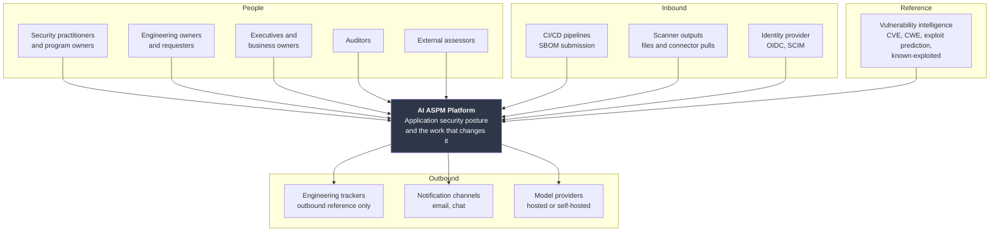
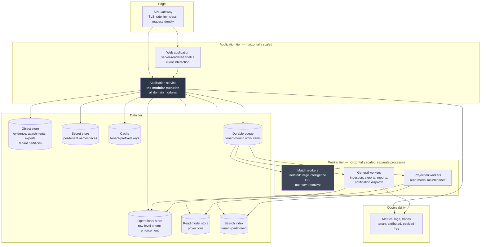
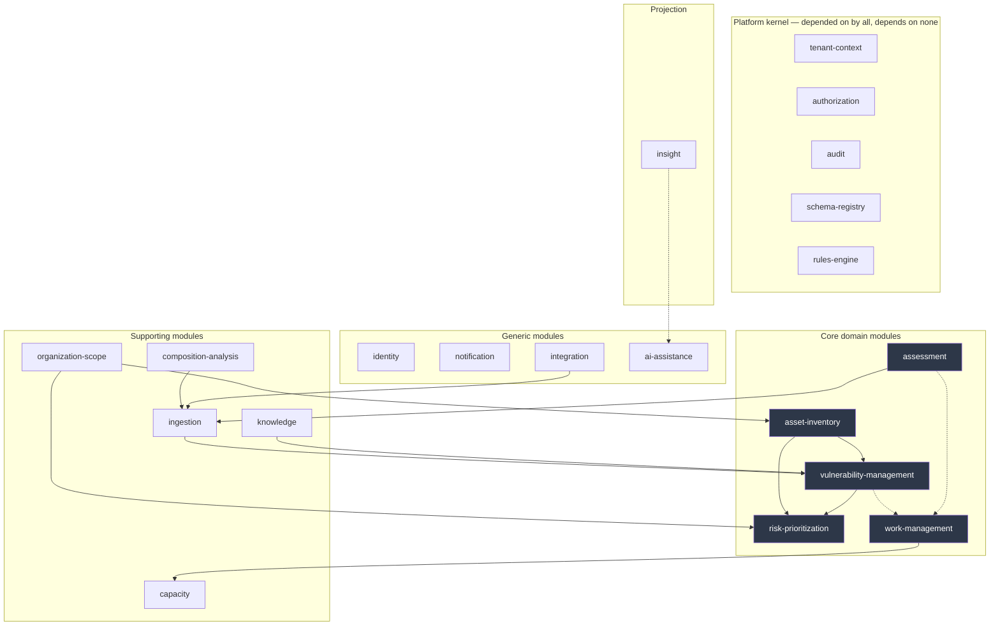

# 02 — System Architecture

## Table of Contents

1. [Purpose and Scope](#1-purpose-and-scope)
2. [Prerequisites and Local Conventions](#2-prerequisites-and-local-conventions)
3. [Architectural Drivers](#3-architectural-drivers)
4. [Context — C4 Level 1](#4-context--c4-level-1)
5. [Containers — C4 Level 2](#5-containers--c4-level-2)
6. [Modules — C4 Level 3](#6-modules--c4-level-3)
7. [Boundary Enforcement](#7-boundary-enforcement)
8. [Layering](#8-layering)
9. [Transactions and Consistency](#9-transactions-and-consistency)
10. [The Event Backbone](#10-the-event-backbone)
11. [Read Models](#11-read-models)
12. [Asynchronous Work](#12-asynchronous-work)
13. [Cross-Cutting Architecture](#13-cross-cutting-architecture)
14. [Failure Modes and Degradation](#14-failure-modes-and-degradation)
15. [Extraction Seams](#15-extraction-seams)
16. [Deferred Technology Decisions](#16-deferred-technology-decisions)
17. [Requirements Summary](#17-requirements-summary)
18. [Extensibility, Security, Closing](#18-extensibility-security-closing)

---

## 1. Purpose and Scope

### 1.1 Purpose

This document specifies the runtime and code structure that realizes the domain model. It is written **after** DOC-03 rather than before, because in Domain-Driven Design the architecture serves the model: module boundaries, transaction boundaries, and event flows are derived from bounded contexts and aggregates, not chosen independently and then imposed.

### 1.2 In scope

Architectural drivers traced to their sources; C4 levels 1 through 3; the modular monolith topology and how its boundaries are enforced rather than merely documented; layering rules; transaction and consistency boundaries; the event backbone; read model strategy; asynchronous work; cross-cutting architecture for tenant context, authorization, caching, and observability; failure modes and degradation behaviour; extraction seams; and the technology decisions this document deliberately defers.

### 1.3 Out of scope

| Excluded | Owned by |
|---|---|
| Physical schema, indexes, partitioning | DOC-04 |
| API contract detail | DOC-05 |
| Infrastructure, orchestration, environments, CI/CD | DOC-15 |
| Security control specification | DOC-06 |
| Isolation enforcement mechanics | DOC-24 |
| Authorization semantics | DOC-07 |

C4 Level 4 is deliberately absent: it duplicates the code and the duplicate is wrong within one sprint (DOC-00 §11.2).

---

## 2. Prerequisites and Local Conventions

| Document | Why |
|---|---|
| DOC-01 | Non-functional requirements (§12) are the architecture's acceptance criteria; PP-1 through PP-10 |
| DOC-03 | Bounded contexts are the modules; aggregates are the transaction boundaries; the relationship patterns of §5.3 determine permitted dependency directions |
| DOC-07 | The single enforcement contract this architecture must make unavoidable |
| DOC-24 | Tenant context propagation is an architectural requirement, not a library concern |
| DOC-26 | §13.2 concludes that structural controls should be preferred over procedural ones — a direct instruction to this document |

**LC-01.** Architectural constraints are issued as `CON-PLT-nnn`, continuing DOC-01's sequence which ended at `CON-PLT-005` (DOC-28 LC-01 establishes this pattern). They are constraints rather than functional requirements: they bind implementation and are not negotiable against schedule.

**LC-02 — Technology neutrality where it is genuine.** This document names a technology only where the choice is architecturally load-bearing. Where any competent option would do, the requirement states the property and §16 records the decision as deferred. Naming technologies that do not matter creates the appearance of decisions nobody made.

---

## 3. Architectural Drivers

Every significant structure below traces to one of these. A structure tracing to none is unjustified.

| ID | Driver | Source | Architectural consequence |
|---|---|---|---|
| D1 | **Tenant isolation is absolute and enforced beneath application code** | ADR-002, DOC-24 | Tenant context is a first-class runtime concern propagated everywhere, including asynchronous work; persistence-layer enforcement is mandatory |
| D2 | **The domain model must remain correctable while it is still being learned** | ADR-003 | Modular monolith with enforced boundaries, not microservices; extraction seams documented rather than pre-taken |
| D3 | **Nothing organization-specific may be fixed in code** | ADR-027 | Workflow, roles, taxonomies, and fields are data interpreted at runtime; a rules engine and a schema registry are architectural components, not features |
| D4 | **Authorization must be structurally unavoidable** | DOC-07 §8.1, DOC-26 §13.2 | A single enforcement contract that data access cannot bypass; not a library that must be remembered |
| D5 | **Dashboards must be fast over large data while operational writes stay responsive** | `NFR-DSH-001`, `NFR-VUL-001` | Read models separate from operational tables; CQRS for the query side only |
| D6 | **Coverage and freshness must accompany every derived figure** | PP-1, `PRD-SBM-022` | Coverage is computed and stored alongside measures, not derived at presentation time |
| D7 | **The platform must function with every external dependency unavailable** | `CON-DEP-001`, PP-9 | External integrations are optional, isolated, and explicitly degrading; no capability holds a hard dependency on egress |
| D8 | **AI holds no write authority** | ADR-005 | AI is architecturally outside the domain: it reads a projection and writes only to its own store, with no dependency edge into a domain module |
| D9 | **Work management must feel comparable to a purpose-built tracker** | ADR-028, `NFR-WRK-001` | Comment and item interactions need sub-second write acknowledgement, which constrains where synchronous work may be placed |
| D10 | **Findings and audit reach hundreds of millions of rows** | DOC-01 §12.1 | Partitioning and archival are architectural from the outset; append-only streams are separated from mutable aggregates |

---

## 4. Context — C4 Level 1



*Figure 4.1 — System context. Note what is absent: no edge to customer source control (ADR-024) and no edge into customer systems other than outbound reference creation. The platform's inbound surface is deliberately narrow.*

**On the absent edges.** ADR-024 removes source control from the context diagram entirely. This is the single largest simplification in the architecture: no repository fetch, no credential store for source access, no sandbox for untrusted code, no build execution. DOC-26 §3 explains why declining the capability was the correct trade.

---

## 5. Containers — C4 Level 2



*Figure 5.1 — Containers. One deployable application service containing all domain modules (ADR-003), with worker tiers as separate processes. Match workers are isolated for a specific reason (§5.2).*

### 5.1 Container responsibilities

| Container | Responsibility | Scaling |
|---|---|---|
| API Gateway | TLS termination, rate limit class assignment, request identity extraction. **No authorization decisions** | Stateless |
| Web application | Interface delivery and client interaction | Stateless, horizontal |
| Application service | Every domain module; all synchronous domain logic | Stateless, horizontal |
| General workers | Ingestion, export, report generation, notification dispatch, scheduled jobs | Horizontal by queue depth |
| Match workers | Vulnerability matching only | Horizontal, separate resource profile |
| Projection workers | Read model and search index maintenance | Horizontal by lag |
| Operational store | Aggregate persistence with row-level tenant enforcement | Vertical plus read replicas |
| Read model store | Query projections | Horizontal read |
| Object store | Evidence, attachments, exports — tenant-partitioned by access policy, not path convention | Managed |
| Secret store | Per-tenant namespaces | Managed |
| Cache | Tenant-prefixed keys via a mandatory constructor | Horizontal |
| Durable queue | Tenant-bound work items | Managed |

### 5.2 Why match workers are a separate container

Not premature separation. Three specific reasons:

**Memory profile.** A vulnerability intelligence database is large, and matching holds substantial working set. Co-locating with the API tier means an out-of-memory condition during a match run takes down request handling — and it would occur precisely during a portfolio sweep triggered by a high-profile disclosure, which is when the platform must be available.

**Independent scaling.** Match load is bursty and driven by intelligence updates rather than user activity. It scales on a different signal from the API tier.

**Blast radius.** Matching processes submitted SBOM documents, which are untrusted input (DOC-24 B5). Process isolation contains a parser defect.

This is the one container separation that ADR-003 permits at v1 without treating it as a microservice: it shares the codebase, the deployment pipeline, and the domain model, and differs only in which entry points it runs.

### 5.3 Requirements

| ID | Statement | Rationale | Pri | V |
|---|---|---|---|---|
| `CON-PLT-006` | All domain modules MUST deploy as a single application artifact. Modules MUST NOT be independently deployable in this release. | ADR-003. Independent deployability locks context boundaries before the model is validated by use, and the boundaries will move. One artifact makes boundary correction a refactor rather than a migration. | M | AR |
| `CON-PLT-007` | The application service and every worker tier MUST be stateless, holding no session, tenant, or work state between requests. | Required for horizontal scaling and for `NFR-DEP-001`. Also a correctness requirement: state retained between requests is the mechanism of the pooled-connection leak of `SEC-TEN-007`. | M | AR, AT |
| `CON-PLT-008` | Vulnerability matching MUST execute in a worker process separate from the API tier. | An out-of-memory condition during matching must not affect request handling, and matching's resource profile differs materially. It also isolates a parser processing untrusted documents. | M | AR |
| `CON-PLT-009` | The API gateway MUST NOT make authorization decisions. It assigns rate limit class and extracts request identity only. | Authorization requires domain context — the object, its scope, its ownership. A gateway making partial decisions creates a second enforcement point that will diverge from the first (D4). | M | AR, CR |

---

## 6. Modules — C4 Level 3

### 6.1 Module map

One module per bounded context (DOC-03 §5.1). The module boundary *is* the context boundary; there is no second decomposition.



*Figure 6.1 — Module dependency graph. Dashed edges are event-driven and carry no compile-time dependency. The kernel is depended upon by everything and depends on nothing.*

### 6.2 The platform kernel

Five modules that every domain module needs and that must not be duplicated.

| Module | Provides | Why it is kernel rather than a domain module |
|---|---|---|
| `tenant-context` | Context establishment, propagation, and the data access gate | Every module needs it; duplication would mean multiple enforcement points (D1) |
| `authorization` | The single evaluation contract | Same reasoning (D4). Note this is the *contract*; the permission catalogue and role data are its concern too, but it holds no domain knowledge |
| `audit` | Event recording with integrity | Subscribes to all modules; must not be optional for any of them |
| `schema-registry` | Typed attribute schemas for custom fields and type registries | The mechanism through which ADR-027 configurability is realized (D3) |
| `rules-engine` | Deterministic condition-action evaluation for workflows, automation, service level matching, and checklist selection | Four modules need the same evaluator. Four implementations would diverge, and one of them governs authorization-relevant workflow transitions |

**On `rules-engine` being kernel.** It is tempting to place a rules engine in each module that needs one. That produces four evaluators with four sets of subtle semantics, one of which — workflow transitions — determines whether an approval gate applies. A single evaluator with one semantics, tested once, is the only defensible arrangement.

### 6.3 Requirements

| ID | Statement | Rationale | Pri | V |
|---|---|---|---|---|
| `CON-PLT-010` | Each bounded context MUST correspond to exactly one module, and there MUST NOT be a second decomposition scheme layered over it. | Two decomposition schemes mean two mental models and a boundary that is unclear in exactly the cases that matter. The context boundary is the module boundary. | M | AR |
| `CON-PLT-011` | Kernel modules MUST NOT depend on any domain module. | A kernel with a domain dependency is not a kernel; it creates a cycle through which every module transitively depends on one domain module's model. | M | AT, AR |
| `CON-PLT-012` | Deterministic rule evaluation for workflows, automation, service level matching, and checklist selection MUST use a single shared evaluator. | Four evaluators diverge in semantics, and one of them governs whether workflow approval gates apply — divergence there is a privilege escalation. | M | AR |

---

## 7. Boundary Enforcement

### 7.1 Documented boundaries are not boundaries

ADR-003 accepted a known cost: module boundary discipline erodes unless tooling enforces it. DOC-26 §13.2 concluded that structural controls should be preferred over procedural ones. This section is where those two meet.

A modular monolith with boundaries maintained by convention becomes an unstructured monolith within a year, and the erosion is invisible in review because each individual cross-boundary call is locally reasonable.

### 7.2 The enforcement mechanism

Each module publishes an explicit contract — commands, queries, events, and shared value objects — and everything else is internal. Enforcement is at build time.

```
module/
├── contract/          ← the only importable surface; commands, queries, events, DTOs
├── domain/            ← aggregates, invariants, domain services. Never imported externally
├── application/       ← command and query handlers
└── infrastructure/    ← persistence, adapters. Never imported externally
```

| ID | Statement | Rationale | Pri | V |
|---|---|---|---|---|
| `CON-PLT-013` | Cross-module imports MUST be restricted at build time to published contract surfaces, and a violation MUST fail the build rather than produce a warning. | A warning is a violation with extra steps. Build failure is the only enforcement that survives delivery pressure, and this is the specific cost ADR-003 accepted (D2). | M | AT |
| `CON-PLT-014` | The permitted dependency direction between modules MUST match the relationship patterns of DOC-03 §5.3, and a dependency in the prohibited direction MUST fail the build. | The relationship patterns encode who absorbs the cost of change. A dependency pointing the wrong way inverts that silently — for example Vulnerability Management depending on Ingestion would make a parser change a domain change. | M | AT |
| `CON-PLT-015` | No module MUST access another module's persistence directly. Data crosses boundaries through contracts or events only. | Direct table access is the boundary erosion that cannot be undone: once two modules read the same table, neither can change its schema. | M | AT, CR |
| `CON-PLT-016` | The module dependency graph MUST be acyclic, and a cycle MUST fail the build. | A cycle means the two modules are one module with a documented fiction between them, and it makes extraction (§15) impossible without breaking both. | M | AT |

### 7.3 The one permitted asymmetry

Modules may **subscribe** to another module's events without a compile-time dependency on that module, because an event contract is published in a shared events package rather than owned by the publisher. This is how `audit`, `notification`, and `insight` observe everything without depending on everything — and it is why those three appear with dashed edges in Figure 6.1.

---

## 8. Layering

### 8.1 Rules

Within a module, dependencies point inward. Four layers, and the rule is absolute in one direction.

| Layer | May depend on | May not depend on |
|---|---|---|
| `domain` | Nothing outside itself and shared value objects | Application, infrastructure, framework, persistence, any external library beyond primitives |
| `application` | Domain, other modules' contracts, kernel | Infrastructure concretions |
| `infrastructure` | Domain interfaces, application interfaces | — implements them |
| `contract` | Shared value objects only | Domain internals |

| ID | Statement | Rationale | Pri | V |
|---|---|---|---|---|
| `CON-PLT-017` | The `domain` layer MUST NOT depend on any persistence, framework, transport, or serialization concern, and this MUST be enforced at build time. | Invariants are the platform's correctness. A domain layer coupled to persistence cannot be tested without a database, which means invariant tests are slow, which means they are run less often, which means invariants regress. The 106 invariants of DOC-03 are only as good as the speed at which they can be asserted. | M | AT |
| `CON-PLT-018` | Domain invariants MUST be enforced in the domain layer, not in the application layer, database constraints, or interface validation. | An invariant enforced only at the interface is bypassed by the API; one enforced only in the database produces an error the domain cannot interpret. Database constraints remain as defence in depth (DOC-04) but are not the primary enforcement. | M | CR, AT |

### 8.2 Where configurability lives

D3 requires workflows, roles, taxonomies, and fields to be data. This creates a tension with the layering rule: interpreted data is infrastructure-adjacent, but it governs domain behaviour.

**Resolution.** The `domain` layer defines the *interfaces* — a workflow definition, a field schema, a rule — as domain concepts. Loading and caching them is infrastructure. Interpreting them is domain. A workflow transition is therefore a domain operation over a domain object that happens to have been loaded from configuration, which keeps invariant enforcement (`CON-PLT-018`) in the right place.

**The alternative that fails.** Treating configuration as infrastructure and applying it in the application layer moves transition guards out of the domain, which means the invariant *"a transition cannot exceed the actor's authority"* (`INV-WRK-13`) is enforced where it can be bypassed.

---

## 9. Transactions and Consistency

### 9.1 One aggregate per transaction

| ID | Statement | Rationale | Pri | V |
|---|---|---|---|---|
| `CON-PLT-019` | A transaction MUST modify exactly one aggregate instance. Where an operation must change several, it MUST be modelled as a sequence with defined intermediate states and compensation. | Multi-aggregate transactions make aggregate boundaries fictional and turn the highest-contention objects — findings and work items — into contention on unrelated objects. It also forecloses extraction (§15), since a transaction spanning two aggregates in different modules cannot be split. | M | AR, CR |
| `CON-PLT-020` | Where an operation spans aggregates, the resulting eventual consistency MUST be visible in the model and the interface. It MUST NOT be concealed by synchronous waiting. | Concealed asynchrony produces a system that appears consistent and is not, which is worse than one that is honestly eventual — because the inconsistency surfaces as an inexplicable defect rather than an expected state. | M | AR |

### 9.2 Consistency classification

| Operation | Consistency | Why |
|---|---|---|
| Finding state transition | Strong, within the aggregate | Invariants must hold |
| Work item transition | Strong | Workflow guards must hold |
| Assignment | Strong | |
| Finding → work item creation | **Eventual** | Two aggregates, two modules. Modelling it as strong would couple Vulnerability Management to Work Management transactionally |
| Score recomputation after a criticality change | Eventual | Potentially thousands of scores; synchronous recomputation would block the criticality change for minutes |
| Read model projection | Eventual, bounded lag | `NFR-DSH-001` sets the budget |
| Search index | Eventual, bounded lag | |
| Coverage state recomputation | Eventual | |
| Audit event | **Strong** — see below | |
| Notification dispatch | Eventual | |

### 9.3 Audit is the exception

| ID | Statement | Rationale | Pri | V |
|---|---|---|---|---|
| `CON-PLT-021` | An audited operation MUST NOT be acknowledged as successful unless its audit event is durably recorded. Where audit recording fails, the operation MUST fail. | `NFR-AUD-002`. An audit trail with gaps of unknown extent has limited evidential value, and the gap is undetectable afterwards. This is the one place where availability is deliberately traded for integrity, and DOC-26 T10 depends on it — audit is how compromise is evidenced. | M | AT |

**The cost, stated.** An audit store outage becomes a write outage. That is accepted: a platform that continues accepting changes it cannot record is producing an unreliable record, and an unreliable record is worse for the customer than a brief outage. Mitigation is availability of the audit store rather than relaxation of the rule.

### 9.4 Reorganization as a saga

DOC-03 §7.5 established reorganization as a process rather than a transaction, because a subtree is not one aggregate. Architecturally it is a saga: validate the target structure, increment the hierarchy version, re-parent, rebuild affected closure rows, emit the event. Each step is individually transactional; failure between steps leaves a defined intermediate state with a compensation path, specified in DOC-09.

---

## 10. The Event Backbone

### 10.1 Two classes of event delivery

Not every event needs the same guarantees, and treating them uniformly is either over-engineered or unsafe.

| Class | Delivery | Used for | Rationale |
|---|---|---|---|
| **Transactional** | Written in the same transaction as the aggregate change, dispatched after commit | Audit, projection invalidation, work item creation from findings | Must not be lost. An event lost between the aggregate change and its consequence produces permanent inconsistency with no signal |
| **Best-effort** | Dispatched after commit without durability guarantee | Cache invalidation hints, presence, non-critical telemetry | Loss is tolerable and recoverable by other means |

| ID | Statement | Rationale | Pri | V |
|---|---|---|---|---|
| `CON-PLT-022` | Domain events whose loss would produce inconsistency MUST be persisted in the same transaction as the state change that produced them, and dispatched after commit. | Dispatching before commit publishes events for changes that may roll back. Dispatching outside the transaction loses events on a crash between commit and dispatch. Transactional persistence with post-commit dispatch is the only arrangement that avoids both. | M | AT |
| `CON-PLT-023` | Every event consumer MUST be idempotent, and MUST tolerate at-least-once delivery and out-of-order arrival within a bounded window. | Exactly-once delivery is not achievable across a process boundary. Building consumers that assume it produces defects that appear only under retry — which is to say, under load and during incidents. | M | AT |
| `CON-PLT-024` | Every event MUST carry its tenant identifier, and a consumer MUST establish tenant context from the event rather than inheriting ambient context. | `SEC-TEN-006`. An event handler has no request to inherit from, and this is where cross-tenant iteration actually occurs (DOC-24 §6.2 entry 2). | M | AT |
| `CON-PLT-025` | Event consumers MUST NOT be able to write into the publishing module's aggregates. | Otherwise events become a bidirectional coupling that bypasses the contract, and the dependency direction of `CON-PLT-014` is defeated through a channel the build cannot see. | M | AT, CR |

### 10.2 Ordering

Global ordering is not provided. Per-aggregate ordering is, because consumers reasoning about an aggregate's lifecycle require it: a `FindingResolved` arriving before `FindingRaised` is not a tolerable reordering.

---

## 11. Read Models

### 11.1 Why a separate read side

D5. Dashboard aggregation over operational tables at the volumes of DOC-01 §12.1 degrades both the dashboard and the operational writes it competes with. `PRD-DSH-014` requires the separation.

**CQRS on the query side only.** Commands go through aggregates in the operational store. Queries for dashboards, search, and reporting go to projections. This is deliberately partial: full CQRS with separate command and query models per module would add ceremony to the many modules where a simple query against the aggregate store is correct.

### 11.2 Projections

| Projection | Source events | Serves | Lag budget |
|---|---|---|---|
| Posture aggregate | Finding, asset, score, coverage | Executive and operational dashboards | 60 s |
| Finding search | Finding, asset, enrichment | Finding list and search | 10 s |
| Work queue | Work item, transition, service level clock | Operational queues, personal views | 5 s |
| Workload snapshot | Transition log, capacity | Workload composition | Daily rollup plus 60 s current |
| Coverage state | SBOM submission, match run, asset | Coverage reporting, freshness queues | 60 s |
| Activity timeline | All state-bearing events | Work item timeline | 5 s |

**On the 5-second budgets.** Work queue and activity timeline are the surfaces a practitioner refreshes constantly and where lag reads as the platform being broken. `NFR-WRK-001` requires sub-second write acknowledgement; a user who writes and then sees stale state within a second concludes the write failed.

### 11.3 Requirements

| ID | Statement | Rationale | Pri | V |
|---|---|---|---|---|
| `CON-PLT-026` | Read model projections MUST be rebuildable from the event stream or from the operational store without downtime. | A projection defect is otherwise permanent, and projections are where subtle aggregation errors live. Rebuildability is also how a new measure is added over historical data (DOC-01 §16.4). | M | AT |
| `CON-PLT-027` | Projection lag MUST be observable per projection and MUST alert on exceeding its budget. | Silent lag presents as stale data the user believes is current — PP-1 applied to freshness. It is also the failure mode that looks like a write having failed. | M | AT |
| `CON-PLT-028` | Coverage and freshness MUST be materialized in projections alongside the measures they qualify, not computed at presentation time. | D6. Computing at presentation makes it optional, and an optional coverage qualifier will be omitted from the report where it matters most. Materializing it makes the measure and its qualification inseparable. | M | AT, AR |
| `CON-PLT-029` | A projection MUST enforce tenant partitioning structurally, and a projection query MUST NOT be able to span tenants. | DOC-24 §6.2 entries 3 and 4. Projections are aggregation surfaces, which is where cross-tenant leakage through counts occurs. | M | AT, PT |

**On `CON-PLT-028`.** This is the architectural expression of PP-1 and it is easy to get wrong in a way that is hard to detect: a projection storing a finding count without its coverage forces the presentation layer to fetch coverage separately, at which point a report can be built that omits it. Materializing them together makes the omission require deliberate effort.

---

## 12. Asynchronous Work

### 12.1 Work classes

| Class | Examples | Isolation |
|---|---|---|
| `INTERACTIVE` | User-triggered match run, on-demand report, single export | Never queued behind `BATCH` (`PRD-SBM-004`) |
| `BATCH` | Portfolio sweep, bulk import, scheduled report | Separate queue, per-tenant concurrency cap |
| `PROJECTION` | Read model and index maintenance | Separate; lag-sensitive |
| `SCHEDULED` | Freshness checks, service level evaluation, escalation, rollups | Separate; must not be starved |
| `DISPATCH` | Notification delivery, webhook delivery | Separate; latency-sensitive (`NFR-NTF-001`) |

| ID | Statement | Rationale | Pri | V |
|---|---|---|---|---|
| `CON-PLT-030` | Work classes MUST use isolated queues with independent concurrency control, and `INTERACTIVE` work MUST NOT be blocked behind `BATCH` work. | A user-initiated operation queued behind a portfolio sweep is a feature nobody uses. This is the most common operational failure in self-built job orchestration. | M | AT |
| `CON-PLT-031` | Work items MUST be leased with expiry and automatic reclamation. Heartbeat-only liveness MUST NOT be used. | Container termination is abrupt and is the normal failure mode. A heartbeat that stops without a lease expiry leaves work claimed permanently, which stalls a batch silently. | M | AT |
| `CON-PLT-032` | Work items MUST be idempotent on a derived key, and retry MUST be bounded with backoff and a terminal failure state. | Retry is inevitable; unbounded retry on a permanently failing item consumes capacity indefinitely and hides the failure. A terminal state makes the failure visible. | M | AT |
| `CON-PLT-033` | Scheduled work MUST NOT overlap with a prior run of itself unless explicitly permitted, and MUST apply jitter. | Overlapping sweeps compound load. Unjittered schedules produce synchronized load spikes across tenants at hour boundaries — which is also when reports run. | M | AT |
| `CON-PLT-034` | Per-tenant concurrency caps MUST apply to `BATCH` and `INTERACTIVE` classes such that one tenant cannot starve another. | `SEC-TEN-032`, `NFR-PLT-002`. Without per-tenant caps, a single tenant's sweep occupies the worker fleet. | M | AT |

---

## 13. Cross-Cutting Architecture

### 13.1 Tenant context

D1. Established at request entry from the credential, immutable for the request, propagated to every call including asynchronous continuations and queued work.

| ID | Statement | Rationale | Pri | V |
|---|---|---|---|---|
| `CON-PLT-035` | Tenant context MUST be propagated implicitly through the call chain rather than passed as an explicit parameter through every function signature. | Explicit propagation is forgotten in exactly the deep call paths where it matters, and an omitted parameter compiles. Implicit propagation with a mandatory gate at data access makes omission structurally impossible (D1). | M | AR, AT |
| `CON-PLT-036` | Data access MUST be reachable only through a gate that requires an established tenant context, and there MUST NOT be an alternative access path in application code. | `SEC-TEN-005`. An alternative path exists for convenience and then becomes the normal path. | M | AT, CR |

### 13.2 Authorization

D4, and DOC-26 §13.2's instruction to prefer structural controls.

| ID | Statement | Rationale | Pri | V |
|---|---|---|---|---|
| `CON-PLT-037` | Authorization MUST be evaluated through the kernel contract, and repository or query execution MUST require an authorization decision as an input. A query MUST NOT be executable without one. | `SEC-AUZ-013`. Making the decision a required *input* rather than a preceding *call* converts "remembering to check" into "unable to proceed without checking". This is the structural-over-procedural preference applied to the platform's highest-risk control. | M | AT, AR |
| `CON-PLT-038` | Collection queries MUST accept the scope predicate as part of query construction, and MUST NOT support post-retrieval filtering as an authorization mechanism. | `SEC-AUZ-016`. Retrieve-then-filter discloses counts, breaks pagination, and moves unauthorized data into application memory where it reaches logs and error reports. | M | AT, PT |

### 13.3 Caching

| ID | Statement | Rationale | Pri | V |
|---|---|---|---|---|
| `CON-PLT-039` | Cache keys MUST be constructed by a mandatory constructor that includes tenant and, where the cached value is scope-dependent, a scope discriminator. Direct cache client access MUST NOT be available to application code. | DOC-24 §6.2 entry 1. A key is constructed by hand in the moment and reviewed by someone reading the feature. The scope discriminator matters because a value cached for a broad-scope principal must not be served to a narrow-scope one. | M | AT, CR |
| `CON-PLT-040` | Authorization and scope resolution caches MUST be invalidated explicitly on hierarchy change, assignment change, role change, and node archival, within the bound of `NFR-SEC-002`. | A stale scope cache is a live authorization bypass. Hierarchy change is the trigger most likely to be missed, because it originates in a different module. | M | AT |

### 13.4 Observability

| ID | Statement | Rationale | Pri | V |
|---|---|---|---|---|
| `CON-PLT-041` | Telemetry MUST carry tenant identity as a dimension and MUST NOT carry tenant data as payload. | `NFR-OPS-001`. Telemetry pipelines are the most common residency and disclosure leak, because they are designed for diagnosis rather than for confidentiality (DOC-24 §8.1). | M | AT, CR |
| `CON-PLT-042` | Every request and every work item MUST carry a correlation identifier propagated across module, process, and queue boundaries. | Without it, diagnosing a failure spanning a request, a queued job, and a projection requires guesswork — which is the normal shape of a failure here. | M | AT |

---

## 14. Failure Modes and Degradation

D7 and PP-9. Every external dependency is optional; unavailability degrades explicitly.

| Dependency unavailable | Behaviour | Explicitly surfaced as |
|---|---|---|
| Vulnerability intelligence source | Matching continues against the last provisioned version | Intelligence age indicator; staleness on affected findings |
| Model provider | AI capabilities unavailable; non-AI fallback presented | Capability marked unavailable with the reason |
| Notification provider | Queued with retry; in-product notification unaffected | Delivery failure surfaced to administrators |
| Secret store | Credential reveal unavailable; everything else functions | Reveal disabled with the reason |
| Object store | Evidence and export unavailable; findings and work function | Affected operations disabled |
| Search index | Search unavailable; filtered lists function against the operational store | Search marked unavailable |
| Read model store | Dashboards unavailable or degraded to a slower direct path | Degradation stated with expected latency |
| Connector target | Health state degraded, circuit opened, owner notified | Connector health, coverage gap |
| Audit store | **Writes fail** (`CON-PLT-021`) | Service unavailable |

| ID | Statement | Rationale | Pri | V |
|---|---|---|---|---|
| `CON-PLT-043` | No capability except audit MUST hold a hard dependency on an external service. Unavailability MUST degrade that capability only, with the degradation and its consequence visible in the interface. | `CON-DEP-001` requires air-gapped deployment, where several of these are permanently absent rather than transiently unavailable. A hard dependency would make air-gapped deployment impossible, and silent degradation would make it dishonest. | M | AT |
| `CON-PLT-044` | Every degraded state MUST be observable in telemetry and MUST alert where it exceeds a configured duration. | A degradation nobody notices becomes permanent, and permanent degradation of the intelligence path is how coverage gaps form silently. | M | AT |

**The single hard dependency is deliberate.** Audit (`CON-PLT-021`) trades availability for integrity. Every other dependency trades capability for availability. That asymmetry is the architecture's clearest statement of priority.

---

## 15. Extraction Seams

ADR-003 requires documented extraction seams. This section names them, in order, with the trigger for each.

| Order | Module | Why first | Trigger | Cost |
|---|---|---|---|---|
| 1 | `composition-analysis` match execution | **Already a separate process** (§5.2). Extracting to a separate deployable is a packaging change, not a refactor | Independent scaling or release cadence required | Low |
| 2 | `ai-assistance` | No inbound domain dependency by construction (D8, `INV-AIC-01`). Reads a projection, writes its own store | Model hosting requires distinct infrastructure (OQ-027) | Low |
| 3 | `ingestion` | Customer-supplier to Vulnerability Management with a defined contract; already worker-resident | Ingestion volume requires independent scaling | Medium — the fingerprint computation must remain single-sited (`INV-ING-01`) |
| 4 | `insight` projection | Read-only, event-driven, no domain writes | Query load requires separate infrastructure | Medium — projection rebuild coordination |
| 5 | `notification` | Event-driven, no inbound dependency | Delivery volume | Low |

**Not extractable without model change:** the five core modules. `asset-inventory`, `vulnerability-management`, `risk-prioritization`, `assessment`, and `work-management` share published-language coupling and, in the finding-to-work case, event-driven coupling that assumes bounded lag. Extracting any of them means accepting cross-service eventual consistency in the platform's central workflow, which is a product decision rather than an architectural one.

| ID | Statement | Rationale | Pri | V |
|---|---|---|---|---|
| `CON-PLT-045` | Extraction seams MUST be maintained as the module contracts evolve, and a contract change that would prevent extraction of a listed module MUST be recorded as a decision. | Seams documented once and not maintained are fiction. Recording the closure of a seam as a decision means the option is given up deliberately rather than lost. | M | CR, DI |

---

## 16. Deferred Technology Decisions

Per LC-02, decisions this document deliberately does not make. Each is deferred because any competent option satisfies the stated properties, and naming one here would create the appearance of an architectural decision that is really an implementation choice.

The deferral has since been discharged: the eight selections are recorded as ADR-049 through ADR-056 in DOC-19 under `OPS-DEP-001`, verified against the required properties restated in DOC-15 §2. The table below is retained because it states the properties rather than the products, and a substitution is assessed against it.

| Decision | Required properties | Decided by |
|---|---|---|
| Operational store | Row-level security or equivalent enforced by the engine; transactional; partitioning; JSON attribute support for typed schemas | DOC-04 |
| Read model store | Horizontal read scaling; aggregation performance at DOC-01 §12.1 volumes | DOC-04 |
| Search engine | Tenant partitioning; pre-scoring filtering (`SEC-TEN-011`); relevance ranking | DOC-04 |
| Durable queue | At-least-once delivery; per-class isolation; lease semantics; visibility timeout | DOC-15 |
| Cache | Key-prefix scoping; explicit invalidation | DOC-15 |
| Secret store | Per-tenant namespaces; non-retrievable-after-entry; rotation. **Blocked on OQ-026** | DOC-06 |
| Object store | Access-policy tenant partitioning, not path convention; signed references; server-side encryption | DOC-15 |
| Application language and framework | Build-time module boundary enforcement (`CON-PLT-013`); static analysis for `SEC-AUZ-050` | DOC-15 |

**The one that is not merely deferred.** `CON-PLT-013` and `SEC-AUZ-050` require build-time enforcement of module boundaries and a static analysis rule prohibiting role-name branching. **A language or toolchain without a credible mechanism for both is disqualified**, and that is an architectural constraint on the technology choice rather than a preference.

| ID | Statement | Rationale | Pri | V |
|---|---|---|---|---|
| `CON-PLT-046` | The implementation language and toolchain MUST support build-time enforcement of module boundary rules and static analysis of authorization patterns. | Two of the architecture's structural controls depend on it (`CON-PLT-013`, `SEC-AUZ-050`), and DOC-26 §13.2 establishes that structural controls are preferred precisely because procedural ones decay. A toolchain that cannot enforce them reduces both to code review. | M | AR |

---

## 17. Requirements Summary

Forty-one architectural constraints, `CON-PLT-006` through `CON-PLT-046`, continuing DOC-01's sequence.

| Group | IDs | Count |
|---|---|---|
| Containers | `CON-PLT-006` – `009` | 4 |
| Modules | `CON-PLT-010` – `012` | 3 |
| Boundary enforcement | `CON-PLT-013` – `016` | 4 |
| Layering | `CON-PLT-017` – `018` | 2 |
| Transactions | `CON-PLT-019` – `021` | 3 |
| Events | `CON-PLT-022` – `025` | 4 |
| Read models | `CON-PLT-026` – `029` | 4 |
| Asynchronous work | `CON-PLT-030` – `034` | 5 |
| Cross-cutting | `CON-PLT-035` – `042` | 8 |
| Degradation | `CON-PLT-043` – `044` | 2 |
| Extraction | `CON-PLT-045` | 1 |
| Toolchain | `CON-PLT-046` | 1 |

---

## 18. Extensibility, Security, Closing

### 18.1 Extensibility

The five extension mechanisms of DOC-01 §16.1 map onto architecture as follows: type registries and declarative definitions are served by `schema-registry` and `rules-engine`; plugin contracts are module-internal registries with a published interface; tenant configuration is data loaded through infrastructure and interpreted in domain (§8.2); event subscription requires no dependency edge (§7.3).

**Adding a bounded context** is adding a module with a contract and a place in the dependency graph. The build enforces that its dependencies are legal (`CON-PLT-014`), which means a new module cannot quietly couple to another's internals.

**Deliberate rigidity.** One artifact (`CON-PLT-006`); one aggregate per transaction (`CON-PLT-019`); build-enforced boundaries (`CON-PLT-013`); no direct cross-module persistence (`CON-PLT-015`); audit as the single hard dependency (`CON-PLT-021`). Each will be pressured, and `CON-PLT-019` most of all — a multi-aggregate transaction is always the shortest path to a consistent-looking result.

**Known extension costs.** Read model dimension changes require backfill (`CON-PLT-026` makes it possible, not cheap). Extracting a core module requires accepting cross-service eventual consistency in the central workflow (§15). The rules engine is shared by four consumers, so a semantics change affects all four including workflow authorization.

### 18.2 Security considerations

The architecture's contribution to security is **making controls unavoidable rather than remembered**, which is DOC-26 §13.2's instruction realized:

| Control | Made structural by |
|---|---|
| Tenant isolation | Implicit propagation plus a mandatory data access gate (`CON-PLT-035`, `-036`) |
| Authorization | Decision as a required query input (`CON-PLT-037`) |
| Scope in collections | Predicate in query construction (`CON-PLT-038`) |
| Cache tenant keying | Mandatory constructor, no direct client access (`CON-PLT-039`) |
| Audit completeness | Operation fails if audit fails (`CON-PLT-021`) |
| Module boundaries | Build failure (`CON-PLT-013`) |
| Domain invariants | Enforced in a layer with no infrastructure dependency (`CON-PLT-017`, `-018`) |
| AI containment | No dependency edge from `ai-assistance` into any domain module (D8) |

**Residual architectural risks.**

*The kernel is a single point of correctness.* `tenant-context` and `authorization` are depended upon by everything, so a defect in either is a platform-wide defect. This is the correct trade — one place to get right rather than seventeen — but it concentrates risk and warrants the deepest test coverage in the corpus.

*Boundary enforcement depends on the toolchain.* `CON-PLT-046` makes it a selection constraint. If the chosen toolchain's enforcement is weak or bypassable, `CON-PLT-013` degrades to convention and ADR-003's accepted cost materializes.

*Eventual consistency is a correctness surface.* `CON-PLT-020` requires eventual consistency to be visible rather than concealed, which pushes the complexity into the interface and the model where it can be reasoned about. It does not remove it.

### 18.3 Open questions

| ID | Bearing |
|---|---|
| OQ-015 | Volume determines whether read models require separate infrastructure at v1 or can share the operational store initially. Structure unaffected |
| OQ-027 | If the platform must operate models rather than call providers, a substantial container is added and `ai-assistance` extraction (§15 order 2) becomes mandatory rather than optional |

### 18.4 Notes for downstream documents

| Document | Note |
|---|---|
| DOC-04 | Owes schema per module with no cross-module table access (`CON-PLT-015`); projection schemas with materialized coverage (`CON-PLT-028`); partitioning for append-only streams (D10); row-level enforcement policy |
| DOC-05 | Owes the async job pattern realizing §12; idempotency key derivation; the tenant context never appearing as a parameter |
| DOC-06 | Owes the secret store decision (OQ-026) and the static analysis rule realizing `SEC-AUZ-050` under `CON-PLT-046` |
| DOC-09 | Owes the reorganization saga compensations (§9.4) and workflow interpretation semantics for the shared rules engine |
| DOC-15 | Owes container topology, worker fleet sizing per class, queue configuration, and the toolchain selection satisfying `CON-PLT-046` |
| DOC-16 | Owes build-time boundary tests (`CON-PLT-013`, `-014`, `-016`), domain layer purity tests (`CON-PLT-017`), projection rebuild-and-compare tests, and idempotency tests under duplicate and out-of-order delivery |

### 18.5 Change History

| Version | Date | Author | Change | Reviewer |
|---|---|---|---|---|
| 1.0.1 | 2026-08-04 | Chief Software Architect; Principal Security Architect | §16 records that the deferral has been discharged and points to ADR-049 through ADR-056. No requirement changed; the property table is retained because it states properties rather than products, and `CON-PLT-046` remains the constraint the toolchain selection was verified against. | Pending |
| 1.0.0 | 2026-08-04 | Chief Software Architect; Principal Security Architect | Initial content-complete version. Derives ten architectural drivers from DOC-01, DOC-24, DOC-26, and the ADRs. Specifies C4 levels one to three with the module map equal to the bounded context map, and a five-module platform kernel including a shared rules engine justified by the divergence risk in workflow authorization. Specifies build-time boundary enforcement as the structural realization of ADR-003's accepted cost, with dependency direction bound to the DOC-03 relationship patterns. Specifies layering with domain purity enforced at build time on the grounds that slow invariant tests are run less often. Specifies one aggregate per transaction, a consistency classification per operation, and audit as the single deliberate availability-for-integrity trade. Specifies transactional versus best-effort event delivery, read model projections with materialized coverage as the architectural expression of PP-1, five isolated asynchronous work classes, and cross-cutting architecture that makes tenant context and authorization structurally unavoidable rather than remembered. Enumerates degradation behaviour for nine external dependencies, five extraction seams in order with triggers, and eight deliberately deferred technology decisions with one that is instead a selection constraint. Forty-one constraints continuing DOC-01's sequence. | Pending |
