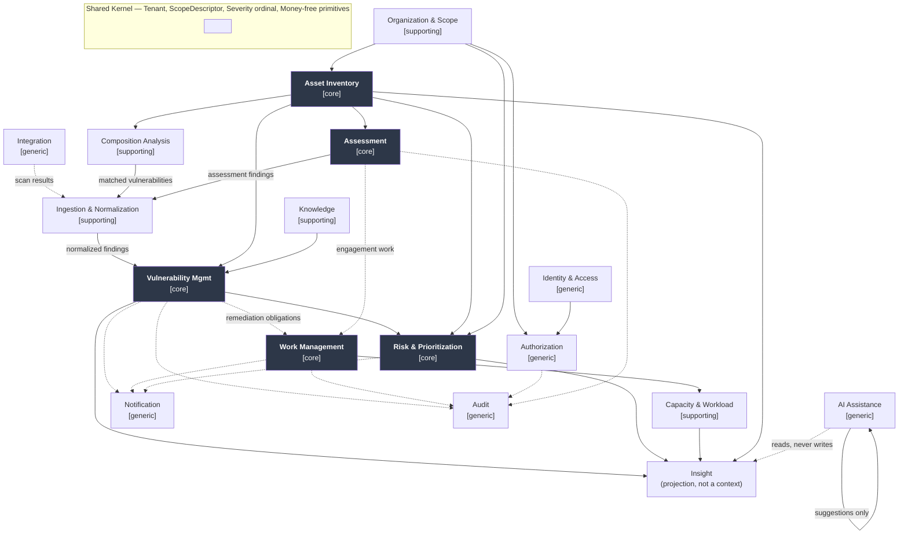
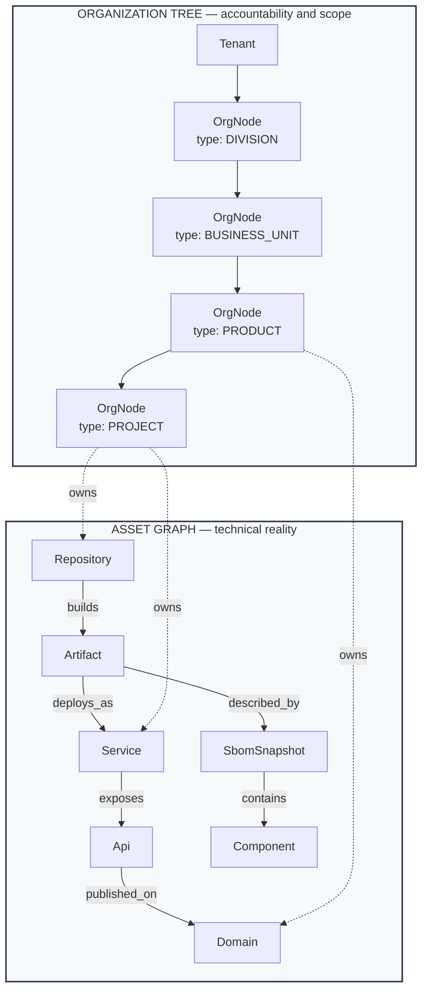
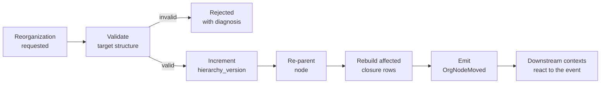
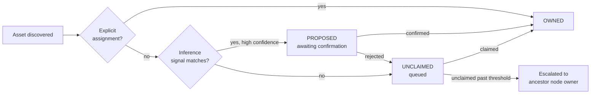

# 03 — Domain Model

> **Document complete.** Authored in three parts per DOC-00 §19.3; all parts delivered. Seventeen bounded contexts, thirty-two aggregates, one hundred and six invariants. No content was abbreviated to fit a delivery.

---

## Table of Contents

**Part 1 — delivered**
1. [Purpose and Scope](#1-purpose-and-scope)
2. [Prerequisites](#2-prerequisites)
3. [Local Conventions](#3-local-conventions)
4. [Modelling Approach and Notation](#4-modelling-approach-and-notation)
5. [Bounded Context Map](#5-bounded-context-map)
6. [The Structural Foundation](#6-the-structural-foundation)
7. [Organization and Scope Context](#7-organization-and-scope-context)

**Part 2**
8. [Asset Inventory Context](#8-asset-inventory-context)
9. [Assessment Context](#9-assessment-context)
10. [Vulnerability Management Context](#10-vulnerability-management-context)

**Part 3**
11. [Composition Analysis](#11-composition-analysis-context) · 12. [Risk and Prioritization](#12-risk-and-prioritization-context) · 13. [Work Management](#13-work-management-context) · 14. [Capacity](#14-capacity-context) · 15. [Ingestion](#15-ingestion-context) · 16. [AI Assistance](#16-ai-assistance-context) · 17. [Supporting and Generic Contexts](#17-supporting-and-generic-contexts) · 18. [Value Object and Event Catalogues](#18-value-object-and-domain-event-catalogues) · 19. [Consolidated Invariants](#19-consolidated-invariants) · 20. [Extensibility, Security, Closing](#20-extensibility-security-and-closing-sections)

---

## 1. Purpose and Scope

### 1.1 Purpose

This document defines the domain model: the bounded contexts, aggregates, entities, value objects, invariants, and domain events from which the rest of the corpus is derived.

It is the highest-leverage document in the corpus. DOC-02 (architecture), DOC-04 (database), DOC-05 (API), and every module document are downstream of it. An error here propagates to all of them and is corrected only by revisiting all of them.

### 1.2 In scope

- The bounded context map, with each context's classification and its relationships to the others.
- The structural foundation: the organization tree, the asset graph, and the ownership edge that joins them (ADR-001).
- Every aggregate with its root, boundary, invariants, and lifecycle.
- Entities, value objects, and their identity rules.
- Domain events, and which context publishes each.
- The ubiquitous language additions arising from the model.

### 1.3 Out of scope

| Excluded here | Owned by |
|---|---|
| Physical schema, columns, types, indexes | DOC-04 |
| Module topology, deployment units, transaction infrastructure | DOC-02 |
| The permission catalogue and authorization evaluation | DOC-07 |
| Tenant isolation enforcement mechanics | DOC-24 |
| State machines with full transition tables | DOC-09 |
| The risk formula and its weights | DOC-28 |
| API contracts | DOC-05 |

This document states **what the domain is**. Where it names a mechanism, the mechanism is illustrative and the binding decision belongs downstream.

### 1.4 The relationship between this document and DOC-01

DOC-01 states what the product must do; this document states what the domain *is*. Every aggregate here traces to requirements there. Where this document introduces a concept DOC-01 does not require, that is either a modelling necessity — stated with its rationale — or scope creep, and reviewers should treat it as the latter until convinced otherwise.

Three requirements in DOC-01 are load-bearing on this document specifically. `PRD-ORG-011` (historical scope preservation) requires a scope snapshot that cannot be retrofitted. `PRD-VUL-001` (stable finding identity) is the hardest modelling problem in the domain. `PRD-AST-003` (exactly one owning node per asset) is the invariant that makes the two-structure model work at all.

---

## 2. Prerequisites

| Document | Why required |
|---|---|
| DOC-00 | Naming conventions (§10), diagram conventions (§11), the single-name principle. This document establishes names that propagate to schema, API, and code |
| DOC-01 | The requirements this model satisfies. §1.4 and §9.2 (product principles) in particular |
| DOC-18 | Canonical term definitions. Terms in DOC-00 Appendix D carry exactly one meaning and this document must not introduce a second |
| DOC-19 | ADR-001, ADR-009, ADR-010, ADR-011, ADR-020, ADR-024, ADR-027. Reading §6 without ADR-001 will produce incorrect conclusions |

---

## 3. Local Conventions

**LC-01 — Aggregate presentation format.** Every aggregate is presented with: purpose, root, boundary (what is inside the consistency boundary and what is referenced by identity), invariants, lifecycle states, published events, and the requirements it satisfies. Aggregates whose invariants are non-obvious additionally carry a *why this boundary* subsection.

**LC-02 — Invariant identifiers.** Invariants are identified as `INV-<CONTEXT>-<nn>` — for example `INV-ORG-03`. These are model constraints, not requirements, and carry no `MUST`/`SHOULD` weight of their own; each references the requirement that mandates it. They are identified so that DOC-04 can name the constraint enforcing each and DOC-16 can name the test asserting it.

**LC-03 — Reference by identity across aggregate boundaries.** Where one aggregate references another, the reference is by identity only, never by object containment. This is stated once here rather than repeated per aggregate. The consequence — that a single transaction modifies exactly one aggregate — is an architectural commitment discussed in DOC-02.

**LC-04 — Event naming.** Domain events are past tense (DOC-00 §10.4). An event is a record of something that has happened and is immutable.

**LC-05 — Attribute lists are illustrative, not exhaustive.** Attribute lists in this document establish the *meaning* of an aggregate, not its schema. DOC-04 owns completeness. Where an attribute carries a domain rule, the rule is stated; where it is merely data, it may be omitted here.

---

## 4. Modelling Approach and Notation

### 4.1 Approach

The model follows Domain-Driven Design. Three consequences of that choice shape everything below and are worth stating explicitly, because each is occasionally treated as optional.

**Bounded contexts have real boundaries.** A context owns its model. Another context that needs data from it receives it through a published contract or an event, not by reaching into its tables. Under the modular monolith of ADR-003 this boundary is compile-time enforced rather than network-enforced, which makes it cheaper to maintain but easier to erode — the enforcement must therefore be tooling, not discipline.

**Aggregates are consistency boundaries, not object graphs.** An aggregate is the smallest set of objects that must change together to preserve an invariant. Aggregates are kept small deliberately: a large aggregate is a large lock, and in this domain the objects with the highest write contention — findings and work items — are also the highest volume.

**The model is written for the domain, not for the database.** Where a modelling decision and a persistence convenience conflict, the model wins and DOC-04 absorbs the cost. The inverse produces a schema-shaped domain, which is how the linear hierarchy in the original brief arose.

### 4.2 Notation

Per DOC-00 §11, diagrams are Mermaid. Additional conventions for this document:

| Notation | Meaning |
|---|---|
| **Bold** in a context diagram | Aggregate root |
| `⟨VO⟩` | Value object |
| Solid arrow | Reference by identity |
| Dashed arrow | Event flow |
| Double line in a context map | Bounded context boundary |
| `[core]` `[supporting]` `[generic]` | Subdomain classification |

Cardinality is stated on both ends of every relationship, with optionality explicit. `0..*` and `1..*` are different constraints and the difference becomes a nullable column if left ambiguous.

### 4.3 Classification of subdomains

Not every context deserves equal investment. Classification directs effort and is a genuine engineering decision, not documentation ceremony.

| Classification | Meaning | Investment posture |
|---|---|---|
| **Core** | Where the product's differentiation lives. Getting these wrong means the product has no reason to exist | Deepest modelling, most senior attention, richest test coverage |
| **Supporting** | Necessary, specific to this domain, but not differentiating | Modelled carefully; pragmatic implementation |
| **Generic** | Solved problems, not specific to this domain | Use established patterns; buy or adopt rather than invent |

---

## 5. Bounded Context Map

### 5.1 The contexts

Seventeen contexts. The classification is asserted with reasons, because a reviewer should be able to challenge it.

| # | Context | Class | Owns | Why this classification |
|---|---|---|---|---|
| 1 | **Asset Inventory** | Core | The asset graph, ownership, criticality, exposure, lifecycle | The graph is what makes the platform more than a finding list. *Which internet-facing systems contain this component* is unanswerable without it, and that question is the product's reason for existing |
| 2 | **Vulnerability Management** | Core | Findings, their identity, lifecycle, triage, exceptions | Finding identity is the hardest problem in the domain and the most common cause of abandoned deployments. Everything downstream is computed from findings |
| 3 | **Risk and Prioritization** | Core | Deterministic scoring, service level policy, posture aggregation | Reducing four thousand findings to twelve is the central prioritization claim. A score that cannot be reproduced or defended is inert |
| 4 | **Assessment** | Core | Assessments of every type, engagements, checklists, coverage, evidence | Manual assessment is where the security function's judgement is recorded. No competing tool category models it well |
| 5 | **Work Management** | Core | Work items, workflows, collaboration, assignment, links | ADR-028. This is the differentiating context per DOC-01 §5.3 and the largest adoption risk |
| 6 | Organization and Scope | Supporting | The organization tree, node types, criticality inheritance, scope resolution inputs | Necessary substrate, specific to this domain, but not differentiating — every enterprise tool has a hierarchy. It is *supporting* rather than core despite being load-bearing |
| 7 | Composition Analysis | Supporting | SBOM snapshots, components, match runs, coverage and freshness | Bounded narrowly by ADR-013 and ADR-024. Valuable, but the matching itself is a commodity; the differentiation is the coverage honesty layered over it |
| 8 | Capacity and Workload | Supporting | Team capacity, allocation, utilization, competencies, derived measures | Uncommon in this product category and genuinely useful, but it serves the core rather than constituting it |
| 9 | Ingestion and Normalization | Supporting | Parsers, normalization, deduplication execution, quarantine, provenance | The pipeline is specific to this domain. Its *contents* — individual parsers — are near-generic |
| 10 | Knowledge | Supporting | Articles, standards, guidance, linkage to finding classes | Specific content, unremarkable model |
| 11 | Identity and Access | Generic | Principals, credentials, sessions, authentication | A solved problem. Adopt standards; do not invent |
| 12 | Authorization | Generic† | Permission catalogue, roles, grants, scope predicates | †Marked generic because RBAC with scope predicates is well understood — **but the scope predicate model here is domain-specific and is the platform's highest-likelihood serious defect.** Treated as generic in pattern, core in scrutiny |
| 13 | Notification | Generic | Events, channels, subscriptions, digests, delivery | Solved problem. The domain contribution is restraint, not mechanism |
| 14 | Audit | Generic | Audit events, integrity, retention, erasure reconciliation | Pattern is generic; the erasure-versus-immutability reconciliation (`PRD-AUD-009`) is not |
| 15 | Integration | Generic | Connectors, credentials, health, egress constraint | Solved problem |
| 16 | AI Assistance | Generic | Provider abstraction, suggestion ledger, grounding contracts | Deliberately generic in the model. AI holds no domain authority (ADR-005), so it contributes no domain concepts — only a ledger |
| 17 | Insight | — | Read models, compositions, measures | **Not a domain context.** A projection layer over the others. Listed for completeness and to make its non-context status explicit |

**Note on the Authorization classification.** Calling it generic risks under-investment in the one place the platform is most likely to fail. The classification refers to the *pattern* — role-based access with attribute predicates is textbook — while the *instance* requires the deepest testing in the corpus. DOC-16 must treat it as core regardless of this label. Recording the tension here rather than silently mis-classifying it.

### 5.2 Context map



*Figure 5.1 — Bounded context map. Core contexts shaded. Solid arrows are references by identity or synchronous queries through a published contract; dashed arrows are event flows. The Insight projection is shown to make explicit that it reads from contexts and is read by AI, and that AI never writes to a domain context.*

### 5.3 Context relationships

Relationship patterns are named per Evans. The pattern determines who absorbs the cost of change, which is the practical reason to record it.

| Upstream | Downstream | Pattern | Rationale |
|---|---|---|---|
| Organization & Scope | Asset, Assessment, Vulnerability, Risk, Work, Capacity | **Published Language** | Every context needs organizational scope. A shared kernel would let downstream contexts modify the hierarchy model; a published language — `OrgNodeId` plus an immutable `ScopeDescriptor` value object — gives them what they need without that. Downstream contexts consume; they do not extend |
| Identity & Access | Authorization | **Customer-Supplier** | Authorization depends on principal identity and cannot proceed without it. Identity is upstream and must consider Authorization's needs when changing |
| Authorization | All contexts | **Published Language** | Every context enforces authorization through a single published evaluation contract. Contexts do not implement their own checks — a per-context check is how enforcement points get omitted |
| Integration | Ingestion | **Anti-Corruption Layer** | Scanner output formats are external, unstable, and shaped by their producers' models. The ACL sits in Ingestion and translates into the canonical model. Without it, external format changes propagate into the finding model |
| Ingestion | Vulnerability Management | **Customer-Supplier** | Ingestion exists to serve Vulnerability Management. It is upstream and its output contract is negotiated, not imposed |
| Composition Analysis | Ingestion | **Customer-Supplier** | Per ADR-011 match results enter through the same normalization pipeline as file imports. Composition Analysis is a supplier to Ingestion, not a second path to Vulnerability Management. **This is the relationship most likely to be short-circuited under delivery pressure**, and doing so reintroduces duplicate findings permanently |
| Assessment | Ingestion | **Customer-Supplier** | Same reasoning. Manual findings are not privileged; they pass through the same identity and deduplication path |
| Asset Inventory | Vulnerability, Assessment, Composition, Risk | **Published Language** | Findings affect assets; assessments scope to assets; snapshots describe artifacts; risk consumes criticality and exposure. All by identity plus a published projection |
| Vulnerability + Asset + Organization | Risk & Prioritization | **Customer-Supplier** | Risk consumes from three upstreams and computes. It owns no source data, which is what makes score reproducibility achievable — the inputs are recorded, not re-derived |
| Vulnerability, Assessment | Work Management | **Customer-Supplier, event-driven** | A finding requiring remediation raises a work item. Work Management does not own findings and Vulnerability does not own work state. **The temptation is to merge them** — see §5.4 |
| Work Management | Capacity | **Customer-Supplier** | Capacity is computed from work item assignment and transition history. It reads; it does not write work state |
| Knowledge | Vulnerability, Assessment | **Published Language** | Guidance is referenced by finding class and checklist item |
| All contexts | Notification, Audit | **Published Language, event-driven** | Both subscribe to domain events. Neither is permitted to query a context's internals, which is what keeps them from becoming coupling in disguise |
| Insight projection | AI Assistance | **Separate Ways, read-only** | AI reads the projection and writes only to its own suggestion ledger. There is no path from AI into a domain context (ADR-005). Modelling this as *Separate Ways* is deliberate: it states that the two share no model and are integrated only by the projection |

### 5.4 Two boundaries that will be argued about

Recording these now because both will be raised in review, and in both cases the merge is locally attractive.

**Vulnerability Management and Work Management should not be one context.** A finding and the work to remediate it are different things with different lifecycles, different owners, and different consistency requirements. A finding is a statement about the world: it exists because a weakness exists, and it closes when the weakness is gone. A work item is a statement about intent: it exists because someone decided to act, and it closes when the action is done or abandoned. One finding may generate several work items across teams over years; one work item may address many findings.

Merging them produces the failure familiar from generic issue trackers used for vulnerability management: closing the ticket closes the finding, whether or not the vulnerability is gone. Keeping them separate costs an event-driven link and the discipline of two lifecycles; merging them costs the integrity of the closure semantics, which is the one thing the platform must get right (`PRD-VUL-011`, `PRD-VUL-012`).

**Assessment and Vulnerability Management should not be one context.** An assessment is an *activity* with coverage, evidence, and a verdict; a finding is an *observation*. An assessment producing no findings is meaningful information (`PRD-ASM-006`); a finding without an assessment is normal, because most findings arrive from automation. Their cardinality is many-to-many over time — a retest is a second assessment against an existing finding. Merging them makes assessment coverage unrepresentable, and coverage is what distinguishes "we looked and found nothing" from "we did not look".

---

## 6. The Structural Foundation

### 6.1 Why this section exists

The original requirement brief specified a single containment chain:

> Business Unit → Product → Project → Assessment → Finding → Repository → Service → API → Domain → SCA Scan → SBOM

ADR-001 rejects it. This section states the replacement precisely, and demonstrates the failure of the original with a worked case, because the replacement is more complex and the additional complexity must be justified rather than asserted.

### 6.2 What the linear chain asserts, and why each assertion is false

| Asserted containment | Reality |
|---|---|
| A Project contains its Assessments | True in practice, and the only link in the chain that holds |
| An Assessment contains its Findings | Approximately true for manual assessment; false for automated findings, which arrive without an assessment |
| A Finding contains Repositories | False, and inverted. A finding *affects* repositories, and one finding affects many |
| A Repository contains Services | False. A repository *builds artifacts*, which *deploy as* services. One repository may build several; one service may be built from several repositories |
| A Service contains APIs | Approximately true, but the relationship is many-to-many in practice, since a gateway may expose one backend API on several public paths |
| An API contains Domains | False and inverted. An API is *published on* domains, and one API is commonly published on several — production, staging, regional |
| A Domain contains SCA Scans | False. A scan is an event, not a component of a domain |
| An SCA Scan contains an SBOM | False. An SBOM describes a *build artifact*. A scan may read one; it does not contain one |

### 6.3 A worked case

Consider a widely exploited vulnerability in a logging library. The question the security function must answer within hours is: **which internet-facing systems are affected, and who owns them?**

The concrete situation in a group of the target shape:

- One vulnerable component, at a specific version.
- Present in **3 build artifacts**, produced by **2 repositories** (one repository builds two artifacts for different runtimes).
- Those artifacts deploy as **5 services** across three environments.
- Those services expose **9 APIs**, published across **12 domains**, of which **4 are internet-facing**.
- The services are owned by **3 different business units**, because one is a shared platform service consumed by the others.

**Under the linear chain**, the component sits at the bottom of a containment path rooted in a single project. To find affected systems you would traverse *upward* from an SBOM to a scan to a domain to an API to a service to a repository to a finding to an assessment to a project. Each of those hops is one-to-one in the model and many-to-many in reality, so the traversal either returns one arbitrary path or requires a join table at every hop — at which point the model is a graph with a hierarchy's schema, and the hierarchy is only misleading documentation.

Worse: the component appears in three artifacts owned by three business units. A containment model requires it to be *in* one place. The three options are all wrong — duplicate the component three times and lose the fact that it is one vulnerability; pick one owner and mis-attribute two; or place it above the business units and lose ownership entirely.

**Under the two-structure model** the query is a graph traversal in one direction:

```
Component(vulnerable version)
  → contained_in → SbomSnapshot
  → describes → Artifact
  → built_by → Repository            (provenance, for remediation)
  → deploys_as → Service
  → exposes → Api
  → published_on → Domain            (filter: exposure = INTERNET_PUBLIC)
  → Service.owner → OrgNode          (accountability, for routing)
```

One traversal answers both halves of the question — what is exposed and who owns it — and it answers them correctly when the cardinalities are many-to-many, which they always are.

### 6.4 The two structures



*Figure 6.1 — The two structures and the ownership edge. Node type names are illustrative: depth and naming are tenant-configured (ADR-027, `CFG-ORG-001`). Dotted edges are ownership; note that assets at different graph positions may be owned by nodes at different tree depths.*

**The organization tree** models accountability. It is a strict hierarchy — exactly one parent (`INV-ORG-02`) — because accountability that is shared is accountability that is absent, and because aggregation over a multi-parent structure double-counts. It changes by reorganization, on a timescale of quarters.

**The asset graph** models technical reality. It is a directed graph with typed, many-to-many edges. It changes by deployment, on a timescale of hours.

**The ownership edge** joins them: every asset is owned by exactly one `OrgNode` (`INV-AST-02`, from `PRD-AST-003`). This single edge is what makes every scope-filtered query over the asset graph possible, and it is why the invariant is non-negotiable.

### 6.5 Why not one generic graph

A reasonable alternative — considered and rejected in ADR-001 as option C — is a single graph with typed nodes covering both organization and assets.

It fails on invariants. The organization tree's value comes from constraints the asset graph must not have: single parent, acyclicity, ordered depth, inheritance of criticality down the tree. A unified graph either applies those constraints to assets, which makes the asset graph unable to represent a repository building two artifacts, or abandons them, which makes organizational aggregation double-count and scope resolution ambiguous. Two structures with different rules is the honest modelling of two things with different rules.

### 6.6 Events attach to both structures

Assessments, findings, and work items are neither organizational nor technical; they are events and obligations that reference both.

| Concept | Technical anchor | Organizational scope |
|---|---|---|
| Assessment | Scopes to one or more assets | **Derived from the affected asset's owner**, not from the assessor's own scope |
| Finding | Affects one or more assets | Derived from the affected asset's owner |
| SbomSnapshot | Describes exactly one artifact | Derived from the artifact's owner |
| WorkItem | References the domain object it concerns | Derived from that object's scope |

**Scope derives from the thing, never from the actor.** A central security team's finding on a business unit's service is scoped to that business unit — otherwise the accountable team cannot see it, and the finding sits in the security team's scope where nobody who can fix it will look. This is `PRD-ASM-003`, and it is a frequent implementation error because deriving scope from the creating user is the simpler code path.

### 6.7 The scope snapshot

`PRD-ORG-011` requires that historical authorization and reporting remain correct across reorganization. This requires a mechanism, and the mechanism cannot be added later — the data does not exist retroactively.

**The problem.** A project moves from business unit A to business unit B. Three questions arise, and a model storing only current parentage answers all three wrongly.

| Question | Correct answer | What a current-parentage model does |
|---|---|---|
| Can A's manager still see findings that arose under their accountability? | Yes for historical, no for new | Loses all access, or retains all — both wrong |
| Does last quarter's posture report for A change retroactively? | No. It must reproduce identically | Silently changes, making every historical report unreproducible and trend data fiction |
| Which service level policy applies to a finding opened before the move? | The one in effect when it opened | Applies B's policy, shifting deadlines arbitrarily under reorganization |

**The mechanism.** Every scope-bearing event records a `ScopeDescriptor` — an immutable value object capturing the resolved organizational context at that instant.

```
⟨ScopeDescriptor⟩                              immutable value object
  ├─ tenant_id
  ├─ owning_node_id                            the node at the time of the event
  ├─ ancestor_path            OrgNodeId[]       root → owning node, at the time
  ├─ node_type_at_time
  ├─ criticality_at_time
  ├─ resolved_at
  └─ hierarchy_version                          monotonic per tenant
```

Recording the **ancestor path** rather than only the owning node is the point. Authorization is subtree-based: a manager assigned to a node is authorized for everything beneath it. To answer *was this principal authorized for this object at that time*, the ancestors at that time are needed, and they are not derivable from the current tree.

`hierarchy_version` increments on every structural change, which makes "the tree as it was" addressable and gives DOC-04 a partition key for hierarchy history.

**Consequences, stated honestly.** Every finding, assessment, work item, and audit event carries a descriptor — storage cost, and a resolution step on every write. Historical authorization becomes a distinct evaluation path from current authorization, which is a second thing to get right and a second thing to test. Both costs are accepted because the alternative is a platform whose historical reports cannot be reproduced, which disqualifies it from the executive reporting and audit use cases that justify it.

**Deliberate limit.** The descriptor answers *what scope applied*. It does not record *who held which role*, which is Authorization's history and is owned by DOC-07. Keeping these separate prevents the descriptor becoming a denormalized copy of the permission model.

---

## 7. Organization and Scope Context

**Classification.** Supporting. **Owns:** the tenant boundary as a domain concept, the organization tree, node types, criticality inheritance, and scope descriptor resolution.

### 7.1 Aggregate — `Tenant`

**Purpose.** The isolation boundary as a domain concept, and the root of all tenant-scoped identity.

**Root.** `Tenant`

**Boundary.** Inside: tenant identity, lifecycle state, residency designation, and the `hierarchy_version` counter. Referenced by identity: everything else. Tenant configuration — roles, workflows, taxonomies, weights — is owned by the contexts that consume it, not held inside this aggregate. Placing configuration here would make `Tenant` a write bottleneck on every configuration change and would couple unrelated contexts through one lock.

```
Tenant                                          aggregate root
  ├─ id                       TenantId
  ├─ display_name
  ├─ lifecycle_state          PROVISIONING | ACTIVE | SUSPENDED | OFFBOARDING | OFFBOARDED
  ├─ residency                ⟨ResidencyDesignation⟩
  ├─ hierarchy_version        monotonic counter
  └─ established_at
```

**Invariants.**

| ID | Invariant | Mandated by |
|---|---|---|
| `INV-TEN-01` | Every tenant-scoped entity in the model belongs to exactly one tenant, and that association is immutable for the entity's lifetime | `PRD-TEN-001` |
| `INV-TEN-02` | No aggregate may reference an entity in another tenant. There is no legitimate cross-tenant reference | `PRD-TEN-005` |
| `INV-TEN-03` | `hierarchy_version` increments on every structural change to the tenant's organization tree and never decreases | `PRD-ORG-011` |
| `INV-TEN-04` | Residency designation may be set at provisioning and changed only through an explicit, audited migration — never silently | `PRD-TEN-003` |

**Lifecycle.** `PROVISIONING → ACTIVE → SUSPENDED ⇄ ACTIVE → OFFBOARDING → OFFBOARDED`. Suspension is distinct from offboarding because a commercial dispute is not a termination (`PRD-TEN-007`); a suspended tenant's data is retained and its access withdrawn.

**Events.** `TenantProvisioned`, `TenantSuspended`, `TenantReactivated`, `TenantOffboardingStarted`, `TenantOffboarded`.

**Why this boundary.** `Tenant` is deliberately thin. The temptation is to make it the aggregate that owns configuration, roles, and the hierarchy root, which would give a single object to load for tenant context. That object would then be written on every configuration change in any context, making it the platform's hottest lock, and it would couple Authorization, Work Management, and Risk configuration into one consistency boundary for no domain reason. Tenant identity is a boundary marker, not a container.

### 7.2 Aggregate — `OrgNodeType`

**Purpose.** The tenant-defined vocabulary and structural rules of the organization tree. Its existence is a direct consequence of ADR-027.

```
OrgNodeType                                     aggregate root
  ├─ id                       OrgNodeTypeId
  ├─ tenant_id                TenantId
  ├─ code                                        stable, tenant-unique
  ├─ label                    ⟨LocalizedText⟩    e.g. "Business Unit", "P&L", "Division"
  ├─ permitted_parent_types   OrgNodeTypeId[]     empty ⇒ may be a tree root
  ├─ may_own_assets           bool
  ├─ may_scope_work           bool
  ├─ display_order            int
  └─ lifecycle_state          ACTIVE | DEPRECATED
```

**Invariants.**

| ID | Invariant | Mandated by |
|---|---|---|
| `INV-ORG-01` | At least one node type per tenant has empty `permitted_parent_types`, or no tree can be rooted | `PRD-ORG-004` |
| `INV-ORG-02` | The permitted-parent relation must not permit a structural cycle among types. Type-level cycles are rejected at configuration time, independently of instance-level cycle rejection | `PRD-ORG-003`, `CFG-PLT-009` |
| `INV-ORG-03` | A node type in use by any node may not be deleted; it may only be deprecated | `PRD-ORG-009` |
| `INV-ORG-04` | `code` is immutable once created; `label` is freely editable | DOC-00 §10.1 |

**Why `code` is immutable while `label` is not.** The label is what users see and is expected to change — a tenant renaming "Business Unit" to "P&L" is exactly the configurability ADR-027 requires. The code is what integrations, saved queries, imports, and API consumers reference. Permitting the code to change would silently break every one of them, and the breakage would appear as empty query results rather than as an error.

**Events.** `OrgNodeTypeDefined`, `OrgNodeTypeLabelChanged`, `OrgNodeTypeDeprecated`.

**Extensibility.** Adding an organizational level is a new type with appropriate permitted parents — configuration, with no schema change and no impact on existing nodes. This is the mechanism that makes `CFG-ORG-001` achievable.

### 7.3 Aggregate — `OrgNode`

**Purpose.** One node in the organization hierarchy. The unit of accountability and the anchor of scope.

**Root.** `OrgNode`

**Boundary.** Inside: the node's own attributes, its direct parent reference, its criticality assignment or inheritance marker, and its owner assignments. Referenced by identity: parent, type, owners, and every asset it owns. Descendants are **not** inside the boundary — a node and its subtree are not one consistency boundary, because a change to a leaf must not require locking the root.

```
OrgNode                                         aggregate root
  ├─ id                       OrgNodeId
  ├─ tenant_id                TenantId
  ├─ type_id                  OrgNodeTypeId
  ├─ parent_id                OrgNodeId?         null ⇒ tree root
  ├─ name
  ├─ external_reference?                         key in an authoritative source
  ├─ criticality              ⟨CriticalityAssignment⟩
  ├─ business_owners          PrincipalId[]
  ├─ technical_owners         PrincipalId[]
  ├─ lifecycle_state          ACTIVE | DEPRECATED | ARCHIVED
  └─ tags                     ⟨Tag⟩[]

⟨CriticalityAssignment⟩                         value object
  ├─ mode                     ASSIGNED | INHERITED
  ├─ tier_id                  CriticalityTierId?  set iff ASSIGNED
  ├─ justification            text?               required iff ASSIGNED and overriding
  ├─ assigned_by              PrincipalId?
  └─ assigned_at
```

**Invariants.**

| ID | Invariant | Mandated by |
|---|---|---|
| `INV-ORG-05` | Exactly one parent, except tree roots which have none | `PRD-ORG-003` |
| `INV-ORG-06` | The parent's type must appear in this node's type's `permitted_parent_types` | `PRD-ORG-004` |
| `INV-ORG-07` | No cycles. Rejected at write time, not detected later | `PRD-ORG-003` |
| `INV-ORG-08` | A node with `mode = INHERITED` resolves criticality from its nearest ancestor with `mode = ASSIGNED`. At least one ancestor on every path to the root must be `ASSIGNED`, or resolution is undefined | `PRD-ORG-006` |
| `INV-ORG-09` | An override — `ASSIGNED` where an ancestor is also `ASSIGNED` — requires a non-empty justification | `PRD-ORG-007` |
| `INV-ORG-10` | A node that has ever owned an asset, or been the scope of a finding or work item, may not be hard-deleted | `PRD-ORG-009` |
| `INV-ORG-11` | An `ARCHIVED` node may not be assigned new assets, work items, or owners, and does not appear in operational scope resolution — but remains resolvable for historical scope descriptors | `PRD-ORG-009`, `PRD-ORG-011` |
| `INV-ORG-12` | Business and technical owner sets may overlap and may be empty. An empty business owner set on a node owning assets raises an ownership gap, which is a domain event rather than a rejected write | `PRD-ORG-008` |

**On `INV-ORG-12`.** Requiring an owner at write time appears safer and is worse. Nodes are frequently created by import or by structural change before ownership is settled, and rejecting the write means the node is not created, which means its assets have no home at all. Accepting the node and raising `OrgNodeOwnershipGapDetected` puts the problem into a visible queue with an escalation path — the same reasoning as unclaimed assets in `PRD-AST-011`. Making the unsafe state *visible* is more effective than making it *unrepresentable* when the unsafe state is a normal transient.

**Lifecycle.** `ACTIVE → DEPRECATED → ARCHIVED`. Deprecated nodes accept no new assignment but remain in operational views so that in-flight work completes. Archived nodes leave operational views entirely.

**Events.** `OrgNodeCreated`, `OrgNodeRenamed`, `OrgNodeMoved`, `OrgNodeCriticalityAssigned`, `OrgNodeCriticalityOverridden`, `OrgNodeOwnerAssigned`, `OrgNodeOwnerRemoved`, `OrgNodeOwnershipGapDetected`, `OrgNodeDeprecated`, `OrgNodeArchived`.

**Why descendants are outside the boundary.** A subtree can contain thousands of nodes. Including descendants would mean renaming a leaf requires loading and locking its entire ancestry's subtree, and moving a mid-tree node would serialize against every operation anywhere beneath it. The consequence is accepted: subtree operations are not atomic across the whole subtree, and reorganization is therefore modelled as an explicit process (§7.5) rather than as a single transaction.

### 7.4 Hierarchy traversal — `OrgClosure`

**Purpose.** Constant-cost ancestor and descendant resolution at any depth. Not an aggregate: a derived projection maintained by the context, with `OrgNode` as the source of truth.

```
OrgClosure                                      derived projection
  ├─ tenant_id
  ├─ ancestor_id              OrgNodeId
  ├─ descendant_id            OrgNodeId
  ├─ depth                    int                0 ⇒ self-reference
  └─ hierarchy_version                           version at which this row became valid
```

**Why a closure table rather than recursive traversal.** Subtree resolution is the platform's single most frequent operation: every authorization decision and every dashboard aggregation performs it. Recursive traversal makes the two highest-frequency operations scale with tree depth, and tree depth is tenant-configured and therefore unbounded (`PRD-ORG-001`). This is `PRD-ORG-002`.

**Invariants.**

| ID | Invariant | Mandated by |
|---|---|---|
| `INV-ORG-13` | Every node has a self-reference at depth zero. Without it, "the subtree of X" excludes X and every scope query is subtly wrong | `PRD-ORG-002` |
| `INV-ORG-14` | The closure is a pure function of the node parentage. Any divergence is a defect, and the projection must be rebuildable from `OrgNode` alone | `PRD-ORG-002` |
| `INV-ORG-15` | Closure updates are transactionally consistent with the parentage change that caused them | `PRD-ORG-002` |

**On `INV-ORG-14`.** Rebuildability matters more than it appears. A corrupted closure table silently breaks authorization — a principal either loses access they should have, which is reported, or gains access they should not, which is not. Being able to rebuild from source and compare is the only practical detection mechanism, so it is stated as an invariant rather than left as an implementation nicety.

**Deliberate exclusion.** The closure holds structure only. It does not carry criticality, ownership, or names, though denormalizing them would make some queries faster. It would also make every rename write to every ancestor row of the renamed node, turning a cheap operation into a subtree-wide write, and it would create a second place where criticality lives.

### 7.5 Reorganization as a process

`PRD-ORG-010` requires move, merge, and split as first-class operations. Because subtrees are not one aggregate (§7.3), these are processes rather than transactions, and the model must say so.



*Figure 7.1 — Reorganization. Validation precedes any mutation; the version increment precedes the structural change so that descriptors resolved during the operation are attributable to one side of it.*

| Operation | Domain meaning | Constraints |
|---|---|---|
| **Move** | A node and its subtree acquire a new parent | Target parent type must permit the moved node's type (`INV-ORG-06`). No cycle (`INV-ORG-07`). Existing scope descriptors are untouched — that is the point of §6.7 |
| **Merge** | Two nodes become one; assets, work, and history consolidate under the survivor | Both must be same-tenant. The absorbed node becomes `ARCHIVED`, never deleted (`INV-ORG-10`), so historical descriptors referencing it remain resolvable |
| **Split** | One node becomes two; assets are apportioned | Every asset of the original must be assigned to exactly one successor. An unapportioned asset is an error, not a default — silently leaving it with the original is how ownership decays |

**What the model deliberately does not do.** Reorganization does not rewrite history. Findings, assessments, and work items keep the scope descriptors they were created with. This means a report for a past period reflects the structure of that period, which is `PRD-ORG-011` and is the correct behaviour — but it will be reported as a bug by someone expecting last quarter's numbers to re-aggregate under the new structure. The model's answer is that both views are legitimate and they are different queries: *as-was* uses the descriptor, *as-is* uses the current tree. Both must be available, and which one a given report uses must be stated on the report.

### 7.6 Criticality tiers

```
CriticalityTier                                 aggregate root
  ├─ id                       CriticalityTierId
  ├─ tenant_id                TenantId
  ├─ code                                        immutable
  ├─ label                    ⟨LocalizedText⟩
  ├─ ordinal                  int                lower ⇒ more critical
  └─ lifecycle_state          ACTIVE | DEPRECATED
```

Tier names and count are tenant-configured (`CFG-AST-001`); the `ordinal` is the product-fixed comparison mechanism. This is the same pattern as the severity taxonomy (`PRD-VUL-005`) and for the same reason: tenants need their own vocabulary, and the platform needs a stable basis for comparison, normalization, and cross-tenant support. Configurable presentation over a fixed ordinal satisfies both; a fully configurable scale satisfies neither.

| ID | Invariant | Mandated by |
|---|---|---|
| `INV-ORG-16` | Ordinals are unique within a tenant and totally ordered | `PRD-VUL-005` pattern |
| `INV-ORG-17` | A tier in use may be deprecated but not deleted | `PRD-AST-018` |

### 7.7 Context boundary summary

| Concern | Owned here | Owned elsewhere |
|---|---|---|
| The organization tree and its types | ✓ | |
| Criticality tiers and inheritance | ✓ | |
| Scope descriptor resolution | ✓ | |
| Closure projection | ✓ | |
| Tenant identity and lifecycle | ✓ | |
| Which principals hold which roles | | Authorization (DOC-07) |
| Whether a principal is authorized | | Authorization (DOC-07) |
| Tenant isolation enforcement | | DOC-24 |
| Which assets a node owns | | Asset Inventory (§8) |
| Node-level posture aggregation | | Risk and Prioritization (§12) |

**The distinction that matters.** This context answers *what is the organizational structure and what scope applies to this object*. It does not answer *may this principal see it*. Conflating them would put the permission model inside the hierarchy, which makes both harder to change and makes the hierarchy an authorization surface. Authorization consumes `ScopeDescriptor` and `OrgClosure` as published language; it does not extend them.

### 7.8 Requirements satisfied

`PRD-ORG-001` through `PRD-ORG-014`; `PRD-TEN-001`, `PRD-TEN-003`, `PRD-TEN-004`, `PRD-TEN-007`; `CFG-ORG-001`, `CFG-AST-001` (tier portion). Full traceability in DOC-16.

---

## 8. Asset Inventory Context

**Classification.** Core. **Owns:** the asset graph, ownership, identity resolution, criticality and exposure, lifecycle.

### 8.1 Aggregate — `AssetType`

**Purpose.** The registry that makes ADR-009 work. One `Asset` aggregate serves every inventory the original brief listed separately; the type registry carries what differs between them.

```
AssetType                                       aggregate root
  ├─ id                       AssetTypeId
  ├─ tenant_id                TenantId?          null ⇒ platform-supplied type
  ├─ code                                        immutable: REPOSITORY, SERVICE, API, DOMAIN,
  │                                              ARTIFACT, COMPONENT, APPLICATION
  ├─ label                    ⟨LocalizedText⟩
  ├─ identity_rule            ⟨IdentityRule⟩     how two reports of "the same" asset are matched
  ├─ attribute_schema         ⟨AttributeSchema⟩  typed, validated, searchable
  ├─ permitted_edges          ⟨EdgeConstraint⟩[]
  ├─ is_network_reachable     bool               ⇒ exposure classification applies
  ├─ may_carry_findings       bool
  ├─ applicable_checklists    ChecklistDefinitionId[]
  └─ lifecycle_state          ACTIVE | DEPRECATED
```

**Invariants.**

| ID | Invariant | Mandated by |
|---|---|---|
| `INV-AST-01` | Every `Asset` references exactly one `AssetType`, and the type is immutable after creation | `PRD-AST-001` |
| `INV-AST-02` | An asset's attributes must validate against its type's `attribute_schema` at every write | `PRD-AST-014` |
| `INV-AST-03` | A type in use may be deprecated, never deleted | `PRD-AST-008` |
| `INV-AST-04` | `code` is immutable; `label` is freely editable | DOC-00 §10.1 |

**Why the type is immutable after creation.** Changing an asset's type would change its identity rule, its permitted edges, and its attribute schema simultaneously — the asset would need re-identification, its edges revalidated, and its attributes remapped. A type change is therefore modelled as *retire and recreate with a merge*, which is explicit and auditable, rather than as an in-place mutation that silently invalidates the graph around it.

**Extensibility.** Container image, mobile application, model artifact, data store, and operational technology device are all anticipated as registrations. Because the registry carries identity rule and edge constraints, a new type arrives without schema migration and without touching ownership, permission, or deduplication paths. This is the return on ADR-009.

### 8.2 Aggregate — `Asset`

**Purpose.** One unit of technical existence.

**Root.** `Asset`

**Boundary.** Inside: identity, type reference, owning node, criticality assignment, exposure classification, lifecycle state, typed attributes, tags, external identifiers, and the provenance of each. Referenced by identity: owning `OrgNode`, related assets, findings. **Edges are not inside the boundary** — see §8.3.

```
Asset                                           aggregate root
  ├─ id                       AssetId
  ├─ tenant_id                TenantId
  ├─ type_id                  AssetTypeId
  ├─ identity                 ⟨AssetIdentity⟩    the resolved natural key
  ├─ display_name
  ├─ owning_node_id           OrgNodeId?         null ⇒ UNCLAIMED (see §8.4)
  ├─ scope                    ⟨ScopeDescriptor⟩  resolved at ownership assignment
  ├─ criticality              ⟨CriticalityAssignment⟩
  ├─ exposure                 ⟨ExposureClassification⟩
  ├─ lifecycle_state          DISCOVERED | ACTIVE | DEPRECATED | RETIRED
  ├─ attributes               ⟨TypedAttributeSet⟩
  ├─ tags                     ⟨Tag⟩[]
  ├─ external_identifiers     ⟨ExternalIdentifier⟩[]
  ├─ technical_contact        PrincipalId?
  ├─ provenance               ⟨DiscoveryProvenance⟩
  └─ first_seen_at, last_confirmed_at

⟨ExposureClassification⟩                        value object
  ├─ declared                 INTERNET_PUBLIC | PARTNER_B2B | INTERNAL_ONLY | AIR_GAPPED
  ├─ declared_by, declared_at
  ├─ observed                 same enum, nullable
  ├─ observed_source, observed_at
  └─ conflict                 bool               derived: observed more exposed than declared
```

**Invariants.**

| ID | Invariant | Mandated by |
|---|---|---|
| `INV-AST-05` | An asset is owned by **exactly one** `OrgNode`, or by none while `UNCLAIMED`. Never more than one | `PRD-AST-003` |
| `INV-AST-06` | Criticality inherits from the owning node unless assigned, and an assignment overriding inheritance requires justification | `PRD-AST-010` |
| `INV-AST-07` | Exposure classification applies only where the type's `is_network_reachable` is true | `PRD-AST-009` |
| `INV-AST-08` | Where `observed` is more exposed than `declared`, `conflict` is true and the asset appears in the exposure conflict queue. **The declaration is not silently corrected** | `PRD-AST-017` |
| `INV-AST-09` | A `RETIRED` asset is excluded from posture metrics but retains its findings and history | `PRD-AST-008` |
| `INV-AST-10` | An asset that has ever carried a finding may not be hard-deleted; it may be retired or merged | `PRD-AST-012` |
| `INV-AST-11` | External identifiers are unique per source system per tenant. Two assets claiming the same external identifier from the same source is a duplicate to resolve, not a permitted state | `PRD-AST-013` |
| `INV-AST-12` | `last_confirmed_at` advances only on evidence from a discovery source, never on manual edit | `PRD-AST-007` |

**On `INV-AST-08`.** Auto-correcting a declaration to match observation is the intuitive behaviour and is wrong. An asset declared internal but observed on a public domain is itself a high-severity finding — someone exposed a system that was not intended to be exposed. Silently updating the declaration erases the discrepancy, and with it the finding. Worse, every risk score computed from the declaration during the discrepancy window was wrong, and correcting the declaration without recording the conflict destroys the ability to detect that.

**On `INV-AST-12`.** `last_confirmed_at` is a coverage signal, and coverage must not be improvable by editing. If a manual save advanced it, a stale asset could be made to look fresh without any evidence that it still exists — which is PP-1 violated through a field nobody thinks of as a metric.

**Lifecycle.** `DISCOVERED` is distinct from `ACTIVE`: an asset asserted by a scanner but not yet confirmed by ownership or a second source is real enough to carry findings and not yet trustworthy enough to drive posture reporting. Conflating them either inflates the inventory with scanner artifacts or discards genuine discoveries.

**Events.** `AssetDiscovered`, `AssetActivated`, `AssetOwnershipAssigned`, `AssetOwnershipTransferred`, `AssetCriticalityOverridden`, `AssetExposureDeclared`, `AssetExposureConflictDetected`, `AssetDeprecated`, `AssetRetired`, `AssetsMerged`, `AssetAttributesChanged`.

### 8.3 Asset relationships — the graph edges

Edges are a separate concept from assets, not attributes of them.

```
AssetRelationship                               aggregate root (small)
  ├─ id                       AssetRelationshipId
  ├─ tenant_id                TenantId
  ├─ from_asset_id            AssetId
  ├─ to_asset_id              AssetId
  ├─ edge_type                BUILDS | DEPLOYS_AS | EXPOSES | PUBLISHED_ON
  │                           | DESCRIBED_BY | CONTAINS | DEPENDS_ON
  ├─ provenance               ⟨DiscoveryProvenance⟩
  ├─ valid_from, valid_until                     null until ⇒ current
  └─ attributes               ⟨TypedAttributeSet⟩  e.g. path within a monorepo
```

**Invariants.**

| ID | Invariant | Mandated by |
|---|---|---|
| `INV-AST-13` | Both endpoints are in the same tenant | `INV-TEN-02` |
| `INV-AST-14` | The edge type must be permitted between the endpoints' types by `AssetType.permitted_edges` | `PRD-AST-004` |
| `INV-AST-15` | Edges are many-to-many in both directions. No edge type constrains either endpoint to one | `PRD-AST-005` |
| `INV-AST-16` | Edges are temporal. Superseding an edge closes it with `valid_until` rather than deleting it | `PRD-AST-018` |
| `INV-AST-17` | Graph traversal for a principal filters **per node**, not per query. Reaching an out-of-scope asset by following an edge is prohibited | `PRD-AUZ-007` |

**Why edges are their own aggregate rather than a collection on `Asset`.** Three reasons, each sufficient. An edge has two owners and no natural single home — placing it on the `from` asset makes reverse traversal require scanning every asset. Edge churn is far higher than asset churn: a redeployment rewrites edges while the assets are unchanged, and holding edges inside `Asset` would make every deployment a write to the asset aggregate. And edges are temporal (`INV-AST-16`); an asset with three years of deployment history would carry thousands of closed edges inside its consistency boundary.

**On `INV-AST-17`.** This is the subtle authorization defect in any graph model. A principal authorized for service S follows `S → exposes → API → published_on → Domain` and reaches a domain owned by a different business unit. Filtering the *query* is insufficient because the query started legitimately. Each traversal step must re-evaluate scope on the node reached, and an out-of-scope node terminates that branch rather than failing the query — otherwise the failure itself discloses that something exists there.

**Temporality is deliberate and has a cost.** Closed edges accumulate, and most queries want only current edges. DOC-04 must index for `valid_until IS NULL` as the common case. The alternative — deleting superseded edges — makes it impossible to answer *what was deployed when this finding was open*, which is required for retest scoping and for reproducing a historical posture figure.

### 8.4 Ownership resolution

`PRD-AST-011` requires an unowned asset queue with a claim workflow. The domain concept is a resolution pipeline with an explicit unresolved state.



*Figure 8.1 — Ownership resolution. `PROPOSED` is distinct from `OWNED`: an inferred owner is a hypothesis, and treating it as fact routes findings to someone who never accepted them.*

```
OwnershipClaim                                  aggregate root
  ├─ id                       OwnershipClaimId
  ├─ asset_id                 AssetId
  ├─ proposed_node_id         OrgNodeId
  ├─ basis                    EXPLICIT | INFERRED_PATH_PATTERN | INFERRED_PIPELINE
  │                           | INFERRED_PRIOR_FINDING | INFERRED_MANUAL_PROPOSAL
  ├─ confidence               ⟨Confidence⟩
  ├─ state                    PROPOSED | CONFIRMED | REJECTED | EXPIRED
  ├─ claimed_by, claimed_at, resolved_by, resolved_at
  └─ escalation_level         int
```

**Invariants.**

| ID | Invariant | Mandated by |
|---|---|---|
| `INV-AST-18` | Confirming a claim requires the confirming principal to be authorized for the proposed node. **A claim is not self-service across scope boundaries** | `PRD-AST-011` |
| `INV-AST-19` | At most one `PROPOSED` claim per asset at a time | `PRD-AST-011` |
| `INV-AST-20` | An unresolved claim past its threshold escalates to the nearest ancestor node owner; escalation does not assign ownership | `PRD-AST-011` |

**On `INV-AST-18`.** Claiming an asset grants visibility of its findings. Unrestricted self-service claiming is a data exfiltration path: claim a competitor business unit's repository and receive its vulnerability data. The claim must be authorized against the *proposed node*, not merely authenticated.

**Why escalation does not assign.** Assigning ownership to an ancestor on timeout would technically clear the queue and would place accountability with someone who has no operational relationship to the asset. Findings would route to a divisional manager who cannot act on them, which trains that manager to ignore the platform. Escalation makes the gap someone's *problem*; it does not pretend to solve it.

### 8.5 Asset identity resolution

`PRD-AST-006` requires per-type identity rules. This is the asset-graph analogue of finding identity (§10.2) and fails in the same two directions.

```
⟨IdentityRule⟩                                  value object, per AssetType
  ├─ natural_key_attributes   string[]           attributes forming the key
  ├─ normalizations           ⟨Normalization⟩[]  applied before comparison
  ├─ match_strategy           EXACT | NORMALIZED_EXACT | ALIAS_SET
  └─ version                  int
```

| Type | Natural key | Normalizations | Why |
|---|---|---|---|
| `REPOSITORY` | Host + namespace + name | Lowercase host; strip protocol, credentials, `.git` suffix, trailing slash | The same repository is reported as an SSH URL, an HTTPS URL, and a project path. Without normalization each becomes a separate asset and finding history fragments three ways |
| `SERVICE` | Owning node + service name | Trim, case-fold | Service names are not globally unique — two business units both run "gateway" |
| `API` | Service + method + normalized path | Collapse path parameters to placeholders | `/users/123` and `/users/456` are one API endpoint, not two. Without collapsing, an inventory of a REST service is unbounded |
| `DOMAIN` | Fully qualified name | Lowercase; strip trailing dot; punycode-normalize | Internationalized and mixed-case forms of one domain must not become two assets |
| `ARTIFACT` | Registry-qualified name + version, or digest | Prefer digest where present | A digest is exact; a tag is mutable and can be reassigned to different content |
| `COMPONENT` | Package URL | Canonicalize per ecosystem | Package identifiers have ecosystem-specific canonical forms; comparing raw strings produces both false splits and false merges |

**On path parameter collapsing.** This is the highest-consequence normalization. A scanner reporting one finding per observed URL will produce thousands of assets for one endpoint, each with one finding, and both the inventory and the finding count become meaningless. The collapse must be conservative — a segment is a parameter if it matches a numeric, UUID, or high-cardinality pattern — and it must be recorded in the rule version so that a change to the heuristic is traceable.

**Versioning and re-resolution.** `IdentityRule.version` exists because rules will improve, and improvement changes identity. Re-resolution must preserve ownership, criticality, tags, and finding association, which means it is a merge operation (§8.6) rather than a recompute. Without a re-resolution path, the first version of a rule is permanent — and the first version is always the least informed.

### 8.6 Merge

```
AssetMerge                                      aggregate root
  ├─ id, tenant_id
  ├─ surviving_asset_id       AssetId
  ├─ absorbed_asset_ids       AssetId[]
  ├─ reason                   DUPLICATE_IDENTITY | RULE_VERSION_CHANGE | MANUAL
  ├─ attribute_resolutions    ⟨AttributeResolution⟩[]
  ├─ performed_by, performed_at
  └─ reversal                 ⟨MergeReversal⟩?
```

| ID | Invariant | Mandated by |
|---|---|---|
| `INV-AST-21` | Merge transfers all findings, edges, external identifiers, and history to the survivor. Nothing is discarded | `PRD-AST-012` |
| `INV-AST-22` | Absorbed assets become `RETIRED` with a redirect to the survivor, so historical references resolve | `PRD-AST-012` |
| `INV-AST-23` | Merge is reversible for a bounded period, with sufficient state retained to reverse it | `PRD-AST-012` |
| `INV-AST-24` | Where absorbed assets have conflicting owners, merge requires explicit resolution and MUST NOT pick one | `PRD-AST-003` |

**On `INV-AST-24`.** Two assets with different owners merging into one is an ownership decision, not a data operation. Automatically taking the survivor's owner silently transfers accountability for the absorbed asset's findings, which is exactly the invisible accountability decay the platform exists to prevent.

### 8.7 Context boundary summary

| Concern | Here | Elsewhere |
|---|---|---|
| Asset identity, graph, ownership, criticality, exposure, lifecycle | ✓ | |
| Which findings affect an asset | | Vulnerability Management (§10) — Asset holds no finding collection |
| Which SBOM describes an artifact | Edge only | Composition Analysis (§11) owns the snapshot |
| Asset-level risk score | | Risk and Prioritization (§12) |
| Whether a principal may see an asset | | Authorization (DOC-07) |

**Deliberate exclusion.** `Asset` carries no finding collection. Findings reference assets, not the reverse. A high-criticality asset may carry tens of thousands of findings over its life, and holding them inside the asset's consistency boundary would make every finding write contend on the asset.

### 8.8 Requirements satisfied

`PRD-AST-001` through `PRD-AST-018`; `CFG-AST-001`; `CFG-WRK-003` (asset custom attribute portion).

---

## 9. Assessment Context

**Classification.** Core. **Owns:** assessments of every type, request intake, engagements, checklists and coverage, evidence, external assessor grants, test credential references.

### 9.1 Aggregate — `AssessmentType`

```
AssessmentType                                  aggregate root
  ├─ id, tenant_id?                              null ⇒ platform-supplied
  ├─ code                     ARCHITECTURE_REVIEW | THREAT_MODEL | PENETRATION_TEST
  │                           | VENDOR_ASSESSMENT | GENERIC_ASSESSMENT
  ├─ label                    ⟨LocalizedText⟩
  ├─ payload_schema           ⟨AttributeSchema⟩  type-specific structured content
  ├─ workflow_id              WorkflowDefinitionId
  ├─ requires_request         bool               ⇒ intake precedes the assessment
  ├─ checklist_selection      ⟨ChecklistSelectionRule⟩[]
  ├─ specialist_track_rules   ⟨TrackActivationRule⟩[]
  └─ lifecycle_state          ACTIVE | DEPRECATED
```

This registry is the whole of ADR's duplication finding D-04: five modules in the original brief collapse to one aggregate plus a registry entry each. They share scope, evidence, findings, coverage, and workflow shape; they differ in payload schema, checklist, and workflow variant — which is exactly what the registry carries.

### 9.2 Aggregate — `AssessmentRequest`

**Purpose.** Intake. Separated from `Assessment` because a request exists before, and independently of, the work it asks for — it may be rejected, deferred, or merged, and none of those produce an assessment.

```
AssessmentRequest                               aggregate root
  ├─ id                       AssessmentRequestId
  ├─ tenant_id, request_code                     human-facing, immutable
  ├─ type_id                  AssessmentTypeId
  ├─ requested_scope          ⟨RequestedScope⟩   target assets + org node
  ├─ scope                    ⟨ScopeDescriptor⟩  resolved at submission, immutable
  ├─ classification           ⟨RiskClassification⟩
  ├─ technical_profile        ⟨TechnicalProfile⟩
  ├─ environments             ⟨TestEnvironment⟩[]
  ├─ role_accounts            ⟨RoleAccountSet⟩
  ├─ attachments              AttachmentId[]
  ├─ readiness                ⟨ReadinessAttestation⟩
  ├─ timeline                 ⟨RequestTimeline⟩
  ├─ contacts                 ⟨RequestContacts⟩
  ├─ derived                  ⟨DerivedRequestFacts⟩  priority, effort, feasible start
  ├─ group_id                 RequestGroupId?
  ├─ state                    (see DOC-09)
  └─ requested_by, submitted_at

⟨RoleAccountSet⟩                                value object
  └─ accounts                 ⟨RoleAccount⟩[]

⟨RoleAccount⟩
  ├─ role_name, role_description
  ├─ username
  ├─ credential_ref           SecretRef          never a plaintext value
  ├─ mfa_enrolled, mfa_bypass_ref  SecretRef?
  ├─ tenant_or_org_context                       for multi-tenant targets
  ├─ expected_permissions     text[]
  └─ status                   PROVIDED | VERIFIED | EXPIRED | LOCKED | INVALID
```

**Invariants.**

| ID | Invariant | Mandated by |
|---|---|---|
| `INV-ASM-01` | `requested_scope` must resolve within the requester's authorized scope, **re-validated on write independently of the submitted identifier** | `PRD-PTR-002` |
| `INV-ASM-02` | Before `ACCEPTED`, every distinct `role_name` must have **at least two** accounts | `PRD-PTR-003` |
| `INV-ASM-03` | No credential value is held in the aggregate. Only `SecretRef` | `PRD-PTR-004` |
| `INV-ASM-04` | Before `ACCEPTED`, `readiness` must be complete | `PRD-PTR-009` |
| `INV-ASM-05` | Where a protective control is present on an environment, an approved bypass or allowlist arrangement must be recorded | `PRD-PTR-016` |
| `INV-ASM-06` | A request references exactly one org node scope. Multi-project work is a `RequestGroup` of one request per project | `PRD-PTR-021` |
| `INV-ASM-07` | `scope` is resolved at submission and immutable thereafter, even if the project later moves | `PRD-ORG-011` |
| `INV-ASM-08` | `derived` facts are recomputed from recorded inputs and are never manually set | `PRD-PTR-017`, PP-2 |
| `INV-ASM-09` | A `RETEST` request must reference a prior assessment and a new revision identifier | `PRD-PTR-014`, `PRD-PTR-019` |

**On `INV-ASM-02`.** Two accounts of the same role is the *only* way to demonstrate broken object-level authorization: showing that user A can read user B's data requires both A and B. A request lacking this cannot produce a meaningful authorization assessment, and the engagement will nonetheless report that authorization was tested. Encoding it as an invariant rather than a checklist item is deliberate — it is a precondition for the assessment being able to do its job.

**Why intake is an aggregate and not a form.** It carries invariants that must hold as a set — two accounts per role, readiness complete, bypass recorded where a control exists — and those invariants gate a state transition. A form validates fields; an aggregate enforces that a request cannot be accepted in a state where the work cannot proceed.

### 9.3 Aggregate — `Assessment`

```
Assessment                                      aggregate root
  ├─ id, tenant_id
  ├─ type_id                  AssessmentTypeId
  ├─ request_id               AssessmentRequestId?   null ⇒ initiated without intake
  ├─ scoped_assets            AssetId[]
  ├─ scope                    ⟨ScopeDescriptor⟩      derived from asset ownership, not the assessor
  ├─ revision_reference       ⟨RevisionReference⟩?   commit or release tested
  ├─ payload                  ⟨TypedAttributeSet⟩    per type_id schema
  ├─ checklist_instances      ChecklistInstanceId[]
  ├─ coverage                 ⟨CoverageSummary⟩      derived
  ├─ outcome                  ⟨AssessmentOutcome⟩?
  ├─ conditions               ⟨AssessmentCondition⟩[]
  ├─ assignments              ⟨Assignment⟩[]
  ├─ effort                   ⟨DerivedEffort⟩
  ├─ state                    (see DOC-09)
  └─ started_at, completed_at

⟨CoverageSummary⟩                               derived value object
  ├─ items_total, items_assessed
  ├─ items_not_applicable                        with recorded reason
  ├─ items_not_assessed
  └─ coverage_ratio
```

**Invariants.**

| ID | Invariant | Mandated by |
|---|---|---|
| `INV-ASM-10` | `scope` derives from the scoped assets' ownership, **never from the assessor's scope** | `PRD-ASM-003` |
| `INV-ASM-11` | `coverage` is derived from checklist instances and cannot be set directly | `PRD-ASM-006` |
| `INV-ASM-12` | An assessment may not reach a completed state with `items_not_assessed > 0` unless the incompleteness is explicitly acknowledged and recorded | `PRD-ASM-006` |
| `INV-ASM-13` | `items_not_applicable` requires a reason per item. An unreasoned exclusion is `items_not_assessed` | `PRD-ASM-006` |
| `INV-ASM-14` | Conditions are tracked to closure **independently of the assessment's completion** | `PRD-ASM-009` |
| `INV-ASM-15` | Findings are not held inside the aggregate. They are produced through Ingestion (ADR-011) | `PRD-VUL-002` |
| `INV-ASM-16` | `effort` derives from state duration; manual adjustment is recorded separately and does not overwrite the derived value | `PRD-ASM-014`, ADR-021 |

**On `INV-ASM-12` and `INV-ASM-13`.** These two invariants are the whole of PP-1 applied to manual work. An assessment reporting no findings is meaningless without knowing what was examined, and "no findings" is indistinguishable from "we did not look" unless coverage is recorded. Requiring a reason for each not-applicable item is what prevents coverage being inflated by marking inconvenient items as inapplicable — the path of least resistance under deadline.

**On `INV-ASM-14`.** Conditional approval whose conditions are never verified is the characteristic failure of architecture review. Making conditions independently tracked objects with their own owners and deadlines is the only mechanism that closes them; attaching them to the assessment means they close when the assessment does, which is precisely the failure.

### 9.4 Checklists

```
ChecklistDefinition                             aggregate root
  ├─ id, tenant_id, code, label
  ├─ version                  int                immutable once published
  ├─ domain_groups             ⟨ChecklistGroup⟩[]
  ├─ items                    ⟨ChecklistItem⟩[]
  ├─ applicability            ⟨ApplicabilityRule⟩[]
  └─ state                    DRAFT | PUBLISHED | DEPRECATED

ChecklistInstance                               aggregate root
  ├─ id, assessment_id
  ├─ definition_id, definition_version           pinned
  ├─ item_results             ⟨ItemResult⟩[]
  └─ completed_at?
```

| ID | Invariant | Mandated by |
|---|---|---|
| `INV-ASM-17` | A published definition version is immutable. Changes create a new version | `PRD-ASM-004` |
| `INV-ASM-18` | An instance pins the definition version, so historical coverage claims remain interpretable | `PRD-ASM-004` |
| `INV-ASM-19` | Every item result is `PASS`, `FAIL`, `NOT_APPLICABLE` with reason, or `NOT_ASSESSED`. There is no null | `PRD-ASM-006` |

**On version pinning.** Editing a live checklist would silently change the meaning of every completed assessment that used it — an assessment that covered 340 of 351 items would, after an edit adding 20 items, appear to have covered 340 of 371 without anyone having changed the assessment. Version immutability makes historical coverage claims stable, which is what makes coverage reportable at all.

### 9.5 Evidence

```
Evidence                                        aggregate root
  ├─ id, tenant_id
  ├─ assessment_id?, finding_id?, checklist_item_ref?
  ├─ classification           RESTRICTED         always
  ├─ storage_ref              ⟨IsolatedStorageRef⟩
  ├─ declared_type, verified_type                magic-byte verified
  ├─ content_hash
  ├─ malware_scan             ⟨ScanVerdict⟩
  ├─ availability             QUARANTINED | AVAILABLE | FLAGGED_AVAILABLE
  ├─ retention_until
  └─ uploaded_by, uploaded_at
```

| ID | Invariant | Mandated by |
|---|---|---|
| `INV-ASM-20` | Evidence is `RESTRICTED` unconditionally, with no configuration reducing it | `PRD-ASM-012` |
| `INV-ASM-21` | Not retrievable until the malware scan completes. A malicious verdict **flags, it does not delete** — the sample is the evidence | `PRD-ASM-012` |
| `INV-ASM-22` | Never included in any export, notification, or AI context, at any permission level | `PRD-ING-015`, `PRD-AIC-009` |
| `INV-ASM-23` | Filenames are server-generated. The original name is metadata only, sanitized at display | `PRD-ASM-012` |
| `INV-ASM-24` | Retention is bounded. Indefinite retention of exploit tooling is an accumulating liability, not a conservative default | `PRD-ASM-012` |

**Why flag rather than delete on a malicious verdict.** Pentest evidence is *expected* to be malicious: a web shell demonstrating an unrestricted upload vulnerability is the proof the finding rests on. Deleting it on an antivirus verdict destroys the evidence for the finding and makes the finding disputable. `FLAGGED_AVAILABLE` with mandatory acknowledgement before retrieval is the only design that serves both safety and evidential integrity.

### 9.6 External assessor grants

```
ExternalAssessorGrant                           aggregate root
  ├─ id, tenant_id
  ├─ principal_id             PrincipalId
  ├─ granted_objects          ⟨ObjectGrant⟩[]    explicit; never scope-derived
  ├─ agreements_accepted      ⟨AgreementAcceptance⟩[]
  ├─ valid_from, valid_until                     mandatory bound
  ├─ state                    PENDING_AGREEMENT | ACTIVE | REVOKED | EXPIRED
  └─ revoked_by?, revoked_at?
```

| ID | Invariant | Mandated by |
|---|---|---|
| `INV-ASM-25` | Grants are explicit object grants and **never derived from organizational scope**. Scope inheritance widens with structural change; explicit grants cannot | `PRD-PTR-019` |
| `INV-ASM-26` | `valid_until` is mandatory and bounded by a configured maximum. Automatic expiry, not manual revocation | `PRD-PTR-019` |
| `INV-ASM-27` | No access before required agreements are accepted | `PRD-PTR-019` |
| `INV-ASM-28` | Test credentials of a granted engagement are revealable to the grantee, audited at elevated granularity | `PRD-AUD-003` |
| `INV-ASM-29` | On engagement closure, associated test accounts are flagged for rotation and an attestation is required | `PRD-PTR-012` |

**Why not scope-based.** An external assessor is an untrusted party inside a system holding the enterprise's complete attack surface. Granting through the normal scope mechanism means any later change to the organization tree, a role definition, or a node assignment can silently widen their visibility. Automatic expiry is required because manual revocation reliably does not happen — access reviews find dormant external accounts as a matter of routine, and each is a standing compromise of all the customer's posture data.

### 9.7 Context boundary summary and requirements satisfied

Owned here: assessment types, intake, assessments, checklists and coverage, evidence, external grants, test credential references. Owned elsewhere: findings (§10), work state (§13), authorization evaluation (DOC-07), secret storage (DOC-06), state machines (DOC-09).

Satisfies `PRD-ASM-001` through `PRD-ASM-014`, `PRD-PTR-001` through `PRD-PTR-025`, `CFG-ASM-001`, `CFG-PTR-001`.

---

## 10. Vulnerability Management Context

**Classification.** Core, and the deepest. **Owns:** finding identity, findings, per-asset impact, severity, enrichment, triage, suppression, exceptions.

### 10.1 Why identity dominates this context

Everything downstream — risk, service levels, work, capacity, trend, reporting — is computed from findings. If the same weakness produces a new record on every scan, none of it works. `PRD-VUL-001` calls this the hardest problem in the domain; this section is the reason.

### 10.2 `FindingFingerprint`

```
⟨FindingFingerprint⟩                            value object
  ├─ algorithm_version        int
  ├─ finding_class            CODE | DEPENDENCY | RUNTIME | INFRASTRUCTURE
  │                           | SECRET | MANUAL | CONFIGURATION
  ├─ digest                                      hash over the class's declared inputs
  └─ input_snapshot           ⟨FingerprintInputs⟩   the values hashed, retained
```

**Inputs per class.** The inputs differ because what is stable differs.

| Class | Inputs | Deliberately excluded | Why |
|---|---|---|---|
| `CODE` | Tenant · rule identity · asset identity · normalized code location · structural context hash | Line number, absolute path, scanner version, timestamp | Line numbers shift on every unrelated edit. A fingerprint including them produces a new finding on reformatting, which destroys triage state for a change that altered nothing |
| `DEPENDENCY` | Tenant · vulnerability identity · package URL · affected version range · asset identity | **All file location** | The identity of a vulnerable component does not depend on where its manifest sits. Including manifest path splits one finding across a monorepo |
| `RUNTIME` | Tenant · rule identity · asset identity · normalized request path · parameter name | Concrete parameter values, session data, timestamps | A payload reflected at `/search?q=X` is one finding, not one per value of X |
| `INFRASTRUCTURE` | Tenant · check identity · asset identity · port or service identity | Scan timestamp, scanner version | |
| `SECRET` | Tenant · asset identity · secret type · normalized location · secret digest | The secret value itself, in cleartext | The digest identifies recurrence without storing the value in the fingerprint |
| `MANUAL` | Tenant · assessment type · asset identity · human-assigned title digest · weakness classification | Assessor identity, assessment identity | A retest finds the same weakness through a second assessment; keying on assessment would make it a new finding and reset its age |
| `CONFIGURATION` | Tenant · check identity · asset identity · configuration path | Observed value | |

**Invariants.**

| ID | Invariant | Mandated by |
|---|---|---|
| `INV-VUL-01` | The fingerprint is **tenant-scoped**. A global fingerprint permits cross-tenant inference: submit a finding, observe whether it is treated as new, learn whether another tenant has the same vulnerability | `PRD-VUL-001`, `INV-TEN-02` |
| `INV-VUL-02` | Deterministic. Identical inputs always produce an identical digest, with no dependence on ordering, locale, or time | `PRD-VUL-001` |
| `INV-VUL-03` | `algorithm_version` is recorded on every finding. A finding created under one version is not compared against another version's digest | `PRD-VUL-001` |
| `INV-VUL-04` | `input_snapshot` is retained, so re-fingerprinting under a new version is possible without re-running the source tool | `PRD-VUL-001` |
| `INV-VUL-05` | Re-fingerprinting preserves triage state, assignment, comments, exceptions, and history. It is a **migration**, never a recompute-and-replace | `PRD-VUL-001` |
| `INV-VUL-06` | The fingerprint is computed in the Ingestion context and is identical regardless of source path (ADR-011) | `PRD-VUL-002` |

**On `INV-VUL-04`.** Retaining the hashed inputs is what makes the algorithm improvable. Without it, a new version can only be applied to findings created after it, so the platform carries two identity regimes permanently and cross-version deduplication is impossible. With it, a migration can recompute historical digests from retained inputs and merge accordingly. The storage cost is real and is the price of not being locked into the first attempt.

**On `INV-VUL-01`.** This looks like a technical detail and is a cross-tenant information leak. If fingerprints were global, a tenant could probe for the existence of a specific vulnerability in another tenant's estate by submitting a crafted finding and observing the deduplication response. The isolation must be in the hash inputs, not merely in the query filter.

**The two failure modes, stated plainly.** Too specific: every rescan creates new records, triage state is lost, counts inflate without cause, trend becomes noise, and the team stops believing the number — after which no subsequent correctness recovers the deployment. Too loose: distinct issues collapse, fixing one appears to fix all, and closure is wrong. The inputs above are chosen to sit between them, and the choice must be validated against a rescan corpus (`INV-VUL-02`, tested per DOC-16).

### 10.3 Aggregate — `Finding`

**Boundary.** Inside: identity, fingerprint, classification, severities, state, closure reason, assignment, recurrence, and the per-asset impact set. Referenced by identity: assets, enrichment, source, evidence, exceptions, work items. Comments and history are outside — they are unbounded and belong to Work Management and Audit respectively.

```
Finding                                         aggregate root
  ├─ id                       FindingId
  ├─ tenant_id
  ├─ fingerprint              ⟨FindingFingerprint⟩
  ├─ finding_class
  ├─ title, description
  ├─ weakness_classification  ⟨WeaknessRef⟩[]
  ├─ vulnerability_refs       ⟨VulnerabilityRef⟩[]
  ├─ reported_severity        ⟨Severity⟩         immutable, as received
  ├─ effective_severity       ⟨SeverityAssignment⟩  adjustable, with actor and reason
  ├─ asset_impacts            ⟨AssetImpact⟩[]    inside the boundary
  ├─ scope                    ⟨ScopeDescriptor⟩  from affected asset ownership
  ├─ source                   ⟨FindingSource⟩    tool, version, rule, import provenance
  ├─ state                    (see DOC-09)
  ├─ closure                  ⟨ClosureRecord⟩?
  ├─ assignee_id              PrincipalId?
  ├─ recurrence_count         int
  ├─ dispute                  ⟨DisputeRecord⟩?
  ├─ first_detected_at, last_detected_at, resolved_at?
  └─ evidence_refs            EvidenceId[]

⟨AssetImpact⟩                                   inside the aggregate
  ├─ asset_id                 AssetId
  ├─ status                   OPEN | REMEDIATED | NOT_APPLICABLE | EXCEPTED
  ├─ detected_version?, fixed_version?
  ├─ first_detected_at, last_confirmed_at
  └─ remediation_ref          WorkItemId?

⟨ClosureRecord⟩
  ├─ reason                   FIXED_VERIFIED | FIXED_UNVERIFIED | NOT_APPLICABLE
  │                           | FALSE_POSITIVE | DUPLICATE | RISK_ACCEPTED | ASSET_RETIRED
  ├─ verification             ⟨VerificationRecord⟩?
  ├─ closed_by                PrincipalId        or the system actor
  ├─ closed_at
  └─ justification            text
```

**Invariants.**

| ID | Invariant | Mandated by |
|---|---|---|
| `INV-VUL-07` | `reported_severity` is immutable. Adjustment writes `effective_severity` with actor and reason | `PRD-VUL-006` |
| `INV-VUL-08` | A finding has at least one `AssetImpact`. A finding affecting nothing is not a finding | `PRD-VUL-003` |
| `INV-VUL-09` | The aggregate state is derived from impact statuses: open while any impact is open; resolved only when none is | `PRD-VUL-003` |
| `INV-VUL-10` | Closure requires a reason from the enumerated set. There is no undifferentiated closure | `PRD-VUL-011` |
| `INV-VUL-11` | `FIXED_VERIFIED` requires a verification record with method, actor, and evidence | `PRD-VUL-012` |
| `INV-VUL-12` | Reappearance after closure **reopens the same finding** with `recurrence_count` incremented. It never creates a new finding | `PRD-VUL-013` |
| `INV-VUL-13` | System-initiated closure requires confirmed successful coverage. A failed or stale source run may not close anything | `PRD-SBM-010`, PP-1 |
| `INV-VUL-14` | `scope` derives from affected asset ownership. Where impacts span owners, the scope is the union and each impact carries its own descriptor | `PRD-ASM-003` |
| `INV-VUL-15` | Assignment is to an individual, never a group | `PRD-VUL-017` |
| `INV-VUL-16` | `SECRET` class findings may not have closure reason `RISK_ACCEPTED` | `PRD-VUL-019`, `PRD-EXC-009` |

**On `INV-VUL-09`.** Deriving aggregate state from impacts rather than storing it independently prevents the state most likely to be wrong: a finding marked resolved while an impact remains open. It also makes partial remediation visible, which is the normal case for dependency findings across many services — six of eight fixed is useful information that a single aggregate status destroys.

**On `INV-VUL-13`.** A failed match returns no components. Under naive logic — component absent therefore remediated — one failure auto-closes every dependency finding for a project. This has occurred in production deployments of comparable tooling, and it destroys data trust irrecoverably because the team learns that closure is meaningless. The invariant is the model-level expression of PP-1.

**On `INV-VUL-12`.** Reopening as a new record loses the history that reveals recurring regression and resets the age clock, making remediation appear more effective than it is. `recurrence_count` is a quality signal about the *fix*, not about the finding, and it is one of the more actionable numbers the platform produces.

### 10.4 Enrichment

```
VulnerabilityIntelligence                       aggregate root, tenant-independent
  ├─ id                       VulnerabilityRef   e.g. a CVE identifier
  ├─ weakness_classifications ⟨WeaknessRef⟩[]
  ├─ severity_scores          ⟨SeverityScore⟩[]  scheme + vector + value
  ├─ exploit_prediction       ⟨ExploitPrediction⟩?
  ├─ known_exploited          ⟨KnownExploitedRecord⟩?
  ├─ affected_ranges          ⟨AffectedRange⟩[]
  ├─ fixed_versions           ⟨VersionRef⟩[]
  ├─ intelligence_version                        source dataset version
  └─ retrieved_at
```

| ID | Invariant | Mandated by |
|---|---|---|
| `INV-VUL-17` | Enrichment is tenant-independent and shared. It contains no tenant data, so sharing it does not breach `INV-TEN-02` | `PRD-VUL-007` |
| `INV-VUL-18` | Every enrichment carries `retrieved_at` and `intelligence_version`, and staleness is visibly indicated wherever it is used | `PRD-VUL-008`, PP-1 |
| `INV-VUL-19` | Enrichment is advisory input to scoring, never a substitute for it. Risk is computed in the Risk context from recorded inputs | `PRD-RSK-001` |

**On `INV-VUL-17`.** This is the single exception to the no-shared-data rule of `INV-TEN-02`, and it is worth stating why it is safe: vulnerability intelligence is public data about software, containing nothing about any tenant. Sharing it avoids storing the same dataset once per tenant. The boundary is strict — the shared aggregate holds intelligence, and the association between a tenant's finding and an intelligence record lives in the tenant's finding.

**On `INV-VUL-18`.** In an air-gapped deployment, stale intelligence is the *normal* condition rather than an incident (`PRD-SBM-013`). Presenting a six-month-old exploit-prediction score as current is PP-1 violated in its most consequential form, because prioritization rests on it.

### 10.5 Suppression

```
FindingSuppression                              aggregate root
  ├─ id, tenant_id
  ├─ fingerprint_digest                          the specific finding identity suppressed
  ├─ reason                   FALSE_POSITIVE | ACCEPTED_PATTERN | TEST_CODE | NOT_REACHABLE
  ├─ justification            text
  ├─ scope                    ⟨SuppressionScope⟩  finding | class-within-scope | asset
  ├─ expires_at                                  mandatory
  ├─ revalidation_due_at?
  └─ created_by, created_at
```

| ID | Invariant | Mandated by |
|---|---|---|
| `INV-VUL-20` | Suppression is fingerprint-scoped, not free-text-scoped. A pattern-matched suppression would silently suppress unrelated findings | `PRD-VUL-015` |
| `INV-VUL-21` | Every suppression expires or requires periodic revalidation. A suppression correct today may be wrong after the code changes | `PRD-VUL-015` |
| `INV-VUL-22` | Suppressed findings remain recorded and countable, marked suppressed. They are not deleted | PP-1 |

**Why suppression is distinct from exception.** A suppression asserts the finding is *not real* or not applicable; an exception accepts a *real* risk. Conflating them means a false positive and an accepted vulnerability appear identically in reporting, and the accepted risk stops being visible — which is exactly what `PRD-EXC-007` prohibits.

### 10.6 Aggregate — `RiskException`

```
RiskException                                   aggregate root
  ├─ id, tenant_id
  ├─ subject                  ⟨ExceptionSubject⟩  finding | finding-class-in-scope | asset
  ├─ justification            text
  ├─ compensating_controls    ⟨CompensatingControl⟩[]
  ├─ no_controls_declaration  ⟨ExplicitDeclaration⟩?
  ├─ requested_by, approvals  ⟨ApprovalRecord⟩[]
  ├─ expires_at                                  mandatory, bounded
  ├─ review_schedule          ⟨ReviewSchedule⟩?
  ├─ state                    REQUESTED | APPROVED | ACTIVE | EXPIRED | REVOKED | RENEWED
  └─ scope                    ⟨ScopeDescriptor⟩
```

| ID | Invariant | Mandated by |
|---|---|---|
| `INV-VUL-23` | `expires_at` is mandatory and bounded by a configured maximum. Indefinite exceptions are unrepresentable | `PRD-EXC-002` |
| `INV-VUL-24` | On expiry the subject returns to an active state automatically, and the requester and approver are notified | `PRD-EXC-003` |
| `INV-VUL-25` | Either compensating controls or an explicit, separately approved declaration that none exist | `PRD-EXC-004` |
| `INV-VUL-26` | The approver must differ from the requester, enforced not advised | `PRD-EXC-005` |
| `INV-VUL-27` | Excepted findings remain in posture reporting, marked excepted, and remain in aggregate risk | `PRD-EXC-007` |
| `INV-VUL-28` | No exception may have a `SECRET` class finding as its subject | `PRD-EXC-009` |
| `INV-VUL-29` | Broader subject scopes require higher approval authority and shorter maximum expiry | `PRD-EXC-008` |

**On `INV-VUL-23`.** This is the domain's most consequential invariant after finding identity. A non-expiring exception is a permanent unremediated vulnerability with an approval attached, and organizations accumulate them until the risk register describes a posture that no longer exists. A bounded maximum is required in addition to mandatory expiry, because otherwise expiry is set twenty years out and the requirement is satisfied in form only.

**On `INV-VUL-27`.** If excepting a finding improved the posture score, exception would become the cheapest way to improve the score and would be used that way. Keeping excepted findings in aggregate risk is what preserves the score's meaning, and it is the anti-gaming control that matters most (`PRD-RSK-010`).

### 10.7 Context boundary summary and requirements satisfied

Owned here: fingerprint and identity, findings, per-asset impact, severity, enrichment, suppression, exceptions, triage state. Owned elsewhere: fingerprint *computation* (Ingestion, ADR-011), risk scores (§12), remediation work (§13), comments (§13), evidence (§9), state machines (DOC-09).

**Deliberate exclusion.** `Finding` holds no comment collection and no history collection. Both are unbounded and would make the aggregate grow without limit; comments belong to Work Management, history to Audit.

Satisfies `PRD-VUL-001` through `PRD-VUL-020`, `PRD-EXC-001` through `PRD-EXC-010`, `CFG-VUL-001`.

---

## 11. Composition Analysis Context

**Classification.** Supporting. Bounded narrowly by ADR-013, ADR-023, ADR-024: this context **stores** bills of materials and **matches** them. It does not fetch source, generate SBOMs, or execute scanners over code.

### 11.1 Aggregates

```
SbomSnapshot                                    aggregate root, immutable
  ├─ id, tenant_id
  ├─ artifact_asset_id        AssetId            the artifact described
  ├─ content_hash                                identity
  ├─ format                   CYCLONEDX | SPDX
  ├─ format_version
  ├─ revision_reference       ⟨RevisionReference⟩?
  ├─ source                   API_PUSH | MANUAL_UPLOAD
  │                           | PLATFORM_GENERATED | REGISTRY_DERIVED   ← reserved, rejected in v1
  ├─ quality                  ⟨SbomQualityScore⟩
  ├─ components               ⟨ComponentEntry⟩[]  inside the boundary
  ├─ submitted_by, submitted_at
  └─ scope                    ⟨ScopeDescriptor⟩

⟨ComponentEntry⟩
  ├─ package_url                                 canonicalized per ecosystem
  ├─ name, version
  ├─ relationship             DIRECT | TRANSITIVE
  ├─ depth                    int?
  ├─ licenses                 ⟨LicenseRef⟩[]
  └─ reachability             ⟨Reachability⟩?     reserved for DF-03, null in v1

⟨SbomQualityScore⟩
  ├─ purl_validity_ratio, concrete_version_ratio
  ├─ distinguishes_direct_transitive  bool
  ├─ component_count
  ├─ ecosystem_consistency    ⟨EcosystemCheck⟩
  └─ overall                  int 0..100

MatchRun                                        aggregate root
  ├─ id, tenant_id
  ├─ snapshot_id              SbomSnapshotId
  ├─ idempotency_key                             hash(content_hash + intelligence_version + matcher_version)
  ├─ intelligence_version, matcher_version
  ├─ queue_class              INTERACTIVE | BATCH
  ├─ lease                    ⟨WorkerLease⟩?
  ├─ state, attempt_count
  ├─ coverage_confirmed       bool
  ├─ delta                    ⟨FindingDelta⟩?
  └─ started_at, completed_at

ComponentChangeSet                              derived, between two snapshots
  ├─ from_snapshot_id, to_snapshot_id
  └─ added, removed, upgraded, downgraded        ⟨ComponentEntry⟩[]
```

### 11.2 Invariants

| ID | Invariant | Mandated by |
|---|---|---|
| `INV-SBM-01` | A snapshot is immutable once accepted. Re-matching requires that it has not changed, or results are not attributable | `PRD-SBM-007` |
| `INV-SBM-02` | Snapshot identity is its content hash. Resubmitting identical content returns the existing snapshot | `PRD-SBM-007`, `PRD-ING-005` |
| `INV-SBM-03` | A snapshot with zero components is **rejected**. It is the likely output of a misconfigured pipeline, and accepting it records "this application has no dependencies" | `PRD-SBM-015` |
| `INV-SBM-04` | Below the rejection quality threshold the submission is rejected; below the acceptance threshold it is accepted with a warning | `PRD-SBM-015` |
| `INV-SBM-05` | `source` values `PLATFORM_GENERATED` and `REGISTRY_DERIVED` are **rejected at the application layer** in this release. Reserved, not permitted | ADR-026 |
| `INV-SBM-06` | The submitted scope is re-validated against the credential's pinned scope and never trusted from the payload | `PRD-SBM-014`, `PRD-AUZ-011` |
| `INV-SBM-07` | Match runs are idempotent on `idempotency_key` | `PRD-SBM-002` |
| `INV-SBM-08` | Match results reach findings only through the Ingestion pipeline (ADR-011) | `PRD-SBM-011` |
| `INV-SBM-09` | `coverage_confirmed` is false unless the run completed successfully with non-stale intelligence. Only a confirmed run may drive closure | `PRD-SBM-010`, PP-1 |
| `INV-SBM-10` | Leases expire and are reclaimed. Worker termination does not leave work permanently claimed | `PRD-SBM-012` |
| `INV-SBM-11` | `INTERACTIVE` runs are never queued behind `BATCH` runs | `PRD-SBM-004` |
| `INV-SBM-12` | Every run records `intelligence_version` and `matcher_version` | `PRD-SBM-013` |

**On `INV-SBM-03` and `INV-SBM-04`.** Matching operates on package identifiers. An SBOM whose components lack valid identifiers or concrete versions produces **zero matches and no error** — the matcher finds nothing because there is nothing matchable, and the result is indistinguishable from a clean application. This is a false negative presenting as good news, which is more dangerous than any false positive this context can produce.

### 11.3 Coverage and freshness

This subsection exists because of the boundary in §11's header. Without it the context produces confident reporting over unknown coverage.

```
SbomCoverageState                               derived projection, per asset
  ├─ asset_id, tenant_id
  ├─ latest_snapshot_id?                         null ⇒ never submitted
  ├─ snapshot_age_days?
  ├─ freshness_threshold_days                    from criticality
  ├─ status                   CURRENT | STALE | NEVER_SUBMITTED
  └─ latest_quality_score?
```

| ID | Invariant | Mandated by |
|---|---|---|
| `INV-SBM-13` | An asset with no snapshot is `NEVER_SUBMITTED` — an explicit coverage gap, never absent from reporting | `PRD-SBM-020`, PP-1 |
| `INV-SBM-14` | Every measure derived from composition data carries its coverage and freshness | `PRD-SBM-022`, PP-1 |
| `INV-SBM-15` | Freshness thresholds derive from asset criticality | `PRD-SBM-021` |

**The consequence of the context boundary, stated plainly.** Because the platform never fetches source (ADR-024), it is **blind between submissions**. A project whose last submission was three months ago has a three-month-old dependency picture, and its dashboard will look favourable **because data is missing, not because the project is secure**. `INV-SBM-13` and `INV-SBM-14` are the model-level mechanisms that make this visible rather than silent. They are the most important invariants in this context.

---

## 12. Risk and Prioritization Context

**Classification.** Core. **Owns:** the scoring model, computed scores, service level policy, posture aggregation. Formula and weights are specified in DOC-28; this section owns the model shape.

```
ScoringModel                                    aggregate root, versioned
  ├─ id, tenant_id, version                      immutable once activated
  ├─ factors                  ⟨ScoringFactor⟩[]  product-fixed set
  ├─ weights                  ⟨FactorWeight⟩[]   tenant-configurable within bounds
  ├─ activated_at, retired_at?
  └─ state                    DRAFT | ACTIVE | RETIRED

RiskScore                                       aggregate root, immutable
  ├─ id, tenant_id
  ├─ subject                  ⟨ScoreSubject⟩     finding | asset | org node
  ├─ model_version
  ├─ factor_inputs            ⟨FactorInput⟩[]    the values used
  ├─ factor_contributions     ⟨FactorContribution⟩[]
  ├─ value
  ├─ coverage                 ⟨CoverageQualifier⟩
  └─ computed_at

ServiceLevelPolicy                              aggregate root
  ├─ id, tenant_id, code, label
  ├─ matching_rules           ⟨SlaMatchRule⟩[]
  ├─ target_duration          ⟨BusinessDuration⟩
  ├─ business_calendar_id
  ├─ escalation_chain         ⟨EscalationStep⟩[]
  └─ version, state

ServiceLevelClock                               aggregate root
  ├─ id, subject_ref, policy_id, policy_version  pinned
  ├─ started_at, due_at
  ├─ intervals                ⟨ClockInterval⟩[]  running | paused, with attribution
  ├─ state                    RUNNING | PAUSED | MET | BREACHED | EXTENDED
  └─ extension                ⟨ApprovedExtension⟩?
```

| ID | Invariant | Mandated by |
|---|---|---|
| `INV-RSK-01` | Scores are deterministic functions of recorded inputs. **No AI participates in computation** | `PRD-RSK-001`, ADR-005 |
| `INV-RSK-02` | A score records its model version, factor inputs, and contributions, making it reproducible | `PRD-RSK-002`, `PRD-RSK-006` |
| `INV-RSK-03` | Scores are immutable. A new computation creates a new score; the prior is retained | `PRD-RSK-007` |
| `INV-RSK-04` | The factor set and formula shape are product-fixed; weights are tenant-configurable within validated bounds | `PRD-RSK-004` |
| `INV-RSK-05` | An activated model version is immutable | `PRD-RSK-002` |
| `INV-RSK-06` | Aggregate scores carry a coverage qualifier. **A node with no data does not score well** | `PRD-RSK-009`, PP-1 |
| `INV-RSK-07` | Comparative aggregates normalize for portfolio size and criticality composition, and state the normalization | `PRD-RSK-008` |
| `INV-RSK-08` | A clock pins its policy version at start, so a policy change does not retroactively move an existing deadline | `PRD-RSK-011` |
| `INV-RSK-09` | Paused intervals record a blocking attribution and are reportable separately | `PRD-RSK-013`, PP-6 |
| `INV-RSK-10` | Duration computation is business-calendar aware in the tenant's timezone | `PRD-RSK-012`, `NFR-INT-004` |
| `INV-RSK-11` | An approved extension is a distinct state from breach | `PRD-RSK-015` |

**Why scores are immutable rather than updated in place.** `PRD-RSK-007` requires that a score change be attributable to a specific input change. An in-place update destroys the prior value and with it the ability to answer *what changed*. Immutability also makes historical reproduction (`INV-RSK-02`) a lookup rather than a recomputation, which matters because recomputation would require reconstructing the inputs — and reconstruction is exactly what §6.7 exists to avoid.

**Why the clock is its own aggregate.** A service level clock changes on a different rhythm from its subject: it pauses and resumes on events unrelated to the finding's own state. Holding it inside `Finding` would make every pause a write to the finding aggregate and would put clock arithmetic inside the finding's invariants.

---

## 13. Work Management Context

**Classification.** Core, and the largest by requirement count. **Owns:** work items, workflow definitions, collaboration, assignment, links, automation.

### 13.1 Aggregates

```
WorkItemType                                    aggregate root
  ├─ id, tenant_id, code, label
  ├─ field_schema             ⟨AttributeSchema⟩  including tenant custom fields
  ├─ workflow_definition_id
  ├─ permission_requirements  ⟨TypePermissions⟩  type-level and field-level
  ├─ default_views            ⟨ViewDefinition⟩[]
  └─ lifecycle_state

WorkflowDefinition                              aggregate root, versioned
  ├─ id, tenant_id, work_item_type_id, version   immutable once activated
  ├─ states                   ⟨WorkflowState⟩[]
  ├─ transitions              ⟨WorkflowTransition⟩[]  guards, required fields, permissions, effects
  ├─ initial_state, terminal_states
  └─ state                    DRAFT | ACTIVE | RETIRED

WorkItem                                        aggregate root
  ├─ id, tenant_id, type_id
  ├─ workflow_definition_version                 pinned at creation
  ├─ title, fields            ⟨TypedAttributeSet⟩
  ├─ subject_refs             ⟨DomainObjectRef⟩[]  finding | assessment | asset | exception
  ├─ scope                    ⟨ScopeDescriptor⟩    derived from the subject
  ├─ assignee_id              PrincipalId?
  ├─ participants             ⟨Participation⟩[]
  ├─ watchers                 PrincipalId[]
  ├─ labels                   ⟨Tag⟩[]
  ├─ links                    ⟨WorkItemLink⟩[]
  ├─ checklist                ⟨ChecklistEntry⟩[]  sub-items without independent scheduling
  ├─ state, effort            ⟨DerivedEffort⟩
  └─ created_by, created_at

WorkItemStateTransition                         append-only, not an aggregate
  ├─ work_item_id, sequence
  ├─ from_state, to_state, event
  ├─ actor_id, actor_type     USER | SERVICE | AUTOMATION | SYSTEM
  ├─ transitioned_at
  ├─ duration_in_previous_state
  ├─ sla_clock_running        bool
  └─ blocking_attribution     ⟨BlockingAttribution⟩?

Comment                                         aggregate root
  ├─ id, work_item_id, thread_id?
  ├─ body                     ⟨ConstrainedRichText⟩
  ├─ mentions                 PrincipalId[]
  ├─ attachments              AttachmentId[]
  ├─ edit_history             ⟨CommentRevision⟩[]
  ├─ redaction                ⟨RedactionRecord⟩?
  └─ author_id, created_at

AutomationRule                                  aggregate root
  ├─ id, tenant_id, trigger, conditions, actions
  ├─ owning_principal_id                          authority ceiling
  ├─ execution_budget, loop_guard
  └─ enabled
```

### 13.2 Invariants

| ID | Invariant | Mandated by |
|---|---|---|
| `INV-WRK-01` | A work item pins its workflow definition version at creation. A workflow change does not strand in-flight items | `PRD-WRK-009` |
| `INV-WRK-02` | A workflow definition is validated for reachability of every state and presence of at least one terminal state **before activation** | `PRD-WRK-008`, `CFG-PLT-009` |
| `INV-WRK-03` | Every transition is recorded in the append-only transition log with actor, timestamps, duration, and clock state | `PRD-WRK-010`, `PRD-WRK-011` |
| `INV-WRK-04` | The transition log is append-only and never modified | `PRD-WRK-011` |
| `INV-WRK-05` | Assignment is to exactly one individual; supporters are participants | `PRD-WRK-012` |
| `INV-WRK-06` | `scope` derives from the subject object, not the creator | `PRD-ASM-003` |
| `INV-WRK-07` | Link types maintain their inverse automatically | `PRD-WRK-006` |
| `INV-WRK-08` | Comments are editable with retained history and are **never hard-deletable**. Removal is redaction leaving a visible record | `PRD-WRK-019` |
| `INV-WRK-09` | Mentions may not disclose principals outside the mentioning principal's authorized scope | `PRD-WRK-019`, PP-4 |
| `INV-WRK-10` | Comment body is constrained rich text on an allowlist, never sanitized arbitrary markup | `PRD-WRK-019` |
| `INV-WRK-11` | A shared saved query evaluates against the **viewer's** scope, not the author's | `PRD-WRK-015`, PP-4 |
| `INV-WRK-12` | Bulk operations evaluate permission per item and record audit per item | `PRD-WRK-016` |
| `INV-WRK-13` | An automation rule may not effect a change its owning principal could not perform directly | `PRD-WRK-026`, PP-4 |
| `INV-WRK-14` | Automation has loop detection and a bounded execution budget per trigger | `PRD-WRK-026` |
| `INV-WRK-15` | Effort derives from state duration; manual adjustment is recorded separately, never overwriting | `PRD-WRK-027`, ADR-021 |
| `INV-WRK-16` | A work item references the domain object it concerns, and that object exposes its associated work | `PRD-WRK-030` |
| `INV-WRK-17` | Concurrent edits are detected; neither party's change is silently discarded | `PRD-WRK-021` |

**On `INV-WRK-04`.** The transition log's data cannot be reconstructed later. *How many items were in remediation at the end of last quarter* is answerable only from a transition record; it is not derivable from current state with a modification timestamp. A platform omitting this in v1 and adding workload analytics in v2 finds its historical charts begin on the day the log was introduced, with the preceding period permanently unavailable.

**On `INV-WRK-08`.** A comment thread on a security finding is audit evidence. Selective deletion permits reconstruction of a different history, so removal is redaction with a visible record rather than deletion.

**On `INV-WRK-13`.** An automation rule is code executing with authority, authored through configuration by someone not thinking about authorization. Without an authority ceiling it is a privilege escalation mechanism that no access review would detect.

### 13.3 Why the transition log is not an aggregate

It is an append-only fact stream, not a consistency boundary. Modelling it as an aggregate would imply it can be loaded and modified as a unit, which is precisely what `INV-WRK-04` prohibits, and a single work item's log may run to hundreds of entries over years. It is written by the work item's transition and read by Capacity and Insight.

---

## 14. Capacity Context

**Classification.** Supporting. **Owns:** capacity model, allocation, derived measures, competencies.

```
TeamMember                                      aggregate root
  ├─ id, tenant_id, principal_id
  ├─ capacity_ratio           decimal 0..1
  ├─ overhead_allowance       decimal            non-project time
  ├─ competencies             ⟨Competency⟩[]     domain + proficiency
  └─ active_from, active_until?

AvailabilityRecord                              aggregate root
  ├─ id, team_member_id, period, reason, source  MANUAL | IMPORTED

CapacityMeasure                                 derived projection
  ├─ tenant_id, subject       team | member
  ├─ period
  ├─ available_capacity_days                     net of non-working days, leave, overhead
  ├─ allocated_effort_days
  ├─ utilization_ratio
  ├─ effort_by_category       map
  └─ classification           RESTRICTED where subject = member

WorkloadSnapshot                                daily rollup, idempotent
  ├─ tenant_id, snapshot_date
  └─ state_occupancy          map<state, count>
```

| ID | Invariant | Mandated by |
|---|---|---|
| `INV-CAP-01` | Available capacity is net of non-working days, recorded leave, and the overhead allowance. Gross headcount is never used | `PRD-CAP-002` |
| `INV-CAP-02` | Daily rollups are idempotent and re-runnable over historical periods, so a rollup defect is correctable | `PRD-CAP-001` |
| `INV-CAP-03` | Per-member measures are `RESTRICTED`, gated by explicit permission rather than role seniority | `PRD-CAP-013`, ADR-022 |
| `INV-CAP-04` | Team aggregates enforce a minimum group size or suppress, so per-member values cannot be reconstructed | `PRD-CAP-013` |
| `INV-CAP-05` | Utilization is presented against a target band, never against a maximum | `PRD-CAP-005` |
| `INV-CAP-06` | Effort spans every work category, not only assessments | `PRD-WRK-001`, ADR-020 |

**On `INV-CAP-04`.** A team of three where two members' data is visible discloses the third by subtraction. The suppression rule is the only mechanism that prevents an aggregate becoming a per-person disclosure.

**On `INV-CAP-06`.** A capacity model counting only assessments reports a materially over-capacity team at low utilization, and that number is then used to deny resourcing. A measurement system producing evidence against its own users is worse than none.

---

## 15. Ingestion Context

**Classification.** Supporting, with an anti-corruption layer at its edge. **Owns:** parsers, normalization, fingerprint computation, deduplication execution, quarantine, provenance, reversal.

```
ImportSession                                   aggregate root
  ├─ id, tenant_id
  ├─ idempotency_key                             hash(content + target)
  ├─ parser_id, parser_version
  ├─ source_descriptor        ⟨SourceDescriptor⟩  file | match run | assessment
  ├─ target_scope             ⟨ScopeDescriptor⟩
  ├─ outcome                  ⟨ImportOutcome⟩     per-record counts
  ├─ quarantined              QuarantinedRecordId[]
  ├─ reversal                 ⟨ImportReversal⟩?
  └─ state, initiated_by, started_at

ParserDefinition                                aggregate root
  ├─ id, formats, versions, field_mapping
  ├─ validation_rules, asset_anchor_strategy
  └─ limits                   ⟨ParserLimits⟩      depth, size, element count

QuarantinedRecord                               aggregate root
  ├─ id, session_id, raw_payload, reason, state
```

| ID | Invariant | Mandated by |
|---|---|---|
| `INV-ING-01` | Fingerprint computation happens **here**, once, identically for every source path | `PRD-VUL-002`, ADR-011 |
| `INV-ING-02` | Idempotent on `idempotency_key` | `PRD-ING-005` |
| `INV-ING-03` | Partial failure: valid records ingest, invalid records quarantine with a per-record reason, and a per-record outcome is reported | `PRD-ING-007` |
| `INV-ING-04` | A finding whose asset cannot be resolved creates an `UNCLAIMED` asset rather than being discarded | `PRD-ING-009` |
| `INV-ING-05` | Provenance is recorded per finding: source, parser, parser version, principal, timestamp | `PRD-ING-010` |
| `INV-ING-06` | Reversal returns affected findings to their prior state and removes those created | `PRD-ING-011` |
| `INV-ING-07` | Infrastructure-class findings do not contribute to application posture scores | `PRD-ING-004` |
| `INV-ING-08` | External format models are translated at the boundary. No external model shape enters the domain | §5.3 ACL |

**On `INV-ING-01`.** This is the single most important invariant in the context. Two paths to finding creation means two identity implementations, which diverge undetectably and produce duplicate findings that cannot be reconciled after the fact. The relationship in §5.3 — Composition Analysis and Assessment as *suppliers to* Ingestion rather than direct writers to Vulnerability Management — exists to enforce it, and it is the relationship most likely to be short-circuited under delivery pressure.

---

## 16. AI Assistance Context

**Classification.** Generic, deliberately. AI holds no domain authority (ADR-005), so it contributes no domain concepts — only a ledger and a governance boundary.

```
AiSuggestion                                    aggregate root
  ├─ id, tenant_id
  ├─ capability               EXECUTIVE_NARRATIVE | SCORE_EXPLANATION | GROUPING
  │                           | REMEDIATION_GUIDANCE | PRIORITIZATION | DRAFT
  ├─ subject_refs             ⟨DomainObjectRef⟩[]
  ├─ content, citations       ⟨SourceCitation⟩[]
  ├─ provenance               ⟨AiProvenance⟩     provider, model id, model version,
  │                                              prompt hash, retrieved context ids
  ├─ state                    PROPOSED | PROMOTED | DISMISSED | EXPIRED
  ├─ promotion                ⟨PromotionRecord⟩?  actor, timestamp, resulting change
  └─ generated_at
```

| ID | Invariant | Mandated by |
|---|---|---|
| `INV-AIC-01` | AI writes only here. **No code path exists from AI to any domain aggregate** | `PRD-AIC-005`, ADR-005 |
| `INV-AIC-02` | Promotion is an explicit human action, recorded with full provenance | `PRD-AIC-005` |
| `INV-AIC-03` | Promotion re-validates the promoting principal's authorization for the resulting change | `PRD-AIC-005`, PP-4 |
| `INV-AIC-04` | Factual output cites the records supporting each claim and introduces no numeric value the platform has not computed | `PRD-AIC-004` |
| `INV-AIC-05` | Grounding retrieval enforces the requesting principal's scope. Broad retrieval with narrow presentation is a scope bypass with a natural-language interface | `PRD-AIC-004`, PP-4 |
| `INV-AIC-06` | External content in model context is structurally segregated from instructions, and output is validated against an expected structure before use | `PRD-AIC-006` |
| `INV-AIC-07` | Evidence content never enters model context under any configuration | `PRD-AIC-009` |
| `INV-AIC-08` | Credentials, secret values, and detected personal data are redacted before transmission, and the redaction is logged | `PRD-AIC-007` |
| `INV-AIC-09` | No context spans tenants | `PRD-TEN-005` |

**On `INV-AIC-06`.** Finding content legitimately includes attacker-authored text — a captured payload, a hostile header value, crafted evidence. That content is then fed to a model producing summaries for the security team. An attacker who can place text into a scanned application can place text into model context **without any platform access at all**. Segregation and output validation are defence in depth; `INV-AIC-01` is the control that bounds the consequence.

---

## 17. Supporting and Generic Contexts

Per §4.3, generic subdomains adopt established patterns. The model contribution of each is recorded; the mechanism is owned downstream.

| Context | Aggregates | Domain-specific invariants |
|---|---|---|
| **Identity and Access** | `Principal`, `ServicePrincipal`, `Session`, `BreakGlassGrant` | `INV-IAM-01` Service principal scope is pinned to the credential, never payload-asserted or human-derived (`PRD-AUZ-011`). `INV-IAM-02` No unconstrained bearer credential exists for service access (ADR-004). `INV-IAM-03` Break-glass is time-boxed, justified, tenant-notified, elevated-audit (`PRD-IAM-011`). `INV-IAM-04` Revocation takes effect for already-issued tokens (`PRD-IAM-005`) |
| **Authorization** | `Permission` (catalogue, product-fixed), `Role`, `RoleAssignment`, `ObjectGrant`, `SodConstraint` | `INV-AUZ-01` The catalogue is product-fixed; roles are tenant-composed (`PRD-AUZ-001`). `INV-AUZ-02` No evaluation branches on role name, count, or organizational position (ADR-027). `INV-AUZ-03` Deny by default at every enforcement point (`PRD-AUZ-006`). `INV-AUZ-04` Object-level evaluation on every read and write, independent of client-supplied identifiers (`PRD-AUZ-007`). `INV-AUZ-05` Denials do not disclose existence (`PRD-AUZ-014`). `INV-AUZ-06` Separation-of-duties constraints are enforced, not advised (`PRD-AUZ-009`). `INV-AUZ-07` Delegation may not exceed the delegator's authority (`PRD-AUZ-010`) |
| **Notification** | `NotifiableEvent` (catalogue), `Subscription`, `NotificationDelivery` | `INV-NTF-01` Content is evaluated against the recipient's scope at **delivery** time (`PRD-NTF-007`). `INV-NTF-02` Never contains credentials, secrets, evidence, or personal workload data (`PRD-NTF-008`). `INV-NTF-03` Bursts coalesce (`PRD-NTF-005`). `INV-NTF-04` Mandatory categories are product-fixed and not unsubscribable (`PRD-NTF-012`) |
| **Audit** | `AuditEvent` | `INV-AUD-01` Append-only with no mutation path at any privilege level (`PRD-AUD-002`). `INV-AUD-02` Integrity is cryptographically verifiable with independently anchored material (`PRD-AUD-002`). `INV-AUD-03` Immutable metadata is separated from erasable payload, so erasure preserves verifiability (`PRD-AUD-009`). `INV-AUD-04` Every event records the scope descriptor in effect (`PRD-AUD-004`). `INV-AUD-05` Restricted-data reads are recorded at object granularity (`PRD-AUD-003`). `INV-AUD-06` Audit contains no restricted values, only the fact of access (`PRD-AUD-003`) |
| **Integration** | `Connector`, `ConnectorCredential`, `ConnectorHealth`, `OutboundReference` | `INV-CON-01` Credentials are vault-referenced and never retrievable after entry (`PRD-CON-002`). `INV-CON-02` Egress destinations are configuration, never data (`PRD-CON-007`). `INV-CON-03` Failure classification determines retry; authentication failures are not blindly retried (`PRD-CON-004`). `INV-CON-04` Outbound references do not overwrite platform state; divergence is surfaced (`PRD-CON-012`, PP-10) |
| **Knowledge** | `KnowledgeArticle`, `StandardRequirement` | `INV-KBS-01` Content is constrained rich text on an allowlist (`PRD-WRK-019` pattern). `INV-KBS-02` Tenant-scoped; never shared across tenants (`INV-TEN-02`). `INV-KBS-03` Articles carry an owner and a review date (`PRD-KBS-001`) |

---

## 18. Value Object and Domain Event Catalogues

### 18.1 Shared value objects

| Value object | Purpose | Notes |
|---|---|---|
| `⟨ScopeDescriptor⟩` | Resolved organizational context at an instant | Immutable. The mechanism of §6.7 |
| `⟨CriticalityAssignment⟩` | Assigned or inherited criticality with justification | Used by `OrgNode` and `Asset` |
| `⟨ExposureClassification⟩` | Declared and observed exposure, with conflict flag | Conflict is derived, never resolved silently |
| `⟨Severity⟩` | Tenant taxonomy value plus product-fixed ordinal | Configurable label over fixed comparison |
| `⟨FindingFingerprint⟩` | Deterministic, versioned finding identity | §10.2 |
| `⟨AssetIdentity⟩` | Resolved natural key per type rule | §8.5 |
| `⟨DiscoveryProvenance⟩` | Source, method, timestamp of an assertion | Provenance determines trust |
| `⟨CoverageQualifier⟩` | Coverage and freshness of the data behind a measure | PP-1 mechanism |
| `⟨TypedAttributeSet⟩` | Validated attributes per schema | Custom field mechanism |
| `⟨LocalizedText⟩` | Source-locale text with translations | `NFR-INT-003` |
| `⟨BusinessDuration⟩` | Calendar-aware duration | `INV-RSK-10` |
| `⟨SecretRef⟩` | Vault reference; never a value | `INV-ASM-03` |
| `⟨ConstrainedRichText⟩` | Allowlist-constrained markup | `INV-WRK-10` |
| `⟨Confidence⟩` | Confidence with basis, for inferred assertions | Ownership inference, estimation |
| `⟨RevisionReference⟩` | Commit or release identifier | Retest anchoring |

### 18.2 Domain events by publishing context

| Context | Events |
|---|---|
| Organization & Scope | `TenantProvisioned`, `TenantSuspended`, `TenantOffboarded`, `OrgNodeCreated`, `OrgNodeMoved`, `OrgNodeCriticalityOverridden`, `OrgNodeOwnershipGapDetected`, `OrgNodeArchived`, `HierarchyVersionIncremented` |
| Asset Inventory | `AssetDiscovered`, `AssetActivated`, `AssetOwnershipAssigned`, `AssetOwnershipTransferred`, `AssetExposureConflictDetected`, `AssetRetired`, `AssetsMerged`, `OwnershipClaimProposed`, `OwnershipClaimConfirmed`, `OwnershipClaimEscalated` |
| Assessment | `AssessmentRequestSubmitted`, `AssessmentRequestReturnedForInformation`, `AssessmentRequestAccepted`, `AssessmentStarted`, `AssessmentCompleted`, `AssessmentConditionRaised`, `AssessmentConditionClosed`, `EvidenceUploaded`, `EvidenceFlagged`, `ExternalGrantIssued`, `ExternalGrantExpired`, `TestAccountRotationRequired` |
| Vulnerability Management | `FindingRaised`, `FindingSeverityAdjusted`, `FindingAssigned`, `FindingImpactRemediated`, `FindingResolved`, `FindingReopened`, `FindingDisputed`, `FindingSuppressed`, `ExceptionRequested`, `ExceptionApproved`, `ExceptionExpired`, `ExceptionRevoked` |
| Composition Analysis | `SbomSubmitted`, `SbomRejected`, `MatchRunCompleted`, `MatchRunFailed`, `ComponentChangeDetected`, `SbomCoverageGapDetected`, `SbomFreshnessBreached` |
| Risk & Prioritization | `RiskScoreComputed`, `ScoringModelActivated`, `ServiceLevelClockStarted`, `ServiceLevelClockPaused`, `ServiceLevelAtRisk`, `ServiceLevelBreached`, `ServiceLevelExtended` |
| Work Management | `WorkItemCreated`, `WorkItemAssigned`, `WorkItemTransitioned`, `WorkItemBlocked`, `WorkItemLinked`, `CommentPosted`, `PrincipalMentioned`, `CommentRedacted`, `AutomationRuleExecuted` |
| Capacity | `CapacityMeasureComputed`, `AllocationExceededCapacity`, `WorkloadSnapshotRecorded` |
| Ingestion | `ImportSessionStarted`, `ImportSessionCompleted`, `RecordQuarantined`, `ImportReversed` |
| AI Assistance | `SuggestionGenerated`, `SuggestionPromoted`, `SuggestionDismissed`, `AiInvocationRecorded` |
| Identity & Authorization | `PrincipalAuthenticated`, `AuthenticationFailed`, `SessionRevoked`, `BreakGlassInvoked`, `RoleAssigned`, `PermissionCatalogueChanged`, `ObjectGrantIssued` |

**Subscribers.** Audit subscribes to all. Notification subscribes to a declared subset (`PRD-NTF-001`). The Insight projection subscribes to state-bearing events. No context subscribes to another's events in order to write into it.

---

## 19. Consolidated Invariants

One hundred and six invariants across thirteen contexts. Those whose violation is unrecoverable are marked ⚠ — they cannot be corrected after the fact because the data required to correct them does not exist.

| Context | Count | Unrecoverable if violated |
|---|---|---|
| Tenant | 4 | ⚠ `INV-TEN-01`, ⚠ `INV-TEN-02` — cross-tenant contamination cannot be untangled |
| Organization & Scope | 17 | ⚠ `INV-ORG-08` (criticality resolution), ⚠ `INV-TEN-03` + §6.7 (scope descriptors are not reconstructible) |
| Asset Inventory | 24 | ⚠ `INV-AST-05` (single ownership), ⚠ `INV-AST-12` (coverage signal integrity) |
| Assessment | 29 | ⚠ `INV-ASM-07` (scope immutability), ⚠ `INV-ASM-11`–`13` (coverage cannot be reconstructed after completion) |
| Vulnerability Management | 29 | ⚠ `INV-VUL-01`–`06` (identity: history is lost, not recoverable), ⚠ `INV-VUL-13` (mass false closure) |
| Composition Analysis | 15 | ⚠ `INV-SBM-01` (snapshot immutability), ⚠ `INV-SBM-09` |
| Risk & Prioritization | 11 | ⚠ `INV-RSK-02` (inputs not recorded ⇒ no historical reproduction) |
| Work Management | 17 | ⚠ `INV-WRK-03`, ⚠ `INV-WRK-04` (transition history is not reconstructible) |
| Capacity | 6 | ⚠ `INV-CAP-02` (non-backfillable rollup makes a defect permanent) |
| Ingestion | 8 | ⚠ `INV-ING-01` (divergent identity produces irreconcilable duplicates) |
| AI Assistance | 9 | ⚠ `INV-AIC-01` |
| Generic contexts | 20 | ⚠ `INV-AUD-01`, ⚠ `INV-AUD-03` |

**The twelve that must be right in v1.** `INV-TEN-01`, `INV-TEN-02`, `INV-AST-05`, `INV-VUL-01`, `INV-VUL-04`, `INV-VUL-13`, `INV-WRK-04`, `INV-ING-01`, `INV-RSK-02`, `INV-AUD-01`, `INV-AIC-01`, and the scope descriptor mechanism of §6.7. Each is either unfixable later or fixable only by discarding accumulated history. Everything else can be corrected by a migration.

---

## 20. Extensibility, Security, and Closing Sections

### 20.1 Extensibility

Five mechanisms, as established in DOC-01 §16.1, realized here:

| Mechanism | Realized as |
|---|---|
| Type registry | `AssetType`, `AssessmentType`, `WorkItemType`, finding class, credential type, SBOM format, `OrgNodeType` |
| Plugin contract | `ParserDefinition`, connector contract, match engine, AI provider |
| Tenant configuration | `OrgNodeType`, `Role`, `WorkflowDefinition`, custom field schemas, `CriticalityTier`, severity taxonomy, `ServiceLevelPolicy`, scoring weights |
| Declarative definition | `ScoringFactor`, measures, permission catalogue, `SodConstraint`, notifiable events |
| Event subscription | Audit, Notification, Insight projection, activity timeline |

**Reserved in the model, rejected at the application layer:** `ScanTarget` types `CONTAINER_IMAGE` and `GIT_REPO`; `SbomSnapshot.source` values `PLATFORM_GENERATED` and `REGISTRY_DERIVED`; `⟨ComponentEntry⟩.reachability`; a zero-weighted reachability scoring factor; orthogonal scope dimensions in the scope predicate grammar.

**Deliberate rigidity.** Single-parent hierarchy (`INV-ORG-05`); exactly one owning node per asset (`INV-AST-05`); one fingerprint computation site (`INV-ING-01`); bounded mandatory exception expiry (`INV-VUL-23`); requester-approver separation (`INV-VUL-26`); no AI write path (`INV-AIC-01`); comments not hard-deletable (`INV-WRK-08`); no cross-tenant operation (`INV-TEN-02`). Each will be challenged; DOC-01 §16.3 records why each challenge should be declined.

**Known extension costs.** Asset types requiring probabilistic identity are not supported by the rule-based framework of §8.5. Reachability requires call graph data unavailable under ADR-024. Re-fingerprinting is a migration requiring the retained input snapshots of `INV-VUL-04`, and its cost scales with finding volume.

### 20.2 Security considerations

The model's security properties are structural rather than procedural, which is deliberate: a property enforced by the model cannot be omitted at a call site.

| Property | Model mechanism |
|---|---|
| Tenant isolation | `INV-TEN-01`, `INV-TEN-02`. Every tenant-scoped aggregate carries `tenant_id`; no aggregate may hold a cross-tenant reference |
| Object-level authorization | `ScopeDescriptor` on every scope-bearing object; per-node graph traversal filtering (`INV-AST-17`); scope derived from the object, never the actor (`INV-VUL-14`, `INV-WRK-06`) |
| Credential containment | `⟨SecretRef⟩` is the only representation. No aggregate holds a credential value (`INV-ASM-03`) |
| Evidence containment | `RESTRICTED` unconditionally; excluded from export, notification, and AI context (`INV-ASM-20`–`24`, `INV-AIC-07`) |
| AI containment | No code path from AI to a domain aggregate (`INV-AIC-01`); promotion re-validates authorization (`INV-AIC-03`) |
| Audit integrity | Append-only with no mutation path; metadata separated from erasable payload (`INV-AUD-01`, `INV-AUD-03`) |
| Historical authorization | Scope descriptors are immutable, so reorganization cannot retroactively grant or revoke (§6.7) |
| Cross-tenant inference | Fingerprints are tenant-scoped (`INV-VUL-01`) |
| Existence disclosure | Denials do not differentiate absence from prohibition (`INV-AUZ-05`) |

**The two model-level risks that remain.** First, the `Component` and enrichment data shared across tenants (`INV-VUL-17`) is the only shared mutable-adjacent surface in the model; its read-only nature and absence of tenant data are what make it safe, and any future addition of tenant-derived data to it would breach isolation. Second, graph traversal (`INV-AST-17`) is the model's most subtle authorization surface, because a traversal begins legitimately and reaches out-of-scope nodes through valid edges. Both are carried into DOC-26.

### 20.3 Open questions

| ID | Bearing on this document |
|---|---|
| OQ-015 | Volume determines whether `ScopeDescriptor` embedding on high-volume aggregates is affordable, and whether closed asset edges require archival. Structure is unaffected |

No open question blocks this document. OQ-015 must be answered before DOC-04.

### 20.4 Decisions referenced

ADR-001, ADR-002, ADR-003, ADR-005, ADR-009, ADR-010, ADR-011, ADR-013, ADR-020, ADR-021, ADR-022, ADR-023, ADR-024, ADR-026, ADR-027, ADR-028.

### 20.5 Notes for downstream documents

| Document | Note |
|---|---|
| DOC-02 | Context boundaries are the module boundaries. Ingestion and AI Assistance are the extraction candidates. §5.3 relationship patterns determine which direction a dependency may point |
| DOC-04 | 106 invariants require constraint mapping. Partition candidates: `WorkItemStateTransition`, `AuditEvent`, `RiskScore`, closed `AssetRelationship`. `⟨FingerprintInputs⟩` retention (`INV-VUL-04`) is a storage commitment requiring sizing against OQ-015 |
| DOC-05 | Aggregate boundaries are the transaction boundaries and therefore the natural resource boundaries. Bulk endpoints must respect per-item authorization (`INV-WRK-12`) |
| DOC-07 | Consumes `ScopeDescriptor` and `OrgClosure` as published language. Owes the permission catalogue, the two evaluation paths (current and historical), and the static analysis rule enforcing `INV-AUZ-02` |
| DOC-09 | Owes state machines for: assessment request, assessment per type, finding, secret finding, exception, ownership claim, match run, work item per workflow, reorganization process, external grant |
| DOC-16 | Every ⚠ invariant in §19 requires a dedicated test. `INV-ORG-14` requires a closure rebuild-and-compare test. `INV-VUL-02` requires a rescan corpus. `INV-AST-17` and `INV-AIC-05` require adversarial tests |
| DOC-24 | `INV-TEN-01`/`02` are model-level; enforcement is owed here, including cache key isolation |
| DOC-28 | Owes the factor set, weights, and bounds within the `ScoringModel` shape of §12 |

---

## Part 2 and 3 — End. Document content-complete.

DOC-03 is content-complete at version 1.0.0 and moves to `In review`. It requires technical review by a Principal Engineer who did not author it, and security review per DOC-00 §18.3.

**Summary.** Seventeen bounded contexts with Evans relationship patterns; the ADR-001 structural foundation with a worked refutation of the original linear hierarchy; the scope descriptor mechanism; thirty-two aggregates and four derived projections; one hundred and six invariants, of which twelve are identified as unrecoverable if violated in v1; fifteen shared value objects; and the domain event catalogue.

---

## Change History

| Version | Date | Author | Change | Reviewer |
|---|---|---|---|---|
| 0.1.0 | 2026-08-04 | Chief Software Architect; Principal Application Security Engineer | Part 1. Modelling approach and subdomain classification; seventeen bounded contexts mapped with relationship patterns; the two context boundaries most likely to be argued about recorded with reasons; ADR-001 resolved with a per-assertion refutation and a worked case; scope descriptor mechanism specified with its costs stated; Organization and Scope context complete. | Pending |
| 1.0.0 | 2026-08-04 | Chief Software Architect; Principal Application Security Engineer; Principal Security Architect | Parts 2 and 3, completing the document. Adds the three core contexts — Asset Inventory with per-type identity resolution and the ownership resolution pipeline, Assessment with intake as an aggregate carrying gating invariants, and Vulnerability Management with the finding fingerprint model specified per finding class including deliberate exclusions and their reasons. Adds Composition Analysis with the coverage honesty invariants that compensate for the ADR-024 boundary, Risk and Prioritization, Work Management with the append-only transition log, Capacity, Ingestion with the single fingerprint computation site, AI Assistance, and the generic contexts. Adds value object and domain event catalogues, consolidated invariants identifying the twelve that are unrecoverable if violated in v1, extensibility with reserved points and deliberate rigidity, structural security properties, and downstream notes. | Pending |
