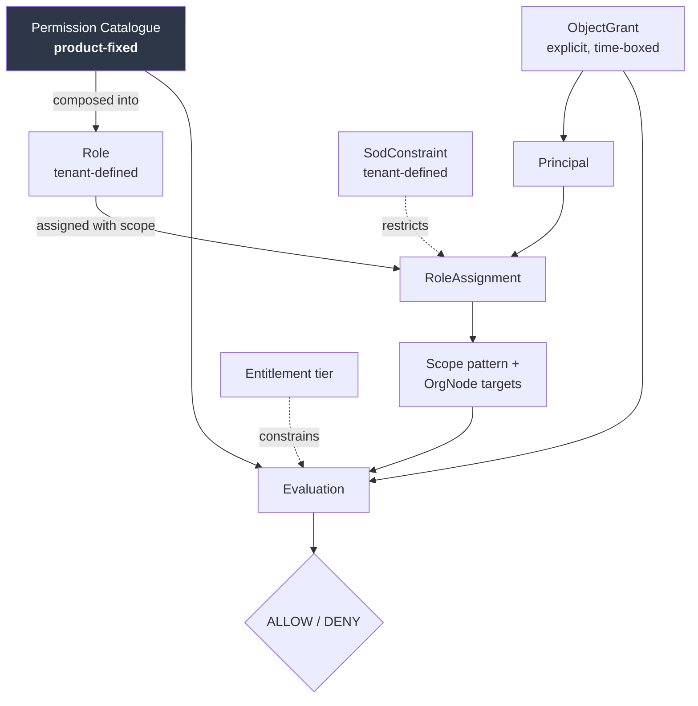

# 07 — RBAC and Permission Model

## Table of Contents

1. [Purpose and Scope](#1-purpose-and-scope)
2. [Prerequisites and Local Conventions](#2-prerequisites-and-local-conventions)
3. [Why This Is the Platform's Highest-Risk Control](#3-why-this-is-the-platforms-highest-risk-control)
4. [Model Overview](#4-model-overview)
5. [The Permission Catalogue](#5-the-permission-catalogue)
6. [Roles](#6-roles)
7. [Scope](#7-scope)
8. [The Evaluation Model](#8-the-evaluation-model)
9. [Object-Level Authorization](#9-object-level-authorization)
10. [Field-Level Authorization](#10-field-level-authorization)
11. [Graph Traversal and Inference](#11-graph-traversal-and-inference)
12. [Historical Authorization](#12-historical-authorization)
13. [Object Grants and Constrained Access](#13-object-grants-and-constrained-access)
14. [Non-Human Principals](#14-non-human-principals)
15. [Separation of Duties and Delegation](#15-separation-of-duties-and-delegation)
16. [Inspection and Access Review](#16-inspection-and-access-review)
17. [Enforcement Point Map](#17-enforcement-point-map)
18. [Prohibited Patterns and Static Enforcement](#18-prohibited-patterns-and-static-enforcement)
19. [Requirements Summary](#19-requirements-summary)
20. [Extensibility, Security, Closing](#20-extensibility-security-closing)

---

## 1. Purpose and Scope

### 1.1 Purpose

This document specifies the authorization model: the permission catalogue, how tenants compose roles from it, how scope is resolved, and how authorization is evaluated and enforced.

### 1.2 In scope

- The permission catalogue — enumerated, product-fixed.
- Role composition and the default role templates shipped as configuration.
- The scope model and its six patterns.
- The evaluation contract, including the two evaluation paths (current and historical).
- Object-level, field-level, and traversal-level enforcement.
- Object grants for constrained external access.
- Non-human principal scope pinning.
- Separation of duties, delegation, inspection.
- The enforcement point map and the static analysis rule that prevents role-name branching.

### 1.3 Out of scope

| Excluded | Owned by |
|---|---|
| Tenant isolation | DOC-24. Authorization operates strictly inside an established tenant context and never establishes one |
| Authentication, credentials, sessions | DOC-06 |
| The organization tree and scope descriptor mechanism | DOC-03 §6.7, §7 |
| Physical policy storage | DOC-04 |
| Threat analysis | DOC-26 |

### 1.4 The relationship to tenancy

Stated once and relied upon throughout: **tenancy is a precondition, not a permission.** Every evaluation in this document assumes an established tenant context (`SEC-TEN-004`) and concerns only what a principal may do *within* it. No permission, role, or grant specified here can cross a tenant boundary, and none is evaluated in a way that could.

---

## 2. Prerequisites and Local Conventions

| Document | Why |
|---|---|
| DOC-01 | `PRD-AUZ-001` – `014`, `CFG-AUZ-001` – `002`, `PRD-CAP-013`, PP-4, PP-7, ADR-027 |
| DOC-03 | `ScopeDescriptor` and `OrgClosure` as published language (§6.7, §7.4); `INV-AUZ-01` – `07`; `INV-AST-17` |
| DOC-24 | The tenant context this model operates inside |

**LC-01.** This document issues `SEC-AUZ-nnn` requirements specifying enforcement. It does not restate the `PRD-AUZ-nnn` requirements from DOC-01 (DOC-00 §6.4).

**LC-02 — Permission notation.** `<domain>.<resource>.<action>`, lowercase, dot-separated: `vul.finding.triage`. The domain segment uses the codes of DOC-00 Appendix A.

**LC-03 — Role names in this document are template names.** Default role templates ship as tenant configuration and every tenant renames, splits, merges, or deletes them. A template name is never a value tested in code (`SEC-AUZ-002`).

---

## 3. Why This Is the Platform's Highest-Risk Control

DOC-03 §5.1 classified this context as *generic in pattern, core in scrutiny*, and recorded the tension. This section discharges it.

**The pattern is unremarkable.** Role-based access with attribute-based scope predicates is textbook, and there is no novelty to invent here.

**The instance is the platform's most likely serious defect,** for four converging reasons.

*The largest user population has the narrowest scope* (PP-7). Thousands of requesters and engineering owners each authorized for a small slice of the tree, against tens of practitioners authorized broadly. Volume of narrow-scope access means volume of scope checks, and the probability of one being wrong scales with the count.

*The scope model is genuinely complex.* Six patterns, subtree inheritance over a tenant-configured hierarchy of unbounded depth, object grants that bypass inheritance, historical evaluation against snapshots, and field-level differentiation within a single object. Complexity is where defects live.

*The consequence is exactly what the product exists to find.* Broken object-level authorization is consistently the highest-impact application vulnerability class, and it is the first thing an evaluating customer's security team will test in a platform that claims to find it. Shipping it here is not merely a defect; it is disqualifying.

*The shortcut is faster, passes review, and is invisible.* `if (role === 'BU_MANAGER')` is quicker to write than resolving a permission, reads naturally to a reviewer focused on the feature, and produces correct behaviour until a customer creates a role structure it does not anticipate. By then the pattern is distributed across the codebase in precisely the places that concern authorization. §18 exists because of this specific failure mode, and it requires static analysis rather than review discipline because review discipline demonstrably does not catch it.

---

## 4. Model Overview

### 4.1 The decision

```
ALLOW  ⟺  principal holds a role granting the permission
          ∧ the object falls within the principal's scope for that permission
          ∧ no separation-of-duties constraint is violated
          ∧ any applicable field-level restriction is satisfied
          ∧ entitlement permits the capability
DENY   otherwise, including on any evaluation error
```

Five conjunctions, and the last two are frequently forgotten. Entitlement (`LIC-PLT-003`) is a capability constraint composed with permission, not an interface concern. Separation of duties is evaluated at the point of action, not only at the point of grant.

### 4.2 Structure



*Figure 4.1 — Authorization structure. The catalogue is product-fixed; everything else is tenant configuration or per-principal grant. Object grants reach the evaluation independently of scope inheritance (§13).*

### 4.3 Why this shape and not the alternatives

| Alternative | Rejected because |
|---|---|
| **Per-object access control lists** | An entry per object per principal is unmanageable at hundreds of thousands of findings. It also makes *"who can see this business unit's findings"* unanswerable without scanning, which defeats access review |
| **Pure attribute-based access control** | Maximally expressive and unauditable. A policy language over arbitrary attributes cannot answer *"what can this person do"* without evaluating every possible request, which makes `PRD-AUZ-012` unachievable |
| **Roles without scope** | Every role becomes tenant-wide. The entire access model here is a permission qualified by a portion of the tree; a role without scope is not a partial answer but a wrong one |
| **Scope without a permission catalogue** | Scope tells you *where*, not *what*. Without permissions, visibility of a business unit implies the ability to approve its exceptions |
| **Tenant-definable permissions** | A permission requires an enforcement point in code. A tenant-defined permission gates nothing, which is worse than its absence because it appears to gate something |

---

## 5. The Permission Catalogue

### 5.1 Principles

**Product-fixed** (`PRD-AUZ-001`, `CFG-PLT-001`). Tenants compose; they do not define.

**Granularity rule.** A permission gates one action on one resource class. Where two actions differ in consequence, they are separate permissions — because a permission gating both means granting it for the lesser grants the greater. The rule is applied by asking: *would any tenant plausibly want to grant one and not the other?* If yes, they are separate.

**Read is split by aggregate sensitivity.** Reading one finding and exporting fifty thousand are different acts with different risk, so `read` and `export` are distinct permissions throughout. The aggregate is more sensitive than the parts.

**Restricted-data access is always a separate permission** and never implied by any other (`PRD-AUZ-004`).

### 5.2 Catalogue

Organization and scope:

| Permission | Gates |
|---|---|
| `org.node.read` | Read organization structure within scope |
| `org.node.create` | Create nodes within scope |
| `org.node.update` | Rename, retag, change attributes |
| `org.node.reorganize` | Move, merge, split — **separate from update because it changes who can see what** |
| `org.node.archive` | Archive a node |
| `org.criticality.assign` | Assign or override criticality — a risk-scoring input |
| `org.owner.assign` | Assign business or technical owners |
| `org.nodetype.manage` | Define node types, labels, parent rules, vocabulary |

Assets:

| Permission | Gates |
|---|---|
| `ast.asset.read` · `ast.asset.export` | Read within scope · bulk extraction |
| `ast.asset.create` · `ast.asset.update` · `ast.asset.retire` | |
| `ast.asset.merge` | Merge — transfers findings and history |
| `ast.ownership.claim` | Claim an unowned asset — **grants visibility of its findings, so it is scope-checked against the proposed node** (`INV-AST-18`) |
| `ast.ownership.reassign` | Transfer ownership between nodes |
| `ast.asset.grant` | Appoint a steward for one asset, and delegate the right to request assessments of it (§13.2). Distinct from `ast.ownership.reassign`, which moves an asset between organization nodes and changes who can SEE it |
| `ast.exposure.declare` | Declare exposure — a risk-scoring input |
| `ast.assettype.manage` | Manage the asset type registry |
| `ast.customfield.manage` | Define custom attributes |

Assessments and engagements:

| Permission | Gates |
|---|---|
| `asm.request.create` | Submit a request — **the permission held by the largest population** |
| `asm.request.read.own` · `asm.request.read.scope` | Own requests · all in scope |
| `asm.request.triage` | Accept, reject, defer, return for information |
| `asm.request.priority.override` | Override computed priority — separate because it is the field most likely to be abused |
| `asm.request.golive_blocking.set` | Mark go-live blocking — escalation lever, separately gated |
| `asm.assessment.conduct` | Perform an assessment, record results |
| `asm.assessment.read` · `asm.assessment.export` | |
| `asm.checklist.manage` | Author checklist definitions |
| `asm.evidence.upload` | Upload evidence |
| `asm.evidence.read` | **Retrieve evidence content — `RESTRICTED`. Never implied by assessment read** |
| `asm.credential.reveal` | **Reveal test credentials — `RESTRICTED`, audited per reveal** |
| `asm.externalgrant.issue` · `asm.externalgrant.revoke` | Issue and revoke external assessor grants |
| `asm.gate.configure` | Configure assessment gates |

Findings and exceptions:

| Permission | Gates |
|---|---|
| `vul.finding.read` · `vul.finding.export` | |
| `vul.finding.triage` | Change state, set closure reason |
| `vul.finding.assign` | Assign to an individual |
| `vul.finding.severity.adjust` | Adjust effective severity — **separate; it changes risk and is an anti-gaming control point** |
| `vul.finding.dispute` | Raise a dispute |
| `vul.finding.dispute.adjudicate` | Resolve a dispute — separate from raising it |
| `vul.finding.bulk` | Bulk operations — **separate from triage; per-item permission still applies** (`INV-WRK-12`) |
| `vul.suppression.create` · `vul.suppression.revoke` | |
| `vul.secret.reveal` | **Reveal a secret value — `RESTRICTED`, audited per reveal** |
| `exc.exception.request` | Request an exception |
| `exc.exception.approve` | Approve — **subject to separation of duties (§15)** |
| `exc.exception.approve.elevated` | Approve broader-scope or higher-risk exceptions |
| `exc.exception.revoke` | |

Composition analysis:

| Permission | Gates |
|---|---|
| `sbm.sbom.submit` | Submit an SBOM — typically a service principal |
| `sbm.sbom.read` · `sbm.snapshot.read` | |
| `sbm.matchrun.trigger` | Trigger interactive re-matching |
| `sbm.matchrun.trigger.batch` | Trigger a portfolio sweep — **separate; it is resource-expensive** |
| `sbm.coverage.read` | Read coverage and freshness state |

Risk and service levels:

| Permission | Gates |
|---|---|
| `rsk.score.read` · `rsk.score.explain` | Read a score · read its factor breakdown |
| `rsk.model.configure` | Configure factor weights — **enterprise-wide prioritization impact; elevated** |
| `rsk.sla.configure` | Configure service level policies and calendars |
| `rsk.sla.extend` | Approve a deadline extension |

Work management:

| Permission | Gates |
|---|---|
| `wrk.item.read` · `wrk.item.create` · `wrk.item.update` | |
| `wrk.item.transition` | Effect a state transition — **additionally gated per transition by the workflow** |
| `wrk.item.assign` · `wrk.item.bulk` | |
| `wrk.comment.post` · `wrk.comment.redact` | Post · redact with a visible record |
| `wrk.workflow.manage` | **Define workflows — can remove an approval gate. Elevated, distinct from item management** |
| `wrk.customfield.manage` · `wrk.itemtype.manage` | |
| `wrk.automation.manage` | **Author automation rules — code executing with the owner's authority (`INV-WRK-13`)** |
| `wrk.savedview.share` | Share a saved query |

Capacity — every permission here is `RESTRICTED`-adjacent:

| Permission | Gates |
|---|---|
| `cap.team.read` | Team-level aggregate measures |
| `cap.member.read.own` | Own workload |
| `cap.member.read.all` | **Per-person workload for all members — `RESTRICTED`, audited, never implied by seniority (`PRD-CAP-013`)** |
| `cap.member.manage` | Manage capacity ratios, availability, competencies |

Dashboards, reporting, knowledge:

| Permission | Gates |
|---|---|
| `dsh.composition.executive` · `.operational` · `.engineering` · `.workload` | Per-composition access (`PRD-DSH-016`) |
| `dsh.report.schedule` · `dsh.report.template.manage` | |
| `dsh.audit_evidence.generate` | Generate audit evidence exports |
| `kbs.article.read` · `kbs.article.author` | |

Ingestion, integration, AI:

| Permission | Gates |
|---|---|
| `ing.import.execute` · `ing.import.reverse` | Import · reverse an import |
| `ing.quarantine.manage` | |
| `ing.migration.execute` | **Migration import from an incumbent tracker — writes historical authorship; elevated** |
| `con.connector.configure` | **Grants the platform access to another system; elevated** |
| `con.connector.credential.rotate` · `con.connector.health.read` | |
| `aic.suggestion.read` · `aic.suggestion.promote` | Read suggestions · promote into the record — **re-validates authorization for the resulting change** (`INV-AIC-03`) |
| `aic.provider.configure` | **Determines what tenant data may leave the boundary; elevated** |

Platform administration:

| Permission | Gates |
|---|---|
| `auz.role.manage` | **Define roles and permission composition — grants the ability to grant. Elevated, separation-of-duties constrained** |
| `auz.assignment.manage` | Assign roles to principals with scope |
| `auz.effective.inspect` | Inspect effective permissions |
| `auz.sod.manage` | Define separation-of-duties constraints |
| `auz.delegation.create` | Delegate own permissions, bounded |
| `iam.principal.manage` · `iam.serviceprincipal.manage` | |
| `aud.audit.read` | **Read the audit trail — never implied by administrative permission (`PRD-AUD-007`)** |
| `aud.retention.configure` · `aud.legalhold.manage` | |
| `dat.erasure.execute` | **Execute data subject erasure — destructive, dual-controlled (`PRD-AUD-009`)** |
| `ten.configuration.export` · `ten.configuration.import` | Configuration promotion between environments |

### 5.3 Requirements

| ID | Statement | Rationale | Pri | V |
|---|---|---|---|---|
| `SEC-AUZ-001` | The permission catalogue MUST be product-fixed, and every catalogue entry MUST correspond to at least one enforcement point in code. A catalogue entry gating nothing MUST be treated as a defect. | An unenforced permission appears to grant protection and provides none, which is worse than its absence because it is granted deliberately and relied upon. | M | AT, CR |
| `SEC-AUZ-002` | Authorization evaluation MUST NOT branch on role name, role count, role identity, organizational position, or any proxy for seniority. Evaluation MUST resolve a named permission. | ADR-027's operative half. The shortcut is faster, passes review, and stays invisible until a customer's structure breaks it — at which point it is distributed across exactly the code that concerns authorization. | M | AT, CR |
| `SEC-AUZ-003` | Where two actions on a resource differ in consequence such that a tenant might plausibly grant one and not the other, they MUST be separate permissions. | A coarse permission is a latent privilege escalation: granting it for the lesser purpose grants the greater. | M | CR |
| `SEC-AUZ-004` | Bulk and export actions MUST be gated by permissions distinct from single-record read. | The aggregate is materially more sensitive than any element, and bulk extraction is the highest-value insider action available. | M | AT |
| `SEC-AUZ-005` | Access to `RESTRICTED` data MUST require a permission that is never implied by any other permission, role seniority, or administrative capability. | `PRD-AUZ-004`. There is no role the platform can check for, since role names are tenant-defined; the gate must be a permission a tenant grants deliberately. | M | AT |

---

## 6. Roles

### 6.1 Model

```
Role                                            aggregate root
  ├─ id, tenant_id
  ├─ code                                        immutable
  ├─ label                    ⟨LocalizedText⟩    freely editable
  ├─ permissions              PermissionId[]      from the catalogue only
  ├─ default_scope_pattern    ScopePattern?       suggestion at assignment
  ├─ entitlement_tier_minimum EntitlementTier
  ├─ derived_from_template?   TemplateId          provenance only, no live link
  └─ lifecycle_state          ACTIVE | DEPRECATED

RoleAssignment                                  aggregate root
  ├─ id, tenant_id, principal_id, role_id
  ├─ scope                    ⟨ScopeGrant⟩
  ├─ granted_by, granted_at
  ├─ valid_until?                                optional expiry
  └─ state                    ACTIVE | EXPIRED | REVOKED
```

`code` immutable, `label` editable — the same reasoning as `OrgNodeType` (DOC-03 §7.2): the label is what users see and is expected to change; the code is what audit records, configuration exports, and API consumers reference.

### 6.2 Default templates

Shipped as configuration, materialized at provisioning (`SEC-TEN-002`), with no live link afterward. They correspond to the archetypes of DOC-01 §7.2 and exist so that a tenant is usable on day one (`CFG-PLT-008`).

| Template | Typical scope | Notable inclusions | Notable exclusions |
|---|---|---|---|
| Tenant Administrator | `TENANT` | All `*.manage`, `auz.role.manage`, `auz.assignment.manage` | `aud.audit.read`, `asm.credential.reveal`, `vul.secret.reveal`, `cap.member.read.all`, `dat.erasure.execute` |
| Security Program Owner | `TENANT` | Triage, assign, `cap.member.read.all`, `rsk.sla.configure`, all compositions | `auz.role.manage`, `aud.audit.read`, `dat.erasure.execute` |
| Security Practitioner | `TENANT` read, `SUBTREE` write | Conduct, triage, `asm.evidence.read`, `asm.credential.reveal`, `cap.member.read.own` | `cap.member.read.all`, all `*.manage`, `exc.exception.approve` |
| Security Champion | `SUBTREE` | Practitioner set restricted to own subtree | `asm.credential.reveal` outside own subtree |
| Engineering Owner | `SUBTREE` | `vul.finding.read`, `wrk.item.*`, `exc.exception.request`, engineering composition | `asm.evidence.read`, `vul.secret.reveal`, `exc.exception.approve`, `vul.finding.severity.adjust` |
| Requester | `LEAF_SET` + `SELF` | `asm.request.create`, `asm.request.read.own`, `wrk.comment.post` | Everything else, including `asm.request.read.scope` |
| Business Owner | `SUBTREE` | Executive composition, `exc.exception.approve`, `rsk.score.read` | **`cap.member.read.all`, `cap.team.read`** — see below |
| Executive | `TENANT` | Executive composition, `rsk.score.read`, `rsk.score.explain` | Same capacity exclusions; all write |
| Compliance and Audit | `TENANT` read | All read, `aud.audit.read`, `dsh.audit_evidence.generate` | **Every write permission without exception** |
| External Assessor | `OBJECT_SET` | Granted-engagement conduct, `asm.evidence.upload`, `asm.credential.reveal` scoped to the grant | All scope-based read; everything outside the grant |

**On the Business Owner and Executive capacity exclusions.** These templates exclude even `cap.team.read`. This is deliberate and stronger than `PRD-CAP-013` strictly requires. The reasoning: a business owner who can see aggregate security-team capacity will direct requests by observed availability, bypassing the prioritization the platform exists to enforce. What they legitimately need — when work can start — is exposed as `feasible start date` at intake (`PRD-CAP-010`), which is a computed answer rather than a window into the team's workload.

**On the Tenant Administrator exclusions.** A tenant administrator can grant themselves anything through `auz.role.manage`, so excluding restricted-data permissions from the template is not a security control — it is a control against *accident*, and it makes deliberate self-grant a visible, audited act (`SEC-AUZ-021`) rather than an unnoticed default. Excluding `aud.audit.read` is a genuine separation of duties (§15).

### 6.3 Requirements

| ID | Statement | Rationale | Pri | V |
|---|---|---|---|---|
| `SEC-AUZ-006` | Roles MUST be composed only from catalogue permissions, and a role MUST NOT be able to reference a permission that does not exist. | Prevents configuration drift producing roles that appear to grant capabilities the platform does not have. | M | AT |
| `SEC-AUZ-007` | Default role templates MUST be materialized per tenant at provisioning with no live link to the template. | `SEC-TEN-002`. A shared template is a path by which a platform change silently alters an existing tenant's authorization. | M | AT |
| `SEC-AUZ-008` | A new catalogue permission MUST NOT be added to any existing role automatically. | Otherwise a new feature becomes available to everyone the moment it ships, which is the opposite of the correct default. New capability requires deliberate grant. | M | AT |
| `SEC-AUZ-009` | Role and assignment changes MUST be audited with before and after state, and `auz.role.manage` and `auz.assignment.manage` MUST be distinct from every operational permission. | An operational administrator who can also grant permissions can grant themselves anything, which makes every other constraint advisory. | M | AT |

---

## 7. Scope

### 7.1 Patterns

| Pattern | Resolution | Used by |
|---|---|---|
| `GLOBAL` | All tenants. **Exists only for platform operations and never grants business data access** (`SEC-TEN-026`) | Platform operator |
| `TENANT` | Entire tree of the established tenant | Program owner, executive, audit |
| `SUBTREE` | Assigned nodes and all descendants, resolved through `OrgClosure` | Engineering owner, business owner, champion |
| `LEAF_SET` | Exactly the assigned nodes, **no inheritance** | Requester |
| `OBJECT_SET` | Explicitly granted objects, independent of the tree | External assessor |
| `SELF` | Objects the principal created or is assigned | Requester, all principals for own data |

```
⟨ScopeGrant⟩
  ├─ pattern                  ScopePattern
  ├─ node_ids                 OrgNodeId[]        for SUBTREE and LEAF_SET
  └─ include_archived         bool               default false
```

**Why `LEAF_SET` exists alongside `SUBTREE`.** A requester assigned to a project must not automatically gain the sibling projects beneath a shared parent. Without a non-inheriting pattern, the only way to scope a requester narrowly is to assign them to a leaf — which fails the moment the tree gains a level beneath it, silently widening their access. `LEAF_SET` makes narrowness explicit and stable under structural change.

**Why `include_archived` defaults false.** Archived nodes remain resolvable for historical scope (`INV-ORG-11`). Including them by default would mean an assignment silently covers the history of a merged-away business unit.

### 7.2 Resolution and multiple assignments

A principal may hold several assignments. Resolution is the **union of permission-scope pairs**, never the union of permissions crossed with the union of scopes.

This distinction is the most consequential subtlety in the model. Consider a principal who is an Engineering Owner over subtree X and a Requester over leaf Y:

- **Correct:** they hold engineering permissions over X and requester permissions over Y.
- **Wrong:** they hold engineering *and* requester permissions over X *and* Y.

The wrong reading grants engineering permissions over Y, which they were never assigned. It arises naturally from an implementation that resolves permissions and scope separately and then intersects — which is the simpler code path.

| ID | Statement | Rationale | Pri | V |
|---|---|---|---|---|
| `SEC-AUZ-010` | Scope MUST be resolved per permission. Where a principal holds multiple assignments, the result is the union of permission-scope pairs, never the cross product of permissions and scopes. | The cross product silently grants permissions outside the scope they were assigned with. It is the natural outcome of resolving the two dimensions independently. | M | AT, PT |
| `SEC-AUZ-011` | Scope resolution MUST occur server-side from the authenticated principal and MUST NOT accept any client-supplied scope, node list, or filter as authoritative. | A client-supplied scope is an access primitive requiring only that the client widen one value. Client filters are presentation, never authorization. | M | AT, PT |
| `SEC-AUZ-012` | Scope resolution results MAY be cached, and the cache MUST be invalidated explicitly on hierarchy change, assignment change, role change, and node archival, taking effect within the bound of `NFR-SEC-002`. | A stale scope cache is a live authorization bypass, and it is the most likely mechanism by which correct logic produces incorrect outcomes. Hierarchy change is the invalidation trigger most likely to be missed, because it originates in a different context. | M | AT |

---

## 8. The Evaluation Model

### 8.1 Single enforcement point

| ID | Statement | Rationale | Pri | V |
|---|---|---|---|---|
| `SEC-AUZ-013` | Authorization MUST be evaluated through a single contract, and application code MUST NOT implement its own check. Data access MUST be unable to proceed without an evaluation result. | Distributed checks can be omitted, and an omission is a silent full-visibility read. Structural enforcement makes omission impossible rather than unlikely — which is the only approach that survives a growing codebase and rotating engineers. | M | AT, CR, AR |
| `SEC-AUZ-014` | Evaluation MUST deny by default: on no matching grant, on evaluation error, on unavailable scope resolution, and on any unhandled condition. | An enforcement point permitting when no rule matches fails open, and failing open here discloses vulnerability data. Denial converts a missing rule into a visible malfunction. | M | AT, CR |
| `SEC-AUZ-015` | Every denial MUST emit an audit event with the principal, permission, object reference, and reason. | Denials are the primary signal of probing and of misconfiguration. Their absence from the audit trail means neither is detectable. | M | AT |

### 8.2 Decision inputs

```
⟨AuthorizationRequest⟩
  ├─ tenant_context           ⟨TenantContext⟩    established, never from the request
  ├─ principal_id
  ├─ permission               PermissionId
  ├─ object_ref               ⟨ObjectReference⟩? absent for collection operations
  ├─ evaluation_time          CURRENT | HISTORICAL(at)
  └─ field_set                FieldId[]?         for field-level evaluation

⟨AuthorizationDecision⟩
  ├─ outcome                  ALLOW | DENY
  ├─ reason                   enumerated; never disclosed verbatim to the client
  ├─ permitted_fields         FieldId[]?
  └─ applied_scope            ⟨ScopeGrant⟩       for audit and inspection
```

**On `reason`.** Recorded in audit at full fidelity and never returned to the client, because a differentiated denial reason discloses whether an object exists (`SEC-AUZ-020`).

### 8.3 Collection operations

Collection reads have no single object, and the naive implementation — retrieve then filter — is a defect in three ways: it discloses total counts, it makes pagination incorrect (a page of fifty becomes twelve after filtering), and it processes data the principal may not see.

| ID | Statement | Rationale | Pri | V |
|---|---|---|---|---|
| `SEC-AUZ-016` | Collection operations MUST apply the scope predicate **as part of retrieval**, not as a filter after it. Counts, aggregates, pagination, and relevance MUST be computed post-predicate. | Retrieve-then-filter discloses foreign volume through counts, breaks pagination, and moves unauthorized data into application memory where it reaches logs and error reports. | M | AT, PT |

---

## 9. Object-Level Authorization

### 9.1 The contract

This section is the platform's single highest-risk enforcement point (§3).

| ID | Statement | Rationale | Pri | V |
|---|---|---|---|---|
| `SEC-AUZ-017` | Every operation accepting an object identifier MUST re-validate that object against the principal's resolved scope, **independently of how the identifier was obtained**, including identifiers returned by a prior response in the same session. | An identifier surfaced by an earlier response does not authorize a later operation: scope may have changed, and the identifier may have been altered. This is the defect class the product exists to detect in customers' software (PP-4). | M | AT, PT |
| `SEC-AUZ-018` | A server-side-filtered selection interface MUST NOT be treated as an authorization control. Every write accepting a selected identifier MUST re-validate it. | A filtered picker is a usability feature. Treating it as a control permits a request against another business unit's project by altering one value — and receiving that project's context in the response (`PRD-PTR-002`). | M | AT, PT |
| `SEC-AUZ-019` | Object identifiers MUST NOT be sequential or otherwise predictable, **and unpredictability MUST NOT be relied upon as the control**. | Unpredictability raises the cost of enumeration and is not a control: identifiers appear in exports, notifications, links, and logs. It is defence in depth behind `SEC-AUZ-017`. | M | AT |
| `SEC-AUZ-020` | Responses MUST NOT differentiate non-existence from non-authorization, in status code, error code, message, or timing. | Differentiated responses permit enumeration of another business unit's findings, assets, and users using only responses the platform considers denials. Timing is included because a lookup-then-deny differs measurably from an immediate deny. | M | AT, PT |

**On `SEC-AUZ-020` and timing.** The timing clause is easy to dismiss and is genuinely exploitable: if a denial for a non-existent object returns in two milliseconds and a denial for an existing out-of-scope object takes twenty because it performed a lookup first, the difference is a reliable existence oracle. The mitigation is to evaluate scope before retrieval where possible, and otherwise to normalize the response path.

### 9.2 Scope derivation for objects

An object's scope derives from the object, never from its creator (DOC-03 §6.6).

| Object | Scope derivation |
|---|---|
| Asset | Owning `OrgNode`; `UNCLAIMED` assets are visible only with `ast.ownership.claim` in the candidate scope |
| Finding | Union of affected assets' owners; each impact carries its own descriptor |
| Assessment | Scoped assets' owners — **not the assessor's scope** (`INV-ASM-10`) |
| Assessment request | Resolved at submission, immutable thereafter (`INV-ASM-07`) |
| Work item | The subject object's scope (`INV-WRK-06`) |
| SBOM snapshot | The described artifact's owner |
| Comment | The parent work item's scope |
| Evidence | The parent assessment's scope, plus `asm.evidence.read` |

**The recurring implementation error** is deriving scope from the creating principal, because it is the simpler code path and produces plausible behaviour in testing. Its consequence is that a central security team's findings are scoped to the security team, and the accountable business unit — the only party who can fix them — cannot see them.

---

## 10. Field-Level Authorization

A single object legitimately contains content for different audiences. An engineering owner should see a remediation obligation without the exploit evidence; a requester should see their own request without the credential reference they submitted.

| Object | Field | Additional requirement |
|---|---|---|
| Assessment request | `role_accounts[].credential_ref` | `asm.credential.reveal`; **the submitting requester cannot read it back** |
| Assessment request | `derived.priority_score` | Read with request; override needs `asm.request.priority.override` |
| Finding | `evidence_refs` content | `asm.evidence.read` |
| Finding (`SECRET` class) | secret value | `vul.secret.reveal` |
| Finding | `effective_severity` | Read with finding; adjust needs `vul.finding.severity.adjust` |
| Risk score | `factor_contributions` | `rsk.score.explain` — **the breakdown can disclose out-of-scope inputs** |
| Capacity measure | per-member values | `cap.member.read.all` |
| Work item | custom fields | Per-field configuration (`PRD-WRK-024`) |
| Connector | credential | Never readable after entry, at any permission level (`INV-CON-01`) |

| ID | Statement | Rationale | Pri | V |
|---|---|---|---|---|
| `SEC-AUZ-021` | Field-level restrictions MUST be enforced on every representation of the object: single read, collection, search result, export, notification content, API response, and AI context. | A field correctly withheld in the detail view and included in the export is disclosed. Export and notification are the two most commonly missed representations. | M | AT, PT |
| `SEC-AUZ-022` | A restricted field MUST be **absent** from the representation, not present with a masked value, where absence is achievable. | A masked placeholder confirms the field has a value, which for a secret finding confirms a credential exists at that location. Absence discloses nothing. | M | AT |
| `SEC-AUZ-023` | Each reveal of a `RESTRICTED` field MUST emit an audit event naming the specific object and field. | For restricted data the read is the sensitive event, and object granularity is what makes an investigation possible (`PRD-AUD-003`). | M | AT |

**On the requester's inability to read back a submitted credential (§10, row 1).** This appears unhelpful and prevents the platform becoming a credential store. A requester who can retrieve credentials they submitted months earlier has a password manager with no rotation policy, and the credentials in it are for systems connected to real data.

---

## 11. Graph Traversal and Inference

### 11.1 Traversal

DOC-03 `INV-AST-17`. A principal authorized for service S follows `S → exposes → API → published_on → Domain` and reaches a domain owned by another business unit. The query began legitimately, so query-level filtering does not help.

| ID | Statement | Rationale | Pri | V |
|---|---|---|---|---|
| `SEC-AUZ-024` | Graph traversal MUST evaluate scope **per node reached**, and an out-of-scope node MUST terminate that branch. Traversal MUST NOT fail the whole operation, and MUST NOT indicate that a branch was terminated. | Per-query filtering is insufficient because the query is authorized. Failing the operation, or reporting truncation, discloses that something exists out of scope. | M | AT, PT |
| `SEC-AUZ-025` | Traversal depth and breadth MUST be bounded, and the bound MUST NOT vary with the principal's scope. | An unbounded traversal is a denial-of-service vector. A bound varying with scope discloses scope breadth through response characteristics. | M | AT |

### 11.2 Inference through aggregates

Aggregates disclose through arithmetic what per-record checks correctly withhold.

| Vector | Control |
|---|---|
| Peer comparison in a small comparison set | Minimum group size, or suppress (`PRD-DSH-001`) |
| Rank or percentile position | Discloses the existence and relative posture of peers; same control |
| Tenant-wide total shown alongside an in-scope subtotal | Prohibited: the difference is the out-of-scope volume |
| Team capacity aggregate in a small team | Minimum group size (`INV-CAP-04`) |
| Score factor breakdown spanning out-of-scope assets | Breakdown restricted to in-scope contributions (`SEC-AUZ-026`) |
| Search total-hit count computed pre-filter | Post-filter counts (`SEC-TEN-011`) |

| ID | Statement | Rationale | Pri | V |
|---|---|---|---|---|
| `SEC-AUZ-026` | Aggregate and comparative presentations MUST enforce a minimum contributing-population size or suppress, and MUST NOT permit derivation of an out-of-scope value by subtraction from a broader total. | Aggregation is a disclosure mechanism that per-record checks pass cleanly. A team of three where two members are visible discloses the third. | M | AT, PT |
| `SEC-AUZ-027` | A score factor breakdown MUST include only contributions from objects within the requesting principal's scope. | An aggregate score is a permitted disclosure; its breakdown can reveal the existence and severity of out-of-scope findings. | M | AT |

---

## 12. Historical Authorization

DOC-03 §6.7 established the scope descriptor. This section specifies the second evaluation path.

**The question.** *Was this principal authorized for this object at that time?* It cannot be answered from the current tree, because the tree has changed; and it cannot be answered from current assignments, because those have changed too.

| ID | Statement | Rationale | Pri | V |
|---|---|---|---|---|
| `SEC-AUZ-028` | Historical evaluation MUST resolve scope from the object's recorded `ScopeDescriptor` and the principal's assignments in effect at the evaluation time, never from the current hierarchy or current assignments. | Otherwise reorganization retroactively grants or revokes access to history, and past reports become irreproducible (`PRD-ORG-011`). | M | AT |
| `SEC-AUZ-029` | Historical authorization MUST grant read only. It MUST NOT permit any write, and MUST NOT extend to objects created after the evaluation time. | Historical access exists for audit and continuity. A write path through it would allow altering the record of a period the principal no longer has responsibility for. | M | AT, PT |
| `SEC-AUZ-030` | Every report and export MUST state whether it aggregates *as-was* (by descriptor) or *as-is* (by current tree). | Both are legitimate and they give different answers. An unlabelled report is uninterpretable and will be compared against another unlabelled report using the other basis (DOC-03 §7.5). | M | AT, DI |

**A consequence.** Two evaluation paths mean two things to test and two places for a defect. It is accepted because the alternative — one path against the current tree — makes historical reporting irreproducible, which disqualifies the executive reporting and audit use cases that justify the product.

---

## 13. Object Grants and Constrained Access

For principals who must reach specific objects without any position in the tree — external assessors above all (DOC-03 §9.6).

| ID | Statement | Rationale | Pri | V |
|---|---|---|---|---|
| `SEC-AUZ-031` | Object grants MUST be evaluated independently of scope inheritance and MUST NOT be widened by any change to the hierarchy, role definitions, or node assignments. | Scope inheritance is designed to broaden with organizational position. For an untrusted external party, any mechanism that can widen implicitly is unacceptable. | M | AT, PT |
| `SEC-AUZ-032` | Every object grant MUST have a mandatory expiry bounded by a configured maximum, with automatic revocation. | Manual revocation reliably does not happen. Access reviews find dormant external accounts routinely, and each is a standing compromise of all the customer's posture data. | M | AT |
| `SEC-AUZ-033` | A principal holding only object grants MUST NOT be able to enumerate organization nodes, assets, findings, users, or any object outside the grant — through search, traversal, aggregate, notification content, export, or error differentiation. | The grant defines the entire visible universe. Every enumeration surface must be closed, not only the obvious read path. | M | AT, PT |
| `SEC-AUZ-034` | Object grants MUST require acceptance of configured agreements before first access, and access before acceptance MUST be impossible rather than merely discouraged. | An acceptance gate that can be bypassed is a record-keeping exercise. | M | AT |

### 13.2 Stewardship grants — a capability over one asset, held by an insider

**This is a different mechanism from §13.1 and the shared word "grant" is a hazard.** §13.1 grants an
outsider *visibility* of an object they otherwise could not see; a stewardship grant gives somebody
who can *already* see an asset a *capability* over it. The two differ in every property that matters:
one widens what is visible and one does not, one is held by a principal with no position in the tree
and one by a principal who has one, and — see `SEC-AUZ-052` — only one of them can safely expire.

The need is structural. Scope is a subtree of the organization tree, which is the right shape for
"the payments security lead reads every finding under payments" and the wrong shape for "Lan is
accountable for the refunds project". A project is an asset, not an organization node; granting Lan a
role over the team that happens to deliver it would give her the same authority over everything else
that team runs today and everything it acquires next year. ADR-001 keeps the two structures separate
precisely so that accountability for a *thing* is not expressed as authority over a *part of the
organization*.

| ID | Statement | Rationale | Pri | V |
|---|---|---|---|---|
| `SEC-AUZ-052` | A stewardship grant MUST NOT widen what its holder can see, and MUST NOT be required to expire. | It confers no visibility, so a dormant one discloses nothing — the exposure `SEC-AUZ-032` mandates expiry against does not arise. Mandatory expiry would instead lapse the primary accountability record for an asset on a timer, and an asset whose steward has silently expired is one nobody is answerable for. Delegations made *by* a steward are the case where expiry is worth having, and that is a configuration question rather than a property of the mechanism. | M | AT |
| `SEC-AUZ-053` | Requesting an assessment of an asset MUST require a stewardship grant over it or an assessment-execution permission, and MUST NOT be satisfied by organization scope alone. | Scope answers "may this person see this project". Requesting work against it is a different question with a different answer: it commits somebody else's effort and exposes the asset to testing. Before this requirement, anybody who could see a project could ask for work against it, which is authority nobody granted. | M | AT, PT |
| `SEC-AUZ-054` | A steward MUST be able to delegate the request capability over their own asset without holding the platform-wide grant permission, and MUST NOT be able to delegate any capability they do not hold. | A steward who cannot delegate is a steward in name only, and routing every delegation through a central administrator reinstates the bottleneck the level exists to remove. The ceiling is the same one `PRD-AUZ-010` places on delegation generally. | M | AT |
| `SEC-AUZ-055` | Composite authority — where an operation is permitted by a platform permission **or** by a relationship to the specific object — MUST be evaluated in a single named component, and MUST NOT be re-implemented at each call site. | ADR-036 gives an operation one declared permission, which cannot express "or whoever owns this one". The declared permission therefore becomes a floor and the real decision moves into the handler; without one component owning it, that decision is duplicated at every surface and the copies diverge. §4's rule — contexts do not implement their own checks — applies with more force here, not less. | M | AT, CR |

**Where this bites, and it already has.** The first implementation computed the caller's requestable
set to filter the picker and never consulted it on the write, so a principal with no grant could post
an asset identifier and raise a request against it regardless. That is `SEC-AUZ-018` — a filtered
selection interface is not a control — reappearing in a new place within days of being written down,
which is the argument for `SEC-AUZ-055`.

---

## 14. Non-Human Principals

| ID | Statement | Rationale | Pri | V |
|---|---|---|---|---|
| `SEC-AUZ-035` | Service principal scope MUST be pinned to the credential and MUST NOT be derived from a human principal, inherited from an organization node, or asserted in a request payload. | A service credential accepting a payload-asserted scope permits cross-scope data injection and existence disclosure. It is a common design because it appears to make integration flexible (`PRD-AUZ-011`). | M | AT, PT |
| `SEC-AUZ-036` | Service principals MUST hold the minimum permission set for their function, and the platform MUST document the minimum set per integration pattern. | Non-human credentials are the most likely to be over-scoped and the least likely to be reviewed. Documenting the minimum removes the incentive to grant broadly for convenience. | M | DI |
| `SEC-AUZ-037` | Automation rules MUST execute with the authority of their owning principal and MUST NOT effect any change that principal could not perform directly. | An automation rule is code executing with authority, authored through configuration by someone not considering authorization. Without a ceiling it is a privilege escalation no access review would detect (`INV-WRK-13`). | M | AT, PT |
| `SEC-AUZ-038` | Where an automation rule's owning principal loses a permission or has their assignment revoked, rules depending on it MUST be suspended and the owner notified — not silently continued. | A rule outliving its author's authority is a persistent grant surviving offboarding. | M | AT |

**On `SEC-AUZ-038`.** This is the least obvious requirement in the section and closes a real gap: an engineer authors an automation rule, leaves the company, their assignments are revoked, and the rule keeps transitioning work items with their former authority. Suspension on authority loss is the only mechanism that ties rule capability to a live grant.

---

## 15. Separation of Duties and Delegation

### 15.1 Constraints

| Conflict | Why |
|---|---|
| `exc.exception.request` + `exc.exception.approve` | Self-approval makes the exception process a formality and is the first control an auditor tests |
| Any write permission + `aud.audit.read` | A principal who can both act and read the record of action can verify their action was recorded — and a principal who can also configure audit is a full separation failure |
| `auz.role.manage` + operational write permissions | Can grant themselves anything, making every other constraint advisory |
| `asm.assessment.conduct` + `vul.finding.dispute.adjudicate` on the same object | Adjudicating a dispute about one's own finding |
| `dat.erasure.execute` + any single-person authority | Erasure is irreversible and is the mechanism an insider would use to destroy evidence |
| `wrk.workflow.manage` + `wrk.item.transition` | Can remove the approval gate and then transition through it |

| ID | Statement | Rationale | Pri | V |
|---|---|---|---|---|
| `SEC-AUZ-039` | Separation-of-duties constraints MUST be enforced both at grant time and at action time. | Grant-time enforcement alone is defeated by two roles that are individually compliant and jointly conflicting. Action-time enforcement alone permits a conflicting grant to exist and be discovered by audit rather than prevented. | M | AT |
| `SEC-AUZ-040` | The platform MUST ship the constraints of §15.1 as default configuration, and relaxing one MUST require elevated permission and be audited. | Defaults determine outcomes. A tenant that must construct these from scratch will not, and the absence is invisible until an audit. | M | AT |
| `SEC-AUZ-041` | Exception approval MUST enforce that the approver differs from the requester, as an invariant rather than an advisory check. | `INV-VUL-26`. An advisory constraint is satisfied by the grant that violates it. | M | AT |
| `SEC-AUZ-042` | `dat.erasure.execute` MUST require dual control. | Irreversible destruction, and the plausible mechanism for an insider covering activity. | M | AT |

### 15.2 Delegation

| ID | Statement | Rationale | Pri | V |
|---|---|---|---|---|
| `SEC-AUZ-043` | Delegation MUST NOT grant a permission or scope the delegator does not hold, MUST be time-bounded, MUST be individually audited, and MUST NOT be re-delegable. | Absence and coverage require delegation; without it, credential sharing occurs, which is worse in every respect. The authority ceiling prevents escalation; non-re-delegation prevents an unbounded chain nobody can reconstruct. | M | AT |
| `SEC-AUZ-044` | Actions under delegation MUST record both the acting principal and the delegating principal. | Attribution to the delegate alone loses who authorized the capability; to the delegator alone loses who acted. | M | AT |

---

## 16. Inspection and Access Review

| ID | Statement | Rationale | Pri | V |
|---|---|---|---|---|
| `SEC-AUZ-045` | The platform MUST answer, for any principal, the complete resolved permission set with scope and the grants producing each — including role assignments, object grants, and delegations. | *"Why can this person see this?"* must be answerable. A model whose effective state cannot be inspected cannot be access-reviewed, debugged, or evidenced to an auditor. | M | AT |
| `SEC-AUZ-046` | The platform MUST answer the inverse: for any object or scope, which principals can perform a given permission on it. | Access review runs in this direction. *"Who can approve exceptions for this business unit?"* is the question a reviewer asks, and it is unanswerable from per-principal inspection alone at any realistic principal count. | M | AT |
| `SEC-AUZ-047` | Inspection MUST reflect the live evaluation path, computed by the same code, not a parallel reporting implementation. | A separate implementation diverges, and the divergence means inspection reports permissions the system does not enforce — or worse, fails to report ones it does. | M | AT, AR |
| `SEC-AUZ-048` | Inspection output MUST be exportable for periodic access review, and the export MUST be permission-gated and audited. | The output is a complete map of who can reach what, which is itself sensitive. | M | AT |

---

## 17. Enforcement Point Map

Every path by which data leaves the platform. **A path absent from this map is a path with no enforcement.**

| # | Path | Enforcement | Highest risk |
|---|---|---|---|
| 1 | API single-object read | Object-level re-validation (`SEC-AUZ-017`), field-level (`SEC-AUZ-021`) | Identifier substitution |
| 2 | API collection read | Predicate in retrieval (`SEC-AUZ-016`) | Retrieve-then-filter disclosing counts |
| 3 | API write | Re-validation independent of the selection interface (`SEC-AUZ-018`) | Filtered-picker-as-control |
| 4 | Bulk operation | Per-item evaluation (`INV-WRK-12`), distinct permission (`SEC-AUZ-004`) | Bulk as a bypass for per-item denial |
| 5 | Search | Predicate before scoring; post-filter counts (`SEC-TEN-011`) | Count and relevance leakage |
| 6 | Aggregate and dashboard | Minimum population, no subtraction (`SEC-AUZ-026`) | Inference by arithmetic |
| 7 | Drill-through from a chart | Full object-level evaluation, not inherited from the chart | Chart permission mistaken for record permission |
| 8 | Export | Scope at generation, field-level, credential exclusion (`PRD-ING-014`, `PRD-ING-015`) | Uncontrolled artifact leaving the platform |
| 9 | Report generation and delivery | Per-recipient evaluation at generation (`PRD-DSH-011`) | One artifact to recipients with differing authorization |
| 10 | Notification | Per-recipient evaluation at delivery (`PRD-NTF-007`) | Delivery to an address after access loss |
| 11 | Graph traversal | Per-node evaluation (`SEC-AUZ-024`) | Reaching out-of-scope nodes through valid edges |
| 12 | AI grounding retrieval | Requesting principal's scope (`INV-AIC-05`) | Broad retrieval, narrow presentation — paraphrased disclosure |
| 13 | AI suggestion promotion | Re-validation for the resulting change (`INV-AIC-03`) | Promotion accomplishing what the principal could not do directly |
| 14 | Webhook payload | Subscription-scoped, field-restricted | Payload exceeding the subscriber's scope |
| 15 | Outbound propagation to an external tracker | Content restricted to the target's authorized set | Finding detail leaving with a work item reference |
| 16 | Saved query shared with another principal | Evaluated as the viewer (`INV-WRK-11`) | Author's scope travelling with the link |
| 17 | Error and validation responses | No existence differentiation (`SEC-AUZ-020`) | Enumeration through denial differences |
| 18 | Audit trail read | Distinct permission; scope-filtered | Audit query as an unrestricted read path |
| 19 | Effective-permission inspection | Permission-gated and audited (`SEC-AUZ-048`) | Complete access map disclosure |
| 20 | Configuration export | Permission-gated; contains role and assignment structure | Access model disclosure |

| ID | Statement | Rationale | Pri | V |
|---|---|---|---|---|
| `SEC-AUZ-049` | Every enforcement point in §17 MUST have a test asserting denial for an out-of-scope principal, and a new data egress path MUST NOT be introduced without adding both a map entry and the test. | The map is complete at authoring and will decay as the platform grows. This requirement is the mechanism against decay. | M | AT |

---

## 18. Prohibited Patterns and Static Enforcement

### 18.1 Prohibited

| Pattern | Why | Detection |
|---|---|---|
| Branching on role name, code, or count | ADR-027. Breaks for any tenant whose role structure differs | Static analysis (§18.2) |
| Branching on organizational depth or position as a seniority proxy | Same, and encodes a hierarchy shape the tenant may not have | Static analysis |
| Trusting a client-supplied scope, node list, or tenant identifier | Access primitive requiring one value change | Static analysis, review |
| Filtering after retrieval | Discloses counts, breaks pagination, moves unauthorized data into memory | Review, load-test assertion |
| Treating a filtered picker as a control | The canonical broken-object-level-authorization defect | Review, penetration test |
| Direct data access bypassing the evaluation contract | Unenforced path | Static analysis |
| Permitting on evaluation error | Fails open | Static analysis, fault-injection test |
| Differentiated denial responses | Existence oracle | Automated test |
| Masked placeholder where absence is achievable | Confirms a value exists | Review |
| A permission gating multiple unrelated actions | Latent escalation | Catalogue review |
| Automation exceeding its owner's authority | Undetectable escalation | Automated test |
| Re-delegation | Unreconstructable chain | Automated test |

### 18.2 Static enforcement

| ID | Statement | Rationale | Pri | V |
|---|---|---|---|---|
| `SEC-AUZ-050` | Continuous integration MUST enforce a static analysis rule rejecting comparison of any role identifier — name, code, or identity — against a literal in application code, and rejecting data access that does not pass through the evaluation contract. | This is the operative half of ADR-027 and the reason it is a build gate rather than a review item: the shortcut is faster, reads naturally, and is invisible until a customer's structure breaks it. Review demonstrably does not catch it, because the reviewer is reading the feature. | M | AT |
| `SEC-AUZ-051` | Any exemption from `SEC-AUZ-050` MUST be individually annotated with a justification, individually reviewed, and reported so that the exemption count is visible and its growth trackable. | Unexplained suppressions accumulate silently. A visible, growing count is a review signal; an invisible one is a slow failure. | M | CR |

---

## 19. Requirements Summary

Fifty-five requirements, all `SEC-AUZ`, all `MUST_HAVE`. As in DOC-24, the absence of `SHOULD_HAVE` is deliberate: a partially enforced authorization model is not a model.

| Group | IDs | Count |
|---|---|---|
| Permission catalogue | `SEC-AUZ-001` – `005` | 5 |
| Roles | `SEC-AUZ-006` – `009` | 4 |
| Scope | `SEC-AUZ-010` – `012` | 3 |
| Evaluation | `SEC-AUZ-013` – `016` | 4 |
| Object-level | `SEC-AUZ-017` – `020` | 4 |
| Field-level | `SEC-AUZ-021` – `023` | 3 |
| Traversal and inference | `SEC-AUZ-024` – `027` | 4 |
| Historical | `SEC-AUZ-028` – `030` | 3 |
| Object grants (external visibility) | `SEC-AUZ-031` – `034` | 4 |
| Non-human principals | `SEC-AUZ-035` – `038` | 4 |
| Separation of duties, delegation | `SEC-AUZ-039` – `044` | 6 |
| Inspection | `SEC-AUZ-045` – `048` | 4 |
| Enforcement map | `SEC-AUZ-049` | 1 |
| Static enforcement | `SEC-AUZ-050` – `051` | 2 |
| Stewardship grants (internal capability) | `SEC-AUZ-052` – `055` | 4 |

Satisfies `PRD-AUZ-001` through `PRD-AUZ-014`, `CFG-AUZ-001` – `002`, `PRD-CAP-013` (permission gate), `PRD-DSH-016`, `PRD-WRK-024`, and model invariants `INV-AUZ-01` – `07`, `INV-AST-17`, `INV-AST-18`, `INV-WRK-11`, `INV-WRK-13`, `INV-AIC-03`, `INV-AIC-05`, `INV-VUL-26`.

---

## 20. Extensibility, Security, Closing

### 20.1 Extensibility

**Adding capability.** A new feature adds catalogue permissions and enforcement points. Existing roles do not acquire them (`SEC-AUZ-008`), so the feature is unavailable until deliberately granted — the correct default, stated because the convenient default is the opposite.

**Orthogonal scope dimensions.** DOC-03 §10.1.3 reserves scope dimensions beyond the tree — geography, legal entity, regulatory regime. These extend `⟨ScopeGrant⟩` with additional predicates composed conjunctively with the node predicate. Because resolution is already predicate-based, this is additive.

**Deliberate rigidity.** The catalogue is product-fixed (`SEC-AUZ-001`); no role-name branching (`SEC-AUZ-002`, `SEC-AUZ-050`); deny by default (`SEC-AUZ-014`); single enforcement contract (`SEC-AUZ-013`); no re-delegation (`SEC-AUZ-043`); separation of duties enforced not advised (`SEC-AUZ-039`).

**Known extension costs.** Two evaluation paths (§12) mean every future permission is testable in two modes. The enforcement point map (§17) must be extended for every new egress path, and the map is the mechanism preventing an unenforced path — so the friction is deliberate. Inference controls (§11.2) must be reassessed whenever a new aggregate presentation is added, and this is the analysis most likely to be skipped because the presentation looks harmless.

### 20.2 Security considerations

This is a security document; what follows is what it does not cover and what remains at risk.

| Not covered | Where |
|---|---|
| Tenant isolation | DOC-24 |
| Authentication, MFA, session, step-up | DOC-06 |
| Audit integrity | DOC-14 |
| Threat model | DOC-26 |

**Residual risks.**

*Enforcement point coverage.* The model is sound only where enforced, and §17 is complete at authoring. `SEC-AUZ-049` is a process control against decay and is therefore the weakest link — a new egress path added without a map entry is unenforced and no test detects its absence, because the test that would detect it is the one not written.

*Inference.* §11.2 addresses the vectors identified. Aggregation is an open-ended disclosure channel and new presentations create new channels. Every dashboard and report addition requires the analysis, and the analysis is most likely skipped precisely when the presentation appears innocuous.

*Configuration as an attack surface.* Workflow definitions, automation rules, and role composition can alter authorization outcomes without appearing in a permission review. `wrk.workflow.manage`, `wrk.automation.manage`, and `auz.role.manage` are the three most consequential permissions in the catalogue, and DOC-26 must treat them as such.

*Historical evaluation.* Two paths mean a defect can exist in one and not the other, and the historical path is exercised far less often — which makes it the more likely place for an undetected defect.

### 20.3 Notes for downstream documents

| Document | Note |
|---|---|
| DOC-04 | Owes policy storage, an index supporting bidirectional inspection (`SEC-AUZ-045`, `-046`), and scope cache invalidation keys |
| DOC-05 | Every operation carries the annotations of DOC-00 §15.1 including scope re-validation. Collection endpoints apply predicates in retrieval (`SEC-AUZ-016`) |
| DOC-06 | Owes authentication, step-up for `RESTRICTED` reveal and elevated approval, and the OQ-026 vault decision |
| DOC-08 | Field-level restrictions mean absence, not masking (`SEC-AUZ-022`) — the interface must render absence gracefully |
| DOC-09 | Workflow transitions are permission-gated and cannot exceed the actor's authority (`SEC-AUZ-037`) |
| DOC-12 | Owes minimum-population enforcement per aggregate and the as-was / as-is label on every report (`SEC-AUZ-030`) |
| DOC-16 | Owes a test per enforcement point (`SEC-AUZ-049`), the static analysis rule (`SEC-AUZ-050`), fault injection asserting deny-on-error, and timing-uniformity assertions for `SEC-AUZ-020` |
| DOC-26 | Owes threat analysis of configuration surfaces as escalation paths, and of inference through aggregates |

### 20.4 Change History

| Version | Date | Author | Change | Reviewer |
|---|---|---|---|---|
| 1.1.0 | 2026-08-07 | Principal Security Architect | Adds §13.2, stewardship grants: a capability held by an insider over one asset, as distinct from §13.1's visibility grant to an outsider. Four requirements (`SEC-AUZ-052` – `055`) and one catalogue entry (`ast.asset.grant`). **`SEC-AUZ-052` states an exception to `SEC-AUZ-032`'s mandatory expiry and gives the reason** — a grant conferring no visibility does not create the exposure expiry exists to bound, and expiring the accountability record for an asset produces an asset nobody is answerable for. `SEC-AUZ-055` records a deviation from ADR-036: a composite authority cannot be expressed as one permission per operation, so the declared permission becomes a floor and the decision moves into a single named component. Written after the implementation rather than before it, and §13.2 says where the first implementation was wrong. | Pending |
| 1.0.0 | 2026-08-04 | Principal Security Architect; Chief Software Architect | Initial content-complete version. Discharges the DOC-03 §5.1 classification tension by stating why this is the platform's highest-risk control despite an unremarkable pattern. Enumerates the product-fixed permission catalogue across fourteen domains with the granularity rule and the separation of read from export throughout. Specifies ten default role templates as configuration, with the Business Owner and Executive capacity exclusions justified beyond what DOC-01 strictly requires. Specifies six scope patterns and the union-of-pairs resolution rule that prevents the cross-product defect. Specifies deny-by-default single-point evaluation, object-level re-validation independent of identifier provenance, field-level absence rather than masking, per-node traversal filtering, inference controls, the second historical evaluation path, object grants for constrained external access, service principal pinning, automation authority ceilings including suspension on authority loss, separation-of-duties constraints enforced at grant and action time, bidirectional inspection, a twenty-entry enforcement point map, and the static analysis rule that makes ADR-027 operative as a build gate rather than a review item. Fifty-one requirements, all MUST_HAVE. | Pending |
