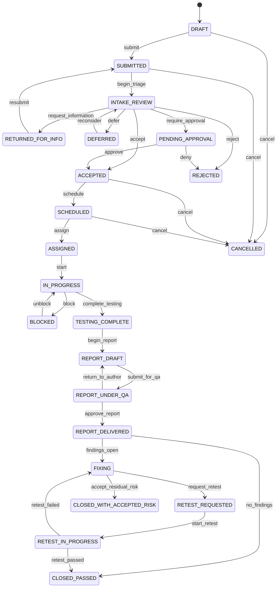
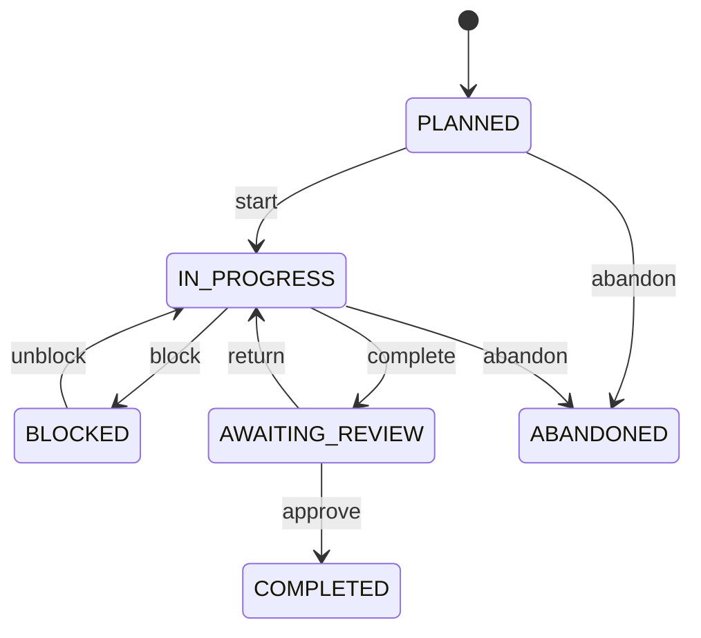
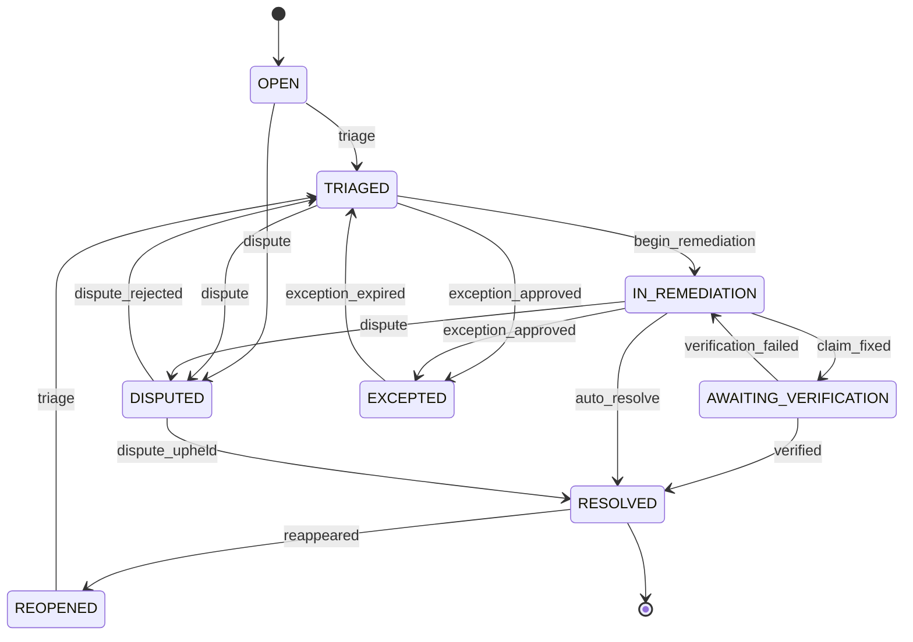
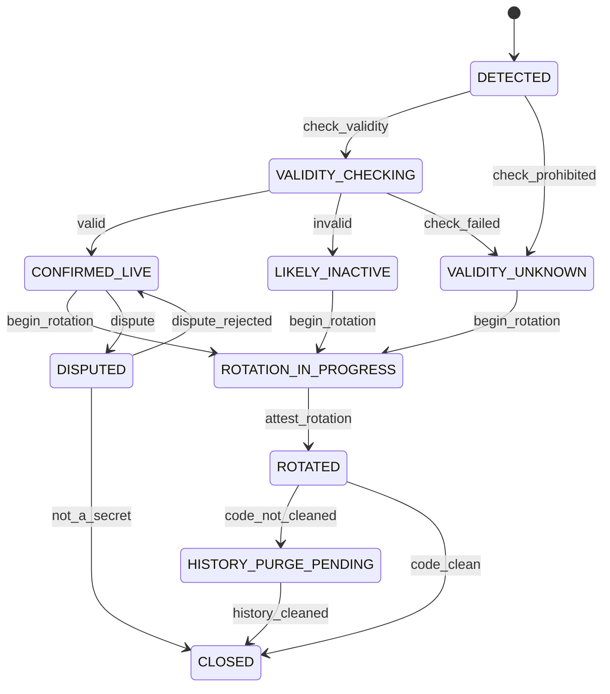
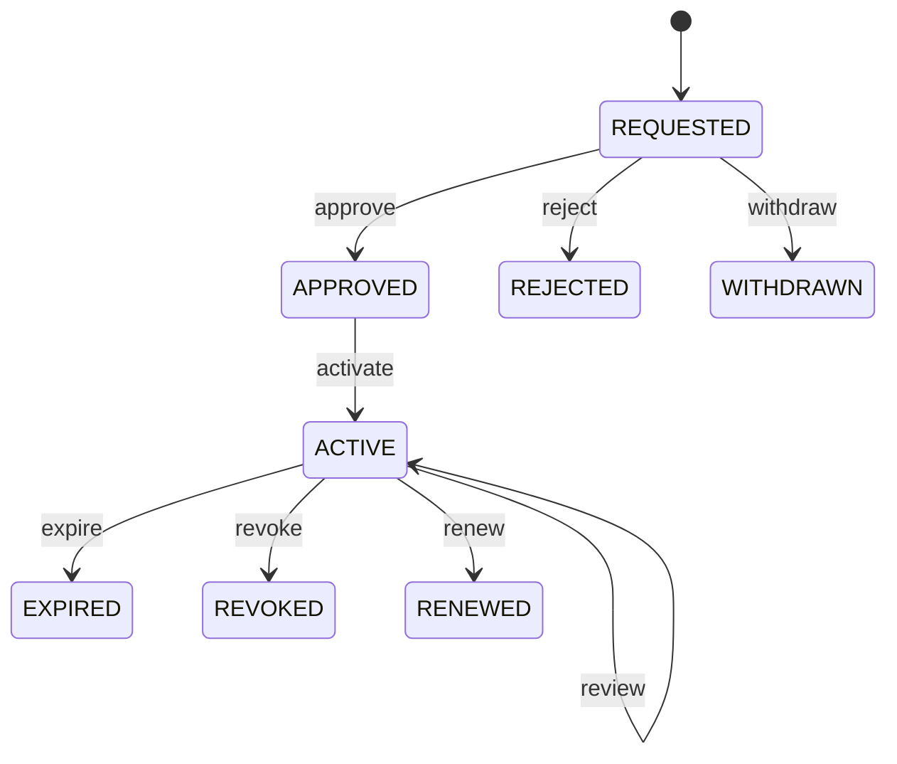
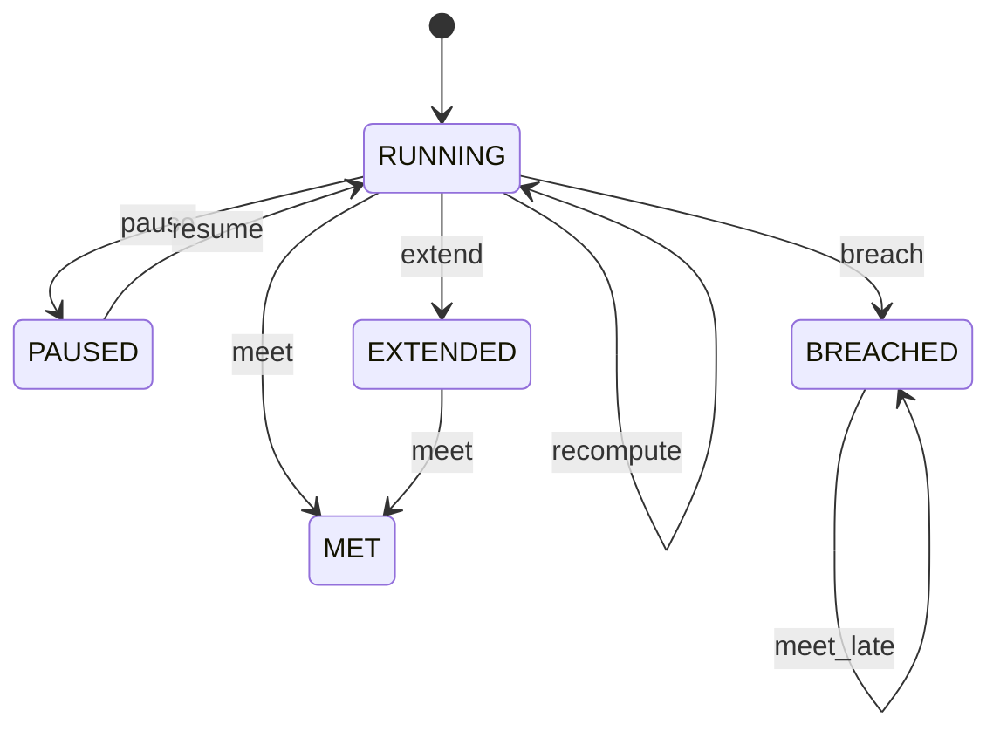
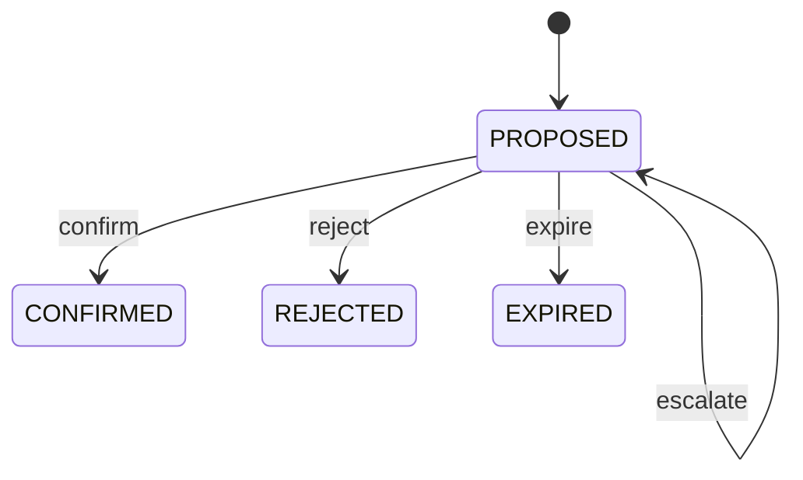
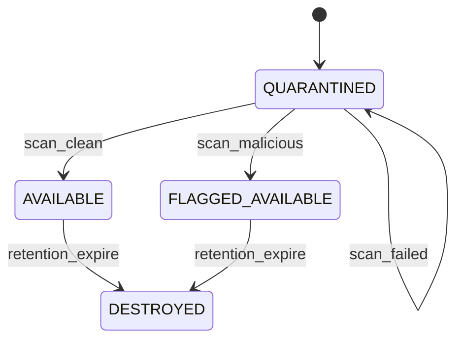
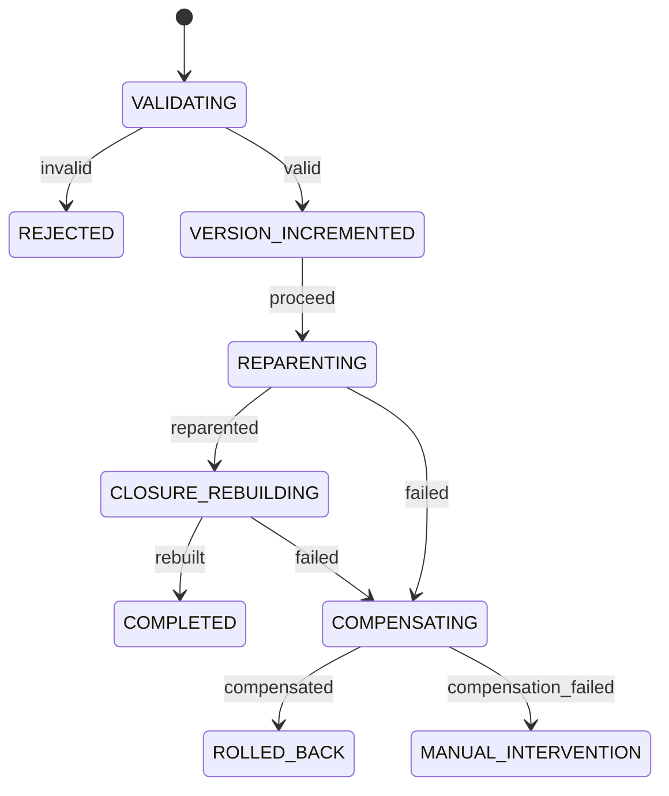

# 09 — Workflow Specification

## Table of Contents

1. [Purpose and Scope](#1-purpose-and-scope) · 2. [Workflow as Data](#2-workflow-as-data) · 3. [Universal Transition Rules](#3-universal-transition-rules) · 4. [Assessment Request](#4-assessment-request) · 5. [Assessment](#5-assessment) · 6. [Finding](#6-finding) · 7. [Secret Finding](#7-secret-finding) · 8. [Risk Exception](#8-risk-exception) · 9. [Service Level Clock](#9-service-level-clock) · 10. [Ownership Claim](#10-ownership-claim) · 11. [Match Run and Batch](#11-match-run-and-batch) · 12. [Evidence Availability](#12-evidence-availability) · 13. [Work Item Default Workflows](#13-work-item-default-workflows) · 14. [Grants](#14-grants) · 15. [Import Session](#15-import-session) · 16. [AI Suggestion](#16-ai-suggestion) · 17. [Reorganization Saga](#17-reorganization-saga) · 18. [Concurrency](#18-concurrency) · 19. [Requirements](#19-requirements) · 20. [Closing](#20-closing)

---

## 1. Purpose and Scope

Specifies every state machine in the platform: states, transitions, guards, actors, side effects, and edge cases.

**In scope.** Workflow-as-data interpretation semantics; universal transition rules; sixteen state machines with full transition tables; concurrency and conflict resolution.

**Out of scope.** Aggregate structure (DOC-03); persistence (DOC-04); API surface (DOC-05); authorization semantics (DOC-07); tenant lifecycle (DOC-24 §12).

**LC-01.** Requirements are `PRD-WRK-031` onward, continuing DOC-01's sequence. Workflow governs several aggregates but is the `WRK` domain's concern, so the sequence is unified rather than split across domains.

**LC-02 — Notation.** Transition tables use: **From** · **Event** · **To** · **Guard** · **Actor** · **Effects**. Edge cases follow each machine. Terminal states are marked ⊗. Machines below six states are presented as a table with a compact diagram, per DOC-00 §11.3.

**LC-03.** Machines marked **[configurable]** are tenant-modifiable defaults (`PRD-WRK-008`). Machines marked **[fixed]** are product invariants and MUST NOT be tenant-configurable, because their transitions carry invariants from DOC-03.

---

## 2. Workflow as Data

### 2.1 Interpretation

A workflow definition is data interpreted by the shared rules engine (`CON-PLT-012`). Interpretation happens in the domain layer (DOC-02 §8.2), so transition guards enforce domain invariants where they can be bypassed.

**Evaluation order for a transition request.** Each step denies on failure; the order is deliberate so that the cheapest and most disclosure-sensitive checks run first.

1. Tenant context established (`SEC-TEN-005`).
2. Object within the caller's scope — a failure here returns `404`, not `403`.
3. Transition exists from the current state for this event.
4. Caller holds the transition's `required_permission`.
5. Caller's authority is not exceeded — an automation rule cannot exceed its owner (`INV-WRK-13`).
6. Separation-of-duties constraints satisfied at action time (`SEC-AUZ-039`).
7. Required fields present.
8. Guard expression evaluates true.
9. Domain invariants hold.
10. Effects applied, transition recorded, events published, all in one transaction.

| ID | Statement | Rationale | Pri | V |
|---|---|---|---|---|
| `PRD-WRK-031` | Transition evaluation MUST follow the order of §2.1, and a scope failure MUST be indistinguishable from non-existence. | Ordering scope before permission prevents a permission denial confirming that an out-of-scope object exists (`SEC-AUZ-020`). | M | AT, PT |
| `PRD-WRK-032` | A transition MUST be atomic: state change, transition record, side effects, and event publication in one transaction. A partial transition MUST NOT be observable. | A recorded state change without its transition record breaks the append-only history that capacity and flow analysis depend on (`INV-WRK-03`). | M | AT |
| `PRD-WRK-033` | Guard expressions MUST be deterministic, side-effect free, and bounded in evaluation cost. They MUST NOT invoke AI, external services, or unbounded queries. | A guard is evaluated on every transition attempt including denied ones. A non-deterministic guard makes a transition's availability unpredictable; an AI-driven guard would place a model in a decision path (ADR-005). | M | AT, CR |
| `PRD-WRK-034` | A workflow definition MUST be validated before activation for: every state reachable from the initial state, at least one terminal state, every non-terminal state having at least one outbound transition, and no transition referencing a state outside the definition. | A state with no outbound transition is a trap: items enter and cannot leave, and the defect surfaces days later as stalled work with no visible cause (`INV-WRK-02`). | M | AT |
| `PRD-WRK-035` | Fixed machines (§LC-03) MUST NOT be tenant-configurable, and the platform MUST reject an attempt to define a workflow for them. | Their transitions carry DOC-03 invariants — bounded exception expiry, closure verification, coverage-confirmed closure. A tenant-editable version could remove the invariant through configuration. | M | AT |

### 2.2 What tenants may change on configurable machines

Permitted: adding states within an existing category; adding, removing, or renaming transitions between permitted states; changing required fields, permissions, and guards; changing which states pause the service level clock; adding side effects from a fixed catalogue.

Prohibited: removing a terminal state; removing the initial state; changing a state's category in a way that would strand in-flight items; defining a side effect not in the catalogue.

---

## 3. Universal Transition Rules

Applying to every machine, stated once.

| Rule | Detail |
|---|---|
| **Recording** | Every transition writes `work_item_state_transition` or the equivalent, with actor, actor type, timestamp, duration in the prior state, and whether the clock was running |
| **Reason** | Required where the transition's definition says so, and always on any transition to a terminal state that is not a success outcome |
| **Reversal** | No transition is silently reversible. Returning to a prior state is a distinct forward transition with its own record |
| **Idempotency** | Re-requesting a transition already applied returns success without a second record; requesting one not available from the current state returns `409 STATE_TRANSITION_INVALID` |
| **Clock** | Entering a state whose `sla_clock_running` is false pauses the clock and requires a blocking attribution (`PRD-RSK-034`) |
| **Automation** | An automated transition records the rule and its owning principal, and is subject to the owner's authority ceiling |
| **Notification** | Transitions publish domain events; notification is a subscriber and never a transition side effect (DOC-13 §3) |

| ID | Statement | Rationale | Pri | V |
|---|---|---|---|---|
| `PRD-WRK-036` | Returning to a previously occupied state MUST be a distinct forward transition with its own record, never a reversal. | An undo that removes history makes cycle-time and flow analysis wrong, and it conceals rework — which is itself a signal (`INV-VUL-12` recurrence is the same principle). | M | AT |
| `PRD-WRK-037` | Notification MUST NOT be a transition side effect. Transitions publish events; notification subscribes. | A notification failure inside a transition either fails the transition or is swallowed. Neither is acceptable: the first makes a mail outage a work outage, the second loses the notification silently. | M | AT, AR |

---

## 4. Assessment Request **[configurable]**

| From | Event | To | Guard | Actor | Effects |
|---|---|---|---|---|---|
| — | create | `DRAFT` | project in caller scope, re-validated | Requester | Code assigned; scope descriptor resolved and frozen |
| `DRAFT` | submit | `SUBMITTED` | ≥2 accounts per declared role; readiness complete; bypass recorded where a control is present; credentials by reference only | Requester | Priority, effort, feasible start computed; duplicate check; checklists and specialist tracks selected; SLA clock starts |
| `SUBMITTED` | begin_triage | `INTAKE_REVIEW` | — | Practitioner | |
| `INTAKE_REVIEW` | request_information | `RETURNED_FOR_INFO` | missing items named | Practitioner | **Clock pauses**, attribution `REQUESTER_READINESS`; requester notified with items |
| `RETURNED_FOR_INFO` | resubmit | `SUBMITTED` | submit guards re-evaluated | Requester | Clock resumes |
| `INTAKE_REVIEW` | require_approval | `PENDING_APPROVAL` | tenant approval gate enabled | Practitioner | Clock pauses, attribution `THIRD_PARTY`; approver notified |
| `PENDING_APPROVAL` | approve / deny | `ACCEPTED` / `REJECTED` | approver ≠ requester | Business owner | Clock resumes or stops |
| `INTAKE_REVIEW` | accept | `ACCEPTED` | all submit guards still hold; account status not `EXPIRED`/`LOCKED` | Practitioner | |
| `INTAKE_REVIEW` | reject | `REJECTED` ⊗ | reason required | Practitioner | Clock stops |
| `INTAKE_REVIEW` | defer | `DEFERRED` | reason and revisit date required | Practitioner | Clock pauses, attribution `CAPACITY` |
| `ACCEPTED` | schedule | `SCHEDULED` | window within test constraints | Program owner | Capacity allocated |
| `SCHEDULED` | assign | `ASSIGNED` | assignee has competency for declared platform types | Program owner | |
| `ASSIGNED` | start | `IN_PROGRESS` | **account pre-verification passed**; environment reachable | Practitioner | Assessment created |
| `IN_PROGRESS` | block | `BLOCKED` | attribution required | Practitioner | **Clock pauses**; escalation scheduled |
| `BLOCKED` | unblock | `IN_PROGRESS` | blocking condition cleared | Practitioner | Clock resumes |
| `IN_PROGRESS` | complete_testing | `TESTING_COMPLETE` | checklist coverage complete or incompleteness acknowledged | Practitioner | Coverage computed |
| `TESTING_COMPLETE` | begin_report | `REPORT_DRAFT` | — | Practitioner | |
| `REPORT_DRAFT` | submit_for_qa | `REPORT_UNDER_QA` | — | Practitioner | QA reviewer assigned |
| `REPORT_UNDER_QA` | return_to_author | `REPORT_DRAFT` | reason required | Reviewer | |
| `REPORT_UNDER_QA` | approve_report | `REPORT_DELIVERED` | reviewer ≠ author | Reviewer | Report published; requester notified; **testing clock stops** |
| `REPORT_DELIVERED` | findings_open | `FIXING` | ≥1 open finding | System | Remediation work items raised; **remediation clocks start per finding** |
| `REPORT_DELIVERED` | no_findings | `CLOSED_PASSED` ⊗ | no open findings | System | Test accounts flagged for rotation |
| `FIXING` | request_retest | `RETEST_REQUESTED` | ≥1 finding claimed fixed; **new revision reference supplied** | Engineering owner | |
| `RETEST_REQUESTED` | start_retest | `RETEST_IN_PROGRESS` | — | Practitioner | Retest assessment created against the new revision |
| `RETEST_IN_PROGRESS` | retest_failed | `FIXING` | ≥1 finding unfixed | Practitioner | Findings reopened with recurrence incremented |
| `RETEST_IN_PROGRESS` | retest_passed | `CLOSED_PASSED` ⊗ | all in-scope findings verified fixed or excepted | Practitioner | Test accounts flagged for rotation |
| `FIXING` | accept_residual_risk | `CLOSED_WITH_ACCEPTED_RISK` ⊗ | every open finding has an active exception | Program owner | Test accounts flagged for rotation |
| any pre-`IN_PROGRESS` | cancel | `CANCELLED` ⊗ | reason required | Requester or program owner | Clock stops; capacity released |

**Edge cases.**

| Case | Behaviour |
|---|---|
| Requester leaves the organization | Requester role reassigned to the technical contact; if also departed, escalated to the business owner. An orphaned request appears in a dedicated queue |
| Test account expires or locks before start | Pre-verification job detects it 24 h before; request moves to `BLOCKED`, attribution `REQUESTER_READINESS`, clock pauses |
| Environment torn down mid-test | `BLOCKED`, attribution `ENVIRONMENT`. Effort already expended is retained |
| Go-live date brought forward | SLA recomputed from the original start; may become immediately breached, which is correct and prompts escalation (`PRD-RSK-035`) |
| Project moves business unit mid-request | Scope descriptor unchanged (`INV-ASM-07`); new scope applies from the move; `scope_migrated` audit event |
| Retest requested with no new revision | Rejected. Retest against the same revision verifies nothing |
| Cancelled after testing began | Not permitted. After `IN_PROGRESS` the path is `CLOSED_*`, because effort and findings exist and cancellation would discard both |
| Report approver is the author | Rejected at guard. Where the team has one practitioner, the tenant configures QA out of the workflow rather than self-approving |

---

## 5. Assessment **[configurable per type]**

| From | Event | To | Guard | Actor | Effects |
|---|---|---|---|---|---|
| — | create | `PLANNED` | ≥1 asset in scope; scope from asset ownership | Practitioner | Checklists instantiated at pinned versions |
| `PLANNED` | start | `IN_PROGRESS` | — | Practitioner | `started_at` set |
| `IN_PROGRESS` | block | `BLOCKED` | attribution | Practitioner | Clock pauses |
| `BLOCKED` | unblock | `IN_PROGRESS` | — | Practitioner | |
| `IN_PROGRESS` | complete | `AWAITING_REVIEW` | coverage complete **or** incompleteness acknowledged with reason | Practitioner | Coverage computed; findings emitted through Ingestion |
| `AWAITING_REVIEW` | return | `IN_PROGRESS` | reason | Reviewer | |
| `AWAITING_REVIEW` | approve | `COMPLETED` ⊗ | reviewer ≠ lead | Reviewer | Outcome recorded; conditions raised as independent items |
| `PLANNED`/`IN_PROGRESS` | abandon | `ABANDONED` ⊗ | reason | Program owner | Partial coverage retained and reported as partial |

**Per-type variants.** Architecture review adds a `CONDITIONS_OPEN` state between `AWAITING_REVIEW` and `COMPLETED` where conditions gate completion; threat model adds `MITIGATIONS_PROPOSED`; vendor assessment adds `VENDOR_RESPONSE_AWAITED` with the clock paused and attribution `THIRD_PARTY`.

**Edge cases.** Abandoning with partial coverage retains it and reports it as partial rather than discarding — an abandoned assessment that examined 200 of 351 items is more informative than none. An assessment whose scoped asset is retired mid-assessment continues; the finding impacts on that asset are marked `NOT_APPLICABLE` with reason `ASSET_RETIRED`.

---

## 6. Finding **[fixed]**

Fixed because its transitions carry `INV-VUL-10` through `INV-VUL-13` and `INV-VUL-16`.

| From | Event | To | Guard | Actor | Effects |
|---|---|---|---|---|---|
| — | raise | `OPEN` | ≥1 asset impact; fingerprint resolved as new | System (Ingestion) | Score computed; SLA clock started; scope from asset ownership |
| — | re-detect | (unchanged) | fingerprint matches an existing finding | System | `last_detected_at` advanced; impacts merged; **no new record** |
| `OPEN` | triage | `TRIAGED` | — | Practitioner | Severity may be adjusted with reason; assignee set |
| `TRIAGED` | begin_remediation | `IN_REMEDIATION` | assignee set | Engineering owner | Remediation work item linked |
| `IN_REMEDIATION` | claim_fixed | `AWAITING_VERIFICATION` | revision reference supplied | Engineering owner | Verification queued |
| `AWAITING_VERIFICATION` | verified | `RESOLVED` ⊗ | verification method and verifier recorded; verifier ≠ claimant | Practitioner | Closure `FIXED_VERIFIED`; clock stops |

**On `claim_fixed`, and how the delivered system expresses it.** The deployed finding lifecycle is
two states, `OPEN` and `CLOSED`, not the eleven above — the same reduction V027 applied to the
request workflow and for the same reason. `AWAITING_VERIFICATION` is therefore carried as an
attribute of an open finding (`remediation_claimed_at`, `_by`, `_note`; V032) rather than as a state.

What is **not** reduced is the separation. The claim is made by the delivery side and the closure is
not available to them; `verifier ≠ claimant` is enforced in the closure predicate itself, so the
person who said a thing was fixed cannot be the person who records that it was verified. Collapsing
the two would make every coverage figure the platform publishes rest on the word of the party with
the strongest reason to want the finding gone.

That guard was **missing from the first implementation** and is recorded here rather than quietly
added: the claim shipped, the closure did not check it, and an assessor could have done both.
| `AWAITING_VERIFICATION` | verification_failed | `IN_REMEDIATION` | reason | Practitioner | Clock continues from original start |
| `IN_REMEDIATION` | auto_resolve | `RESOLVED` ⊗ | **match run completed with coverage confirmed, non-stale intelligence, snapshot quality above warning, ecosystem coverage includes the component** | System | Closure `FIXED_UNVERIFIED`; resolving snapshot and versions recorded |
| any non-terminal | dispute | `DISPUTED` | reason | Engineering owner | Clock pauses, attribution `THIRD_PARTY` |
| `DISPUTED` | dispute_rejected | `TRIAGED` | adjudicator ≠ disputer | Practitioner | Clock resumes |
| `DISPUTED` | dispute_upheld | `RESOLVED` ⊗ | adjudicator ≠ disputer | Practitioner | Closure `FALSE_POSITIVE` or `NOT_APPLICABLE`; suppression optionally created |
| `TRIAGED`/`IN_REMEDIATION` | exception_approved | `EXCEPTED` | active exception exists; **finding class ≠ `SECRET`** | System | Clock pauses; **remains in aggregate risk** |
| `EXCEPTED` | exception_expired | `TRIAGED` | exception expired or revoked | System | Clock resumes from original start; owner and approver notified |
| `RESOLVED` | reappeared | `REOPENED` | fingerprint re-detected after closure | System | `recurrence_count` incremented; new clock started; original closure retained |
| `REOPENED` | triage | `TRIAGED` | — | Practitioner | |
| any | asset_retired | `RESOLVED` ⊗ | every impacted asset retired | System | Closure `ASSET_RETIRED` |

**Edge cases.**

| Case | Behaviour |
|---|---|
| Impacts in different states | Aggregate state derived from impacts: open while any impact is open (`INV-VUL-09`). A finding with six of eight impacts remediated stays `IN_REMEDIATION` |
| Failed match run | **No transition.** Absence of a component in a failed run is not evidence of remediation (`PRD-SBM-053`) |
| Partial ecosystem submission | No `auto_resolve` for components in ecosystems the snapshot does not cover (`PRD-SBM-055`) |
| Severity increases after exception | Exception remains but is flagged for review; the higher score may bring a shorter policy, and the deadline recomputes from the original start |
| Reappears while excepted | No transition; `last_detected_at` advances. The exception is what suppresses the obligation, not the absence of detection |
| Verifier is the claimant | Rejected. Where the same person must do both, the tenant records `FIXED_UNVERIFIED` rather than falsely claiming verification |
| Suppression created after the finding is open | Finding closes as `FALSE_POSITIVE` with the suppression referenced; future re-detection is suppressed until the suppression expires |
| Reopens after 5 years | Same finding, recurrence incremented. Terminal rows remain in the fingerprint index for exactly this reason |

---

## 7. Secret Finding **[fixed]**

A distinct machine because remediating the *code* does not remediate the *exposure* (`INV-VUL-19`).

| From | Event | To | Guard | Actor | Effects |
|---|---|---|---|---|---|
| — | detect | `DETECTED` | secret digest computed; value encrypted | System | **1-business-day clock if validity checking is enabled**; owner notified immediately |
| `DETECTED` | check_validity | `VALIDITY_CHECKING` | validity checking enabled for this credential type | System | Rate-limited, audited check |
| `VALIDITY_CHECKING` | valid | `CONFIRMED_LIVE` | — | System | **Highest-urgency queue**; escalation immediate |
| `VALIDITY_CHECKING` | invalid | `LIKELY_INACTIVE` | — | System | Standard clock applies |
| `VALIDITY_CHECKING` | check_failed | `VALIDITY_UNKNOWN` | — | System | Treated as potentially live |
| `DETECTED` | check_prohibited | `VALIDITY_UNKNOWN` | tenant prohibits checking this type | System | Treated as potentially live |
| any pre-rotation | begin_rotation | `ROTATION_IN_PROGRESS` | — | Engineering owner | |
| `ROTATION_IN_PROGRESS` | attest_rotation | `ROTATED` | attestation recorded | Engineering owner | **Encrypted value nulled**; digest and mask retained |
| `ROTATED` | code_not_cleaned | `HISTORY_PURGE_PENDING` | secret still present in the repository or its history | System | Separate obligation tracked |
| `ROTATED` | code_clean | `CLOSED` ⊗ | secret absent from current content | System | Clock stops |
| `HISTORY_PURGE_PENDING` | history_cleaned | `CLOSED` ⊗ | attested | Engineering owner | |
| `CONFIRMED_LIVE` | dispute | `DISPUTED` | reason | Engineering owner | Clock **continues** — a disputed live credential is still exposed |
| `DISPUTED` | not_a_secret | `CLOSED` ⊗ | adjudicator ≠ disputer | Practitioner | Closure `FALSE_POSITIVE` |

**No `EXCEPTED` state exists** (`INV-VUL-28`). **The clock does not pause on dispute**, unlike an ordinary finding — the exposure is unaffected by disagreement about whether it matters.

**Edge cases.** `VALIDITY_UNKNOWN` is treated as live for prioritization, because the alternative — treating unknown as inactive — is the assumption that produces incidents. Rotation attested but the secret remains in version control history is a real and common state, hence `HISTORY_PURGE_PENDING`: the credential is safe, the hygiene obligation remains, and conflating them either closes prematurely or holds the finding open after the risk is gone.

---

## 8. Risk Exception **[fixed]**

Fixed because its transitions carry `INV-VUL-23` through `INV-VUL-29`.

| From | Event | To | Guard | Actor | Effects |
|---|---|---|---|---|---|
| — | request | `REQUESTED` | expiry supplied and within the configured maximum; compensating controls **or** an explicit no-controls declaration; subject class ≠ `SECRET` | Engineering owner | Approver notified |
| `REQUESTED` | approve | `APPROVED` | **approver ≠ requester**; authority sufficient for subject breadth; step-up authenticated | Business owner | |
| `REQUESTED` | reject | `REJECTED` ⊗ | reason | Business owner | Requester notified |
| `REQUESTED` | withdraw | `WITHDRAWN` ⊗ | — | Requester | |
| `APPROVED` | activate | `ACTIVE` | — | System | Subject transitions to `EXCEPTED`; review scheduled if a cadence is set |
| `ACTIVE` | review | `ACTIVE` | reviewer authority | Business owner | Review outcome recorded; expiry unchanged |
| `ACTIVE` | expire | `EXPIRED` ⊗ | `expires_at` reached | System | **Subject auto-reopens**; requester and approver notified |
| `ACTIVE` | revoke | `REVOKED` ⊗ | reason | Business owner or program owner | Subject reopens immediately |
| `ACTIVE` | renew | `RENEWED` ⊗ | a new exception is approved | Business owner | New exception references this one; expiry chain visible |

**Edge cases.** Renewal is a *new* exception, not an extension — so the register shows a chain and a repeatedly-renewed exception is visible as such rather than appearing as one long-lived decision. An expiry falling while the subject is already resolved still transitions the exception to `EXPIRED` and records it; the subject does not reopen. An approver who loses authority between approval and activation does not invalidate the approval, because the decision was authorized when made.

---

## 9. Service Level Clock **[fixed]**

| From | Event | To | Guard | Actor | Effects |
|---|---|---|---|---|---|
| — | start | `RUNNING` | policy matched; calendar snapshotted; policy version pinned | System | `due_at` and `original_due_at` computed |
| `RUNNING` | pause | `PAUSED` | **blocking attribution required** | System | Interval closed as running; paused interval opened |
| `PAUSED` | resume | `RUNNING` | — | System | `due_at` shifted by paused duration |
| `RUNNING` | recompute | `RUNNING` | score increased such that a shorter policy applies | System | `due_at` recomputed **from the original start**; may become immediately breached |
| `RUNNING` | breach | `BREACHED` | `due_at` passed | System | Escalation chain fires; breach recorded |
| `RUNNING`/`BREACHED` | extend | `EXTENDED` | approved with reason | Program owner | New `due_at`; `original_due_at` retained; **distinct from met** |
| `RUNNING`/`EXTENDED` | meet | `MET` ⊗ | subject reached a satisfying terminal state before `due_at` | System | |
| `BREACHED` | meet_late | `BREACHED` ⊗ | subject resolved after breach | System | Breach retained with resolution time |
| any | cancel | `CANCELLED` ⊗ | subject cancelled | System | |

**Edge cases.** Escalation does not fire while paused for requester or third-party blocking (`PRD-RSK-037`); a separate chain escalates the *blocking* party. A score decrease never extends a deadline automatically (`PRD-RSK-036`) — otherwise downgrading severity becomes a deadline-extension mechanism. A calendar change after start does not move `due_at`, because the calendar was snapshotted.

---

## 10. Ownership Claim **[configurable]**

| From | Event | To | Guard | Actor | Effects |
|---|---|---|---|---|---|
| — | propose | `PROPOSED` | no open claim for this asset | System or practitioner | Candidate node owner notified |
| `PROPOSED` | confirm | `CONFIRMED` ⊗ | **confirmer authorized for the proposed node** | Node owner | Asset ownership assigned; scope descriptor resolved |
| `PROPOSED` | reject | `REJECTED` ⊗ | reason | Node owner | Asset returns to the unowned queue |
| `PROPOSED` | escalate | `PROPOSED` | threshold elapsed | System | `escalation_level` incremented; nearest ancestor owner notified. **Ownership is not assigned** |
| `PROPOSED` | expire | `EXPIRED` ⊗ | maximum escalation reached | System | Asset flagged for manual assignment |

**Edge case.** Escalation notifies but never assigns (`INV-AST-20`): assigning to an ancestor on timeout would place accountability with someone having no operational relationship to the asset, and findings would route to a divisional manager who cannot act — training that manager to ignore the platform.

---

## 11. Match Run and Batch **[fixed]**

### 11.1 Match run

| From | Event | To | Guard | Actor | Effects |
|---|---|---|---|---|---|
| — | enqueue | `QUEUED` | idempotency key unused | System | Priority assigned from criticality and staleness |
| `QUEUED` | claim | `CLAIMED` | worker capacity; per-tenant concurrency cap | Worker | Lease acquired |
| `CLAIMED` | prepare | `PREPARING` | — | Worker | Snapshot and intelligence loaded |
| `PREPARING` | run | `RUNNING` | intelligence version resolved | Worker | |
| `RUNNING` | complete | `NORMALIZING` | matching finished | Worker | Candidates emitted |
| `NORMALIZING` | finish | `COMPLETED` ⊗ | normalization succeeded | Worker | `coverage_confirmed` set **only if** non-stale intelligence and snapshot quality above warning; delta computed |
| `QUEUED` | skip | `SKIPPED_NO_CHANGE` ⊗ | snapshot hash, intelligence version, matcher version, canonicalization version all unchanged | System | **Recorded as a run** so the coverage timeline has no gap |
| `QUEUED` | skip_quota | `SKIPPED_QUOTA` ⊗ | tenant quota exhausted | System | Surfaced to the tenant |
| `CLAIMED`/`PREPARING`/`RUNNING` | lease_expired | `QUEUED` | lease past expiry | System | Attempt incremented; backoff applied |
| any active | fail | `FAILED` ⊗ | attempts exhausted | Worker | Failure classified; **`coverage_confirmed` remains false** |
| any pre-`RUNNING` | cancel | `CANCELLED` ⊗ | batch cancelled or manual | System | |
| `RUNNING` | cancel | `CANCELLED` ⊗ | graceful stop | System | **Partial results discarded**, never normalized |

**Edge cases.** A worker terminated abruptly leaves the run claimed until the lease expires, then it is reclaimed — heartbeat alone would leave it claimed forever. A cancelled run discards partial results rather than normalizing them, because a partial component list under the closure logic could be read as components having been removed. `SKIPPED_NO_CHANGE` is recorded as a run: without a record, the coverage timeline shows a gap indistinguishable from a failure.

### 11.2 Match batch

| From | Event | To | Guard | Actor | Effects |
|---|---|---|---|---|---|
| — | create | `QUEUED` | selection resolved | Practitioner or system | Runs enqueued in criticality-weighted order |
| `QUEUED` | start | `RUNNING` | — | System | |
| `RUNNING` | pause | `PAUSED` | — | Practitioner | Queued runs held; **running runs complete** |
| `PAUSED` | resume | `RUNNING` | — | Practitioner | Completed work not repeated |
| `RUNNING`/`PAUSED` | cancel | `CANCELLED` ⊗ | — | Practitioner | Queued runs cancelled; running runs stopped gracefully |
| `RUNNING` | complete | `COMPLETED` ⊗ | all runs terminal | System | Progress totals finalized |

**Edge case.** Pause lets running work finish rather than aborting it — aborting would discard completed matching and, worse, produce cancelled runs whose partial results must be discarded.

---

## 12. Evidence Availability **[fixed]**

| From | Event | To | Guard | Actor | Effects |
|---|---|---|---|---|---|
| — | upload | `QUARANTINED` | signature verified against declared type; size within limit | Practitioner | Scan queued; **not retrievable** |
| `QUARANTINED` | scan_clean | `AVAILABLE` | verdict clean | System | Retrievable via signed reference |
| `QUARANTINED` | scan_malicious | `FLAGGED_AVAILABLE` | verdict malicious | System | Retrievable **only after explicit acknowledgement**; warning displayed |
| `QUARANTINED` | scan_failed | `QUARANTINED` | — | System | Retry; alert if unresolved beyond threshold |
| `AVAILABLE`/`FLAGGED_AVAILABLE` | retention_expire | `DESTROYED` ⊗ | `retention_until` passed; no legal hold | System | Object destroyed; row retained with marker |
| any | legal_hold | (unchanged) | hold applied | Compliance | Retention expiry blocked |

**Edge case.** A malicious verdict on evidence flags rather than deletes: the sample *is* the proof the finding rests on, and deleting it makes the finding disputable. For non-evidence uploads a malicious verdict rejects outright.

---

## 13. Work Item Default Workflows **[configurable]**

Shipped as tenant configuration (`SEC-TEN-002`).

**Remediation obligation.** `OPEN → ASSIGNED → IN_PROGRESS → AWAITING_VERIFICATION → DONE ⊗`, with `BLOCKED` reachable from `IN_PROGRESS` and `REJECTED ⊗` from `OPEN` or `ASSIGNED`. Mirrors the finding lifecycle without duplicating it: the work item tracks *intent*, the finding tracks *the world* (DOC-03 §5.4).

**Generic task.** `OPEN → IN_PROGRESS → DONE ⊗`, plus `BLOCKED` and `CANCELLED ⊗`.

**Platform engineering, governance, enablement.** Generic task plus a `REVIEW` state before `DONE`.

**Incident support.** `OPEN → ACTIVE → STANDING_DOWN → DONE ⊗`, no `BLOCKED` — incident work is not blocked, it is reprioritized.

| ID | Statement | Rationale | Pri | V |
|---|---|---|---|---|
| `PRD-WRK-038` | Default workflows MUST include at least one state in each category — open, in progress, waiting external, terminal — so that flow and cycle-time analysis is meaningful without tenant configuration. | Category assignment is what makes cumulative flow comparable across tenants and work types. A default lacking a waiting-external state would make blocking attribution unavailable out of the box. | M | AT |

---

## 14. Grants **[fixed]**

### 14.1 External assessor grant

`REQUESTED → PENDING_AGREEMENT → ACTIVE → EXPIRED ⊗`, with `REVOKED ⊗` reachable from `PENDING_AGREEMENT` and `ACTIVE`.

Guards: issuance requires `asm.externalgrant.issue` and a bounded `valid_until`; `ACTIVE` requires every configured agreement accepted; expiry is automatic and not extendable — an extension is a new grant.

**Edge case.** Engagement closure revokes the grant immediately rather than waiting for expiry, and flags associated test accounts for rotation.

### 14.2 Break-glass grant

`REQUESTED → APPROVED → ACTIVE → EXPIRED ⊗`, with `REVOKED ⊗` from `APPROVED` or `ACTIVE`, and `DENIED ⊗` from `REQUESTED`.

Guards: approver ≠ requester; justification and external reference non-empty; `valid_until` within the configured maximum; `RESTRICTED` data classes reachable only if separately named and approved.

Effects on `ACTIVE`: **tenant notified, non-suppressibly**; elevated-granularity audit begins; every action recorded at object granularity.

**Edge case.** No extension transition exists. Continuing access requires a new grant with a new approval — extendable grants become permanent.

---

## 15. Import Session **[fixed]**

| From | Event | To | Guard | Actor | Effects |
|---|---|---|---|---|---|
| — | initiate | `QUEUED` | idempotency key unused; size within limit | Practitioner or service | |
| `QUEUED` | start | `PARSING` | parser resolved for format and version | Worker | |
| `PARSING` | parsed | `NORMALIZING` | within parser limits | Worker | Records extracted; invalid records quarantined |
| `PARSING` | parse_failed | `FAILED` ⊗ | limit breached or format invalid | Worker | Reason returned; **nothing ingested** |
| `NORMALIZING` | complete | `COMPLETED` ⊗ | — | Worker | Fingerprints computed; findings created, updated, or reopened; provenance recorded |
| `NORMALIZING` | partial | `COMPLETED_WITH_QUARANTINE` ⊗ | ≥1 record quarantined | Worker | Valid records ingested; quarantine queue populated |
| `COMPLETED`/`COMPLETED_WITH_QUARANTINE` | reverse | `REVERSED` ⊗ | within the reversal window; distinct permission | Practitioner | Created findings removed; modified findings restored to prior state |

**Edge cases.** A parse failure ingests nothing — partial parse results are not normalized, because a truncated record set could be read as records having been removed. Reversal restores prior state rather than deleting, so a finding that existed before the import and was modified by it returns to its earlier state rather than disappearing.

---

## 16. AI Suggestion **[fixed]**

`GENERATING → PROPOSED → PROMOTED ⊗ | DISMISSED ⊗ | EXPIRED ⊗`, with `FAILED ⊗` from `GENERATING`.

Guards: `PROMOTED` requires an explicit human action **and** re-validation that the promoting principal is authorized for the resulting change (`INV-AIC-03`). Promotion executes the change through the same operation a human would use (`PRD-API-047`).

Effects on `PROMOTED`: provenance recorded — suggestion, model identity and version, prompt hash, retrieved context, acting principal, resulting change reference.

**Edge case.** A suggestion whose subject changed materially since generation is expired rather than promotable — promoting advice computed against stale state is worse than no advice.

---

## 17. Reorganization Saga

Not a state machine on an aggregate but a process across many (DOC-02 §9.4, DOC-03 §7.5), because a subtree is not one aggregate.

| Step | Action | Compensation on failure |
|---|---|---|
| `VALIDATING` | Target type permitted; no cycle; all assets apportioned for a split | None needed — nothing mutated |
| `VERSION_INCREMENTED` | `hierarchy_version` incremented | Not reversed. A gap in versions is harmless; reuse would make snapshots ambiguous |
| `REPARENTING` | Node's parent changed | Restore prior parent |
| `CLOSURE_REBUILDING` | Affected closure rows rebuilt | Rebuild from `org_node`, which is authoritative |
| `COMPLETED` | `OrgNodeMoved` published | — |

| ID | Statement | Rationale | Pri | V |
|---|---|---|---|---|
| `PRD-WRK-039` | Reorganization MUST validate the complete target structure before any mutation, and a failure after mutation MUST compensate by rebuilding the closure from `org_node`. | Validation first means most failures cost nothing. Closure rebuild works as compensation because `org_node` is authoritative and the closure is derived (`INV-ORG-14`). | M | AT |
| `PRD-WRK-040` | `hierarchy_version` MUST NOT be reused after a failed reorganization. | A reused version makes two different tree shapes share an identifier, which makes historical scope descriptors ambiguous — and they are the mechanism historical authorization depends on. | M | AT |
| `PRD-WRK-041` | Where compensation fails, the saga MUST enter a manual-intervention state that blocks further reorganization for the tenant and alerts. | A tenant with a partially reorganized tree has a corrupted authorization substrate; permitting a second reorganization on top would compound it beyond diagnosis. | M | AT |
| `PRD-WRK-042` | Scope descriptors on existing objects MUST NOT be modified by reorganization. | They record the scope as it was, which is what makes historical reporting reproducible (`INV-ORG-11`). | M | AT |

---

## 18. Concurrency

| Situation | Resolution |
|---|---|
| Two principals request the same transition | First succeeds; second returns success idempotently if the outcome is identical, `409` otherwise |
| Two principals request different transitions from the same state | Optimistic concurrency on `row_version`; the loser receives `412` and must re-read |
| Automation and human transition simultaneously | Human wins; the automation execution records the denial rather than failing silently |
| Field edit concurrent with a transition | Both use `row_version`; one receives `412` |
| Comment concurrent with a transition | Independent aggregates; both succeed |
| Re-detection concurrent with manual triage | Re-detection advances `last_detected_at` only and never changes state, so no conflict |
| Match run completes concurrent with manual resolution | Manual resolution wins; the match delta records that the finding was already resolved |
| Exception expiry concurrent with remediation | Expiry transitions the exception; the finding is resolved, so it does not reopen |
| Two workers claim the same run | Lease acquisition is atomic; the loser takes the next item |
| Reorganization concurrent with a transition | Reorganization takes a tenant-level advisory lock on hierarchy operations; transitions proceed and resolve scope at their own commit |

| ID | Statement | Rationale | Pri | V |
|---|---|---|---|---|
| `PRD-WRK-043` | Concurrent conflicting transitions MUST be resolved by optimistic concurrency with an explicit conflict response. Silent last-write-wins MUST NOT occur. | Silent loss means the person whose transition vanished believes it succeeded (`INV-WRK-17`). | M | AT |
| `PRD-WRK-044` | An automated transition losing to a human transition MUST record the denial rather than retrying or failing silently. | A rule that silently loses is undiagnosable; recorded denials are also the escalation-attempt signal of `SEC-AUZ-037`. | M | AT |
| `PRD-WRK-045` | Hierarchy-mutating operations MUST serialize per tenant. | Two concurrent reorganizations produce a closure that matches neither, and the closure is the authorization substrate. | M | AT |

---

## 19. Requirements

Fifteen requirements, `PRD-WRK-031` – `045`, all `MUST_HAVE`.

| Group | IDs | Count |
|---|---|---|
| Interpretation and validation | `031` – `035` | 5 |
| Universal rules | `036` – `037` | 2 |
| Default workflows | `038` | 1 |
| Reorganization saga | `039` – `042` | 4 |
| Concurrency | `043` – `045` | 3 |

Sixteen state machines specified. Satisfies `PRD-WRK-008` – `010`, `PRD-VUL-010` – `013`, `PRD-EXC-002` – `008`, `PRD-RSK-032` – `037`, `PRD-SBM-044` – `050`, and `INV-WRK-01` – `04`.

---

## 20. Closing

### 20.1 Extensibility

Configurable machines are extended by tenant configuration within the §2.2 bounds, validated before activation. A new work item type ships with a default workflow. A new assessment type is a registry entry with a workflow variant. Side effects are drawn from a fixed catalogue, so a new side effect is a product change — deliberately, because an arbitrary side effect in a tenant-authored workflow would be code execution through configuration.

**Deliberate rigidity.** Nine machines are fixed (§LC-03) because their transitions carry DOC-03 invariants. No transition is silently reversible (`PRD-WRK-036`). Notification is never a side effect (`PRD-WRK-037`). Guards are deterministic and AI-free (`PRD-WRK-033`).

**Known extension costs.** Adding a state to a configurable machine requires deciding its category, its clock behaviour, and its effect on in-flight items — the last is why version pinning exists. Adding a fixed-machine state is a product change requiring an invariant review.

### 20.2 Security considerations

Transitions are the platform's authorization enforcement point for state change. The evaluation order of §2.1 places scope before permission so that a denial does not confirm existence. Transition `required_permission` is tenant configuration that alters authorization outcomes without appearing in a permission review, which is why `wrk.workflow.manage` is among the three most consequential permissions (DOC-07 §20.2, DOC-26 T9).

**Residual risk.** A tenant with permission to edit workflows can remove an approval gate. The controls are elevated permission, before-and-after audit, and the periodic configuration summary (`SEC-PLT-004`) — the last being procedural, which DOC-26 §13.2 identifies as the weaker kind.

### 20.3 Notes for downstream documents

| Document | Note |
|---|---|
| DOC-08 | Available transitions drive the interface; an item view must show only transitions whose guards can be satisfied by the viewer |
| DOC-12 | State categories drive cumulative flow; the four-category minimum of `PRD-WRK-038` is what makes it comparable |
| DOC-13 | Every transition publishes an event; the notifiable subset is DOC-13's concern |
| DOC-16 | Owes: a test per transition asserting each guard; a test asserting no fixed machine is configurable; concurrency tests per §18 row; a saga compensation test including compensation failure |
| DOC-17 | ⚠ OQ-018 unresolved — service level values are provisional, but the clock machine is not affected |

### 20.4 Change History

| Version | Date | Author | Change | Reviewer |
|---|---|---|---|---|
| 1.1.0 | 2026-08-07 | Chief Software Architect | Records how the delivered system expresses `claim_fixed`: as an attribute of an open finding rather than as the `AWAITING_VERIFICATION` state, the deployed lifecycle being two states rather than eleven. The `verifier ≠ claimant` guard is unchanged in intent and is now enforced in the closure predicate. **Correction recorded rather than silently applied:** the guard was absent from the first implementation of the claim, so whoever claimed a fix could also close it as verified. | Pending |
| 1.0.0 | 2026-08-04 | Principal Application Security Engineer; Chief Software Architect | Initial content-complete version. Specifies transition evaluation order placing scope before permission; universal transition rules including no silent reversal and notification never as a side effect; sixteen state machines with full transition tables, guards, actors, effects, and edge cases, nine marked fixed because their transitions carry domain invariants; the secret finding machine with no exception path and a clock that does not pause on dispute; the reorganization saga with compensation by closure rebuild and a manual-intervention terminal state; and a ten-row concurrency resolution table. Fifteen requirements. | Pending |

---

*End of DOC-09.*
