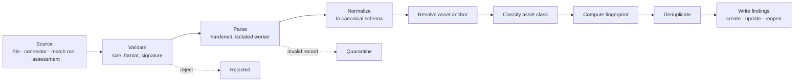

# 11 — Import and Export

## Table of Contents

1. [Purpose and Scope](#1-purpose-and-scope) · 2. [Pipeline](#2-pipeline) · 3. [The Canonical Finding Schema](#3-the-canonical-finding-schema) · 4. [Parser Registry](#4-parser-registry) · 5. [Format Specifications](#5-format-specifications) · 6. [Asset Anchor Resolution](#6-asset-anchor-resolution) · 7. [Asset Class Separation](#7-asset-class-separation) · 8. [Fingerprinting and Deduplication](#8-fingerprinting-and-deduplication) · 9. [Partial Failure and Quarantine](#9-partial-failure-and-quarantine) · 10. [Idempotency and Reversal](#10-idempotency-and-reversal) · 11. [Tabular Import](#11-tabular-import) · 12. [Migration Import](#12-migration-import) · 13. [Export](#13-export) · 14. [Requirements](#14-requirements) · 15. [Closing](#15-closing)

---

## 1. Purpose and Scope

**In scope.** The ingestion pipeline; the canonical finding schema; the parser registry and per-format specifications; asset anchor resolution; asset class separation; the fingerprint and deduplication integration; partial failure and quarantine; idempotency and reversal; tabular import with mapping templates; migration import; export with scope enforcement.

**Out of scope.** Live system integration (DOC-21); SBOM submission and matching (DOC-22); parser hardening controls (DOC-06 §11); finding identity semantics (DOC-03 §10.2); API surface (DOC-05 §23).

**LC-01.** Requirements are `PRD-ING-019` onward, continuing DOC-01's sequence.

---

## 2. Pipeline



**Four sources, one pipeline.** File upload, connector pull, match run output (DOC-22), and manual assessment findings all enter here. ADR-011 requires it: two paths to finding creation means two identity implementations, which diverge undetectably and produce duplicates that cannot be reconciled after the fact.

| ID | Statement | Rationale | Pri | V |
|---|---|---|---|---|
| `PRD-ING-019` | Every finding MUST be created through this pipeline. No component outside Ingestion MUST write a finding fingerprint. | `INV-ING-01`. This is the one unrecoverable invariant of DOC-03 §19 with no database enforcement — it is a code property, held by module boundaries and owed a test asserting no other module writes `fingerprint_digest`. | M | AT, CR |
| `PRD-ING-020` | Pipeline stages MUST be observable per session, with per-stage record counts and durations. | A session that ingested 12,000 of 40,000 records must be diagnosable to a stage. Without per-stage counts the only signal is the total, and the failure could be in any of six places. | M | AT |

---

## 3. The Canonical Finding Schema

Every parser maps to this. A field absent in the source is null, never invented.

| Field | Required | Notes |
|---|---|---|
| `title` | Yes | Truncated to a bounded length with the original retained |
| `description` | No | |
| `finding_class` | Yes | Derived from the parser, not from the source |
| `asset_class` | Yes | §7 |
| `reported_severity` | Yes | Mapped through a per-parser severity map; `UNKNOWN` where the source has none |
| `vulnerability_refs` | No | Identifiers as text; resolved to enrichment when available |
| `weakness_refs` | No | |
| `asset_anchor` | Yes | §6 |
| `location_hint` | No | Human-readable; **never part of identity** |
| `fingerprint_inputs` | Yes | Per finding class (DOC-03 §10.2); retained (`INV-VUL-04`) |
| `evidence_refs` | No | Attachments extracted from the source where present |
| `source_tool`, `source_tool_version`, `source_rule_id` | Yes / No / No | Provenance |
| `detected_at` | Yes | Source timestamp; import time where absent |
| `component_ref`, `detected_version`, `fixed_version` | Conditional | Dependency findings |
| `secret_type`, `secret_digest`, `secret_value` | Conditional | Secret findings; value encrypted immediately (`SEC-SEC-021`) |
| `raw_record` | Yes | The source record, retained for reprocessing |

| ID | Statement | Rationale | Pri | V |
|---|---|---|---|---|
| `PRD-ING-021` | A field absent in the source MUST be null. A parser MUST NOT infer, default, or synthesize a value not present. | An inferred severity or timestamp is indistinguishable from a reported one downstream, and it corrupts both prioritization and trend. `UNKNOWN` severity is honest; a defaulted `MEDIUM` is not. | M | AT, CR |
| `PRD-ING-022` | The source record MUST be retained per finding, and reprocessing under a new parser version MUST be possible from it without re-importing the file. | Parser mappings will be found wrong. Without the raw record the correction requires every tenant to re-import, which does not happen — so the mis-mapping becomes permanent. | M | AT |
| `PRD-ING-023` | `location_hint` MUST NOT participate in fingerprint computation. | A finding whose identity depends on a line number or URL produces a new record on every unrelated change (DOC-03 §10.2). Keeping the hint separate from identity makes it safe to display and useless to identity. | M | AT |

---

## 4. Parser Registry

```
ParserDefinition
  ├─ code, parser_version
  ├─ formats, format_versions
  ├─ finding_class          what class this parser produces
  ├─ severity_map           source value → internal ordinal
  ├─ field_mapping          source path → canonical field
  ├─ fingerprint_inputs     which fields feed identity
  ├─ asset_anchor_strategy  §6
  ├─ asset_class            §7
  ├─ limits                 depth, size, element count, timeout
  ├─ validation_rules       per record
  └─ evidence_extraction    where the format embeds evidence
```

| ID | Statement | Rationale | Pri | V |
|---|---|---|---|---|
| `PRD-ING-024` | Parsers MUST be registered definitions, not code branches in a shared import service. | A shared service with per-format branches means every new format touches code that all formats depend on, and a parser regression silently corrupts ingested data for unrelated sources. | M | AR |
| `PRD-ING-025` | Every parser MUST declare its version, and the version MUST be recorded per finding. | A systematic mapping error introduced by a parser change cannot be scoped without knowing which findings that version produced. | M | AT |
| `PRD-ING-026` | Each parser MUST have a fixture corpus covering: a valid document, an empty document, a malformed document, a document at each declared limit, a document with absent optional fields, and one per known source-tool version. | These are the cases that fail in production and pass a naive suite. The per-version fixture is what detects a source tool changing its output format — the most common cause of silent mis-mapping. | M | AT |
| `PRD-ING-027` | A source format version not in a parser's declared support list MUST be rejected with the supported versions named, not parsed on a best-effort basis. | Best-effort parsing of an unknown version produces partially mapped findings that appear valid. Rejection with a named gap is actionable. | M | AT |

---

## 5. Format Specifications

Per format: the identity inputs and the anchor strategy, which are the two decisions that determine whether ingestion produces stable findings.

### 5.1 Web application proxy output

| | |
|---|---|
| Class | `RUNTIME` · `asset_class` `APPLICATION` |
| Identity | Tenant · rule identity · asset anchor · **normalized request path with parameters collapsed** · parameter name |
| Excluded from identity | Concrete parameter values, session data, timestamps, response bodies |
| Anchor | Host from the request, resolved to a domain asset, then to the API or service exposing it |
| Evidence | Request and response pairs extracted as evidence where present |

**On collapsing path parameters.** A proxy reports one finding per observed URL. Without collapsing, a reflected parameter on `/users/{id}` produces one finding per observed identifier — thousands of findings for one weakness, and an unbounded asset inventory. The collapse is conservative: a segment is a parameter if it matches a numeric, identifier, or high-cardinality pattern, and the rule version is recorded so a change is traceable.

### 5.2 Dynamic scanner output

Same as §5.1, with the anchor resolved from the scan target rather than per-request, and identity keyed on the scanner's own finding identifier where it is stable across scans.

### 5.3 Infrastructure scanner output

| | |
|---|---|
| Class | `INFRASTRUCTURE` · `asset_class` `INFRASTRUCTURE` |
| Identity | Tenant · check identity · asset anchor · port or service identity |
| Excluded | Scan timestamp, scanner version, host uptime |
| Anchor | Network address or hostname resolved to a domain or service asset; **unresolvable anchors create an unclaimed infrastructure asset**, not a discarded finding |
| Note | Excluded from application posture scores (§7) |

### 5.4 Dependency scanner output

| | |
|---|---|
| Class | `DEPENDENCY` · `asset_class` `APPLICATION` |
| Identity | Tenant · vulnerability identity · canonicalized package identifier · affected version range · asset anchor |
| Excluded | **All file location.** A manifest path is not part of a component's identity |
| Anchor | Repository or artifact from the scan context |
| Note | Where the same tool also produces an SBOM, DOC-22 is preferred: a snapshot supports re-matching without resubmission, and a finding list does not |

### 5.5 Container scanner output

Dependency identity plus the image reference. Where the scanner emits both an SBOM and findings, the SBOM path is preferred for the same reason as §5.4.

### 5.6 SBOM documents

CycloneDX and SPDX are handled by DOC-22, not here. Where an SBOM arrives as a file upload it is routed to the submission path rather than parsed as findings, so that snapshot immutability and re-matching apply.

| ID | Statement | Rationale | Pri | V |
|---|---|---|---|---|
| `PRD-ING-028` | An SBOM arriving through file upload MUST be routed to the SBOM submission path, not parsed into findings. | A finding list from an SBOM cannot be re-matched against new intelligence; a snapshot can. Parsing it as findings discards the platform's core disclosure-response mechanism (`PRD-SBM-044`). | M | AT |

### 5.7 Prior vulnerability manager export

| | |
|---|---|
| Class | Derived per record from the source's own classification |
| Identity | Recomputed from the canonical inputs, **not carried from the source** |
| Anchor | Source's product or engagement mapped to an organization node via a mapping template |
| Note | The source's identifiers are retained as external identifiers for traceability |

**On recomputing identity rather than carrying it.** A migrated finding must deduplicate against findings the platform ingests afterwards from the same scanners. Carrying the source's identifier would make every migrated finding a permanent duplicate of its live counterpart.

### 5.8 Secret scanner output

| | |
|---|---|
| Class | `SECRET` · `asset_class` `APPLICATION` |
| Identity | Tenant · asset anchor · secret type · normalized location · **secret digest** |
| Handling | Value encrypted at parse, never written in plaintext; masked form derived; `finding_secret_detail` populated |
| Note | Enters the secret finding lifecycle (DOC-09 §7), which has no exception path |

### 5.9 Manual assessment findings

| | |
|---|---|
| Class | `MANUAL` · `asset_class` from the target asset |
| Identity | Tenant · assessment type · asset anchor · title digest · weakness classification |
| Excluded | Assessor identity, assessment identity |

**On excluding assessment identity.** A retest finds the same weakness through a second assessment. Keying on assessment would make it a new finding and reset its age — concealing that it was never fixed.

---

## 6. Asset Anchor Resolution

Every finding must attach to an asset. The resolution order, each step falling through on failure:

1. Explicit asset identifier in the source.
2. External identifier match (`asset_external_identifier`).
3. Natural key match through the asset type's identity rule, with per-type normalization (DOC-03 §8.5).
4. Alias match (`asset_identity_alias`).
5. **Create the asset unclaimed** and queue it for ownership resolution.

| ID | Statement | Rationale | Pri | V |
|---|---|---|---|---|
| `PRD-ING-029` | A finding whose asset cannot be resolved MUST create an unclaimed asset, and MUST NOT be discarded or rejected. | Discarding is silent data loss at the point of least detectability. Creating an unclaimed asset routes the problem into a visible queue with an escalation path (`PRD-AST-011`). | M | AT |
| `PRD-ING-030` | Anchor resolution MUST record which step resolved it, and resolution by creation MUST be distinguishable from resolution by match. | A session that created 400 assets resolved almost nothing and should be investigated before its findings are trusted. Without the distinction, that session looks identical to one that matched cleanly. | M | AT |
| `PRD-ING-031` | Where a source provides an organization scope, it MUST be re-validated against the importing principal's authorized scope and MUST NOT be trusted from the file. | A file-asserted scope is a cross-scope injection primitive requiring only that the file be edited. | M | AT, PT |

**On `PRD-ING-030`.** Mass asset creation during import is the signal that a mapping is wrong — a template pointing at the wrong column, or a normalization rule that stopped matching. Making it visible per session is what catches it before hundreds of duplicate assets accumulate.

---

## 7. Asset Class Separation

`PRD-ING-004`. Infrastructure findings are ingested for context and **must not contribute to application posture scores**.

| Class | Contributes to | Rationale |
|---|---|---|
| `APPLICATION` | Application posture | The product's subject |
| `INFRASTRUCTURE` | Infrastructure posture, reported separately | Voluminous and legitimate to hold, but an application posture figure dominated by operating system patch findings tells an application team nothing they can act on |
| `CLOUD` | Cloud posture, reported separately | Adjacent domain (NG-02) |
| `CONTAINER` | Application posture where the finding concerns application dependencies; infrastructure otherwise | Container findings span both, and the split is by what the finding is *about* rather than by where it was found |

| ID | Statement | Rationale | Pri | V |
|---|---|---|---|---|
| `PRD-ING-032` | `asset_class` MUST be assigned by the parser and MUST NOT be tenant-configurable per finding. | A tenant reclassifying infrastructure findings as application would inflate or deflate their application posture at will — a gaming path through classification (DOC-28 §13.2). | M | AT |
| `PRD-ING-033` | Container findings MUST be classified by subject: application dependency findings as `APPLICATION`, base image and operating system findings as `INFRASTRUCTURE`. | Classifying by *where the finding was found* puts every container finding in one class, and the two have different owners and different remediation paths. | M | AT |

---

## 8. Fingerprinting and Deduplication

Fingerprint computation happens here, once, identically for every source (`INV-ING-01`).

**Resolution outcomes.**

| Outcome | Condition | Effect |
|---|---|---|
| **New** | No matching fingerprint at the current algorithm version | Finding created; clock started |
| **Re-detected** | Match, finding non-terminal | `last_detected_at` advanced; impacts merged; **no state change** |
| **Reopened** | Match, finding terminal | Reopened; `recurrence_count` incremented; new clock |
| **Suppressed** | Match against an active suppression | Recorded as suppressed; no finding created or reopened |
| **Impact added** | Match, new asset in the same finding | Impact added to the existing finding |

| ID | Statement | Rationale | Pri | V |
|---|---|---|---|---|
| `PRD-ING-034` | Deduplication MUST compare only within the same tenant and the same fingerprint algorithm version. | Cross-tenant comparison is an inference oracle (`INV-VUL-01`). Cross-version comparison is meaningless, because the versions hash different inputs. | M | AT, PT |
| `PRD-ING-035` | Re-detection MUST NOT change finding state. | An open finding re-detected is still open; a finding in remediation re-detected is still in remediation. Advancing state on detection would reset triage on every scan. | M | AT |
| `PRD-ING-036` | Suppression MUST be evaluated before finding creation, and a suppressed candidate MUST be recorded rather than silently dropped. | Silent dropping makes a suppression indistinguishable from a non-match, which removes the ability to review whether the suppression is still valid (`INV-VUL-22`). | M | AT |
| `PRD-ING-037` | Where a fingerprint algorithm version changes, re-fingerprinting MUST be a migration from retained inputs that preserves triage state, assignment, comments, exceptions, and history. | Without a state-preserving migration path, an algorithm improvement discards the platform's entire triage history — which means the improvement is never made, and the first version is permanent (`INV-VUL-05`). | M | AT |

---

## 9. Partial Failure and Quarantine

A single malformed record in a 40,000-record file must not discard the file, and must not be silently skipped either.

| Failure | Handling |
|---|---|
| Document exceeds a limit | Reject the session; nothing ingested; limit named |
| Document unparseable | Reject the session; nothing ingested |
| Format version unsupported | Reject; supported versions named |
| Record fails schema validation | Quarantine with the failing field |
| Record has no resolvable anchor | Ingest; unclaimed asset created (§6) |
| Record has an unmappable severity | Ingest with severity `UNKNOWN`; recorded as a mapping gap |
| Record duplicates another in the same file | Merge within the session; counted once |
| Record's evidence exceeds a limit | Ingest the finding; quarantine the evidence separately |

| ID | Statement | Rationale | Pri | V |
|---|---|---|---|---|
| `PRD-ING-038` | A parse failure MUST ingest nothing. Partial parse results MUST NOT be normalized. | A truncated record set could be read by closure logic as records having been removed (`PRD-SBM-053` is the same failure in the composition domain). | M | AT |
| `PRD-ING-039` | Quarantined records MUST be retrievable with their raw content and failing reason, correctable, and resubmittable without re-importing the source. | Quarantine that cannot be resolved is deletion with extra steps. | M | AT |
| `PRD-ING-040` | An unmappable severity MUST produce `UNKNOWN` and MUST be reported as a mapping gap, not defaulted to a middle value. | A defaulted severity is indistinguishable from a reported one and silently corrupts prioritization for every finding from that source. | M | AT |
| `PRD-ING-041` | Session outcome MUST report per-record counts by disposition — ingested, updated, reopened, suppressed, quarantined, merged — and MUST NOT report only a total. | A total of 39,997 out of 40,000 is not actionable; knowing that three were quarantined for one reason is. | M | AT |

---

## 10. Idempotency and Reversal

**Idempotency** on a key derived from source content and target. A repeat returns the original session rather than ingesting again.

**Reversal** restores prior state rather than deleting:

| Effect of the import | Reversal |
|---|---|
| Finding created | Removed; assets it created remain (they may now carry other findings) |
| Finding re-detected | `last_detected_at` restored to its prior value |
| Finding reopened | Returned to its prior terminal state; `recurrence_count` decremented |
| Impact added | Removed |
| Asset created | Retained. Removing it would orphan anything else that has since attached |

| ID | Statement | Rationale | Pri | V |
|---|---|---|---|---|
| `PRD-ING-042` | Reversal MUST restore prior state, not delete. A finding modified by the import MUST return to its earlier state rather than disappearing. | Deleting on reversal would remove findings that existed before the import and were merely updated by it. | M | AT |
| `PRD-ING-043` | Reversal MUST be bounded to a configurable window and MUST require a permission distinct from import. | Reversal removes findings. Unbounded and equally permissioned, it is a route to deleting inconvenient findings under the appearance of correcting an import. | M | AT |
| `PRD-ING-044` | Reversal MUST be audited, and reversed findings MUST be recorded rather than erased. | Otherwise reversal is the one path by which findings leave the platform without a trace (DOC-26 §8, abuse case). | M | AT |

---

## 11. Tabular Import

Generic tabular and structured import exists because no format list is complete, and the alternative is data staying in a spreadsheet outside the platform.

**Mapping template.** Source column or path → canonical field, with per-column transforms, a severity map, and an anchor strategy. Reusable and versioned.

| ID | Statement | Rationale | Pri | V |
|---|---|---|---|---|
| `PRD-ING-045` | Tabular import MUST support reusable versioned mapping templates. | Without templates a mapping is re-derived per import, which is wasted effort and a source of inconsistent mapping between imports of the same source. | M | AT |
| `PRD-ING-046` | A preview MUST be presented before commitment, showing the mapped result for a sample and the disposition counts the import would produce. | Preview prevents committing a mapping error to thousands of records — where a wrong anchor column would create thousands of unclaimed assets. | M | DM |
| `PRD-ING-047` | A mapping producing an anchor-creation rate above a threshold MUST warn before commitment. | Mass asset creation is the signature of a wrong anchor column, and it is visible in preview before it is visible in the inventory (`PRD-ING-030`). | M | AT |

---

## 12. Migration Import

ADR-028 requires replacing the incumbent tracker. That replacement fails at a predictable point: the team is asked to abandon years of institutional memory, and in practice they keep the old system in read-only mode "temporarily" — which becomes permanent.

⚠ **Working assumption (OQ-025):** the incumbent is unidentified, so the adapter is generic over structured export with fidelity limits documented per source.

| ID | Statement | Rationale | Pri | V |
|---|---|---|---|---|
| `PRD-ING-048` | Migration MUST preserve original authorship and original timestamps on comments and state transitions. | A comment thread where every entry is attributed to "migration" on the migration date is unusable as history — the information that makes it valuable is precisely who said what, when. | M | AT |
| `PRD-ING-049` | Migrated records MUST be flagged as migrated with their original external identifier, and the flag MUST survive into every presentation. | Migration writes historical authorship, which is also the capability to fabricate a record of a decision never made (DOC-26 §8). The flag is the control and it is worthless if a presentation drops it. | M | AT |
| `PRD-ING-050` | Authorship MUST map to platform principals where resolvable and to a clearly marked unresolved placeholder otherwise. It MUST NOT be attributed to an arbitrary existing principal. | Attributing a comment to the wrong person falsifies the record, and the falsification is invisible to a reader. | M | AT |
| `PRD-ING-051` | Migration MUST be executed under an elevated permission distinct from import, MUST require step-up authentication, and MUST NOT bypass scope validation. | It writes on behalf of other people at historical timestamps. That capability warrants the strongest gate available short of dual control. | M | AT |
| `PRD-ING-052` | Migration MUST report per-record fidelity: fields carried, fields dropped, and authorship unresolved. | A migration reporting only success conceals what was lost, and what was lost is discovered months later when someone looks for a decision that is no longer recorded. | M | AT |

---

## 13. Export

| ID | Statement | Rationale | Pri | V |
|---|---|---|---|---|
| `PRD-ING-053` | Scope MUST be applied at generation, not by filtering a broader result set. | Filtering after retrieval means unauthorized data enters application memory, from which it reaches logs and error reports; and it makes the record count wrong. | M | AT, PT |
| `PRD-ING-054` | Credentials, secret values, and evidence content MUST be excluded from every export format, at every permission level, without exception. | An export is an uncontrolled artifact. There is no permission level at which writing live credentials into a spreadsheet that will be emailed is acceptable. | M | AT, CR |
| `PRD-ING-055` | Per-person workload data MUST be excluded unless the requesting principal holds the restricted permission, and its inclusion MUST be separately audited. | Personal data about employment (`PRD-CAP-013`), and an export is the path by which it would leave the platform and circulate. | M | AT |
| `PRD-ING-056` | Every export MUST embed its applied scope, filters, record count, and generation time in the artifact. | An export whose scope is not recorded cannot be relied upon by whoever receives it, and cannot be distinguished from a broader or narrower one later. | M | AT |
| `PRD-ING-057` | Exports above a configured record threshold MUST execute asynchronously with delivery by an authenticated expiring reference bound to the requesting principal's scope at generation. | A permanent link to an export containing the enterprise's findings is a standing exposure, and binding scope at generation prevents an old link surviving an authorization change. | M | AT, PT |
| `PRD-ING-058` | Export MUST support tabular, structured, and document formats, and MUST support exporting a saved query's result set. | Downstream use varies: analysis needs tabular, integration needs structured, distribution needs document. Exporting a saved query is what removes the recurring "can you send me a list of…" request from the security team's workload (PP-8). | M | AT |
| `PRD-ING-059` | Export operations MUST be audited with principal, applied scope, record count, format, and generation time. | Bulk extraction under legitimate permission is the highest-value insider action available and looks identical to routine reporting; only scope and volume in the record distinguish them (DOC-26 T4). | M | AT |

**Tenant data export** (`SEC-TEN-040`) is a distinct operation: complete, documented-format, offboarding-purpose, dual-controlled, and it *does* include everything except secret material — which is destroyed rather than exported, and its destruction recorded.

---

## 14. Requirements

Forty-one requirements, `PRD-ING-019` – `059`, all `MUST_HAVE`.

| Group | IDs | Count |
|---|---|---|
| Pipeline | `019` – `020` | 2 |
| Canonical schema | `021` – `023` | 3 |
| Parser registry | `024` – `027` | 4 |
| Formats | `028` | 1 |
| Anchor resolution | `029` – `031` | 3 |
| Asset class | `032` – `033` | 2 |
| Deduplication | `034` – `037` | 4 |
| Partial failure | `038` – `041` | 4 |
| Idempotency and reversal | `042` – `044` | 3 |
| Tabular import | `045` – `047` | 3 |
| Migration | `048` – `052` | 5 |
| Export | `053` – `059` | 7 |

Satisfies `PRD-ING-001` – `018`, `CAP-5.6`, and `INV-ING-01` – `08`.

---

## 15. Closing

### 15.1 Extensibility

A new format is a parser definition with a severity map, field mapping, fingerprint inputs, anchor strategy, limits, and a fixture corpus — six artifacts, because a parser missing any of them cannot be validated, cannot produce stable identity, or cannot be maintained against source changes. Export formats are serializers over a common scope-enforced record stream, so scope enforcement cannot be bypassed by adding a format.

**Deliberate rigidity.** One fingerprint computation site (`PRD-ING-019`); no inferred field values (`PRD-ING-021`); location never in identity (`PRD-ING-023`); asset class not tenant-configurable (`PRD-ING-032`); parse failure ingests nothing (`PRD-ING-038`); absolute export exclusions (`PRD-ING-054`).

**Known extension costs.** A parser for a format without a stable published schema requires maintenance per source-tool version, and the failure mode is silent field mis-mapping rather than a parse error — which is why the per-version fixture of `PRD-ING-026` exists and why the corpus must be regenerated against new tool versions. Retaining raw records (`PRD-ING-022`) is a storage commitment proportional to ingested volume, and it is the price of correctable mappings.

### 15.2 Security considerations

Import processes untrusted structured documents at volume; export moves the platform's most sensitive data across its boundary.

| Risk | Control |
|---|---|
| Parser resource exhaustion | Declared limits per format; isolated worker (`SEC-SBM-003`, `SEC-SBM-004`) |
| External reference resolution | Disabled (`SEC-SEC-036`) |
| Stored cross-site scripting through finding content | Scanner output is attacker-authored text; output encoding at render (`SEC-SEC-029`) |
| Cross-scope injection through file-asserted scope | Re-validated against the importing principal (`PRD-ING-031`) |
| Credential leakage through raw record retention | Raw records may contain credentials embedded in repository URLs; retained records are `CONFIDENTIAL` and excluded from export |
| Bulk extraction | Scope at generation; absolute exclusions; volume audited (`PRD-ING-053`, `-054`, `-059`) |
| Reversal as a deletion path | Bounded window; distinct permission; audited (`PRD-ING-043`, `-044`) |
| Fabricated history through migration | Migrated flag surviving presentation; elevated permission (`PRD-ING-049`, `-051`) |

**Residual risk.** Raw record retention (`PRD-ING-022`) holds source content indefinitely, including whatever the source embedded. It is the price of correctable parser mappings, and the compensating controls are classification and export exclusion rather than redaction — because redacting the raw record would defeat its purpose.

### 15.3 Notes for downstream documents

| Document | Note |
|---|---|
| DOC-12 | Session disposition counts (`PRD-ING-041`) and anchor-creation rate (`PRD-ING-030`) belong on the operations composition; the latter is the signal of a wrong mapping |
| DOC-15 | Owes parser worker sizing, upload staging, and export artifact storage with expiring references |
| DOC-16 | Owes: a fixture corpus per parser per source version; a test asserting no module outside Ingestion writes a fingerprint (`INV-ING-01`); a re-fingerprinting migration test asserting state preservation; an export test asserting excluded categories are absent from every format |
| DOC-17 | ⚠ OQ-025 — migration adapter fidelity depends on the incumbent's export capability |
| DOC-22 | SBOM uploads route to the submission path (`PRD-ING-028`) |

### 15.4 Change History

| Version | Date | Author | Change | Reviewer |
|---|---|---|---|---|
| 1.0.0 | 2026-08-04 | Principal Application Security Engineer; Chief Software Architect | Initial content-complete version. Specifies one pipeline for four sources per ADR-011, with the single fingerprint computation site identified as the one unrecoverable invariant lacking database enforcement. Specifies the canonical schema prohibiting inferred values and requiring raw record retention so that parser mappings remain correctable. Specifies the parser registry with per-version fixture corpora as the detection mechanism for source tools changing output. Specifies per-format identity inputs and anchor strategies, with path parameter collapsing and the exclusion of file location from dependency identity. Specifies anchor resolution creating unclaimed assets rather than discarding findings, with creation rate recorded as the signal of a wrong mapping. Specifies asset class separation not tenant-configurable to close a gaming path. Specifies partial failure with no defaulted severity, reversal restoring rather than deleting, migration preserving authorship with a surviving migrated flag, and export with scope at generation and absolute exclusions. Forty-one requirements. | Pending |

---

*End of DOC-11.*
