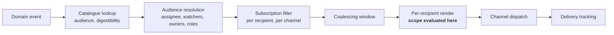

# 13 — Notification

## Table of Contents

1. [Purpose and Scope](#1-purpose-and-scope) · 2. [Why Restraint Is the Design Goal](#2-why-restraint-is-the-design-goal) · 3. [Architecture](#3-architecture) · 4. [Event Catalogue](#4-event-catalogue) · 5. [Channels](#5-channels) · 6. [Subscription and Preference](#6-subscription-and-preference) · 7. [Coalescing and Digest](#7-coalescing-and-digest) · 8. [Escalation](#8-escalation) · 9. [Content and Scope Evaluation](#9-content-and-scope-evaluation) · 10. [Templates and Localization](#10-templates-and-localization) · 11. [Inbound Association](#11-inbound-association) · 12. [Delivery and Failure](#12-delivery-and-failure) · 13. [Requirements](#13-requirements) · 14. [Closing](#14-closing)

---

## 1. Purpose and Scope

**In scope.** The event catalogue and its digestibility classification; channel abstraction; subscription and preference model; coalescing and digest; escalation chains; content composition with per-recipient scope evaluation; templates and localization; inbound email association; delivery guarantees and failure visibility.

**Out of scope.** Domain events (DOC-03 §18.2); state machines (DOC-09); audit trail (DOC-14); delivery infrastructure (DOC-15).

**LC-01.** Requirements are `PRD-NTF-013` onward, continuing DOC-01's sequence.

---

## 2. Why Restraint Is the Design Goal

Notification determines whether the platform is used, and the failure is asymmetric.

A system that notifies too little leaves a process stalled with someone unaware — recoverable, because the queue views still show the work. **A system that notifies too much gets muted, and a muted system is one whose service level escalations do not arrive, whose information requests go unanswered, and whose findings age unnoticed.** Muting is also effectively irreversible: a user who has filtered the sender does not un-filter when the volume improves.

Every capability in this corpus that depends on someone being told something depends on this domain being restrained enough to remain trusted. That is why coalescing, digest, and per-user preference are `MUST_HAVE` rather than refinements, and why §4 classifies every event's digestibility rather than treating urgency as a delivery-time decision.

---

## 3. Architecture

Notification is an **event subscriber**, never a transition side effect (`PRD-WRK-037`).

**Scope is evaluated at render, per recipient** (`PRD-NTF-007`). This forbids rendering once for a group, which is the efficient design and the wrong one: a group notification is a disclosure to the least-authorized recipient.

| ID | Statement | Rationale | Pri | V |
|---|---|---|---|---|
| `PRD-NTF-013` | Notification MUST be produced by subscribing to domain events, and a domain transaction MUST NOT depend on notification success. | A notification failure inside a transaction either fails the transaction — making a mail outage a work outage — or is swallowed, losing the notification silently. Neither is acceptable. | M | AT, AR |
| `PRD-NTF-014` | Content MUST be rendered per recipient with scope evaluated at render time, and a single rendered artifact MUST NOT be delivered to multiple recipients. | Rendering once for a group discloses to the least-authorized recipient, and a notification cannot be recalled. | M | AT, PT |

---

## 4. Event Catalogue

Every notifiable event declares default audience, digestibility, and whether it is mandatory. Tenants adjust audience and channel; digestibility and mandatory status are product-fixed, because they encode urgency semantics rather than preference.

| Event | Default audience | Digestible | Mandatory |
|---|---|---|---|
| `work.assigned` | Assignee | No | **Yes** |
| `work.mentioned` | Mentioned principals | No | **Yes** |
| `work.state_changed` | Watchers, assignee | Yes | No |
| `work.commented` | Watchers, assignee, thread participants | Yes | No |
| `work.blocked` | Assignee, program owner | No | No |
| `request.information_requested` | Requester | **No** | **Yes** |
| `request.accepted` \| `.rejected` \| `.deferred` | Requester | No | No |
| `request.scheduled` | Requester, technical contact | No | No |
| `request.report_delivered` | Requester, business contact, engineering owner | No | **Yes** |
| `finding.raised.critical` | Asset owner, program owner | No | No |
| `finding.assigned` | Assignee | No | **Yes** |
| `finding.reopened` | Prior assignee, asset owner | No | No |
| `finding.secret.confirmed_live` | Asset owner, program owner, escalation contact | **No** | **Yes** |
| `sla.approaching` | Assignee | No | No |
| `sla.breached` | Assignee, accountable owner | **No** | **Yes** |
| `sla.escalated` | Escalation target | **No** | **Yes** |
| `exception.approval_requested` | Approver | No | **Yes** |
| `exception.approved` \| `.rejected` | Requester | No | No |
| `exception.expiring` | Requester, approver, asset owner | No | **Yes** |
| `exception.expired` | Requester, approver, asset owner | No | **Yes** |
| `ownership.claim_proposed` | Candidate node owner | Yes | No |
| `ownership.claim_escalated` | Ancestor node owner | No | **Yes** |
| `asset.exposure_conflict` | Asset owner, program owner | No | No |
| `sbom.coverage_gap` | Asset owner | Yes | No |
| `sbom.freshness_breached` | Asset owner | Yes | No |
| `integration.unhealthy` | Connector owner, tenant administrator | No | **Yes** |
| `integration.submission_failing` | Connector owner | No | **Yes** |
| `import.completed_with_quarantine` | Initiator | Yes | No |
| `credential.rotation_required` | Requester, technical contact | No | **Yes** |
| `credential.verification_failed` | Requester | No | **Yes** |
| `evidence.flagged_malicious` | Uploader, program owner | No | No |
| `report.scheduled_delivered` | Recipients | No | No |
| `capacity.overallocated` | Program owner | Yes | No |
| `ai.budget_exhausted` | Tenant administrator | No | **Yes** |
| `break_glass.activated` | Tenant administrator, security contact | **No** | **Yes, non-suppressible** |
| `audit.integrity_failed` | Tenant administrator, security contact | **No** | **Yes, non-suppressible** |
| `tenant.suspended` \| `.offboarding_started` | Tenant administrator | No | **Yes** |

| ID | Statement | Rationale | Pri | V |
|---|---|---|---|---|
| `PRD-NTF-015` | Every notifiable event MUST be catalogued with default audience, digestibility, and mandatory status, and an uncatalogued event MUST NOT produce a notification. | Without a catalogue, notifications accrete per feature with inconsistent defaults, and the aggregate volume becomes nobody's responsibility. | M | AT |
| `PRD-NTF-016` | Digestibility and mandatory status MUST be product-fixed. Tenants MAY adjust audience and channel only. | Both encode urgency semantics rather than preference. A tenant marking service level breach digestible would defeat the escalation mechanism it is configured to rely on. | M | AT |
| `PRD-NTF-017` | Mandatory categories MUST NOT be unsubscribable, and `break_glass.activated` and `audit.integrity_failed` MUST additionally be non-suppressible by any in-product configuration. | A user may not opt out of being told their work breached its obligation. The two non-suppressible events are those where the party most likely to suppress them is the party with platform access. | M | AT, PT |

---

## 5. Channels

| Channel | Latency | Digest | Notes |
|---|---|---|---|
| In-product | Immediate | Read state rather than digest | The channel the platform controls; always enabled |
| Email | Minutes | Yes | Reply-to-comment supported (§11) |
| Chat integration | Immediate | Yes | Per-connector; content scope-restricted |
| Webhook | Immediate | No | Signed; scope-restricted (`PRD-API-053`) |

| ID | Statement | Rationale | Pri | V |
|---|---|---|---|---|
| `PRD-NTF-018` | The in-product channel MUST always be enabled and MUST NOT be disableable per user or per event. | It is the only channel whose delivery the platform can guarantee, and it is the fallback when every external channel is muted or failing. | M | AT |
| `PRD-NTF-019` | Channel selection MUST be per event category per recipient, not global per recipient. | Different events warrant different urgency. A single global channel produces either noise in the attended channel or important events in an unattended one. | M | AT |

---

## 6. Subscription and Preference

**Audience resolution.** Explicit watchers; role-derived audience per the catalogue; automatic subscription on assignment, comment, or mention. Automatic subscription is unsubscribable except for mandatory categories.

**Preference model.** Per principal: channel per event category; digest schedule; quiet hours with a mandatory-category override; a global mute with mandatory-category override.

| ID | Statement | Rationale | Pri | V |
|---|---|---|---|---|
| `PRD-NTF-020` | Principals MUST be able to unsubscribe from any non-mandatory category, and the platform MUST provide a single control to reduce non-mandatory volume without affecting mandatory categories. | The one-control path exists because a user overwhelmed by volume mutes the sender rather than navigating a preference matrix. Giving them a safe way to reduce volume preserves the mandatory channel. | M | DM |
| `PRD-NTF-021` | Quiet hours MUST defer non-mandatory notifications and MUST NOT suppress mandatory ones. | Quiet hours are a volume control, not an availability control. A confirmed-live leaked credential does not wait for morning. | M | AT |
| `PRD-NTF-022` | Automatic subscription on assignment, comment, or mention MUST be unsubscribable per item. | Otherwise a single comment on a busy item subscribes a person to its entire remaining history, which is the most common source of self-inflicted volume. | M | AT |

---

## 7. Coalescing and Digest

Coalescing merges related events within a window into one notification. Digest batches non-urgent notifications on a schedule. Both are volume controls and both are required.

| Mechanism | Applies to | Behaviour |
|---|---|---|
| **Coalescing** | Any burst from one action | Events for the same recipient and object within a 60-second window merge into one notification stating the net change |
| **Bulk suppression** | Bulk operations, imports, automation | A bulk action produces one summary notification per recipient, never one per item |
| **Digest** | Digestible categories | Scheduled per recipient, default daily, grouped by object |
| **Deduplication** | Repeated identical events | Within the digest period, an event repeating for the same recipient and object appears once with a count |

| ID | Statement | Rationale | Pri | V |
|---|---|---|---|---|
| `PRD-NTF-023` | A bulk operation, import, or automation execution MUST produce at most one summary notification per recipient, never one per affected item. | Bulk actions routinely affect hundreds of items. Uncoalesced delivery sends hundreds of messages from one action and trains the recipient to filter the sender permanently. | M | AT |
| `PRD-NTF-024` | Events within the coalescing window for the same recipient and object MUST merge, and the merged notification MUST state the net change rather than the sequence. | A recipient does not need to know an item moved through three states in forty seconds; they need to know where it is now. | M | AT |
| `PRD-NTF-025` | Digest delivery MUST be configurable per recipient and MUST group by object rather than by event time. | Grouping by time produces a chronological list requiring the reader to reassemble which item each entry concerns. | M | DM |

---

## 8. Escalation

Escalation is what makes a first notification consequential. Chains are tenant-configured (`CFG-NTF-001`) because escalation paths are organizational.

**Default chain for a service level clock**, expressed as a proportion of the budget:

| Trigger | Target |
|---|---|
| 0.50 | Assignee |
| 0.75 | Assignee and accountable owner |
| 1.00 (breach) | Accountable owner and nearest ancestor owner |
| 2.00 | Program owner |

**Default chain for an unanswered information request:** requester at 3 days, requester and business contact at 7, business owner at 14, request auto-deferred with attribution at 30.

| ID | Statement | Rationale | Pri | V |
|---|---|---|---|---|
| `PRD-NTF-026` | Escalation MUST NOT fire against the accountable team while a clock is paused for requester or third-party blocking. A separate chain MUST escalate the blocking party. | Escalating the accountable team for a delay attributable elsewhere is precisely the failure PP-6 addresses, and it destroys the credibility of every subsequent escalation. | M | AT |
| `PRD-NTF-027` | Escalation MUST record each step fired so that a step is not repeated and the escalation history is auditable. | Without a record, a restart or a recomputation re-fires the whole chain, and a recipient who received four escalations for one item stops reading them. | M | AT |
| `PRD-NTF-028` | Escalation targets MUST be resolved at fire time, not at clock start. | The accountable owner may have changed. Resolving at start would escalate to someone who is no longer responsible. | M | AT |

---

## 9. Content and Scope Evaluation

| ID | Statement | Rationale | Pri | V |
|---|---|---|---|---|
| `PRD-NTF-029` | Notification content MUST be evaluated against the recipient's authorized scope at delivery time, and MUST NOT include data the recipient is not authorized to see at that moment. | A notification is a delivery to a destination with no scope enforcement at the point of receipt. Including a finding summary in an email to a recipient who has since lost access is a disclosure no later authorization change can retract. | M | AT, PT |
| `PRD-NTF-030` | Notification content MUST NOT include credentials, secret values, evidence content, or per-person workload data, at any permission level or channel. | An external channel leaves the platform by design and is frequently forwarded. There is no permission level at which emailing a leaked credential is acceptable. | M | AT, CR |
| `PRD-NTF-031` | Where a recipient's scope has narrowed such that the notification's subject is no longer visible to them, the notification MUST be suppressed rather than sent with content removed. | An empty notification about an object the recipient cannot see confirms that the object exists and concerns them — a disclosure through absence. | M | AT, PT |
| `PRD-NTF-032` | External-channel content MUST default to minimal — subject identity and a link — with detail included only where the tenant has enabled it per category. | Email content is retained in mail systems the tenant may not control and is forwarded. Minimal default with opt-in detail puts the decision with the tenant's data governance function. | M | AT |

**On `PRD-NTF-032`.** The default is a deliberate usability cost: a minimal email requires a click to be useful. It is accepted because finding detail in an email is a copy of confidential data outside the platform's control, replicated to every recipient's mail archive.

---

## 10. Templates and Localization

| ID | Statement | Rationale | Pri | V |
|---|---|---|---|---|
| `PRD-NTF-033` | Templates MUST be tenant-configurable per event and channel, and MUST be validated to reference only fields available in the event's payload. | An unvalidated template referencing an absent field fails at delivery, which is the worst time to discover it. | M | AT |
| `PRD-NTF-034` | Templates MUST be localizable, and content MUST be rendered in the recipient's locale with locale-aware dates, times, and numbers in the recipient's timezone. | The recipient population includes thousands of occasional users whose working language may differ from the platform's source locale. An untranslated notification is a barrier to the response the notification exists to produce. | M | AT |
| `PRD-NTF-035` | Template content MUST be treated as data, never as an executable template with access to platform internals. | A tenant-authored template with expression capability is server-side template injection through configuration (`SEC-SEC-037`). | M | AT, CR |
| `PRD-NTF-036` | Tenant vocabulary overrides MUST apply to notification content. | A tenant that renames business units to P&Ls sees the platform's term in every notification otherwise, which is a persistent low-grade signal that the tool was not configured for them. | S | DM |

---

## 11. Inbound Association

A reply to a notification is recorded as a comment on the originating item.

| ID | Statement | Rationale | Pri | V |
|---|---|---|---|---|
| `PRD-NTF-037` | Inbound email MUST be associated with the originating item via an unguessable token in the reply address, and MUST NOT rely on the subject line or sender address for association. | Subject-line association is trivially forged and unreliable after forwarding. Sender-address association permits anyone who learns an address to post as that principal. | M | AT, PT |
| `PRD-NTF-038` | The inbound token MUST identify the item, the recipient, and the notification, MUST expire, and MUST be single-purpose — it MUST NOT confer any authorization beyond posting a comment on that item. | The token travels in email and will be forwarded. Confining it to one action on one item bounds the consequence of exposure. | M | AT, PT |
| `PRD-NTF-039` | Inbound content MUST be sanitized, MUST have quoted history and signatures stripped, and MUST be attributed to the identified recipient with the inbound origin recorded. | Untrusted content from an email path is rendered to other users. Recording the origin matters because an inbound-attributed comment carries weaker identity assurance than an authenticated one. | M | AT, PT |
| `PRD-NTF-040` | Where a reply cannot be associated, the sender MUST receive a failure response. | The population this serves replies by reflex and believes they responded. A silently discarded reply is worse than no inbound support, because it produces a stalled request whose requester believes they answered. | M | AT |

**On `PRD-NTF-040`.** This closes the failure the capability exists to prevent. Inbound email is provided for archetype A6 — occasional users who receive a notification and reply. If association fails silently, the request stalls with both parties believing the other is responsible.

---

## 12. Delivery and Failure

| ID | Statement | Rationale | Pri | V |
|---|---|---|---|---|
| `PRD-NTF-041` | Immediate-category notifications MUST be dispatched within 60 seconds of the triggering event at p95. | Escalations and information requests are time-sensitive by definition; one arriving hours later has lost the urgency that justified sending it immediately (`NFR-NTF-001`). | M | AT |
| `PRD-NTF-042` | Delivery MUST be retried with backoff on transient failure, MUST record outcome per notification, and MUST surface persistent failure to a tenant administrator. | Silent delivery failure means escalations do not arrive and nobody knows. A bounced address for a key approver is an invisible process failure until a deadline is missed. | M | AT |
| `PRD-NTF-043` | A new or changed delivery address MUST be verified before notification content is sent to it. | Notification content is a disclosure to whoever controls the address. An unverified address change is an account-takeover-adjacent exfiltration path. | M | AT, PT |
| `PRD-NTF-044` | Per-recipient rate limiting MUST apply, and exceeding it MUST force digest rather than discard. | Rate limiting protects the platform from becoming an abuse vector against a third party. Forcing digest rather than discarding means the volume control never loses a mandatory notification. | M | AT |
| `PRD-NTF-045` | Where every external channel for a recipient is failing or muted, mandatory notifications MUST remain visible in the in-product channel and the condition MUST be surfaced to the recipient. | The in-product channel is the guaranteed path (`PRD-NTF-018`). Surfacing the condition is what tells the recipient they are missing external delivery. | M | AT |

---

## 13. Requirements

Thirty-three requirements, `PRD-NTF-013` – `045`, all `MUST_HAVE` except `PRD-NTF-036`.

| Group | IDs | Count |
|---|---|---|
| Architecture | `013` – `014` | 2 |
| Catalogue | `015` – `017` | 3 |
| Channels | `018` – `019` | 2 |
| Subscription | `020` – `022` | 3 |
| Coalescing | `023` – `025` | 3 |
| Escalation | `026` – `028` | 3 |
| Content and scope | `029` – `032` | 4 |
| Templates | `033` – `036` | 4 |
| Inbound | `037` – `040` | 4 |
| Delivery | `041` – `045` | 5 |

Satisfies `PRD-NTF-001` – `012`, `CFG-NTF-001`, `PRD-WRK-020`.

---

## 14. Closing

### 14.1 Extensibility

A new notifiable event is a catalogue entry with audience and digestibility. A new channel implements the delivery contract and declares its digest support. Templates and localization use the platform's internationalization architecture rather than a notification-specific mechanism.

**Deliberate rigidity.** Product-fixed digestibility and mandatory status (`PRD-NTF-016`); the in-product channel not disableable (`PRD-NTF-018`); per-recipient render (`PRD-NTF-014`); no executable templates (`PRD-NTF-035`); no silent inbound discard (`PRD-NTF-040`).

**Known extension cost.** Per-recipient scope evaluation at render forbids rendering once for a group, so notification cost scales with recipients rather than with events. For a widely-watched item this is material, and it is the price of not disclosing to the least-authorized recipient.

### 14.2 Security considerations

Notification is an unauthenticated egress channel and is treated as one: content evaluated per recipient at delivery; absolute exclusion of credentials, secrets, evidence, and personal workload data; suppression rather than emptying where scope has narrowed; minimal external content by default; address verification before delivery; and single-purpose expiring inbound tokens.

**Residual risks.** Content already delivered cannot be recalled — an authorization change is prospective only, which is why `PRD-NTF-032` defaults external content to minimal. Inbound-attributed comments carry weaker identity assurance than authenticated ones; `PRD-NTF-039` requires the origin to be recorded, but a reader may not notice the distinction, and the interface must make it visible.

### 14.3 Notes for downstream documents

| Document | Note |
|---|---|
| DOC-08 | Owes the notification centre with read state, the volume-reduction control of `PRD-NTF-020`, and a visible distinction for inbound-attributed comments |
| DOC-15 | Owes delivery infrastructure, address verification, inbound mail routing, and residency constraint on the delivery path (DOC-24 §8.1) |
| DOC-16 | Owes: a test asserting no notification contains excluded categories; a scope-narrowed suppression test; a bulk coalescing test; an inbound token scope test asserting it confers nothing beyond commenting |
| DOC-21 | Chat and webhook channels are connectors under DOC-21's contract |

### 14.4 Change History

| Version | Date | Author | Change | Reviewer |
|---|---|---|---|---|
| 1.0.0 | 2026-08-04 | Staff Product Manager; Chief Software Architect | Initial content-complete version. States restraint as the design goal with the asymmetry of the failure explained. Specifies notification as an event subscriber never a transition side effect; a catalogue of thirty-seven events with product-fixed digestibility and mandatory status and two non-suppressible events; four channels with the in-product channel not disableable; subscription and preference including a single volume-reduction control; coalescing with bulk producing one summary per recipient; escalation resolved at fire time and not firing against a party for another's delay; per-recipient scope evaluation at render with suppression rather than emptying where scope narrowed and minimal external content by default; localizable non-executable templates; inbound association by single-purpose expiring token with no silent discard; and delivery with address verification and digest-not-discard on rate limit. Thirty-three requirements. | Pending |

---

*End of DOC-13.*
