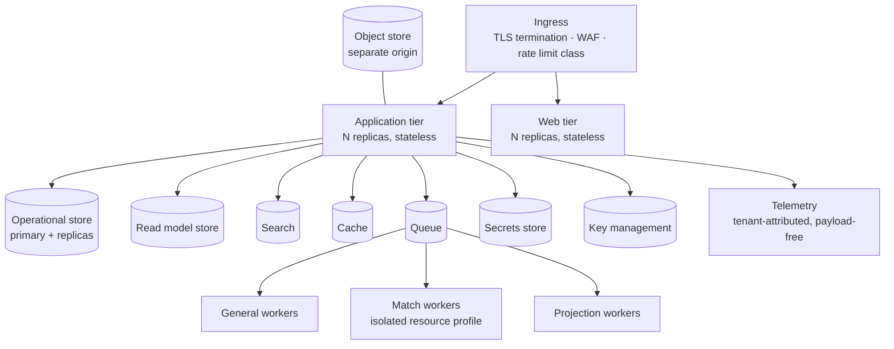

# 15 — Deployment and Operations

## Table of Contents

1. [Purpose and Scope](#1-purpose-and-scope) · 2. [Technology Decisions](#2-technology-decisions) · 3. [Reference Topologies](#3-reference-topologies) · 4. [Runtime Units](#4-runtime-units) · 5. [Data Tier Configuration](#5-data-tier-configuration) · 6. [Network and Egress](#6-network-and-egress) · 7. [Secrets and Key Injection](#7-secrets-and-key-injection) · 8. [Environments](#8-environments) · 9. [Delivery Pipeline](#9-delivery-pipeline) · 10. [Upgrade and Rollback](#10-upgrade-and-rollback) · 11. [Backup and Recovery](#11-backup-and-recovery) · 12. [Observability and Service Levels](#12-observability-and-service-levels) · 13. [Capacity Planning](#13-capacity-planning) · 14. [Air-Gapped Operation](#14-air-gapped-operation) · 15. [Runbooks](#15-runbooks) · 16. [Requirements](#16-requirements) · 17. [Closing](#17-closing)

---

## 1. Purpose and Scope

**In scope.** The technology decisions deferred by DOC-02 §16; three reference topologies; runtime units and their configuration; data tier configuration including the credential separation and partition automation owed by DOC-04; network and egress policy; secrets and key injection; environment strategy; the delivery pipeline with its security gates; upgrade and rollback; backup and recovery with rehearsed restore; observability and service level objectives; capacity planning; air-gapped operation; runbooks.

**Out of scope.** Architecture (DOC-02); schema (DOC-04); security control specification (DOC-06); isolation policy intent (DOC-24); test specification (DOC-16).

**LC-01.** Requirements are `OPS-DEP-nnn` from `001`: class `OPS` (operational requirement) and domain `DEP` (deployment and operations), per DOC-00 §6.2 and Appendix A. An earlier draft used an unregistered `DEP` class code; the corpus validator rejected it and the identifiers were renumbered into the registered scheme. Recorded because it is an instance of the convention working as intended.

**LC-02 — On naming products.** This document names product *categories* and required properties, not vendors. A vendor choice is an implementation decision recorded as an ADR; a required property is a constraint that survives the choice.

---

## 2. Technology Decisions

DOC-02 §16 deferred eight decisions to this document. Two carry disqualifying constraints (`PRD-PLT-009`).

**All eight are now selected.** Per `OPS-DEP-001` the selections are recorded as ADR-049 through ADR-056 in DOC-19, each carrying its constraint verification and, where a required property is not provided by any candidate, the accepted gap and its compensating control per `OPS-DEP-002`. The property table below remains the specification the selections were verified against, and remains the basis on which a substitution would be assessed; it is not superseded by the selections.

| Decision | Category | Required properties | Disqualifying |
|---|---|---|---|
| **Operational store** | Relational engine with row-level security | Row-level security with **forced owner enforcement**; transactional; declarative range and hash partitioning with partition-wise joins; typed document column with expression indexing; array containment indexing; partial and expression indexes; constraint triggers | **Yes** — absent row-level enforcement, tenant isolation becomes query discipline (DOC-24 §5.1) |
| **Application toolchain** | Statically analysable, module-boundary enforceable | Build-time module boundary enforcement; static analysis capable of prohibiting role-identifier comparison against literals; deterministic dependency resolution | **Yes** — `CON-PLT-046`. Both structural controls degrade to code review without it |
| **Search engine** | Full-text search | **Scope predicate combinable with text query in one execution**; pre-scoring filtering; relevance ranking; tenant partitioning | Near-disqualifying — a separate engine filtered after retrieval leaks result counts across scope boundaries (DOC-24 §6.2 entry 3) |
| **Secrets store** | ⚠ OQ-026 | Per-tenant namespaces; non-retrievable after entry; rotation with overlap; audit of access | |
| **Read model store** | Analytical or relational read replica | Aggregation performance at DOC-01 §12.1 volumes; horizontal read scaling; rebuildable | |
| **Durable queue** | Message queue | At-least-once delivery; lease with visibility timeout; per-class isolation; tenant-bound payload | |
| **Cache** | Key-value cache | Key-prefix scoping; explicit invalidation; no cross-tenant key collision by construction | |
| **Object store** | Object storage | Tenant partitioning by **access policy, not path convention**; signed references with short expiry; server-side encryption with supplied keys | |

| ID | Statement | Rationale | Pri | V |
|---|---|---|---|---|
| `OPS-DEP-001` | The operational store and application toolchain MUST be selected against the disqualifying constraints before any implementation begins, and the selection MUST be recorded as an ADR with the constraint verification. | Both constraints exist because a structural control depends on each. Selecting without verifying reduces `CON-DAT-012` and `CON-PLT-013` to convention, and the erosion is invisible until a breach or a boundary violation (`PRD-PLT-009`). | M | AR, DI |
| `OPS-DEP-002` | Where a selected component lacks a required property, the gap MUST be recorded as an accepted risk with its compensating control, not absorbed silently. | An unrecorded gap becomes an assumption downstream documents rely on. Recording it means the compensating control is designed rather than improvised. | M | DI |

---

## 3. Reference Topologies

### 3.1 Multi-tenant

Single region per residency designation. Cross-region replication only within a designation.

### 3.2 Single-tenant hosted

The same topology with one tenant, reduced replica counts, and a dedicated data tier. **No code path differs** (`SEC-TEN-044`).

### 3.3 Air-gapped

The same topology with every egress-dependent connector disabled, offline intelligence provisioning, an internal mail relay if present, and either a self-hosted model endpoint or AI disabled with non-AI fallbacks (§14).

| ID | Statement | Rationale | Pri | V |
|---|---|---|---|---|
| `OPS-DEP-003` | All three topologies MUST run the same artifact with the same code paths, differing only in configuration and scale. | Divergent code paths per deployment model produce defects appearing in one model only, found by the customer. A single artifact tested once is cheaper and more reliable (`SEC-TEN-044`, `PRD-CON-055`). | M | AR, AT |
| `OPS-DEP-004` | Each residency designation MUST be a separate deployment with no data path between designations, including backup, telemetry, and queue. | Residency is breached in the paths nobody designed for residency. Separating at the deployment boundary makes the secondary paths separate by construction rather than by configuration (DOC-24 §8.1). | M | AT, DI |

---

## 4. Runtime Units

| Unit | Scaling signal | Resource profile | Notes |
|---|---|---|---|
| Web tier | Request rate | CPU-bound | Stateless |
| Application tier | Request rate, latency | CPU-bound, moderate memory | Stateless; all domain modules |
| General workers | Queue depth per class | Balanced | Ingestion, export, report, dispatch |
| **Match workers** | Match queue depth | **Memory-heavy** | Intelligence database resident; isolated per `CON-PLT-008` |
| Projection workers | Projection lag | CPU and I/O | Lag-sensitive |
| Scheduler | — | Minimal | Singleton with leader election; emits scheduled work, performs none |

| ID | Statement | Rationale | Pri | V |
|---|---|---|---|---|
| `OPS-DEP-005` | Every runtime unit MUST declare resource requests and limits, and a unit exceeding its memory limit MUST be restarted rather than permitted to degrade the node. | Match workers hold a large intelligence database; without a limit an out-of-memory condition takes the node and everything on it, including the API tier if co-scheduled. | M | AT |
| `OPS-DEP-006` | Match workers MUST NOT be co-scheduled with the application tier. | `CON-PLT-008`. The failure this prevents occurs during a portfolio sweep triggered by a high-profile disclosure — precisely when the platform must be available. | M | AR, DI |
| `OPS-DEP-007` | The scheduler MUST be a singleton with leader election and MUST only enqueue work, never perform it. | Two active schedulers produce duplicate scheduled work; a scheduler that performs work cannot be scaled without duplicating it. | M | AT |
| `OPS-DEP-008` | Every unit MUST expose readiness and liveness separately, and readiness MUST fail where a required dependency is unavailable while liveness MUST NOT. | Conflating them causes a restart loop during a dependency outage, which turns a degraded state into an outage. | M | AT |

---

## 5. Data Tier Configuration

### 5.1 Database credentials

DOC-04 §7.2 requires four roles with three unreachable from the application.

| Credential | Row-level security | Available to | Injection |
|---|---|---|---|
| `app_runtime` | **Enforced** | Application and worker tiers | Standard secret injection |
| `migration_runner` | Bypass | Migration pipeline only | Pipeline-scoped; not present in runtime environments |
| `integrity_verifier` | Bypass, read-only | Verification job only | Job-scoped |
| `offboarding_executor` | Bypass | Offboarding procedure only | Dual-control gated |

| ID | Statement | Rationale | Pri | V |
|---|---|---|---|---|
| `OPS-DEP-009` | The three bypass credentials MUST NOT be present in any runtime environment reachable by application code, and their use MUST emit an audit event. | `CON-DAT-014`. Credential separation is what makes bypass unreachability structural rather than procedural — an application that cannot obtain the credential cannot use the bypass regardless of what its code attempts. | M | AT, CR |
| `OPS-DEP-010` | Connection pooling MUST reset session state on connection return, and a pooled connection MUST NOT be reusable with a stale tenant context. | `SEC-TEN-007`. A session variable carrying tenant context and surviving into the next borrower's request is a documented cross-tenant disclosure mechanism in row-level-security deployments. | M | AT, PT |

### 5.2 Partitioning

| ID | Statement | Rationale | Pri | V |
|---|---|---|---|---|
| `OPS-DEP-011` | Range partition creation MUST be automated ahead of need with a configurable lead time, and a missing future partition MUST alert before it would be required. | A missing partition rejects inserts. For `audit_event` that fails every audited operation under `CON-PLT-021` — a total write outage from an omitted maintenance task (`CON-DAT-025`). | M | AT |
| `OPS-DEP-012` | Hash partition counts MUST be set before first production data and recorded with the sizing basis used. | Changing a hash partition count redistributes every row (`CON-DAT-035`). Recording the basis lets a later resize assess whether the assumption or the growth was wrong (`PRD-PLT-010`). | M | DI |
| `OPS-DEP-013` | Retention jobs MUST implement expiry as partition drop after archival, MUST consult the legal hold register before dropping, and MUST NOT delete rows in bulk. | Deleting hundreds of millions of rows is a sustained load event competing with operational traffic. The hold register is consulted at partition granularity because a row-level flag cannot prevent a partition drop (`CON-DAT-029`). | M | AT |

⚠ **Working assumption (OQ-015):** partition counts follow the Medium reference profile with headroom to Extra large. The values change on an answer; the mechanism does not.

---

## 6. Network and Egress

| ID | Statement | Rationale | Pri | V |
|---|---|---|---|---|
| `OPS-DEP-014` | Egress MUST be deny-by-default with an allowlist per runtime unit, and a unit MUST NOT reach a destination outside its allowlist. | Three surfaces make egress the platform's most exposed injection class: the document parser, webhook delivery, and connectors. Deny-by-default at the network layer is the control that holds when an application-layer check is missed (`SEC-SEC-035`). | M | AT, PT |
| `OPS-DEP-015` | Internal and link-local address ranges MUST be unreachable from any unit that processes user-supplied destinations, and resolution MUST be re-checked at connection time. | Connection-time re-checking closes the rebinding gap between validation and use (`PRD-CON-033`). | M | AT, PT |
| `OPS-DEP-016` | Object storage serving uploaded content MUST be a distinct origin from the API and web tiers, and MUST serve only non-inline with content-type enforcement. | Serving stored hostile content from the application origin makes it a same-origin execution risk. The separate origin is the control; disposition and type enforcement are defence in depth (`SEC-SEC-044`). | M | AT, PT |
| `OPS-DEP-017` | Ingress MUST assign the rate limit class and MUST NOT make authorization decisions. | Authorization requires domain context. A gateway making partial decisions creates a second enforcement point that will diverge from the first (`CON-PLT-009`). | M | AR |
| `OPS-DEP-018` | Inbound mail for reply-to-comment association MUST be routed to a dedicated endpoint with the token validated before any content processing. | The token is what associates the reply; validating it first means malformed or forged inbound never reaches the content path (`PRD-NTF-037`). | M | AT |

---

## 7. Secrets and Key Injection

| ID | Statement | Rationale | Pri | V |
|---|---|---|---|---|
| `OPS-DEP-019` | Secrets MUST be injected at runtime from the secrets store and MUST NOT be present in container images, environment files committed to source, or orchestration manifests in plaintext. | An image or manifest is copied, cached, and shared. A secret in either is a secret in every registry and backup that holds it. | M | AT, CR |
| `OPS-DEP-020` | Long-lived process environment variables MUST NOT hold secrets. Secrets MUST be obtained per use or held in memory with a bounded lifetime. | An environment variable is readable from a process listing and appears in crash dumps and diagnostic exports (`SEC-SEC-023`). | M | CR |
| `OPS-DEP-021` | Key management MUST hold key-encryption keys in a hardware-backed or equivalently protected store, and per-tenant data encryption keys MUST be wrapped rather than stored in plaintext. | `SEC-SEC-018`. Per-tenant keys stored in plaintext alongside the data they protect provide no isolation against a storage compromise. | M | AT |
| `OPS-DEP-022` | Key destruction MUST be dual-controlled and MUST be the mechanism of cryptographic erasure at tenant offboarding. | Destruction is irreversible data loss and is also the mechanism an insider would use to destroy evidence (`SEC-SEC-020`). Using it for offboarding makes deletion demonstrable (`SEC-TEN-041`). | M | AT |

---

## 8. Environments

| Environment | Data | Purpose |
|---|---|---|
| Development | Synthetic | Feature work |
| Integration | Synthetic | Automated testing; the full test suite of DOC-16 |
| Staging | **Synthetic, structurally representative at the Medium profile** | Performance, migration rehearsal, upgrade rehearsal |
| Production | Real | |
| Restore rehearsal | Restored production backup, isolated | `OPS-DEP-030` |

| ID | Statement | Rationale | Pri | V |
|---|---|---|---|---|
| `OPS-DEP-023` | Production data MUST NOT be copied to any non-production environment. Non-production environments MUST use synthetic data. | Production data here is the customer's complete exploitable attack surface, plus credentials and exploit material. A copy in a lower-controlled environment is the disclosure path with the least resistance. | M | AT, CR |
| `OPS-DEP-024` | Synthetic data MUST be structurally representative at the Medium reference profile, including hierarchy depth, finding volume, and component cardinality. | Performance and migration behaviour are volume-dependent. Testing against a small dataset validates correctness and nothing about the properties that fail at scale. | M | DI |
| `OPS-DEP-025` | The restore rehearsal environment MUST be network-isolated and MUST have no egress, and restored data MUST be destroyed on completion. | A restored backup is production data. Rehearsing restore into a reachable environment reintroduces the exposure `OPS-DEP-023` prevents. | M | AT |

---

## 9. Delivery Pipeline

### 9.1 Gates

| Gate | Blocks on |
|---|---|
| Static analysis | Module boundary violation (`CON-PLT-013`); role-identifier comparison (`SEC-AUZ-050`); domain layer purity (`CON-PLT-017`) |
| Test suite | Any failure; the `MUST_HAVE` coverage gate of `PRD-PLT-011` |
| Corpus validation | Register regeneration and validator failure (`PRD-PLT-012`) |
| Dependency policy | Known-vulnerable above threshold; licence policy (`SEC-SEC-058`) |
| Secret scanning | Any detected secret in source or history |
| Container scan | Known-vulnerable above threshold in the image |
| Signing and provenance | Unsigned artifact or absent attestation (`SEC-SEC-056`) |
| Migration validation | Migration not expand-migrate-contract; blocking operation on a large table (`CON-DAT-033`) |
| Accessibility | WCAG automated failure (`INT-UIX-001`) |
| AI evaluation | Harness threshold failure where AI capabilities changed (`PRD-AIC-049`) |

| ID | Statement | Rationale | Pri | V |
|---|---|---|---|---|
| `OPS-DEP-026` | Every gate MUST block rather than warn, and a bypass MUST require a recorded, reviewed exception naming the gate and the reason. | A warning is a violation with extra steps. The static analysis and corpus validation gates in particular exist because the failures they catch are invisible to review (DOC-06's twenty-seven unregistered requirements were found by the register, not by a reviewer). | M | AT, CR |
| `OPS-DEP-027` | Signing keys MUST NOT be reachable from build steps that execute repository content. | Otherwise a compromised dependency signs its own artifact, which defeats the entire provenance chain (`SEC-SEC-059`). | M | AT, CR |
| `OPS-DEP-028` | Base images and runtime dependencies MUST be pinned by digest and rebuilt on a defined cadence. | A tag can be reassigned to different content, so tag-based pinning is not pinning (`SEC-SEC-060`). | M | AT |

---

## 10. Upgrade and Rollback

| ID | Statement | Rationale | Pri | V |
|---|---|---|---|---|
| `OPS-DEP-029` | Upgrades MUST be performable with rolling replacement and MUST NOT require simultaneous deployment of application and schema. Schema changes MUST follow expand-migrate-contract. | Atomic deployment is not achievable with rolling updates, and requiring it forces downtime on every schema change (`CON-DAT-033`, `NFR-DEP-004`). | M | AT |
| `OPS-DEP-030` | Rollback MUST be possible to the prior application version without a schema rollback, and a migration that cannot be rolled forward-compatible MUST be split. | A schema rollback on a large table under incident conditions is the operation most likely to cause data loss. Forward-compatible migrations make application rollback safe and sufficient. | M | AT |
| `OPS-DEP-031` | Migrations MUST be followed by a cross-tenant assertion before the release is considered complete. | Migrations run with row-level enforcement bypassed and are the highest-risk operation in the platform (`SEC-TEN-049`, `CON-DAT-036`). | M | AT |
| `OPS-DEP-032` | Upgrade and rollback MUST be rehearsed in staging at the Medium profile before production, and the rehearsal outcome MUST be recorded. | Migration duration is volume-dependent. A migration that completes in seconds against a small dataset may take hours at profile volumes, and discovering that in production is an unplanned outage. | M | DM |

---

## 11. Backup and Recovery

| ID | Statement | Rationale | Pri | V |
|---|---|---|---|---|
| `OPS-DEP-033` | Recovery point objective MUST NOT exceed 15 minutes and recovery time objective MUST NOT exceed 4 hours, and both MUST be measured rather than asserted. | `NFR-DEP-002`. The platform holds assessment findings and work state that are not reproducible from elsewhere: a pentest finding recorded and lost cannot be recovered by re-running anything. | M | AT |
| `OPS-DEP-034` | Restore MUST be rehearsed at a defined interval into the isolated environment of `OPS-DEP-025`, with the outcome and elapsed time recorded. | An untested backup is an assumption. Rehearsal is the only mechanism converting a documented objective into a demonstrated one, and it is routinely omitted until it is needed (`NFR-DEP-003`). | M | DM |
| `OPS-DEP-035` | Backups MUST be encrypted with tenant key material such that restoring one tenant's backup into another yields unreadable ciphertext. | Misrouted restore is a plausible operational error. Making its failure mode unreadable ciphertext rather than a silent cross-tenant load converts a breach into an incident (`SEC-TEN-016`). | M | AT |
| `OPS-DEP-036` | Backup replication MUST remain within the residency designation. | Managed storage replicates cross-region by default, which is the most common residency breach and one nobody configured (DOC-24 §8.1). | M | AT, DI |
| `OPS-DEP-037` | Partial restore MUST be scoped to one tenant or to a whole instance. A restore path mixing tenants MUST NOT exist. | Otherwise a partial restore is a cross-tenant contamination path with no compensating control (`SEC-TEN-018` reasoning applied to recovery). | M | AT |

---

## 12. Observability and Service Levels

### 12.1 Signals

| Signal | Requirement |
|---|---|
| Metrics | Per unit, per tenant dimension, per work class; no tenant data as payload |
| Logs | Structured; tenant-attributed; redacted at the serialization boundary |
| Traces | Correlation identifier propagated across module, process, and queue boundaries |
| Projection lag | Per projection, against its budget |
| Queue depth | Per class, per tenant |
| Connector health | Per connector, including success rate |
| Intelligence age | Per deployment |
| Audit chain | Verification status and anchor confirmation |

### 12.2 Service level objectives

| Objective | Target | Source |
|---|---|---|
| Availability | 99.9% monthly excluding announced maintenance | `NFR-DEP-001` |
| Dashboard latency | 1.5 s p95 | `NFR-DSH-001` |
| Finding list latency | 600 ms p95 | `NFR-VUL-001` |
| Comment acknowledgement | 400 ms p95 | `NFR-WRK-001` |
| Intelligence-to-visibility | 6 h p95 | `NFR-SBM-003` |
| Notification dispatch | 60 s p95 | `NFR-NTF-001` |
| Session revocation effect | 60 s | `NFR-SEC-001` |
| Projection lag | Per §DOC-02 §11.2 | `CON-PLT-027` |

| ID | Statement | Rationale | Pri | V |
|---|---|---|---|---|
| `OPS-DEP-041` | Alerting MUST be on error budget burn rate, not on individual errors. | Alerting on individual errors produces alert fatigue and then muted alerts. Burn-rate alerting is what makes an on-call rotation sustainable, which is what makes the availability target achievable (`NFR-OPS-002`). | M | DM |
| `OPS-DEP-042` | Silent failure MUST be alertable: a connector with no successful operation, an integration with a degraded success rate, a projection exceeding its lag budget, an intelligence dataset beyond its age threshold, and a queue with no consumer progress. | Each is a condition where nothing errors and the data simply stops being current — which resembles stability. These are the platform's most consequential failures because they produce confident output over stale data (PP-9). | M | AT |
| `OPS-DEP-043` | Detection alerts for insider and integrity conditions MUST be delivered to a destination outside operator control. | An alert an operator can suppress is not a control, and operators reach most platform-internal destinations (`SEC-PLT-008`). | M | AT, AR |
| `OPS-DEP-044` | Telemetry MUST carry tenant identity as a dimension and MUST NOT carry tenant data as payload, and telemetry egress MUST respect residency. | Telemetry pipelines are the most common residency and disclosure leak because they are designed for diagnosis rather than confidentiality (`SEC-SEC-065`). | M | AT, CR |
| `OPS-DEP-045` | Audit chain verification status and anchor confirmation MUST be monitored, and a verification failure MUST page rather than alert. | A verification failure is the single most serious signal the platform can produce, and the party most likely to suppress it is the one with platform access (`SEC-AUD-018`). | M | AT |

---

## 13. Capacity Planning

| Dimension | Driver | Scaling |
|---|---|---|
| Application tier | Concurrent sessions, request rate | Horizontal on latency |
| General workers | Import volume, export volume, notification rate | Horizontal on queue depth |
| Match workers | Component count × intelligence update frequency | Horizontal on match queue depth; memory-bound |
| Projection workers | Domain event rate | Horizontal on lag |
| Operational store | Finding and audit volume | Vertical plus read replicas; partition strategy per DOC-04 |
| Read model store | Composition query rate | Horizontal read |
| Search | Work item and comment volume | Index size and query rate |
| Object store | Evidence and export volume | Managed |

| ID | Statement | Rationale | Pri | V |
|---|---|---|---|---|
| `OPS-DEP-046` | Per-tenant resource limits MUST be enforced at the ingress, queue, and worker tiers, and one tenant reaching a limit MUST NOT degrade another's latency beyond the bound of `NFR-PLT-002`. | A noisy-neighbour failure is attributed to the platform rather than to the tenant who caused it, and it is the most common cause of multi-tenant service complaints (`SEC-TEN-032`). | M | AT |
| `OPS-DEP-047` | Portfolio-scale operations MUST execute in a work class that cannot starve interactive work, per tenant and across tenants. | An interactive request queued behind a portfolio sweep is a feature nobody uses, and one tenant's sweep must not queue another tenant's interactive work (`CON-PLT-030`, `SEC-TEN-035`). | M | AT |
| `OPS-DEP-048` | Capacity forecasting MUST be based on measured per-tenant growth in the dimensions above, and the forecast basis MUST be recorded. | ⚠ OQ-015. Forecasting from an unrecorded basis cannot be corrected when the basis proves wrong, only replaced. | M | DI |

---

## 14. Air-Gapped Operation

| Concern | Procedure |
|---|---|
| Intelligence provisioning | Signed bundle transferred by controlled media; signature verified before use; version and age recorded (`PRD-CON-046`, `-047`) |
| Platform upgrade | Signed artifact bundle with provenance; verified before deployment |
| Dependency updates | Included in the artifact bundle; no registry access at deploy time |
| Model provider | Self-hosted endpoint if present; otherwise AI disabled with non-AI fallbacks |
| Notification | Internal mail relay if present; in-product channel otherwise |
| Telemetry | Internal collection only; no egress |
| Audit anchoring | Operator-attested offline record, **labelled as weaker than an external anchor** (`SEC-AUD-015`) |
| Licence | Signed offline licence artifact (`LIC-PLT-006`) |

| ID | Statement | Rationale | Pri | V |
|---|---|---|---|---|
| `OPS-DEP-038` | Air-gapped deployment MUST state in the interface which capabilities are unavailable and the consequence of each, and MUST NOT present a capability as available where its dependency is absent. | An air-gapped instance silently matching against six-month-old intelligence is PP-1 violated in its most consequential form (`PRD-CON-054`). | M | AT |
| `OPS-DEP-039` | Every bundle transferred into an air-gapped deployment MUST be signature-verified before use, and a verification failure MUST retain the prior version. | The transfer medium is the only ingress. An unverified bundle is an injection path into the data driving every prioritization decision (`PRD-CON-046`). | M | AT |
| `OPS-DEP-040` | Air-gapped operation MUST be rehearsed, including intelligence provisioning and platform upgrade, before it is offered. | Offline procedures are used rarely and therefore tested rarely. Rehearsal before offering is what distinguishes a supported deployment model from a claimed one. | M | DM |

---

## 15. Runbooks

Required before production. Each states detection, immediate action, diagnosis, remediation, and the audit record produced.

| Runbook | Trigger |
|---|---|
| Cross-tenant assertion failure | Continuous verification alert (`SEC-TEN-047`) — **highest severity** |
| Audit chain verification failure | `OPS-DEP-045` |
| Break-glass request | Support or incident need |
| Erasure request | Data subject request |
| Tenant provisioning, suspension, offboarding | Commercial event |
| Connector credential compromise | Detection or notification |
| Key rotation and emergency key rotation | Schedule or compromise |
| Intelligence provisioning failure | `OPS-DEP-042` |
| Projection lag exceeding budget | `CON-PLT-027` |
| Partition exhaustion | `OPS-DEP-011` |
| Migration failure and reorganization saga stuck in manual intervention | `PRD-WRK-041` |
| Restore | `OPS-DEP-034` |
| Noisy neighbour | `OPS-DEP-046` |
| AI provider outage | `PRD-AIC-023` |
| Air-gapped provisioning | §14 |

| ID | Statement | Rationale | Pri | V |
|---|---|---|---|---|
| `OPS-DEP-049` | Every runbook MUST be rehearsed before production, and a runbook that has not been rehearsed MUST NOT be relied upon in a service level commitment. | An unrehearsed runbook is a document, and the first execution under incident conditions is where its gaps are found. | M | DM |
| `OPS-DEP-050` | The cross-tenant assertion failure runbook MUST specify immediate containment before diagnosis. | It is the platform's most severe possible condition: one customer's vulnerability inventory disclosed to another, unrecoverable and disclosable. Diagnosing before containing extends the exposure (DOC-26 T2). | M | DI |

---

## 16. Requirements

Fifty requirements: `OPS-DEP-001` – `040` and `OPS-DEP-041` – `010`. All `MUST_HAVE`.

| Group | IDs | Count |
|---|---|---|
| Technology decisions | `OPS-DEP-001` – `002` | 2 |
| Topologies | `003` – `004` | 2 |
| Runtime units | `005` – `008` | 4 |
| Data tier | `009` – `013` | 5 |
| Network and egress | `014` – `018` | 5 |
| Secrets and keys | `019` – `022` | 4 |
| Environments | `023` – `025` | 3 |
| Pipeline | `026` – `028` | 3 |
| Upgrade | `029` – `032` | 4 |
| Backup | `033` – `037` | 5 |
| Air-gapped | `038` – `040` | 3 |
| Observability | `OPS-DEP-041` – `005` | 5 |
| Capacity | `046` – `048` | 3 |
| Runbooks | `049` – `050` | 2 |

Satisfies `NFR-DEP-001` – `005`, `NFR-OPS-001` – `003`, `NFR-PLT-001` – `004`, `CON-DEP-001`, and the deployment obligations of DOC-02 §16, DOC-04, DOC-06, and DOC-24.

---

## 17. Closing

### 17.1 Extensibility

Adding a residency region is a new deployment against the same artifact (`OPS-DEP-003`, `-004`). Adding a runtime unit requires a resource profile, a scaling signal, an egress allowlist, and readiness and liveness semantics. Adding a pipeline gate is a blocking check.

**Deliberate rigidity.** One artifact across topologies (`OPS-DEP-003`); bypass credentials absent from runtime (`OPS-DEP-009`); no production data outside production (`OPS-DEP-023`); gates block rather than warn (`OPS-DEP-026`); egress deny-by-default (`OPS-DEP-014`).

**Known extension costs.** Each new residency region multiplies deployment, backup, telemetry, and runbook surface. Each new external dependency requires an egress allowlist entry, a degradation path, an air-gapped answer, and a runbook.

### 17.2 Security considerations

| Risk | Control |
|---|---|
| Tenant isolation bypass through pooling | Session reset on return (`OPS-DEP-010`) |
| Bypass credential reachable from application | Credential separation (`OPS-DEP-009`) |
| Egress as a forgery primitive | Deny-by-default; internal ranges unreachable; connection-time re-resolution (`OPS-DEP-014`, `-015`) |
| Hostile content same-origin execution | Separate object origin (`OPS-DEP-016`) |
| Secret in an image or manifest | Runtime injection only (`OPS-DEP-019`, `-020`) |
| Production data in a lower environment | Prohibited; synthetic only (`OPS-DEP-023`) |
| Residency breach through backup or telemetry | Designation-separate deployments; replication constrained (`OPS-DEP-004`, `-036`) |
| Cross-tenant restore | Tenant-key encryption; no mixing path (`OPS-DEP-035`, `-037`) |
| Supply chain through the pipeline | Signing keys unreachable from content-executing steps (`OPS-DEP-027`) |
| Suppressed detection | External alert destination (`OPS-DEP-043`) |

**Residual risks.** The audit anchor in air-gapped deployment is operator-attested, which is materially weaker than an external service; `SEC-AUD-015` requires it labelled as such and the weakness remains. Runbook adequacy depends on rehearsal (`OPS-DEP-049`), which is procedural and therefore the weaker kind of control by DOC-26 §13.2 — and the runbooks least likely to be rehearsed are the rarest, which are also the most severe.

### 17.3 Notes for downstream documents

| Document | Note |
|---|---|
| DOC-16 | Owes: a test asserting bypass credentials are unreachable from application code; a pooling test asserting session reset; egress tests including rebinding; a restore rehearsal procedure test; a migration duration test at the Medium profile |
| DOC-19 | The eight technology selections of §2 are recorded as ADRs with constraint verification (`OPS-DEP-001`) |
| DOC-20 | OQ-015 affects partition counts and forecasting; OQ-026 affects §7; OQ-027 would add inference infrastructure |

### 17.4 Change History

| Version | Date | Author | Change | Reviewer |
|---|---|---|---|---|
| 1.0.1 | 2026-08-04 | Chief Software Architect; Principal Security Architect | §2 records that all eight technology selections have been taken and points to ADR-049 through ADR-056, where `OPS-DEP-001`'s constraint verification and `OPS-DEP-002`'s accepted gaps are held. No requirement changed; the property table is retained as the specification the selections were verified against and as the basis for assessing a substitution. | Pending |
| 1.0.0 | 2026-08-04 | Chief Software Architect; Principal Security Architect | Initial content-complete version. Resolves the eight technology decisions deferred by DOC-02 §16 as required properties rather than vendors, with two carrying disqualifying constraints and search near-disqualifying on scope-combinable query. Specifies three topologies running one artifact with residency designations as separate deployments so that secondary residency paths are separate by construction. Specifies runtime units with match workers not co-scheduled; the four database credentials with three absent from runtime environments; partition automation with lead-time alerting; deny-by-default egress with connection-time re-resolution; runtime-only secret injection; synthetic-only non-production data with an isolated restore rehearsal environment; ten blocking pipeline gates; expand-migrate-contract upgrade with forward-compatible rollback; backup with tenant-key encryption making misrouted restore unreadable; observability with silent-failure alerting identified as the platform's most consequential failure class; per-tenant resource limits; air-gapped procedures with the weaker audit anchor labelled; and fifteen runbooks with cross-tenant assertion failure requiring containment before diagnosis. Fifty requirements. | Pending |

---

*End of DOC-15.*
