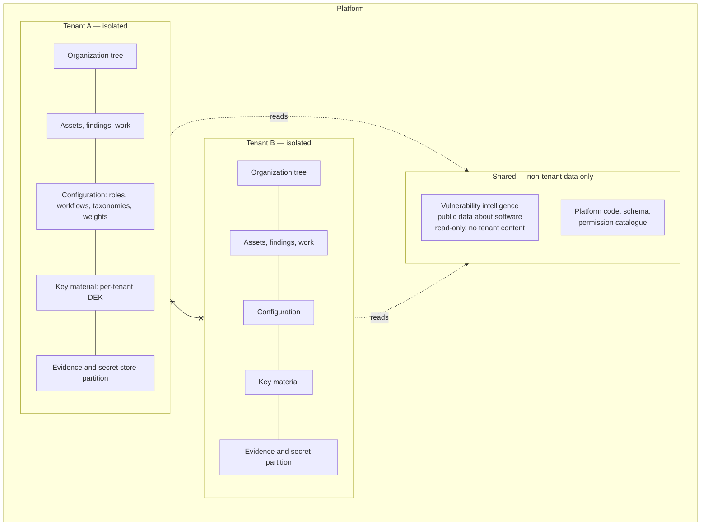
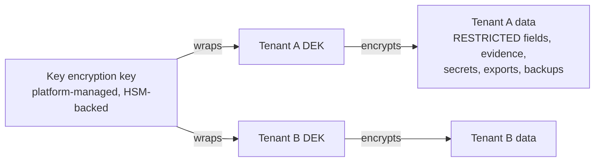
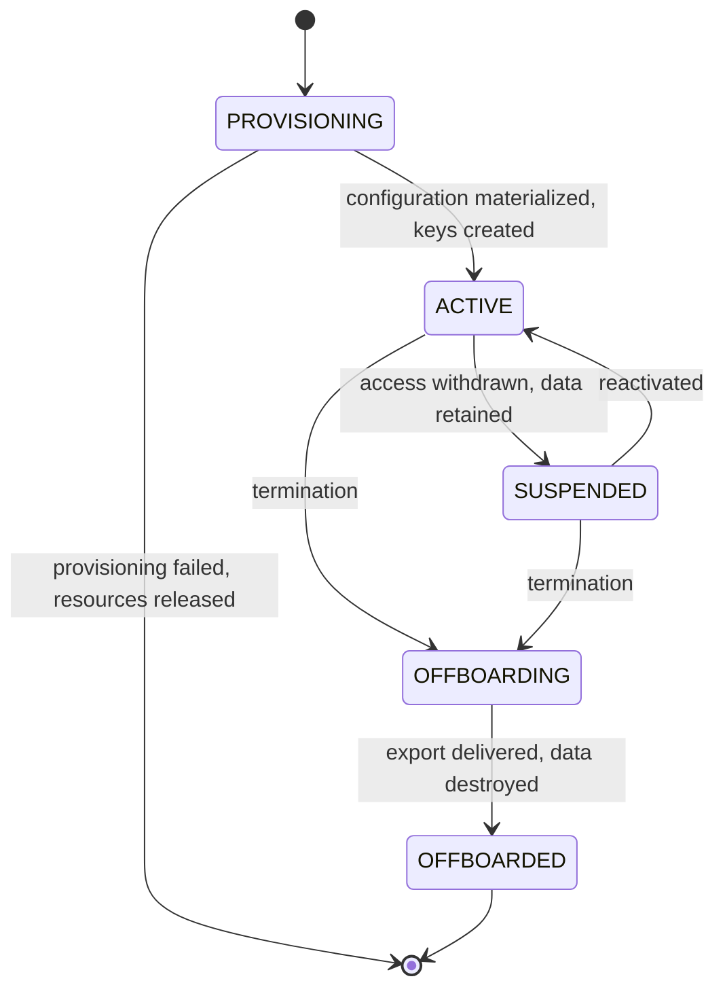

# 24 — Tenancy and Isolation Model

## Table of Contents

1. [Purpose and Scope](#1-purpose-and-scope)
2. [Prerequisites and Local Conventions](#2-prerequisites-and-local-conventions)
3. [The Failure This Document Prevents](#3-the-failure-this-document-prevents)
4. [The Tenant Boundary](#4-the-tenant-boundary)
5. [Enforcement Layers](#5-enforcement-layers)
6. [The Leakage Surface Inventory](#6-the-leakage-surface-inventory)
7. [Cryptographic Isolation and Key Management](#7-cryptographic-isolation-and-key-management)
8. [Data Residency](#8-data-residency)
9. [Cross-Tenant Operations](#9-cross-tenant-operations)
10. [Operator Access and Break-Glass](#10-operator-access-and-break-glass)
11. [Resource Governance](#11-resource-governance)
12. [Tenant Lifecycle](#12-tenant-lifecycle)
13. [Deployment Model Variants](#13-deployment-model-variants)
14. [Verification and Testing](#14-verification-and-testing)
15. [Requirements Summary](#15-requirements-summary)
16. [Extensibility Considerations](#16-extensibility-considerations)
17. [Security Considerations](#17-security-considerations)
18. [Open Questions, Decisions, Change History](#18-open-questions-decisions-change-history)

---

## 1. Purpose and Scope

### 1.1 Purpose

This document specifies how one tenant's data is kept from another's. It exists as a standalone document because seven others depend on it — DOC-02, DOC-04, DOC-05, DOC-06, DOC-07, DOC-14, DOC-15 — and because a tenancy model expressed as a subsection of an architecture document is a tenancy model nobody reviews as such.

### 1.2 In scope

- The tenant boundary: what it separates and what it deliberately does not.
- The enforcement layers and why more than one is required.
- **The enumerated inventory of surfaces where isolation actually fails** (§6). This is the document's most useful content: correct isolation of the primary data store is the easy part, and every production cross-tenant incident in comparable systems has occurred somewhere else.
- Per-tenant key material, rotation, and cryptographic erasure.
- Data residency, including the secondary paths where residency is genuinely breached.
- The prohibition on cross-tenant operations, and the single exception with its justification.
- Operator access, break-glass, resource governance, tenant lifecycle.
- How single-tenant and air-gapped deployments use the same model.

### 1.3 Out of scope

| Excluded | Owned by |
|---|---|
| Authorization within a tenant | DOC-07 |
| The domain meaning of `Tenant` | DOC-03 §7.1 |
| Physical schema and row-level security policy syntax | DOC-04 |
| Cryptographic primitive selection and key store implementation | DOC-06 |
| Infrastructure topology, network segmentation | DOC-15 |
| Threat analysis of the platform as a whole | DOC-26 |

### 1.4 Relationship to authorization

Tenancy and authorization are different controls at different altitudes and must not be conflated.

**Tenancy** answers *whose data is this*. It is binary, absolute, and admits no configuration: there is no legitimate reason for tenant A's request to return tenant B's row, and no permission that should grant it. It is enforced below the application.

**Authorization** answers *may this principal see this data within their tenant*. It is graduated, configurable, and evaluated in the application.

The distinction matters because the two failure modes differ in severity by orders of magnitude. An authorization defect discloses one business unit's findings to another business unit **of the same customer** — serious, contained, and recoverable through a policy correction. A tenancy defect discloses one customer's complete vulnerability inventory to a different company. It is not recoverable, it is disclosable, and for a platform of this content it ends the commercial relationship and probably the product.

This asymmetry justifies the difference in treatment: authorization is configurable and evaluated in code; tenancy is fixed and enforced beneath code.

---

## 2. Prerequisites and Local Conventions

| Document | Why |
|---|---|
| DOC-00 | Requirement ID scheme; the `SEC` class is used here |
| DOC-01 | `PRD-TEN-001` through `PRD-TEN-010`; PP-4; ADR-002 |
| DOC-03 | `Tenant` aggregate (§7.1), `INV-TEN-01` through `INV-TEN-04`, the shared-enrichment exception (`INV-VUL-17`) |

**LC-01.** This document issues `SEC-TEN-nnn` requirements specifying *how* isolation is enforced. It does not restate the `PRD-TEN-nnn` requirements from DOC-01, which specify *what* must be true (DOC-00 §6.4).

**LC-02.** "Tenant-scoped" means any entity whose existence is meaningful only within one tenant. The only non-tenant-scoped domain data in the platform is vulnerability intelligence (§9.2). Everything else is tenant-scoped, and the default for any new entity is tenant-scoped.

---

## 3. The Failure This Document Prevents

### 3.1 What a cross-tenant disclosure discloses

A single leaked row in this platform is not a row of ordinary business data. Depending on which table it comes from, it is:

- a prioritized list of a competitor's unremediated, exploitable vulnerabilities, with severity and exposure;
- the topology of their internet-facing estate, with owners;
- penetration test evidence containing working exploit payloads against their systems;
- live credentials to their pre-production environments;
- secrets recovered from their source code;
- the identity and workload of their security personnel.

**An attacker who obtains a tenant's finding data has obtained a validated, prioritized attack plan for that organization.** This is the reason ADR-002 mandates a hard boundary from v1 rather than logical separation with later hardening, and the reason this document specifies four enforcement layers rather than one.

### 3.2 Why one layer is insufficient

Application-layer tenant filtering depends on every query being written correctly, forever, by every engineer. There are hundreds of queries and the number grows. One omission is a breach.

The failure mode is also asymmetric in a way that defeats testing: a query missing its tenant predicate returns *more* data, not less. It passes functional tests, it passes review when the reviewer is focused on the feature, and it produces no error. It is detected only by a test that specifically asserts the absence of other tenants' data — which is why §14 requires exactly that and why the requirement is that such tests exist for *every access path*, not for the ones someone remembered.

### 3.3 Where it actually fails

Incidents of cross-tenant disclosure in comparable systems have overwhelmingly not occurred in the primary data access path, which receives the most attention. They have occurred in:

| Location | Mechanism |
|---|---|
| Cache | A cache key omitting the tenant, so tenant B receives tenant A's cached response |
| Background jobs | A job written with a whole-system mental model, iterating without a tenant filter |
| Search index | One index for all tenants, filtered at query time, where the filter is missed or the relevance scoring leaks counts |
| Aggregations | A total or average computed across tenants, disclosing the existence and volume of other tenants' data |
| Connection pooling | A session variable carrying tenant context, not reset when the connection returns to the pool |
| Error paths | An exception message or stack trace containing another tenant's identifier or data |
| Telemetry | Logs and traces exported to a shared observability system with tenant data in the payload |

§6 enumerates these and every other surface identified, with the required control for each. **That inventory, rather than the primary-path enforcement, is this document's substantive contribution.**

---

## 4. The Tenant Boundary

### 4.1 Definition

A **tenant** is one customer organization and is the outermost isolation boundary in the platform. Every tenant-scoped entity belongs to exactly one tenant for its entire lifetime.



*Figure 4.1 — The tenant boundary. The only shared domain data is vulnerability intelligence, which contains no tenant content (§9.2). No path exists between tenants.*

### 4.2 What is inside the boundary

Everything tenant-scoped, which is everything except §9.2. Specifically and non-obviously: **configuration is inside the boundary.** Roles, workflows, custom field schemas, severity taxonomies, criticality tiers, scoring weights, service level policies, and vocabulary are per-tenant with no shared mutable state (`PRD-TEN-004`).

This is worth stating because configuration sharing is the most tempting isolation compromise. A shared default workflow that tenants "customize" appears economical and creates a path by which one tenant's change affects another — and where the configuration is authorization-relevant, such as a workflow transition permission, that path is a privilege escalation across the tenant boundary.

**The correct pattern is copy-on-provision, not shared-with-override.** Default configuration is a template materialized into the tenant at provisioning. After provisioning there is no link back to the template, so a template change affects only future tenants.

### 4.3 What the boundary is not

| Not the boundary | Why it matters |
|---|---|
| Business unit | A business unit is an `OrgNode` inside one tenant. Confusing the two produces a design where authorization is mistaken for isolation |
| Deployment | One deployment may host many tenants; one tenant may span deployment regions for residency |
| Database instance | Isolation is logical and enforced; it is not achieved by instance separation, though single-tenant deployment may coincide with it |
| Encryption key scope alone | Per-tenant keys are one layer, not the boundary |

### 4.4 Requirements

| ID | Statement | Rationale | Pri | V |
|---|---|---|---|---|
| `SEC-TEN-001` | Every tenant-scoped record MUST carry an immutable tenant identifier assigned at creation, and no operation SHALL change it. | A mutable tenant identifier is a one-field cross-tenant transfer. There is no legitimate operation that moves a record between tenants; a tenant migration is an export and import, which is auditable and reviewable. | M | AT, CR |
| `SEC-TEN-002` | Tenant configuration MUST be materialized per tenant at provisioning from a template, with no runtime link to the template or to another tenant's configuration. | Shared-with-override configuration creates a path by which one tenant's change affects another, and for authorization-relevant configuration that path crosses the boundary. Copy-on-provision costs storage and removes the path entirely. | M | AT |
| `SEC-TEN-003` | The default for any newly introduced entity MUST be tenant-scoped. Non-tenant-scoped entities MUST be individually justified and recorded. | Defaults determine outcomes under time pressure. A default of tenant-scoped means an omission is safe; the inverse means an omission is a breach. | M | CR |

---

## 5. Enforcement Layers

### 5.1 Four layers, and what each catches

Defence in depth here is not ceremony: each layer catches a failure class the others cannot.

| Layer | Mechanism | Catches | Cannot catch |
|---|---|---|---|
| **1. Persistence** | Row-level security or equivalent, evaluated by the data store using a session-bound tenant context | A query written without a tenant predicate — the highest-frequency mistake | Data reaching the wrong tenant *after* correct retrieval (cache, notification, export) |
| **2. Application context** | A tenant context established at request entry, propagated through every call including asynchronous work, and required by data access | A background job or asynchronous continuation with no ambient request | A query that correctly carries context but constructs a key without it |
| **3. Cryptographic** | Per-tenant data encryption keys; ciphertext is unreadable without the tenant's key | Storage-layer compromise, backup exposure, and physical media disclosure | Application-layer leakage, since the application legitimately holds the key |
| **4. Detection** | Continuous assertion that no response, cache entry, index document, or export contains foreign tenant data | Residual defects in the other three | Nothing, but only if the assertions cover every path |

**Why layer 1 is load-bearing.** Persistence-layer enforcement inverts the default. Without it, correctness requires every query to *add* a predicate, and omission is a breach. With it, correctness is the default and a query must *deliberately* escape enforcement to be wrong — which is a visible, reviewable act rather than an absence.

**Why layer 1 alone is insufficient.** It governs the data store only. Once a row is legitimately retrieved, the store has no further say in where it goes: into a cache under a poorly constructed key, into a search index, into a notification, into an export, into an AI prompt. §6 exists because layer 1 does not reach any of those.

### 5.2 The tenant context

```
⟨TenantContext⟩                                 request-scoped, immutable
  ├─ tenant_id
  ├─ residency_region
  ├─ established_from      AUTHENTICATED_PRINCIPAL | SERVICE_CREDENTIAL
  │                        | SCHEDULED_JOB_BINDING | BREAK_GLASS_GRANT
  ├─ established_at
  └─ break_glass_ref?
```

| ID | Statement | Rationale | Pri | V |
|---|---|---|---|---|
| `SEC-TEN-004` | A tenant context MUST be established at request entry from an authenticated principal or a scope-pinned service credential, and MUST NOT be derivable from any request parameter, header, path segment, or body field. | A client-supplied tenant identifier is a cross-tenant access primitive requiring only that the client change one value. The context must come from the credential, which the client cannot forge. | M | AT, PT |
| `SEC-TEN-005` | Data access MUST fail closed where no tenant context is established. There MUST NOT be a permissive default, an "unscoped" mode, or an administrative bypass reachable from application code. | An unscoped mode exists to make development convenient and reaches production. Failing closed makes a missing context a visible malfunction rather than a silent full-table read. | M | AT, CR |
| `SEC-TEN-006` | Tenant context MUST propagate to asynchronous work — queued jobs, scheduled tasks, event handlers, and worker processes — and a work item without an explicit tenant binding MUST NOT execute. | Asynchronous work has no ambient request to inherit from, and it is written by engineers holding a whole-system mental model. This is where cross-tenant iteration actually happens. | M | AT |
| `SEC-TEN-007` | Where a persistence connection is pooled, tenant context MUST be reset on return to the pool, and a connection MUST NOT be reusable with a stale context. | A session variable carrying tenant context and surviving into the next borrower's request is a documented cross-tenant disclosure mechanism in row-level-security deployments. | M | AT, CR |
| `SEC-TEN-008` | Any code path capable of bypassing persistence-layer enforcement MUST be individually enumerated, individually justified, individually reviewed, and restricted to platform operations that cannot function otherwise. Each MUST emit an audit event. | Bypasses are needed — migrations, integrity verification, offboarding. Unenumerated bypasses accumulate and become the path of least resistance for ordinary features. Enumeration makes the set reviewable and its growth visible. | M | CR, AR |

---

## 6. The Leakage Surface Inventory

### 6.1 How to use this section

Each row is a surface where isolation has failed in comparable systems. The control column is a requirement, not a suggestion. **A new surface added to the platform must be added to this inventory, or it is not covered.**

### 6.2 Inventory

| # | Surface | Mechanism of failure | Required control |
|---|---|---|---|
| 1 | **Cache keys** | A key composed of a resource identifier without the tenant, so a second tenant requesting the "same" identifier receives the first tenant's value | Tenant identifier is a **mandatory structural prefix** of every cache key, enforced by a key constructor that cannot be bypassed. Raw cache client access is prohibited in application code |
| 2 | **Background jobs** | A job iterating a table with no tenant filter, or a job whose tenant binding is inferred rather than explicit | Explicit tenant binding required to enqueue (`SEC-TEN-006`). A job enumerating tenants must do so as a loop of per-tenant jobs, each with its own context, never as one cross-tenant query |
| 3 | **Search index** | One index for all tenants with the filter applied at query time; a missed filter, or relevance scoring and result counts computed pre-filter | Tenant is a mandatory index partition or a mandatory filter applied **before** scoring. Total-hit counts must be post-filter, because a pre-filter count discloses foreign volume |
| 4 | **Aggregations** | A total, average, percentile, or benchmark computed across tenants | Every aggregation carries a tenant predicate. Cross-tenant aggregation is prohibited (§9.1) |
| 5 | **Connection pooling** | Session-scoped tenant context surviving connection reuse | Reset on return (`SEC-TEN-007`) |
| 6 | **Error messages and traces** | An exception containing a foreign identifier, a constraint violation naming another tenant's row, a stack trace with data | Errors returned to clients are structured and carry no data (`PRD-API-004`). Internal traces are tenant-attributed and stripped of payload |
| 7 | **Telemetry and logs** | Logs and traces exported to a shared observability system with tenant data in the payload | Tenant identifier as a dimension; payload content excluded (`NFR-OPS-001`). Export path is residency-constrained (§8) |
| 8 | **Notification** | Content rendered once for a group and delivered to recipients across tenants; an address collision | Notification content is evaluated per recipient at delivery (`PRD-NTF-007`). Delivery batching never spans tenants |
| 9 | **Export** | An export whose scope filter is applied after retrieval; a shared temporary location | Scope and tenant applied at generation (`PRD-ING-014`). Export artifacts are stored in the tenant's partition with short-lived signed references |
| 10 | **AI prompt context** | Grounding retrieval assembling context across tenants; a shared prompt cache | No context spans tenants (`INV-AIC-09`). Prompt and response caches are tenant-keyed. Model provider request isolation per tenant |
| 11 | **File and evidence storage** | A shared bucket with tenant separation by path convention only, so a path traversal or a signed reference for the wrong object crosses tenants | Tenant partition enforced by storage-layer access policy, not by path convention. Signed references bound to tenant and object |
| 12 | **Secret store** | A shared vault namespace where a reference from one tenant resolves in another | Per-tenant vault namespace with access policy bound to tenant context |
| 13 | **Identifier enumeration** | Sequential or guessable identifiers permitting a tenant to probe for another's objects, where the response differentiates absence from prohibition | Non-sequential identifiers, and denials that do not disclose existence (`PRD-AUZ-014`). Identifier unpredictability is a mitigation, never the control |
| 14 | **Finding fingerprints** | A globally scoped fingerprint permitting inference: submit a finding, observe whether deduplication treats it as new, learn whether another tenant has the same vulnerability | Fingerprints are tenant-scoped in their hash inputs (`INV-VUL-01`) — in the inputs, not merely in the query filter |
| 15 | **Rate limit counters** | A shared counter keyed on a resource rather than on tenant plus resource, so one tenant's usage throttles another and reveals their activity | Counters keyed by tenant. Limits are per tenant (`PRD-TEN-006`) |
| 16 | **Idempotency keys** | A shared idempotency namespace where a key from one tenant returns another's recorded outcome | Idempotency keys are tenant-namespaced |
| 17 | **Schema migrations** | A migration executed with enforcement bypassed and a defect that mixes rows | Migrations are enumerated bypasses (`SEC-TEN-008`) with mandatory post-migration cross-tenant assertion |
| 18 | **Backups and restore** | A backup spanning tenants restored into the wrong tenant, or a partial restore mixing rows | Restore is tenant-scoped or whole-instance; no partial cross-tenant restore path exists. Per-tenant keys mean a misrouted restore yields unreadable ciphertext |
| 19 | **Support tooling** | Operator tools built with enforcement bypassed for convenience | Operator tooling uses break-glass (§10), never a standing bypass |
| 20 | **Shared reference data** | Reference data acquiring tenant-derived content over time — the enrichment exception (§9.2) degrading | Enrichment is read-only to tenants and contains no tenant content. Any write of tenant-derived data into it is a boundary breach (`SEC-TEN-012`) |

### 6.3 Requirements

| ID | Statement | Rationale | Pri | V |
|---|---|---|---|---|
| `SEC-TEN-009` | Every caching, indexing, queueing, counting, and idempotency namespace MUST be tenant-partitioned structurally, and key construction MUST be performed by a constructor that cannot omit the tenant. Direct client access to these subsystems MUST be prohibited in application code. | A key is constructed by hand in the moment and reviewed by someone reading the feature. A constructor that cannot omit the tenant removes the possibility rather than relying on attention. | M | AT, CR |
| `SEC-TEN-010` | Every leakage surface in §6.2 MUST have a corresponding adversarial test asserting the absence of foreign tenant data, and a new surface MUST NOT be introduced without adding both the inventory entry and the test. | This inventory is complete as of authoring and will be incomplete as the platform grows. The requirement is the mechanism that keeps it current. | M | AT |
| `SEC-TEN-011` | Search relevance scoring and result counts MUST be computed after tenant filtering. | A pre-filter count discloses the volume of foreign data, which is a disclosure even where no content is returned. | M | AT |

---

## 7. Cryptographic Isolation and Key Management

### 7.1 Model

Envelope encryption with per-tenant data encryption keys.



*Figure 7.1 — Envelope encryption. Destroying a tenant DEK renders that tenant's ciphertext permanently unreadable, which makes cryptographic erasure a demonstrable offboarding mechanism (§12.4).*

### 7.2 Requirements

| ID | Statement | Rationale | Pri | V |
|---|---|---|---|---|
| `SEC-TEN-012` | Every tenant MUST have distinct data encryption key material, and no tenant's key MUST be usable to decrypt another tenant's data. | Bounds a storage-layer or backup compromise to a single tenant, and is a routine enterprise procurement requirement. It also makes cryptographic erasure possible. | M | AT |
| `SEC-TEN-013` | Key access MUST be bound to the established tenant context, such that decryption with a foreign tenant's key is not reachable from a request operating in another tenant's context. | Per-tenant keys with unrestricted key access provide no isolation — the application would hold every key. | M | AT, CR |
| `SEC-TEN-014` | `RESTRICTED` data MUST be encrypted with tenant key material at rest: test credentials, secret values, evidence, personal workload data. | These are the categories whose disclosure is most severe (DOC-00 §15.3). Field-level encryption limits the blast radius of a storage compromise to what the application decrypts in the course of legitimate use. | M | AT |
| `SEC-TEN-015` | Key rotation MUST be supported without downtime and without re-encrypting all data synchronously, and prior key versions MUST remain available for decryption until re-encryption completes. | Rotation that requires downtime does not happen. Rotation that loses access to prior ciphertext is data loss. | M | AT |
| `SEC-TEN-016` | Backups MUST be encrypted with tenant key material such that restoring a tenant's backup into another tenant yields unreadable ciphertext rather than readable data. | Misrouted restore is a plausible operational error. Making its failure mode unreadable ciphertext rather than a silent cross-tenant load converts a breach into an incident. | M | AT |
| `SEC-TEN-017` | Key material MUST NOT be recoverable by platform operators without break-glass, and key destruction MUST be an audited, dual-controlled operation. | Standing operator access to key material defeats §7 entirely. Dual control on destruction is required because destruction is irreversible data loss and is also the mechanism an insider would use to destroy evidence. | M | AT, CR |

---

## 8. Data Residency

### 8.1 The problem is the secondary paths

Where a jurisdiction requires data localization, the requirement is absolute. The primary data store is designed for residency and generally satisfies it. **Residency is breached in the paths nobody designed for residency**, and every one of them must be enumerated.

| Path | Why it breaches residency |
|---|---|
| Backups | Replicated to a secondary region for durability, by default, in most managed storage services |
| Telemetry and logs | Exported to a centralized observability platform, which is typically single-region and not the tenant's |
| Error reporting | Third-party services, frequently with payload capture enabled |
| Notification delivery | Email and messaging providers route through their own infrastructure |
| AI provider egress | Model providers process wherever they operate, which the tenant did not choose |
| Search index | Frequently a separate service with its own region configuration |
| Export artifacts | Temporary storage in the platform's default region |
| Support tooling | Operators located elsewhere accessing data through tools that cache it |
| Content delivery | Cached responses at edge locations |

### 8.2 Requirements

| ID | Statement | Rationale | Pri | V |
|---|---|---|---|---|
| `SEC-TEN-018` | Each tenant MUST carry a residency designation, and every persistence, cache, index, queue, backup, telemetry, notification, export, and AI egress path MUST enforce it. Each path MUST be individually verified. | Enumerated verification is the only method that works: a residency claim covering only the primary store is false, and its falseness is discovered by an auditor rather than by the team. | M | AT, DI |
| `SEC-TEN-019` | Where a path cannot satisfy a tenant's residency designation, the capability using it MUST be disabled for that tenant with an explicit, visible statement of what is unavailable and why. | Silently routing data outside its designated region is a compliance breach. Silently disabling a capability is a support incident. Explicit unavailability is the only honest option (PP-9). | M | AT |
| `SEC-TEN-020` | Residency designation MUST be settable at provisioning and changeable only through an explicit, audited migration that verifies completion across every path. | An unverified residency change leaves data in the prior region while the platform reports compliance. | M | AT |
| `SEC-TEN-021` | AI provider egress MUST be constrained by the tenant's residency designation, and a provider unable to satisfy it MUST NOT be selectable for that tenant. | Model provider egress is the newest and least-governed residency path, and the one a tenant's data governance function will ask about first. | M | AT |

⚠ **Working assumption (OQ-011).** Vietnam is the v1 primary market with EU and US architected but not activated. The mechanism above is region-agnostic; activating a region is configuration plus per-path verification.

---

## 9. Cross-Tenant Operations

### 9.1 The prohibition

| ID | Statement | Rationale | Pri | V |
|---|---|---|---|---|
| `SEC-TEN-022` | No operation MUST span tenants. This includes queries, aggregations, search, background jobs, event handlers, exports, AI context assembly, and reporting. | Every cross-tenant operation is a boundary crossing that must then be individually secured, and the set grows until the boundary is notional. A blanket prohibition with one enumerated exception is enforceable; a set of individually justified crossings is not. | M | AT, PT |
| `SEC-TEN-023` | Cross-tenant aggregation for benchmarking MUST require explicit per-tenant opt-in, MUST be irreversibly anonymised before aggregation, and MUST NOT be enabled by default or by contract term alone. | Benchmarking is commercially attractive and is the most likely future pressure on this boundary. Requiring affirmative opt-in and irreversible anonymisation means the capability, if built, cannot become a disclosure. | M | AT |

### 9.2 The single exception, and why it is safe

**Vulnerability intelligence** (`INV-VUL-17`) is shared across tenants. This is the only shared domain data in the platform.

It is safe because of a property, not a control: **it contains no tenant data.** It is public information about software — vulnerability identifiers, weakness classifications, severity vectors, exploit prediction, known-exploited status, affected version ranges. Sharing it avoids storing an identical dataset once per tenant, which at the volumes involved is a material cost.

The boundary is strict and stated as a requirement because its erosion would be gradual and plausible:

| ID | Statement | Rationale | Pri | V |
|---|---|---|---|---|
| `SEC-TEN-024` | Shared vulnerability intelligence MUST be read-only to tenants and MUST NOT contain, or be augmented with, any tenant-derived data — including prevalence counts, tenant-specific exploitability assertions, or usage statistics. | The exception is justified solely by the absence of tenant content. Adding prevalence — "this component appears in 340 estates" — would make the shared dataset a cross-tenant inference surface, and it would be added because it looks useful and harmless. | M | AT, CR |
| `SEC-TEN-025` | The association between a tenant's finding and an intelligence record MUST be stored in the tenant's partition, never in the shared dataset. | Storing the association centrally would make the shared dataset a map of which tenant has which vulnerability, which is the disclosure the boundary exists to prevent. | M | AT |

**A note on exploitability statements.** Tenant-authored exploitability assertions (`PRD-VUL-009`) are tenant data and live in the tenant's partition. Supplier-published assertions accompanying a component are public data and may be shared. The distinction is authorship, and it must be recorded per assertion.

---

## 10. Operator Access and Break-Glass

### 10.1 No standing access

| ID | Statement | Rationale | Pri | V |
|---|---|---|---|---|
| `SEC-TEN-026` | Platform operators MUST NOT have standing access to tenant business data. Operational duties — monitoring, capacity, deployment, incident response on platform components — MUST be performable from metadata and telemetry that contain no tenant content. | Standing operator access is the most common finding in software-as-a-service security assessment and a frequent procurement blocker. For a platform holding a customer's complete attack surface it is disqualifying. Designing operations to work without tenant data is the harder path and the only defensible one. | M | AT, AR |

### 10.2 Break-glass

```
BreakGlassGrant                                 aggregate root
  ├─ id, tenant_id, principal_id
  ├─ justification                               free text, mandatory, non-empty
  ├─ ticket_reference                             external incident or request reference
  ├─ scope_limit             ⟨BreakGlassScope⟩    which data classes are reachable
  ├─ approver_id                                  second person, mandatory
  ├─ valid_from, valid_until                      bounded by configured maximum
  ├─ tenant_notified_at
  ├─ state                   REQUESTED | ACTIVE | EXPIRED | REVOKED
  └─ activity_log_ref                             elevated-granularity audit reference
```

| ID | Statement | Rationale | Pri | V |
|---|---|---|---|---|
| `SEC-TEN-027` | Break-glass access MUST require a second-person approval, a non-empty justification, and an external reference. | Self-service emergency access is standing access with extra steps. Dual control is what makes it exceptional. | M | AT |
| `SEC-TEN-028` | Break-glass MUST be time-bounded with automatic expiry, and MUST NOT be extendable without a new approval. | Extendable grants become permanent. Requiring re-approval makes duration a decision rather than a default. | M | AT |
| `SEC-TEN-029` | The tenant MUST be notified of break-glass activation, and notification MUST NOT be suppressible by the operator invoking it. | Notification is what makes the access accountable rather than merely logged, and it is a frequent procurement requirement. Operator-suppressible notification is not notification. | M | AT |
| `SEC-TEN-030` | Every action under break-glass MUST be recorded at object granularity, including reads, and the record MUST be visible to the tenant. | Under break-glass the read is the sensitive event. Tenant visibility of the activity record is what allows the customer to verify the access was what was declared. | M | AT |
| `SEC-TEN-031` | Break-glass MUST NOT grant access to secret values, test credentials, or evidence content unless those classes are explicitly named in the grant and separately approved. | Debugging a platform defect does not require reading a customer's leaked credentials. Default-excluding the most sensitive classes means the common case is safe. | M | AT |

**On `SEC-TEN-031`.** This is the requirement most likely to be relaxed for operational convenience. The reasoning against: an operator who can read every tenant's secret findings under a routine break-glass grant is a single-person compromise of every customer's credentials, and no support scenario justifies that as a default.

---

## 11. Resource Governance

| ID | Statement | Rationale | Pri | V |
|---|---|---|---|---|
| `SEC-TEN-032` | Per-tenant limits MUST be enforced on request rate, concurrent operations, background job concurrency, storage, ingestion volume, export size, and AI consumption. | Without limits, one tenant's large import or portfolio-wide operation degrades every other tenant, and the degradation is attributed to the platform. Limits are also a denial-of-service control, since a tenant is an authenticated actor with legitimate access to expensive operations. | M | AT |
| `SEC-TEN-033` | Limit exhaustion MUST degrade the exhausting tenant only, MUST be communicated to that tenant, and MUST NOT be silent. | Silent throttling presents as unexplained slowness and generates support load. Communicated limits let a well-behaved tenant adjust. | M | AT |
| `SEC-TEN-034` | Resource consumption metrics MUST be attributed per tenant. | Attribution is the prerequisite for diagnosing a noisy-neighbour incident. Without it, the first diagnostic question in a multi-tenant service has no answer. | M | AT |
| `SEC-TEN-035` | Expensive operations — portfolio-wide match sweeps, large imports, large exports, bulk operations — MUST execute in a work class that cannot starve interactive work, per tenant and across tenants. | An interactive request queued behind a portfolio sweep is a feature nobody uses (`PRD-SBM-004`), and one tenant's sweep must not queue another tenant's interactive work. | M | AT |

---

## 12. Tenant Lifecycle

### 12.1 States



*Figure 12.1 — Tenant lifecycle. Suspension retains data and withdraws access; offboarding destroys data. Conflating them means a commercial dispute destroys a customer's records.*

### 12.2 Provisioning

| ID | Statement | Rationale | Pri | V |
|---|---|---|---|---|
| `SEC-TEN-036` | Provisioning MUST create tenant key material, materialize default configuration from templates, and establish the tenant's storage, cache, index, and secret partitions before the tenant becomes `ACTIVE`. | A tenant reachable before its partitions exist will have data written to a default location, which is a cross-tenant path created at the moment of onboarding. | M | AT |
| `SEC-TEN-037` | Provisioning MUST be idempotent and MUST release all resources on failure. | Partial provisioning leaves orphaned partitions and key material, which accumulate as unattributed data. | M | AT |

### 12.3 Suspension

| ID | Statement | Rationale | Pri | V |
|---|---|---|---|---|
| `SEC-TEN-038` | Suspension MUST withdraw all principal access and halt all scheduled work for the tenant while retaining data and configuration intact. | A commercial dispute is not a termination (`PRD-TEN-007`). Data destruction on suspension is a contractual and legal exposure. | M | AT |
| `SEC-TEN-039` | Suspension MUST NOT suppress the tenant's ability to request an export. | Withholding a customer's own data as commercial leverage is indefensible and, in most enterprise agreements, a breach. | M | AT |

### 12.4 Offboarding

| ID | Statement | Rationale | Pri | V |
|---|---|---|---|---|
| `SEC-TEN-040` | Offboarding MUST deliver a complete tenant data export in documented formats before destruction, and destruction MUST NOT proceed until export delivery is confirmed or the tenant explicitly waives it. | Export is a contractual requirement and a purchase condition for buyers assessing exit cost. Destruction before confirmed delivery is irrecoverable. | M | AT |
| `SEC-TEN-041` | Destruction MUST be verifiable, MUST include cryptographic erasure through destruction of tenant key material, and MUST cover primary storage, backups, caches, indices, exports, telemetry retention, and secret partitions. | An unverifiable deletion claim fails audit. Key destruction makes the claim demonstrable rather than asserted, and enumeration of locations is required because deletion of the primary store alone is incomplete. | M | AT, DI |
| `SEC-TEN-042` | Data under legal hold MUST NOT be destroyed by offboarding, and hold status MUST be enforced rather than advisory. | Conflicting obligations exist. An advisory hold is satisfied by the operation that violates it. | M | AT |
| `SEC-TEN-043` | The tenant identifier MUST NOT be reused after offboarding. | Reuse would cause any surviving reference — in a backup, an export, an audit record — to resolve to the wrong organization. | M | AT |

---

## 13. Deployment Model Variants

### 13.1 One model, three deployments

| Model | Tenants | Isolation | Operator access |
|---|---|---|---|
| Multi-tenant | Many | All four layers active | Break-glass only |
| Single-tenant hosted | One | All four layers active | Break-glass only |
| On-premises / air-gapped | One | All four layers active | Customer-operated; no platform operator |

| ID | Statement | Rationale | Pri | V |
|---|---|---|---|---|
| `SEC-TEN-044` | Single-tenant and air-gapped deployments MUST use the same tenancy model and the same enforcement code paths, configured with one tenant. There MUST NOT be a distinct code path for single-tenant operation. | Divergent code paths per deployment model produce defects appearing in one model only, found by the customer. A single model tested once is cheaper and more reliable. It also means an air-gapped customer who later adds a second business entity is already supported. | M | AR, AT |
| `SEC-TEN-045` | In air-gapped deployment, capabilities requiring egress MUST be individually disableable and MUST degrade explicitly with the consequence stated. | `CON-DEP-001`. An air-gapped instance silently matching against six-month-old intelligence is PP-1 violated in its most consequential form. | M | AT |

**A consequence worth stating.** Because single-tenant deployments run the multi-tenant model, they carry its overhead — per-tenant key indirection, context propagation, partitioned namespaces — for a boundary with nothing on the other side. That cost is accepted deliberately (`SEC-TEN-044`) and is small relative to maintaining two enforcement implementations.

---

## 14. Verification and Testing

### 14.1 Adversarial testing is the primary control

Isolation cannot be verified by testing that the right data is returned; it requires testing that the wrong data is not. These are different tests, and only the second catches the failures of §3.2.

| ID | Statement | Rationale | Pri | V |
|---|---|---|---|---|
| `SEC-TEN-046` | The test suite MUST include, for every access path, a two-tenant scenario asserting that a principal of tenant A cannot obtain, infer, or affect any data of tenant B. Paths MUST include: API read and write, search, aggregation, export, notification, background job, event handler, cache, AI context, file retrieval, secret resolution, and error responses. | The enumeration is the requirement. A general instruction to "test isolation" produces tests for the paths someone thought of, and the incidents occur in the paths nobody thought of. | M | AT |
| `SEC-TEN-047` | Continuous verification MUST assert that no response, cache entry, index document, export artifact, or notification contains a foreign tenant identifier, and MUST alert on violation. | Layer 4 (§5.1). Residual defects are caught by assertion in production, not by inspection. | M | AT |
| `SEC-TEN-048` | Every enumerated enforcement bypass (`SEC-TEN-008`) MUST have a test asserting that it emits an audit event and that it is unreachable from ordinary application paths. | A bypass without a test asserting its unreachability becomes reachable through refactoring. | M | AT |
| `SEC-TEN-049` | Schema migrations MUST include a post-migration cross-tenant assertion before the migration is considered complete. | Migrations run with enforcement bypassed and are the highest-risk operation in the platform. | M | AT |
| `SEC-TEN-050` | Tenant isolation MUST be explicitly in scope for penetration testing of the platform, with cross-tenant access as a stated objective. | Internal testing verifies the paths the team modelled. External testing finds the paths they did not. | M | PT |

---

## 15. Requirements Summary

Fifty requirements, all `SEC-TEN`, all `MUST_HAVE`. The absence of `SHOULD_HAVE` requirements in this document is deliberate: a partially enforced isolation boundary is not a boundary, and there is no requirement here whose omission leaves the model intact.

| Group | IDs | Count |
|---|---|---|
| Tenant boundary | `SEC-TEN-001` – `003` | 3 |
| Enforcement layers | `SEC-TEN-004` – `008` | 5 |
| Leakage surfaces | `SEC-TEN-009` – `011` | 3 |
| Cryptographic isolation | `SEC-TEN-012` – `017` | 6 |
| Residency | `SEC-TEN-018` – `021` | 4 |
| Cross-tenant prohibition | `SEC-TEN-022` – `025` | 4 |
| Operator access | `SEC-TEN-026` – `031` | 6 |
| Resource governance | `SEC-TEN-032` – `035` | 4 |
| Lifecycle | `SEC-TEN-036` – `043` | 8 |
| Deployment variants | `SEC-TEN-044` – `045` | 2 |
| Verification | `SEC-TEN-046` – `050` | 5 |

Satisfies `PRD-TEN-001` through `PRD-TEN-010`, `CFG-TEN-001`, `CON-DAT-002`, `CON-DEP-001`, and the model invariants `INV-TEN-01` through `INV-TEN-04`.

---

## 16. Extensibility Considerations

**Anticipated extensions.** Additional residency regions are configuration plus per-path verification (`SEC-TEN-018`). Additional isolation dimensions — legal entity, environment, regulatory regime — extend the boundary descriptor rather than introducing a second mechanism. Additional key management backends are a plugin behind the key access contract of `SEC-TEN-013`.

**Reserved.** Cross-tenant aggregation for benchmarking (DF-07) is reserved in the data model, disabled, and gated on opt-in (`SEC-TEN-023`). Bring-your-own-key is anticipated and accommodated by the envelope structure of §7.1 without model change: a tenant-supplied key encryption key replaces the platform's for that tenant.

**Deliberate rigidity.** No cross-tenant operations (`SEC-TEN-022`); shared intelligence contains no tenant data (`SEC-TEN-024`); no standing operator access (`SEC-TEN-026`); one code path across deployment models (`SEC-TEN-044`). Each will be pressured — benchmarking, prevalence data, support convenience, single-tenant simplification — and each concession would be individually reasonable and collectively fatal to the boundary that makes the platform sellable.

**Known extension cost.** Adding a new subsystem — a new cache tier, a new index, a new queue — requires adding it to the §6.2 inventory, implementing tenant-partitioned key construction, and adding the adversarial test of `SEC-TEN-046`. This is deliberate friction: the alternative is a subsystem that is isolated by whoever happened to think about it.

---

## 17. Security Considerations

This document *is* a security document, so this section records what it does **not** cover rather than restating it.

| Not covered here | Where |
|---|---|
| Authorization within a tenant | DOC-07 |
| Cryptographic primitive and key store selection | DOC-06 |
| Network segmentation, infrastructure hardening | DOC-15 |
| Threat model, including insider scenarios | DOC-26 |
| Audit integrity and erasure reconciliation | DOC-14 |

**The residual risks, stated plainly.**

*The shared intelligence dataset* (§9.2) is the only shared surface, and its safety rests on a property rather than a control. Property-based safety is fragile because a well-meaning future change — adding prevalence counts, caching tenant-specific match outcomes — breaks it without breaking any test. `SEC-TEN-024` states the prohibition; DOC-26 carries the threat.

*Break-glass* (§10.2) is a deliberately introduced privileged path. Its controls — dual approval, bounds, tenant notification, object-granularity audit, exclusion of the most sensitive classes — are the only things distinguishing it from a backdoor. Weakening any of them for operational convenience makes it one.

*Layer 4 detection* (§5.1) depends on assertion coverage, and coverage depends on the §6.2 inventory being current. The inventory is complete as of authoring and will decay. `SEC-TEN-010` is the mechanism against decay and is itself a process control rather than a technical one, which makes it the weakest link in the model.

---

## 18. Open Questions, Decisions, Change History

### 18.1 Open questions

| ID | Bearing | Status |
|---|---|---|
| OQ-011 | Determines which residency regions are activated in v1. The mechanism is region-agnostic; activation is configuration and per-path verification | Assumption ratified: Vietnam-first |
| OQ-015 | Determines per-tenant limit values (§11) and partition sizing. Structure unaffected | Open; required before DOC-04 |

### 18.2 Decisions referenced

ADR-002 (hard tenant boundary from v1), ADR-003 (modular monolith — isolation is in-process, which makes context propagation cheaper and boundary erosion easier), ADR-024 (no source code — removes an entire class of tenant data from the platform), ADR-027 (configurability — which makes configuration tenant-scoped and therefore part of the boundary).

### 18.3 Notes for downstream documents

| Document | Note |
|---|---|
| DOC-04 | Owes row-level security policy per table, the tenant column as a mandatory index prefix, per-tenant partition strategy, and the enumerated bypass list of `SEC-TEN-008` |
| DOC-05 | Tenant context is never a request parameter (`SEC-TEN-004`). Every operation inherits it from the credential |
| DOC-06 | Owes cryptographic primitives, key store selection, and the OQ-026 vault decision |
| DOC-07 | Authorization operates strictly within an established tenant context and never establishes one |
| DOC-14 | Break-glass activity requires elevated-granularity audit visible to the tenant (`SEC-TEN-030`) |
| DOC-15 | Owes per-path residency verification, backup routing, telemetry egress constraint, and connection pool configuration |
| DOC-16 | Owes the two-tenant adversarial suite across all thirteen paths of `SEC-TEN-046` |
| DOC-26 | Owes threat analysis of the shared intelligence surface and of break-glass as a deliberate privileged path |

### 18.4 Change History

| Version | Date | Author | Change | Reviewer |
|---|---|---|---|---|
| 1.0.0 | 2026-08-04 | Principal Security Architect; Chief Software Architect | Initial content-complete version. Establishes the tenant boundary and its distinction from authorization with the severity asymmetry that justifies different treatment; four enforcement layers with what each catches and cannot catch; a twenty-entry inventory of leakage surfaces with required controls, presented as the document's substantive contribution on the grounds that primary-path enforcement is the easy part; envelope encryption with per-tenant keys enabling cryptographic erasure; residency enforcement across nine secondary paths; the cross-tenant prohibition with one enumerated exception and the requirement preventing its erosion; break-glass with dual control, tenant notification, and default exclusion of the most sensitive data classes; resource governance; tenant lifecycle distinguishing suspension from offboarding; one code path across deployment models; and adversarial verification requirements enumerating thirteen access paths. Fifty requirements, all MUST_HAVE, with the absence of SHOULD_HAVE justified. | Pending |
