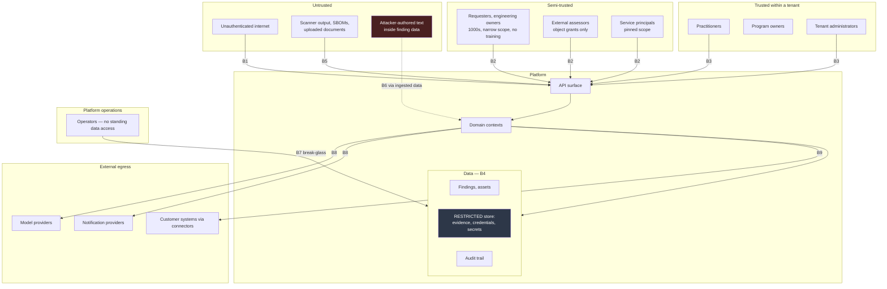

# 26 — Platform Threat Model

## Table of Contents

1. [Purpose and Scope](#1-purpose-and-scope)
2. [Prerequisites and Local Conventions](#2-prerequisites-and-local-conventions)
3. [Crown Jewels](#3-crown-jewels)
4. [Trust Boundaries](#4-trust-boundaries)
5. [Threat Actors](#5-threat-actors)
6. [STRIDE by Trust Boundary](#6-stride-by-trust-boundary)
7. [Ranked Threat Scenarios](#7-ranked-threat-scenarios)
8. [Abuse Cases](#8-abuse-cases)
9. [Deliberate Privileged Paths](#9-deliberate-privileged-paths)
10. [Detection Requirements](#10-detection-requirements)
11. [Accepted Residual Risks](#11-accepted-residual-risks)
12. [Requirements Summary](#12-requirements-summary)
13. [Extensibility, Review, Closing](#13-extensibility-review-closing)

---

## 1. Purpose and Scope

### 1.1 Purpose

This document threat-models the platform itself. It exists as a standalone document because a threat model embedded in a security-requirements document is never reviewed *as a threat model* — reviewers read it as a control list and lose the adversarial framing that gives it value.

### 1.2 In scope

The platform's asset value and why it exceeds that of most systems it protects; trust boundaries; threat actors including insiders and non-human principals; STRIDE analysis per boundary; ranked scenarios worked through end to end; abuse cases; the deliberately introduced privileged paths and the reasoning that makes them defensible; detection requirements; and accepted residual risks.

### 1.3 Out of scope

| Excluded | Owned by |
|---|---|
| Security control specifications | DOC-06 |
| Tenant isolation mechanics | DOC-24 |
| Authorization model | DOC-07 |
| Threat modelling of *customer* applications | The product's own assessment capability |
| Infrastructure and network threat analysis | DOC-15 |

**A distinction worth stating.** This document models threats to the platform. The platform's *function* is to help customers model threats to their applications. Conflating the two is a recurring source of confusion in review: nothing here concerns customer application security except insofar as the platform holds the record of it.

---

## 2. Prerequisites and Local Conventions

| Document | Why |
|---|---|
| DOC-01 | §17.1 identifies five highest-risk surfaces; this document analyses them and adds others |
| DOC-03 | Aggregate boundaries, invariants, and the two model-level risks at §20.2 |
| DOC-07 | The authorization model whose failure modes dominate §7 |
| DOC-24 | Tenant isolation and its twenty-entry leakage inventory |
| DOC-28 | The scoring model whose manipulation is a threat class |

**LC-01.** This document issues `RISK-PLT-nnn` for accepted residual risks and `SEC-PLT-nnn` for detection and threat-model-governance requirements. Controls are owned by DOC-06, DOC-07, and DOC-24 and are referenced, not restated.

**LC-02 — Ratings.** Likelihood and impact are `LOW` / `MEDIUM` / `HIGH` / `CRITICAL`, assessed for a mature deployment with the specified controls in place. A rating is the *residual* assessment, not the inherent one.

---

## 3. Crown Jewels

### 3.1 The central observation

**This platform is a higher-value target than the majority of systems it protects.**

An attacker targeting a customer's payment service must find a vulnerability, determine its exploitability, and establish what it reaches. An attacker who obtains that customer's data *from this platform* receives a prioritized, validated inventory of the weaknesses across their entire estate, with owners, exposure, and in many cases working proof of exploitation.

The platform converts an attacker's reconnaissance problem into a retrieval problem.

### 3.2 Asset inventory

| Asset | Why it is valuable to an attacker | Classification |
|---|---|---|
| Findings with severity, exposure, and asset linkage | A prioritized attack plan for the customer's estate, pre-validated | `CONFIDENTIAL` |
| Assessment evidence | Working exploit payloads, web shells, malware samples, captured sessions — functional attack tooling against named systems | `RESTRICTED` |
| Test account credentials | Live access to pre-production environments frequently sharing data or trust with production | `RESTRICTED` |
| Secret findings | Credentials recovered from the customer's own source code, some still valid | `RESTRICTED` |
| Connector credentials | Access to the customer's source control, scanners, tracker, and identity provider — **their engineering estate, independent of anything else here** | `RESTRICTED` |
| Asset graph | The topology of the customer's internet-facing estate with ownership | `CONFIDENTIAL` |
| Risk scores and posture | Where the customer is weakest, and where they know they are weak | `CONFIDENTIAL` |
| Exception register | Known-unremediated weaknesses with expiry dates — a list of what will remain exploitable and until when | `CONFIDENTIAL` |
| Security personnel workload | Who is overloaded, when coverage is thin | `RESTRICTED` |
| Organization structure | Reporting lines and accountability, useful for social engineering | `INTERNAL` |
| Audit trail | Which vulnerabilities were examined and by whom, revealing investigative focus | `CONFIDENTIAL` |

### 3.3 The two that exceed the rest

**Connector credentials.** These are not data *about* the customer; they are access *to* the customer. A compromise of the connector credential store is a compromise of the customer's engineering estate whether or not any finding data is read. This asset is frequently underweighted because it is infrastructure rather than content.

**The exception register.** A list of weaknesses the customer has decided not to fix, with dates until which they will remain unfixed. As targeting information it is more efficient than the finding list, because every entry is confirmed unremediated by the customer's own decision.

### 3.4 Consequence for the model

Three consequences follow, and they justify decisions that would otherwise look disproportionate:

- **`CON-SEC-001`** — ASVS Level 2 baseline with Level 3 uplift is proportionate to this asset value, not conservative.
- **`SEC-TEN-026`** — no standing operator access. For most systems this is good practice; here it is disqualifying to omit.
- **`ADR-024`** — no source code access. Declining a capability to avoid holding an asset class is the correct trade when the asset is this valuable.

---

## 4. Trust Boundaries

*Figure 4.1 — Trust boundaries. B6 is the boundary most often omitted from threat models of this product class: attacker-authored text arriving inside legitimate finding data, requiring no platform access.*

| ID | Boundary | Crossing |
|---|---|---|
| B1 | Unauthenticated → API | Authentication |
| B2 | Semi-trusted principal → API | Authentication plus narrow authorization |
| B3 | Trusted principal → API | Authentication plus broad authorization |
| B4 | Application → `RESTRICTED` store | Additional permission plus audited reveal |
| B5 | Untrusted document → parser | Validation, sandboxing, limits |
| B6 | **Attacker-authored content → model context** | Structural segregation, output validation |
| B7 | Operator → tenant data | Break-glass: dual approval, bounds, notification |
| B8 | Platform → third-party service | Data category governance, residency, redaction |
| B9 | Platform → customer system | Egress allowlist, least-privilege credential |

**On B6.** It is a trust boundary crossed by *data*, not by a principal, which is why it is missed. A payload captured by a proxy scanner and recorded as finding evidence is attacker-authored text. When that finding is summarized by a model, the attacker has reached the platform's inference path having never authenticated to it.

**On B9.** Connectors are an *outbound* boundary that is also an inbound risk: a compromised platform reaches the customer's engineering estate through them (§3.3).

---

## 5. Threat Actors

| ID | Actor | Capability | Motivation | Likelihood |
|---|---|---|---|---|
| A1 | External unauthenticated | Network reach, public interface knowledge | Access the crown jewels | HIGH — constant background |
| A2 | External authenticated as a legitimate tenant | Full API access within their own tenant | Reach another tenant's data — competitor intelligence | MEDIUM |
| A3 | **Requester or engineering owner** | Narrow authorized scope, large population, no training | Curiosity, or reach data outside their business unit | **HIGH** — largest population, most access attempts |
| A4 | Malicious or compromised tenant administrator | Can grant themselves any permission within the tenant | Exfiltration, concealment | LOW likelihood, HIGH impact |
| A5 | Insider practitioner | Broad legitimate read across the tenant including `RESTRICTED` | Exfiltration before departure; concealing an omission | MEDIUM |
| A6 | Platform operator | Infrastructure access; break-glass path | Exfiltration across tenants | LOW likelihood, CRITICAL impact |
| A7 | Compromised service principal | Whatever the credential is scoped to | Depends on scope — the reason pinning matters | MEDIUM |
| A8 | External assessor | Object grants only, but legitimately holds evidence and credentials for their engagement | Retain access beyond engagement; reach adjacent objects | MEDIUM |
| A9 | **Attacker via ingested content** | No platform access whatsoever. Controls only the text of a finding | Suppress a finding from reporting; misdirect prioritization | **MEDIUM, and frequently unmodelled** |
| A10 | Supply chain attacker | Compromise of a platform dependency or build pipeline | Any of the above, at scale across tenants | LOW likelihood, CRITICAL impact |
| A11 | Business owner under measurement pressure | Legitimate access plus configuration or classification authority | Improve their unit's score without remediating | **HIGH** — rational response to measurement |

**On A3 being the highest-likelihood actor.** Not because requesters are malicious but because there are thousands of them, they receive no training, they hold narrow scope in a product full of adjacent data, and they interact with the platform's least-hardened surface (PP-7). Most of their attempts will be accidental — an altered identifier, a shared link, a curiosity click — and an accidental crossing discloses exactly as much as a deliberate one.

**On A11.** Score gaming is a threat actor class, not a data-quality concern. The actor is rational, authorized, and responding to an incentive the platform created (DOC-28 §13.1).

---

## 6. STRIDE by Trust Boundary

| Boundary | Spoofing | Tampering | Repudiation | Information disclosure | Denial of service | Elevation |
|---|---|---|---|---|---|---|
| **B1** unauth → API | Credential stuffing against a high-value target | — | — | Enumeration through differentiated errors | Unauthenticated endpoint exhaustion | Authentication bypass |
| **B2** semi-trusted → API | Session theft; credential sharing | Altering another scope's object | Action attributed to a shared credential | **Object identifier substitution — the dominant risk** | Expensive-operation abuse | Scope widening through inference |
| **B3** trusted → API | — | Configuration tampering | Deleting the record of an action | Bulk extraction under legitimate permission | Portfolio-wide operation abuse | Self-granting permission |
| **B4** app → `RESTRICTED` | — | Altering evidence | Unlogged reveal | Credential or evidence disclosure | — | Reveal without the specific permission |
| **B5** document → parser | — | Malformed content corrupting records | — | External reference resolution reading local resources | Parser resource exhaustion | Code execution through deserialization |
| **B6** content → model | Content impersonating instructions | **Influencing suggestions through injected text** | — | Broad grounding retrieval, narrow presentation | Cost exhaustion | Suggestion promoted into the record |
| **B7** operator → data | Impersonating a break-glass grant | Altering data under break-glass | Suppressing the activity record | Cross-tenant disclosure | — | Standing access acquired through tooling |
| **B8** platform → third party | — | — | — | **Residency breach; data egress to a provider** | Provider outage degrading the platform | — |
| **B9** platform → customer | Platform credential used beyond its purpose | Writing to a customer system | — | Finding detail in an outbound payload | Exhausting the customer's API quota | Over-scoped connector credential |

**The two cells that dominate.** B2 information disclosure through identifier substitution is the highest-likelihood serious threat in the entire model, because it combines the largest actor population (A3) with the platform's most complex control (scope resolution). B7 information disclosure is the highest-impact, because it is cross-tenant.

---

## 7. Ranked Threat Scenarios

Ranked by likelihood × impact with the specified controls in place. Each is worked through so that the control chain can be assessed rather than merely listed.

### T1 — Cross-business-unit disclosure through identifier substitution

**Actor** A3 · **Boundary** B2 · **Likelihood** HIGH · **Impact** MEDIUM · **Residual** MEDIUM

A requester in business unit A submits an assessment request. The project selector shows only their own projects. They alter the project identifier in the request payload to a value belonging to business unit B. If the server does not independently re-validate, the request is created against B's project — and the response, and every subsequent view of that request, carries B's asset context, prior findings, and technical profile.

**Chain.** `SEC-AUZ-017` re-validation independent of identifier provenance · `SEC-AUZ-018` filtered picker is not a control · `SEC-AUZ-020` denials do not differentiate existence · `SEC-AUZ-019` unpredictable identifiers as depth · `SEC-AUZ-049` a test per enforcement point.

**Why residual is MEDIUM rather than LOW.** The control is correct and the enforcement surface is large — twenty egress paths (DOC-07 §17), each requiring the check. A single omission reintroduces the threat, and an omission produces no error. This is why `SEC-AUZ-049` requires a test per path and why penetration testing (`SEC-TEN-050`) names this explicitly.

### T2 — Cross-tenant disclosure through a non-primary path

**Actor** A2 · **Boundary** B2, B4 · **Likelihood** LOW · **Impact** CRITICAL · **Residual** MEDIUM

Not the primary query path, which is enforced at the persistence layer. A cache key omitting the tenant, a background job iterating without a tenant binding, a search index computing counts pre-filter, a pooled connection retaining session context, an idempotency namespace shared across tenants.

**Chain.** DOC-24 §5 four enforcement layers · §6.2 twenty-entry surface inventory · `SEC-TEN-009` structural key construction · `SEC-TEN-046` two-tenant adversarial tests per path · `SEC-TEN-047` continuous assertion · per-tenant keys (`SEC-TEN-012`) limiting a storage-layer compromise.

**Why residual is MEDIUM despite LOW likelihood.** Impact is CRITICAL and unrecoverable — a disclosure of one customer's estate to another is disclosable and probably terminal for the relationship. The inventory of §6.2 is complete at authoring and will decay as subsystems are added; `SEC-TEN-010` is a process control, which is weaker than a technical one.

### T3 — Indirect prompt injection through ingested finding content

**Actor** A9 · **Boundary** B6 · **Likelihood** MEDIUM · **Impact** MEDIUM · **Residual** MEDIUM

An attacker probing a customer's web application submits a request whose parameter contains instruction-shaped text. The customer's dynamic scanner captures it as finding evidence. The finding is ingested. Later, an executive narrative is generated over that scope, and the injected text is in the model's context.

**What the attacker can attempt.** Cause the finding to be omitted from the summary; cause its severity to be characterized as lower than recorded; misdirect the stated priority; or induce output that misleads the reader about the vulnerability's nature.

**Chain.** `INV-AIC-01` no code path from AI to any domain aggregate — **the load-bearing control** · `INV-AIC-02` promotion requires an audited human action · `PRD-AIC-006` structural segregation and output structure validation · `PRD-RSK-044` output rejected where it contradicts the recorded breakdown · `PRD-AIC-020` generated content labelled.

**Assessment, honestly.** Indirect prompt injection is not a solved problem, and segregation plus validation is mitigation rather than prevention. The reason residual impact is MEDIUM rather than HIGH is architectural: because AI cannot write and its output is labelled and cited, a successful injection produces a *misleading narrative*, not a state change. That containment is why `INV-AIC-01` is non-negotiable — relaxing it for automation convenience would convert this from a reporting-quality threat into a data-integrity threat.

### T4 — Insider bulk extraction

**Actor** A5 · **Boundary** B3 · **Likelihood** MEDIUM · **Impact** HIGH · **Residual** MEDIUM

A practitioner with legitimate broad read exports the finding inventory before departure. Every individual action is authorized. Nothing is anomalous at the per-record level.

**Chain.** `SEC-AUZ-004` export as a distinct permission · `PRD-ING-017` export audited with scope and volume · `PRD-ING-015` credentials and evidence excluded from every export · `SEC-AUZ-023` per-object audit on `RESTRICTED` reveal · `SEC-PLT-002` volume anomaly detection.

**Assessment.** Prevention is not available against an authorized insider; detection and limitation of the most damaging content are. The export exclusions matter most: a bulk export is damaging, but a bulk export *containing live credentials and exploit tooling* is categorically worse, and those are absolutely excluded at every permission level.

### T5 — Break-glass abuse

**Actor** A6 · **Boundary** B7 · **Likelihood** LOW · **Impact** CRITICAL · **Residual** LOW

An operator invokes break-glass on a pretext and reads a tenant's `RESTRICTED` data.

**Chain.** `SEC-TEN-026` no standing access · `SEC-TEN-027` dual approval, justification, external reference · `SEC-TEN-028` bounded, non-extendable · `SEC-TEN-029` tenant notified, non-suppressible · `SEC-TEN-030` object-granularity activity record visible to the tenant · `SEC-TEN-031` `RESTRICTED` classes excluded unless separately named and approved.

**Why residual is LOW.** Two people must collude, the tenant is notified in a channel the operator cannot suppress, and the most valuable data classes require separate approval. Notification is the load-bearing control: it converts a covert action into an overt one.

### T6 — Score gaming

**Actor** A11 · **Boundary** B3 · **Likelihood** HIGH · **Impact** MEDIUM · **Residual** MEDIUM

A business owner facing an unfavourable posture figure reduces it without remediating: reclassify criticality downward, declare assets internal-only, remove data classifications, bulk-close as not-applicable, request exceptions, or stop submitting SBOMs.

**Chain.** DOC-28 §13 eleven paths with controls · `PRD-RSK-041` rate anomaly detection per principal and node · `PRD-RSK-028` coverage not improvable by exclusion · `INV-VUL-27` exceptions remain in aggregate risk · `INV-AST-08` observed exposure overrides declaration · `PRD-RSK-043` configuration change reported.

**Assessment.** This is the highest-likelihood scenario in the model, because it is a rational response to measurement rather than an attack. The controls detect *rates of change*; they do not detect a consistently wrong baseline established at onboarding. That gap is `RISK-PLT-003`.

### T7 — Evidence store compromise

**Actor** A1, A5 · **Boundary** B4, B5 · **Likelihood** LOW · **Impact** HIGH · **Residual** LOW

An attacker reaches the evidence store and obtains working exploit tooling against named customer systems, with the findings identifying the targets.

**Chain.** `PRD-ASM-012` isolated origin, non-inline serving, server-generated filenames · `INV-ASM-20` `RESTRICTED` unconditionally · `SEC-TEN-014` tenant-key encryption at rest · `SEC-AUZ-021` separate permission, audited per retrieval · `INV-ASM-24` bounded retention · `INV-ASM-22` excluded from export, notification, and model context.

**On bounded retention as a security control.** Indefinite retention of exploit tooling is an accumulating liability. Retention limits reduce the asset's size over time, which is a control that requires no ongoing effort — unusual and worth noting.

### T8 — Service principal over-scope

**Actor** A7 · **Boundary** B2 · **Likelihood** MEDIUM · **Impact** MEDIUM · **Residual** LOW

A CI pipeline credential is granted broad submission scope for convenience. The pipeline is compromised. The attacker submits crafted SBOMs across many projects, injecting false findings — or, if scope is payload-asserted, reads across scopes.

**Chain.** `SEC-AUZ-035` scope pinned to the credential, never payload-asserted · `SEC-AUZ-036` documented minimum permission set per pattern · `PRD-IAM-008` individually revocable, expiring by default · `SEC-TEN-006` explicit tenant binding · `PRD-CON-002` vault storage, non-retrievable after entry.

**Why residual is LOW.** Pinning removes the escalation path entirely; what remains is the damage achievable within a correctly narrow scope, which is bounded. Default expiry is what prevents credential accumulation, and it is the control most likely to be requested away for operational smoothness.

### T9 — Configuration as an escalation path

**Actor** A4, A5 · **Boundary** B3 · **Likelihood** MEDIUM · **Impact** HIGH · **Residual** MEDIUM

Rather than attacking authorization, the actor changes configuration. A workflow transition's required permission is removed. An automation rule is authored that performs an action on the actor's behalf. A role gains a permission. **None of these appears in a permission review, because the permissions did not change — the rules governing them did.**

**Chain.** `SEC-AUZ-037` automation cannot exceed its owner's authority · `SEC-AUZ-038` rules suspended on the owner's authority loss · `PRD-WRK-008` workflow modification requires elevated permission distinct from item management · `SEC-AUZ-009` role management distinct from operational permissions · `CFG-PLT-012` configuration change audited with before and after · `PRD-RSK-043` periodic configuration-change summary.

**Assessment.** Residual MEDIUM because this is the least-visible escalation path in the platform. Detection depends on the configuration-change summary being read, which is a process control. DOC-07 §20.2 identifies `wrk.workflow.manage`, `wrk.automation.manage`, and `auz.role.manage` as the three most consequential permissions in the catalogue for exactly this reason.

### T10 — Platform supply chain compromise

**Actor** A10 · **Boundary** all · **Likelihood** LOW · **Impact** CRITICAL · **Residual** MEDIUM

A dependency or build pipeline compromise yields code execution inside the platform, across all tenants.

**Chain.** `CON-SEC-002` signed artifacts, recorded provenance, dependency policy, published SBOM for the platform itself · ADR-017 no build execution over customer content, which removes the most obvious injection route · `SEC-TEN-012` per-tenant keys limiting what a single compromise decrypts · `PRD-AUD-002` independently anchored audit integrity, so tampering is detectable.

**Assessment.** Residual MEDIUM despite LOW likelihood: impact is total, and no control fully prevents a determined supply chain attack. The honest position is that the platform must be able to *detect* and *evidence* compromise rather than claim prevention, which is why audit integrity is anchored independently of the platform.

### 7.1 Summary

| ID | Scenario | Actor | Likelihood | Impact | Residual |
|---|---|---|---|---|---|
| T1 | Identifier substitution across business units | A3 | HIGH | MEDIUM | MEDIUM |
| T6 | Score gaming | A11 | HIGH | MEDIUM | MEDIUM |
| T3 | Indirect prompt injection | A9 | MEDIUM | MEDIUM | MEDIUM |
| T4 | Insider bulk extraction | A5 | MEDIUM | HIGH | MEDIUM |
| T9 | Configuration as escalation | A4, A5 | MEDIUM | HIGH | MEDIUM |
| T2 | Cross-tenant via non-primary path | A2 | LOW | CRITICAL | MEDIUM |
| T10 | Supply chain | A10 | LOW | CRITICAL | MEDIUM |
| T8 | Service principal over-scope | A7 | MEDIUM | MEDIUM | LOW |
| T7 | Evidence store compromise | A1, A5 | LOW | HIGH | LOW |
| T5 | Break-glass abuse | A6 | LOW | CRITICAL | LOW |

**Observation.** Seven of ten residuals are MEDIUM, and no residual is HIGH or CRITICAL. The three at LOW are those where a *structural* control removes the path — pinning, break-glass notification, evidence isolation with bounded retention. The seven at MEDIUM all depend at least partly on a **process** control: a test being written, an inventory being maintained, a summary being read. **That is the model's honest conclusion: the platform's residual risk is concentrated in process discipline rather than in missing controls,** which is why §10 and §13.2 exist.

---

## 8. Abuse Cases

Legitimate features used for illegitimate purposes. Each is a feature working as designed.

| Feature | Abuse | Treatment |
|---|---|---|
| Asset ownership claim | Claim a competitor business unit's repository to receive its findings | Claim authorized against the *proposed* node, not merely authenticated (`INV-AST-18`) |
| Assessment request | Submit against another business unit's project to obtain its asset context | T1 controls |
| Saved query sharing | Share a query whose results reflect the author's broader scope | Evaluated as the viewer (`INV-WRK-11`) |
| Mention autocomplete | Enumerate users outside the mentioning principal's scope | Scope-filtered autocomplete (`INV-WRK-09`) |
| Score explanation | Read factor contributions to infer out-of-scope findings | Breakdown restricted to in-scope contributions (`SEC-AUZ-027`) |
| Comparative dashboard | Derive a peer's posture from a small comparison set | Minimum population or suppress (`SEC-AUZ-026`) |
| Team capacity aggregate | Derive an individual's workload by subtraction in a small team | Minimum group size (`INV-CAP-04`) |
| Export | Bulk extraction under legitimate permission | T4 controls |
| Notification subscription | Watch an item to receive content after losing access to it | Content evaluated per recipient at delivery (`PRD-NTF-007`) |
| Deduplication response | Probe whether another tenant has a specific vulnerability | Tenant-scoped fingerprint inputs (`INV-VUL-01`) |
| Credential reveal | Use the platform as a long-term credential store | Requester cannot read back a submitted credential (DOC-07 §10); rotation flagged at closure |
| Exception request | Convert an obligation into a non-obligation with a signature | Bounded expiry, auto-reopen, requester-approver separation, remains in aggregate risk |
| Effort estimate | Inflate declared scope to obtain a longer allocation | Endpoint count validated against the uploaded collection (`PRD-PTR-007`) |
| Import reversal | Reverse an import to remove inconvenient findings | Reversal is a distinct permission, audited; reversed findings are recorded, not erased |
| Migration import | Write historical authorship to fabricate a record | Elevated permission; migrated records marked as migrated with the original external identifier |

**On the last row.** Migration import writes comments attributed to other people at historical timestamps — by design, because losing authorship makes migrated history worthless (`PRD-ING-013`). That same capability could fabricate a record of a decision that was never made. Marking migrated records as migrated is the control, and it must survive into every presentation of the comment.

---

## 9. Deliberate Privileged Paths

Three paths exist that would otherwise be prohibited. Each is a deliberate decision, and each is defensible only with its controls intact.

| Path | Why it exists | What makes it defensible | What makes it a backdoor |
|---|---|---|---|
| **Break-glass** (§7 T5) | Support and incident response require occasional access to tenant data | Dual approval · bounds with auto-expiry · non-suppressible tenant notification · object-granularity record visible to the tenant · `RESTRICTED` classes excluded unless separately approved | Removing notification, permitting extension without re-approval, or including `RESTRICTED` classes by default |
| **Persistence enforcement bypass** (`SEC-TEN-008`) | Migrations, integrity verification, and offboarding cannot function under row-level enforcement | Individually enumerated · individually justified · unreachable from application paths · audited · tested for unreachability | An unenumerated bypass, or one reachable from ordinary code |
| **Migration import authorship** (§8) | Migrated history is worthless without original authorship | Elevated permission · records marked as migrated · original external identifier retained · marking survives every presentation | Migrated records indistinguishable from native ones |

| ID | Statement | Rationale | Pri | V |
|---|---|---|---|---|
| `SEC-PLT-001` | Every deliberately introduced privileged path MUST be recorded in this document with its justification and the specific controls that distinguish it from a backdoor, and a new privileged path MUST NOT be introduced without adding an entry. | Privileged paths are added for good reasons and then forgotten, at which point they are indistinguishable from defects. Enumeration makes the set reviewable and its growth visible. | M | CR, DI |

---

## 10. Detection Requirements

The §7.1 observation — residual risk concentrated in process discipline — means detection carries more weight here than in a model where structural controls dominate.

| ID | Statement | Rationale | Pri | V |
|---|---|---|---|---|
| `SEC-PLT-002` | The platform MUST detect and alert on volume anomalies in read, export, and `RESTRICTED` reveal, per principal, against that principal's own baseline. | The only signal available against an authorized insider (T4). Baselining per principal rather than against a global threshold is necessary because a practitioner's normal volume differs from a requester's by orders of magnitude. | M | AT |
| `SEC-PLT-003` | The platform MUST detect and alert on authorization denial patterns indicating enumeration: sustained denials against sequential or varied identifiers from one principal. | Denials are the primary signal of T1 probing. Individual denials are normal; a pattern is not (`SEC-AUZ-015`). | M | AT |
| `SEC-PLT-004` | The platform MUST detect and alert on configuration changes affecting authorization, workflow permissions, automation authority, or scoring, and MUST produce a periodic summary regardless of whether an alert fired. | T9 is the least-visible escalation path. The periodic summary matters more than the alert, because the individually plausible changes are the dangerous ones. | M | AT |
| `SEC-PLT-005` | The platform MUST detect and alert on anomalous rates of score-reducing actions per principal and per organization node. | T6. The rate is the signal; each action is individually legitimate (`PRD-RSK-041`). | M | AT |
| `SEC-PLT-006` | Continuous cross-tenant assertion MUST run in production, not only in test, and MUST alert on any violation. | T2 residual depends on inventory maintenance. Production assertion catches what an incomplete inventory missed (`SEC-TEN-047`). | M | AT |
| `SEC-PLT-007` | The platform MUST detect and alert on break-glass invocation, on any grant approaching its bound, and on any attempt to extend one. | T5. The tenant is notified; the platform's own operations must also see it. | M | AT |
| `SEC-PLT-008` | Detection alerts MUST be delivered to a destination outside the control of the principal whose activity triggered them. | An alert an insider can suppress is not a control, and operators can reach most platform-internal destinations. | M | AT, AR |

---

## 11. Accepted Residual Risks

| ID | Risk | Why accepted | Revisit trigger |
|---|---|---|---|
| `RISK-PLT-001` | **Indirect prompt injection is mitigated, not prevented.** Segregation and output validation reduce but do not eliminate the influence of injected content on generated narrative | Not a solved problem industry-wide. Impact is contained architecturally: AI cannot write, output is cited and labelled, so a successful injection yields a misleading narrative rather than a state change | Any proposal to grant AI write authority, or to route AI output into a privileged path — either would remove the containment |
| `RISK-PLT-002` | **Authorization enforcement coverage depends on the enforcement point map remaining current.** A new egress path added without a map entry is unenforced, and no test detects the absence because the test is the one not written | Complete enumeration at a single point in time is achievable; guaranteed completeness over years of development is not. `SEC-AUZ-049` is the mechanism, and it is procedural | Two or more consecutive releases adding an egress path without a map entry — indicating the process control has failed |
| `RISK-PLT-003` | **Score gaming through a consistently wrong baseline is not detected.** Controls detect rates of change; a tenant that under-declares criticality and exposure from onboarding produces internally consistent, externally wrong scores | Detecting a wrong baseline requires ground truth the platform does not have. The exposure-conflict mechanism catches the network-observable subset only | Availability of an independent signal for criticality or data classification — for example a data discovery integration |
| `RISK-PLT-004` | **The shared vulnerability intelligence dataset is safe by property, not by control.** Its safety rests on containing no tenant data, and a well-meaning addition — prevalence counts, cached match outcomes — would break it without breaking any test | A property-based argument is fragile but the alternative is per-tenant duplication of a large public dataset. `SEC-TEN-024` states the prohibition | Any proposal to add tenant-derived data, however aggregated, to the shared dataset |
| `RISK-PLT-005` | **Supply chain compromise cannot be prevented, only detected and evidenced.** | No control fully prevents a determined supply chain attack. The position is detection and evidence rather than a prevention claim, which is why audit integrity is anchored independently of the platform | Material change in the platform's dependency footprint, or an industry incident affecting a direct dependency |
| `RISK-PLT-006` | **Aggregation is an open-ended disclosure channel.** §8 addresses the presentations identified; each new aggregate presentation creates a new channel, and the analysis is most likely skipped when the presentation appears innocuous | Aggregation cannot be enumerated in advance because the presentations do not yet exist | Any dashboard or report addition. The review is required per addition, not periodically |

| ID | Statement | Rationale | Pri | V |
|---|---|---|---|---|
| `SEC-PLT-009` | Every accepted residual risk MUST have a stated revisit trigger expressed as a condition, and MUST be reviewed when the condition occurs rather than on a schedule. | A dated review produces a meeting that concludes nothing. A conditional trigger produces a review with a decidable question (DOC-00 §13.3). | M | DI |

---

## 12. Requirements Summary

Nine `SEC-PLT` requirements and six `RISK-PLT` records. Controls are owned by DOC-06, DOC-07, DOC-24, and DOC-28 and are referenced rather than restated.

| Group | IDs | Count |
|---|---|---|
| Privileged path governance | `SEC-PLT-001` | 1 |
| Detection | `SEC-PLT-002` – `008` | 7 |
| Residual risk governance | `SEC-PLT-009` | 1 |
| Accepted residual risks | `RISK-PLT-001` – `006` | 6 |

---

## 13. Extensibility, Review, Closing

### 13.1 Keeping the model current

| ID | Statement | Rationale | Pri | V |
|---|---|---|---|---|
| `SEC-PLT-010` | This threat model MUST be revised when a trust boundary is added or changed, when a new external integration or egress path is introduced, when a new data classification appears, when a deliberate privileged path is added, or when a new principal type is introduced. | A threat model reviewed annually is a document describing a system that no longer exists. Event-driven revision keeps it attached to the architecture. The listed events are the ones that change the boundary set, which is what the model is about. | M | DI |
| `SEC-PLT-011` | Each threat scenario in §7 MUST be represented in the platform's own penetration testing scope, and a scenario without a corresponding test objective MUST be recorded as untested. | A threat model with no testing relationship is an opinion. Recording untested scenarios explicitly is more useful than implying full coverage. | M | PT, DI |

### 13.2 The model's conclusion, stated plainly

The platform's residual risk is not concentrated in missing controls. Seven of ten scenarios sit at MEDIUM residual, and in every one of those seven the residual is driven by a **process** dependency rather than a technical gap: a test that must be written per enforcement point, an inventory that must be extended per subsystem, a configuration summary that must be read, an aggregation review that must be performed per new presentation.

This has a direct implication for how the platform should be built and operated. The three scenarios at LOW residual are those where a structural control removed the path — credential scope pinning, non-suppressible break-glass notification, evidence isolation with bounded retention. **Where a structural control is available, it should be preferred over a procedural one even at higher implementation cost**, because procedural controls decay and structural controls do not.

The corollary is that `SEC-TEN-010`, `SEC-AUZ-049`, `SEC-PLT-001`, and `SEC-PLT-010` — the four requirements that keep inventories current — are the most important requirements in the security corpus, and they are the ones that will look like documentation overhead during delivery.

### 13.3 Open questions

| ID | Bearing |
|---|---|
| OQ-026 | The secrets vault decision determines the shape of the largest credential concentration in the platform (§3.3) and therefore the treatment of T7 and T8. Required before DOC-06 |

### 13.4 Notes for downstream documents

| Document | Note |
|---|---|
| DOC-06 | Owes controls for every STRIDE cell in §6; the vault decision; and ASVS L3 uplift scoped to the crown jewels of §3 |
| DOC-15 | Owes infrastructure-layer treatment of B7, B8, B9, and the detection alert destination of `SEC-PLT-008` |
| DOC-16 | Owes a penetration test objective per §7 scenario (`SEC-PLT-011`), the injection corpus for T3, and cross-tenant adversarial coverage for T2 |
| DOC-12 | Owes the per-addition aggregation review of `RISK-PLT-006` |
| DOC-14 | Owes independently anchored audit integrity, which T10 depends on for evidencing compromise |

### 13.5 Change History

| Version | Date | Author | Change | Reviewer |
|---|---|---|---|---|
| 1.0.0 | 2026-08-04 | Principal Security Architect; Principal Application Security Engineer | Initial content-complete version. Establishes the crown jewels analysis with the observation that the platform is a higher-value target than most systems it protects, and identifies connector credentials and the exception register as exceeding the finding data in value. Maps nine trust boundaries including B6, attacker-authored content reaching model context without any platform access. Enumerates eleven threat actors including score gaming as a rational actor class and the requester population as the highest-likelihood actor. Provides STRIDE per boundary and ten worked scenarios with control chains and honest residual assessments. Enumerates fifteen abuse cases of features working as designed. Documents three deliberate privileged paths with what makes each defensible and what would make it a backdoor. Specifies eight detection requirements and six accepted residual risks with conditional revisit triggers. Concludes that residual risk is concentrated in process discipline rather than missing controls, and derives the preference for structural over procedural controls. | Pending |
